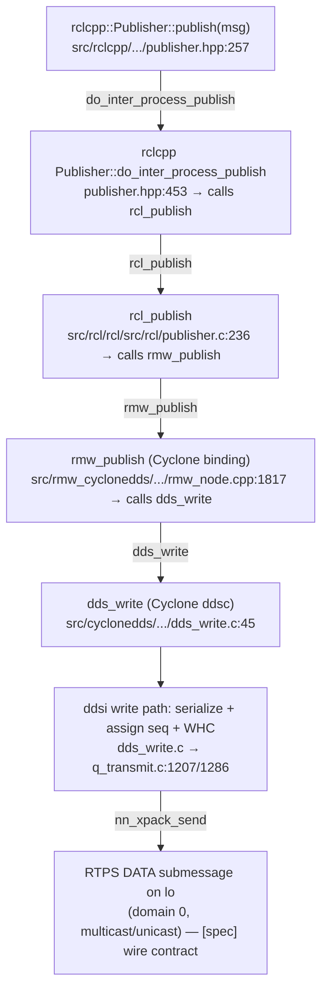

# Shared Foundation — AWSIM / Autoware Core / Cyclone DDS: Temporal-Constraint & STL-Monitor Study

> This is the **shared stack foundation** the five task reports reuse by reference. It is built
> once here; no task re-derives it. It covers the layer map, the publish path to the wire, the
> delivery-matching rules (topic-name mangling, type matching, QoS compatibility including the
> `transient_local` durability rule), discovery (SPDP/SEDP on multicast over `lo`, domain 0,
> GUIDs), and a seed glossary. It contains **none of the five task reports**.
>
> **What this foundation is *for*.** Every mechanism documented here exists in service of one
> question: *where do the system's temporal and freshness constraints come from in the real
> Cyclone DDS stack, and how can the wire behaviour satisfy, degrade, or violate them* — so that a
> runtime **STL monitor** (the Safety Enforcement Unit, **SEU**) can observe a trace, evaluate the
> derived property, and decide whether to trigger a **preemptive safe-stop**. The stack facts are
> unchanged and still load-bearing; they are now read as the physical layer beneath a
> temporal-constraint model, not as an attack surface. The new §0 below adds that layer above the
> stack; §2–§5 then supply the mechanism each constraint rests on.
>
> **Source classes are kept distinct throughout.** `[repo]` = a file in this checkout under
> `src/` (cited `path:line`). `[cyclone]` = Eclipse Cyclone DDS source, which **is present in this
> checkout** at `src/cyclonedds/` and is therefore cited as `[repo]` `path:line`, not as a vendor
> claim. `[spec]` = the OMG DDS / DDSI-RTPS specification (an external claim, not a repo finding).
> `[UNVERIFIED]` = would require running the sim or a packet capture. `setup-guide §N` = the
> authoritative runtime-configuration record.

---

## §0. The layer above the stack — data dependency → temporal constraint → STL → trace → safe-stop

**Motivation before mechanism.** An autonomous vehicle is a data-flow machine: components exchange
samples, and a downstream actuator can only behave safely if the data it depends on arrives *often
enough* and is *fresh enough*. Those two quantities — **actuation frequency** and **data freshness**
— are what turn a data dependency into a *temporal constraint* `[LSEU-abstract]`. The SEU derives
such constraints automatically from the pub/sub data dependencies, formalizes each as a **Signal
Temporal Logic (STL)** property, evaluates system traces against it, and executes a preemptive
safe-stop when a critical property is violated `[LSEU-abstract]`. This foundation supplies the
missing physical half of that pipeline: the Cyclone DDS mechanism that decides whether a given
property *can* hold on the wire.

The end-to-end pipeline this study now serves:

```
data-centric pub/sub abstraction
  → temporal constraint derived from a data dependency   (actuation frequency + data freshness)
    → STL property for runtime verification
      → event-driven capture & evaluation of the system trace
        → preemptive safe-stop on a critical violation
```

**A worked example, on a real topic.** Take `/control/command/gear_cmd` — a command consumed by the
actuation path, published `transient_local` (setup-guide §8). Two properties fall straight out of the
data dependency:

- **Freshness.** The actuator must never act on a stale gear command:
  `G( age(/control/command/gear_cmd) ≤ Δ_fresh )`. Age is measured against **sim time**, which the
  bridge publishes on `/clock` at a steady **~90–100 Hz** (setup-guide §6d); `Δ_fresh` is therefore
  bounded in tens of milliseconds `[INFERRED from the /clock rate; the exact bound is a control-layer
  parameter not fixed in the checkout]`.
- **Liveness / rate.** A command source that has gone quiet is the strongest freshness violation:
  `G( pub(topic) → F_[0,Δ_deadline] pub(topic) )` and a rate bound
  `G( inter_arrival(topic) ∈ [1/f_max, 1/f_min] )`.

The whole rest of the foundation answers *where each of these bounds is set, satisfied, or lost* in
Cyclone: the publish path (§3) is where a sample gets its timestamp, its per-writer sequence number,
and enters the WHC; delivery matching (§4) is the gate that decides whether a producer and consumer
are even coupled (a mismatch means the freshness clock never starts — infinite staleness that a naive
reader cannot see); discovery (§5) sets how *fast* a new or returning source becomes observable, which
bounds how quickly a liveness property can be re-satisfied.

**The recurring closing block.** Every mechanism section below — and every downstream report — ends by
translating its mechanism into monitor terms, in exactly three parts:

1. **The property** — the temporal/freshness constraint the mechanism implies, written STL-shaped over
   the real topics, with concrete bounds where the code/config gives them and `[INFERRED]` where derived.
2. **The trace event** — what the event-driven monitor actually observes to evaluate that property
   (a sample's arrival timestamp and sequence number, a missed deadline, a WHC stall), and at which
   layer of the stack that observable is visible.
3. **The safe-stop decision** — whether violating the property is critical enough to trigger a
   preemptive safe-stop or is a degradation to log/flag, given the topic's role in actuation.

**Fault injection is the test instrument, not the threat.** Where later reports build injectors,
replay, or endpoint-withdrawal mechanisms, they are **fault-injection harnesses**: ways to drive
off-nominal (early / late / stale / wrong-value / over-published) traces *into* the system so the STL
monitor is exercised and its safe-stop path validated — this is the abstract's "extreme fault-injection
stress tests," including the 100× network over-publication case `[LSEU-abstract]`. Where a fault could
*also* be induced maliciously, that is at most a one-line aside; it is no longer the organizing idea.

**Deployment target (why timing determinism matters).** The SEU runs on a resource-constrained
multicore RISC-V executing mixed-criticality workloads, consuming `<2%` of core capacity with
negligible interference on real-time tasks, and its verification algorithms scale linearly even under
100× over-publication `[LSEU-abstract]`. **These are the abstract's motivation and target behaviour,
NOT numbers this static source study measured** — the simulation cannot be run here (setup-guide §0).
Any STL bound this study states is `[INFERRED]` from the code's timing mechanism, never "measured."

---

## SCOPING GATE (Phase 1) — task ranking, reading order, cross-reference plan

This block exists so a human can review the scope before the task reports are written. It is the
output of Phase 1 and reflects Phase 0 reconnaissance (below).

### DEEP / MEDIUM / MENTION ranking of the five tasks

The rank reflects **how much each task informs the STL monitor** — how directly its mechanism defines,
satisfies, or violates a temporal/freshness property, and how much novel Cyclone/RTPS territory that
requires. It is not the reading order (that is dependency order, next section).

| Task | Rank | Why this rank (for the STL monitor) |
|---|---|---|
| **Task 3 — Replay / over-publication** | **DEEP** | **Flagship.** This is the abstract's 100× over-publication stress case `[LSEU-abstract]`: a violated *rate/actuation-frequency* constraint. Its verdict hinges on a subtle Cyclone-internal mechanism — per-writer `(GUID, sequence number)` tracking in the reader's reorder/RHC path and the WHC watermark — which is exactly the observable the monitor keys on to detect over-publication and stays linear-cost under flood. Hardest thing in the study to get right. |
| **Task 2 — Fault-injection harness (outside element)** | **DEEP** | The study's **test instrument**: two full paths (external rclcpp node vs. hand-forged RTPS) traced against a real `transient_local` command topic, plus one *dropped* injection trace. It is how off-nominal (early/late/stale/wrong-value) traces are driven into the system to exercise the monitor; Tasks 3 and 4 reuse it. Highest reuse. |
| **Task 1 — Elements & shutdown → liveness/freshness loss** | **DEEP** | A source going silent is the strongest freshness violation and the archetypal critical fault a safe-stop must catch. Must keep four conflation-prone shutdown mechanisms distinct (`rclcpp::shutdown()` vs. node destruction vs. lifecycle transition vs. process kill), each with a distinct *freshness-loss signature*, and surface the hazard that a latched `transient_local` sample can mask a dead publisher from a naive freshness check. Feeds Task 4. |
| **Task 5 — QoS → timing determinism & mixed-criticality** | **MEDIUM** | Decides whether the temporal constraints can be met *on the wire at all*, and whether the monitor can run on a resource-constrained multicore RISC-V without disturbing real-time tasks `[LSEU-abstract]`. The crisp finding is half-proven here: `TRANSPORT_PRIORITY`/`OWNERSHIP` are **absent** from `rmw_qos_profile_t` and the rmw QoS mapping (§4.3), so latency/jitter shaping is not reachable through rclcpp — it lives only in Cyclone XML/C-API. Feeds Task 4. |
| **Task 4 — Silent freshness loss + safe-stop actuation** | **MEDIUM** | The three layers are both (a) ways data freshness is lost *without* a clean shutdown signal — the hardest case for a monitor — and (b) candidate mechanisms by which a safe-stop could actually halt a flow: protocol (SEDP dispose/unregister, liveliness/deadline), physical (`lo` multicast-off, iptables/tc on the discovery ports from §5), application (cross-ref Task 1). Much is cross-reference; the new tracing is the endpoint-withdrawal path. Malformed-RTPS destabilization stays `[UNVERIFIED]`. |

No task is a pure **MENTION** — all five are required full reports — but Task 4's malformed-RTPS
sub-point and Task 5's `OWNERSHIP` sub-point are MENTION-level within their reports (documented,
not deeply traced, because they rest on vendor/spec rather than a traceable code path here).

### Proposed reading (and writing) order — by dependency

```
Foundation (this file)
   └─> Task 1  (shutdown & configurable elements; establishes the application-layer levers)
        └─> Task 2  (injection; builds the external injector + derives the durability-match rule in use)
             └─> Task 3  (replay/over-publication; reuses the Task 2 injector, adds seq/GUID dedup)
                  └─> Task 5  (QoS prioritization; needed as a lever before Task 4 can cite it)
                       └─> Task 4  (alternatives to shutdown; SYNTHESIS of 1 + 2 + 5)
```

This matches the prompt's suggested order (1 → 2 → 3 → 5 → 4) and is confirmed. Rationale: Task 4 is
explicitly a synthesis — it draws its application layer from Task 1, its discovery/protocol
mechanics from Task 2, and its QoS levers from Task 5 — so it must come last. Task 3 depends on the
injector that Task 2 constructs. Task 5 is pulled ahead of Task 4 (against pure list order) only so
Task 4 can cite the QoS findings rather than re-derive them.

### Cross-reference plan (what each task cites vs. what it opens)

| Task | Reuses from foundation (by reference) | New territory it opens |
|---|---|---|
| **Task 1** | Layer map §2; the `[repo]` locations of `context.cpp`/`utilities.cpp`; QoS-as-config from §4 | `rclcpp::shutdown()` scope; Node destruction; lifecycle service reachability; `signal_handler.cpp`; the Cyclone config knobs as global config |
| **Task 2** | Publish path §3; topic mangling §4.1; type matching §4.2; **durability RxO rule §4.3**; discovery + GUIDs + ports §5 | Minimal injector sketch; forged-RTPS DATA requirements; the dropped-injection trace (volatile writer vs. `transient_local` reader — mechanism in §4.3) |
| **Task 3** | The Task 2 injector; writer `seq` assignment §3 (step 6); WHC watermark §3/§5 | Cyclone reader-side dedup (reorder/RHC), `(writer GUID, seq)` tracking, ACKNACK, flow control under flooding |
| **Task 5** | rmw QoS mapping §4.3; the RxO comparison table §4.3 | `rmw_qos_profile_t` full enumeration; absence of `TRANSPORT_PRIORITY`/`OWNERSHIP`; Cyclone XML/C-API path; `transport_priority` handling in Cyclone |
| **Task 4** | Discovery/dispose §5; ports §5; liveliness/deadline in the RxO table §4.3; Task 1 app layer; Task 5 QoS | SEDP endpoint-withdrawal (dispose/unregister) forging; `lo` link-layer kills mapped to a deployment bus |

---

## Phase 0 — Reconnaissance: what is in the checkout, and what is confirmed

**Vendor / topology / topics confirmed** against the setup guide: the DDS vendor is Eclipse Cyclone
DDS, forced on both sides via `RMW_IMPLEMENTATION=rmw_cyclonedds_cpp` (setup-guide §6a, §9); AWSIM
runs native on the host and Autoware Core in a `--net host` container, communicating over loopback
`lo` on domain 0 with multicast (setup-guide §0, §3); the command topics
`/system/operation_mode/state` (`autoware_adapi_v1_msgs/msg/OperationModeState`) and
`/control/command/gear_cmd` (`autoware_vehicle_msgs/msg/GearCommand`) are published with
`transient_local` durability (setup-guide §8). Both message definitions are present in this checkout
and carry the exact enum constants the guide uses: `GearCommand` `DRIVE = 2`
(`src/autoware_msgs/autoware_vehicle_msgs/msg/GearCommand.msg:3`) and `OperationModeState`
`AUTONOMOUS = 2` (`src/autoware_adapi_msgs/autoware_adapi_v1_msgs/operation_mode/msg/OperationModeState.msg:4`).

**What is in the checkout** (so most wire-level claims are `[repo]`, not `[UNVERIFIED]`):

| Layer | In checkout? | Path |
|---|---|---|
| rclcpp (C++ client library) | yes | `src/rclcpp/` |
| rcl (C client library) | yes | `src/rcl/` |
| rmw (middleware abstraction) | yes | `src/rmw/` |
| rmw_cyclonedds_cpp (Cyclone binding) | yes | `src/rmw_cyclonedds/` |
| **Cyclone DDS core (ddsc + ddsi)** | **yes** | `src/cyclonedds/src/core/` |
| rmw_dds_common | yes | `src/rmw_dds_common/` |
| Message packages (autoware, rcl_interfaces) | yes | `src/autoware_msgs/`, `src/autoware_adapi_msgs/`, `src/rcl_interfaces/` |
| AWSIM / ROS2-for-Unity (`ros2cs`) | **no** | not in checkout — claims about AWSIM's client surface are `[UNVERIFIED]` |
| DDSI-RTPS wire format (the OMG standard itself) | n/a | `[spec]` — the *behaviour* is in `src/cyclonedds`, but the normative wire contract is spec |

**Consequence for evidence:** because Cyclone's core is present, findings about serialization,
sequence numbering, the write history cache, QoS matching, and discovery are `[repo]` findings with
`path:line`, not vendor guesses. Only three things stay tagged: AWSIM's own publishing behaviour
(no source here), the on-the-wire byte layout as an interoperability *contract* (`[spec]`), and
anything settled only by running the sim (`[UNVERIFIED]`).

**Realism caveat (applies study-wide).** Everything below describes a stack where container and
simulator share one host network namespace and one Cyclone domain on `lo`. That co-location makes
discovery and matching automatic for any host process — but it is a **simulation artifact**. The SEU
this study feeds is a runtime STL monitor for a *real AV network*, where the same data dependencies
impose the same temporal/freshness constraints but the transport is automotive Ethernet/CAN rather
than loopback. Where a "how fast is a fault observable" or "how easily can this trace be injected"
judgment depends on the loopback co-location, the task reports say so explicitly rather than
transferring the ease to the deployment target — a constraint the monitor must hold on-vehicle may be
observable on a slower schedule there than on `lo`.

---

## §1. Terms you need before reading (mini-orientation)

Full definitions are in the **glossary (§6)**; this paragraph is the minimum to read §2–§5 linearly.
A ROS 2 program talks to the network through four stacked libraries: **rclcpp** (the C++ API you
write against), **rcl** (a thin C core beneath it), **rmw** (a vendor-neutral interface), and a
vendor **rmw binding** — here **rmw_cyclonedds_cpp** — that calls the actual DDS implementation,
**Cyclone DDS**. Cyclone's own internals split into **ddsc** (its public C API, e.g. `dds_write`)
and **ddsi** (the protocol engine that speaks **RTPS**, the DDS wire protocol). A **DataWriter**
sends samples on a **Topic**; a **DataReader** receives them; they only exchange data if discovery
matched them and their **QoS** is compatible. Each entity has a 16-byte **GUID** identifying it on
the wire.

---

## §2. The layer map — boundaries and the entry point at each crossing

**Orientation.** A single `publisher->publish(msg)` in an Autoware node descends through five library
boundaries before a byte reaches `lo`. Naming collides across these layers (there is a `publish` at
three of them), so the value of this map is the *exact function* at each crossing, read from the
body, not inferred from the name.


*What to notice:* every crossing is a real function whose body was read (cited below), and the
vendor-specific part begins precisely at `rmw_publish → dds_write`. Above that line the code is
vendor-neutral; below it, it is Cyclone.

| Boundary crossed | Entry-point function | Cited at |
|---|---|---|
| rclcpp public API → rclcpp internal | `Publisher::publish` → `do_inter_process_publish` | `src/rclcpp/rclcpp/include/rclcpp/publisher.hpp:257,453` `[repo]` |
| rclcpp → rcl | `do_inter_process_publish` → `rcl_publish` | `publisher.hpp:456` `[repo]` |
| rcl → rmw | `rcl_publish` → `rmw_publish` | `src/rcl/rcl/src/rcl/publisher.c:249` `[repo]` |
| rmw → vendor binding → Cyclone ddsc | `rmw_publish` → `dds_write` | `src/rmw_cyclonedds/rmw_cyclonedds_cpp/src/rmw_node.cpp:1834` `[repo]` |
| ddsc → ddsi (protocol engine) | `dds_write` → `dds_write_impl` → … → `write_sample_gc` | `src/cyclonedds/src/core/ddsc/src/dds_write.c:55,599`; `q_transmit.c:1392` `[repo]` |
| ddsi → wire | `write_sample_gc` → `write_sample_eot` → `nn_xpack_send` | `src/cyclonedds/src/core/ddsc/src/dds_write.c:259` `[repo]`; RTPS framing `[spec]` |

---

## §3. The publish path to the wire (DEEP — traced procedure)

**Orientation.** This section follows one message — say a `GearCommand{command: 2}` on
`/control/command/gear_cmd` — from the rclcpp call all the way to an RTPS DATA submessage leaving
`lo`. The point every task reuses: **where the message is serialized to CDR, where it gets a
sequence number, and where it enters the write history cache (WHC)**, because those three facts
decide injection (Task 2), replay (Task 3), and flow control under flooding (Task 3/5).

**Mental model.** rclcpp/rcl/rmw are pass-through plumbing: they validate arguments and forward the
still-C-struct message down. No serialization happens until Cyclone. Cyclone serializes the message
to **CDR** (the DDS binary encoding), stamps it with the **next per-writer sequence number**, stores
it in the **WHC** (so reliable readers can be retransmitted to, and late `transient_local` joiners
can be resent history), and hands it to the packing layer that emits the RTPS DATA submessage.

**The traced steps** (each cited; ≥6 steps):

1. **rclcpp entry.** `Publisher<T>::publish(const ROSMessageType & msg)` calls
   `this->do_inter_process_publish(*msg)` for the inter-process case
   (`src/rclcpp/rclcpp/include/rclcpp/publisher.hpp:257`) `[repo]`. Intra-process delivery is a
   separate branch and is not the wire path.
2. **rclcpp → rcl.** `do_inter_process_publish` calls `rcl_publish(publisher_handle_.get(), &msg,
   nullptr)` and throws on any non-`RCL_RET_OK` status, except it silently returns if the failure is
   only because the context was already shut down
   (`src/rclcpp/rclcpp/include/rclcpp/publisher.hpp:456,462-465`) `[repo]`. That shutdown-tolerance
   is relevant to Task 1.
3. **rcl → rmw.** `rcl_publish` validates the publisher, emits a tracepoint, then forwards to
   `rmw_publish(publisher->impl->rmw_handle, ros_message, allocation)`; a non-`RMW_RET_OK` return is
   turned into `RCL_RET_ERROR` (`src/rcl/rcl/src/rcl/publisher.c:236,248-252`) `[repo]`. Note: rcl
   does **not** serialize — it passes the raw C message pointer through.
4. **rmw → Cyclone ddsc.** The Cyclone binding's `rmw_publish` checks the implementation identifier
   matches `eclipse_cyclonedds_identifier`, recovers the `CddsPublisher`, and calls
   `dds_write(pub->enth, ros_message)`, returning OK iff `dds_write(...) >= 0`
   (`src/rmw_cyclonedds/rmw_cyclonedds_cpp/src/rmw_node.cpp:1825-1834`) `[repo]`. The identifier
   check is why an RMW-vendor mismatch fails (setup-guide §9): a Fast DDS handle would not carry
   `eclipse_cyclonedds_identifier`.
5. **ddsc dispatch.** `dds_write` looks up the writer and calls `dds_write_impl(wr, data, dds_time(),
   0)` (`src/cyclonedds/src/core/ddsc/src/dds_write.c:45,55`) `[repo]`. `dds_write_impl` runs the
   topic filter, then (no shared-memory in this config) calls `dds_write_impl_plain`
   (`dds_write.c:589,599`) `[repo]`.
6. **Serialization to CDR.** `dds_write_impl_plain` converts the C message to a serialized sample via
   `ddsi_serdata_from_sample(ddsi_wr->type, ... , data)`
   (`src/cyclonedds/src/core/ddsc/src/dds_write.c:566`) `[repo]`. This is the **first and only**
   point the message becomes CDR bytes; the DDS type used is the sertype built by the Cyclone binding
   (§4.2). It then calls `dds_writecdr_impl_common`
   (`dds_write.c:571`) `[repo]`.
7. **Sequence number + WHC.** `dds_writecdr_impl_common` → `deliver_data_any` → `deliver_data_network`
   → `write_sample_gc` (`dds_write.c:321,272,254`) → `write_sample_eot`, where the writer's
   sequence number is advanced with `seq = ++wr->seq;` and the sample is placed in the write history
   cache via `insert_sample_in_whc(wr, seq, plist, serdata, tk)`
   (`src/cyclonedds/src/core/ddsi/src/q_transmit.c:1286,1299`) `[repo]`. **Sequence numbers are
   per-writer and monotonic** — the fact Task 3's replay analysis turns on.
8. **Onto the wire.** After `write_sample_gc` succeeds, `deliver_data_network` flushes the packed
   message unless the writer batches: `if (flush && xp != NULL) nn_xpack_send(xp, false)`
   (`src/cyclonedds/src/core/ddsc/src/dds_write.c:258-259`) `[repo]`. `deliver_data_any` then also
   delivers to local matched readers in-process via `deliver_locally`
   (`dds_write.c:286`) `[repo]`. The bytes that leave here are an RTPS DATA submessage; the exact
   submessage/field layout is the `[spec]` wire contract, realized by Cyclone's `q_xmsg`/`nn_xpack`.

**Gotchas.**
- **No serialization above Cyclone.** Anyone reasoning about "what rmw sends" must remember the CDR
  bytes exist only from step 6 onward; Task 2's forged-RTPS path must reproduce that CDR itself.
- **`transient_local` uses the WHC as its history store.** The same WHC that serves reliable
  retransmission also holds the samples resent to late-joining `transient_local` readers; the
  binding wires this via `dds_qset_durability_service` (§4.3). This is why a late injector can still
  match and why the WHC `WhcHigh=500kB` watermark (setup-guide §4) is the back-pressure knob Task 3
  cites.
- **Batching.** `flush` is `!wr->whc_batch` (`dds_write.c:571`) `[repo]`; with batching off (the
  default here, `[INFERRED: no WriterBatching set in the setup-guide XML]`), each `publish` flushes
  immediately, so one publish ≈ one wire send.

**What this means for the monitor.**

1. **The property.** The publish path is where a sample first acquires the two quantities every
   temporal property is written over: its **timestamp** (`dds_write_impl(..., dds_time(), 0)`,
   `dds_write.c:55`) and its **per-writer sequence number** (`seq = ++wr->seq;`, `q_transmit.c:1286`).
   Those underwrite both a freshness bound `G( age(topic) ≤ Δ_fresh )` (from the timestamp) and a rate
   bound `G( inter_arrival(topic) ∈ [1/f_max, 1/f_min] )` (from arrival spacing and monotone
   sequence). With batching off, one publish ≈ one wire send, so the trace's sample count tracks the
   producer's publish count 1:1 `[INFERRED]`.
2. **The trace event.** The observable is a single delivered sample carrying `(writer GUID, seq,
   source timestamp)`; the monitor sees it either at RTPS DATA receipt on the wire (`[spec]` layout,
   realized by Cyclone's `nn_xpack`/`q_xmsg`) or at the reader's data-available callback above ddsc.
   Monotone `seq` lets it detect gaps (loss) and duplicates (replay, Task 3) without payload parsing.
3. **The safe-stop decision.** This section only establishes the observables; whether a given
   deviation is safe-stop-critical is decided per topic in §4–§5 and the task reports. The load-bearing
   fact here: because CDR/seq/WHC are all assigned *inside Cyclone* (step 6 onward), a monitor tapping
   above rmw sees ROS-typed samples with no seq, while a wire tap sees seq but must decode CDR — the
   tap layer is a monitor design choice this path makes explicit.

---

## §4. Delivery-matching rules — what makes a reader accept a writer

A writer and reader exchange data only if **three independent gates** all pass: the **topic name**
matches (§4.1), the **type** matches (§4.2), and the **QoS is compatible** under the
Requested-offered rule (§4.3). Discovery (§5) is what lets the two sides learn each other's name,
type, and QoS in the first place. All three gates are enforced by Cyclone's `qos_match_mask_p`,
which checks topic name and type name in the *same* function as the QoS policies
(`src/cyclonedds/src/core/ddsi/src/q_qosmatch.c:160,267`) `[repo]`.

### §4.1 Topic-name mangling — `/control/command/gear_cmd` → `rt/control/command/gear_cmd`

**Motivation.** The naive assumption is that the DDS topic name equals the ROS topic name. It does
not: rmw_cyclonedds prepends a namespace prefix, so an injector that creates a DDS topic literally
named `/control/command/gear_cmd` will **not** match the Autoware reader.

The binding builds the fully-qualified DDS topic name with `make_fqtopic(ROS_TOPIC_PREFIX,
topic_name, "", qos_policies)` (`src/rmw_cyclonedds/rmw_cyclonedds_cpp/src/rmw_node.cpp:2282`)
`[repo]`. `make_fqtopic` returns `prefix + topic_name + suffix` unless
`avoid_ros_namespace_conventions` is set, in which case the prefix is dropped
(`rmw_node.cpp:1969-1977`) `[repo]`. The prefix constants are `ROS_TOPIC_PREFIX = "rt"` (topics),
`"rq"`/`"rr"` (service request/reply) (`rmw_cyclonedds_cpp/src/namespace_prefix.hpp:18-20`) `[repo]`.

So for the command topic, the DDS topic name on the wire is **`rt/control/command/gear_cmd`** (prefix
`rt` concatenated with the leading-slash ROS name). An injector must create its topic under exactly
this mangled name (or set `avoid_ros_namespace_conventions` and supply the mangled name itself). The
name equality is enforced byte-for-byte at `strcmp(rd_qos->topic_name, wr_qos->topic_name) != 0`
(`src/cyclonedds/src/core/ddsi/src/q_qosmatch.c:160`) `[repo]`.

### §4.2 Type matching — the DDS type name and the type hash

**Motivation.** Two endpoints on the same topic must agree on the message type. rmw_cyclonedds
encodes the ROS type into a DDS type name and (when type discovery is enabled) a type identifier the
reader can compare.

The DDS type name is built by `create_type_name`: it takes the message namespace, replaces the C
separator `__` with `::`, and emits `<namespace>::dds_::<MessageName>_`
(`src/rmw_cyclonedds/rmw_cyclonedds_cpp/src/serdata.cpp:663-672`) `[repo]`. For the worked example
the wire type name is **`autoware_vehicle_msgs::msg::dds_::GearCommand_`** (and
`autoware_adapi_v1_msgs::msg::dds_::OperationModeState_` for the operation-mode topic). This name is
attached to the Cyclone `sertype` created in `create_sertype`
(`serdata.cpp:688-696`) `[repo]`.

Type agreement is then enforced in `qos_match_mask_p`. With `DDS_HAS_TYPE_DISCOVERY` compiled in,
Cyclone compares type *ids* (a hash-based identifier) and only falls back to comparing the type
*name* string when a type id is absent on either side; if force-validation is off and ids exist, it
runs assignability checks
(`src/cyclonedds/src/core/ddsi/src/q_qosmatch.c:216-265`) `[repo]`. Without type discovery it is a
plain type-name `strcmp` (`q_qosmatch.c:267`) `[repo]`. **Whether this build defines
`DDS_HAS_TYPE_DISCOVERY`** determines whether an injector needs a matching type *hash* or only a
matching type *name* — `[UNVERIFIED: depends on the container's Cyclone build flags; would be settled
by inspecting the built library or a capture]`. Task 2 resolves what the forged-RTPS path must
reproduce here.

### §4.3 QoS compatibility — the Requested/Offered rule and the `transient_local` gate (DEEP)

**Motivation.** This is the gate that silently drops the "obvious" injector. The setup guide proves
the command readers request `transient_local` durability (`ros2 topic pub ... --qos-durability
transient_local`, setup-guide §8). A newcomer's first injector uses the rclcpp default (volatile)
writer QoS and then wonders why the vehicle never obeys the command. The reason is a single
comparison in Cyclone.

**Mental model — Requested ≥ Offered, per policy (RxO).** DDS QoS compatibility is asymmetric: for
each "request-offer" policy, the **reader's requested** value must be *satisfiable by* the
**writer's offered** value, or the pair does not match and **no data flows at all** (it is not a
downgrade — it is a non-match). Cyclone implements exactly this in `qos_match_mask_p`. The relevant
comparisons, read from the body:

| Policy | Cyclone check (reader `rd` vs writer `wr`) | Fails (no match) when | Cited |
|---|---|---|---|
| Reliability | `rd.reliability.kind > wr.reliability.kind` | reader RELIABLE(1) > writer BEST_EFFORT(0) | `q_qosmatch.c:163` `[repo]` |
| **Durability** | `rd.durability.kind > wr.durability.kind` | **reader TRANSIENT_LOCAL(1) > writer VOLATILE(0)** | `q_qosmatch.c:167` `[repo]` |
| Deadline | `rd.deadline.deadline < wr.deadline.deadline` | reader wants a tighter (smaller) period than writer offers | `q_qosmatch.c:183` `[repo]` |
| Latency budget | `rd.latency_budget.duration < wr.latency_budget.duration` | reader budget tighter than writer's | `q_qosmatch.c:187` `[repo]` |
| Ownership | `rd.ownership.kind != wr.ownership.kind` | kinds differ | `q_qosmatch.c:191` `[repo]` |
| Liveliness | `rd.liveliness.kind > wr.liveliness.kind` **or** `rd.lease_duration < wr.lease_duration` | reader stricter than writer | `q_qosmatch.c:195,199` `[repo]` |

**The durability enum ordering is what makes the rule bite.** In Cyclone,
`DDS_DURABILITY_VOLATILE` is declared first (value 0), then `DDS_DURABILITY_TRANSIENT_LOCAL` (1),
`DDS_DURABILITY_TRANSIENT` (2), `DDS_DURABILITY_PERSISTENT` (3)
(`src/cyclonedds/src/core/ddsc/include/dds/ddsc/dds_public_qosdefs.h:77-80`) `[repo]`. So a
`transient_local` reader has `durability.kind == 1` and a volatile writer has `durability.kind ==
0`; the check `rd(1) > wr(0)` is true, the function sets `*reason =
DDS_DURABILITY_QOS_POLICY_ID` and returns `false` (`q_qosmatch.c:167-169`) `[repo]`. **The reader
never accepts the writer; the sample is not dropped after arrival — the two endpoints simply never
match.** This is the dropped-injection trace Task 2 must follow, and the rule Task 2's injector must
satisfy: **the injector's writer must OFFER durability ≥ the reader's request**, i.e. it must offer
`transient_local` (or stronger) to reach a `transient_local` reader.

**How rclcpp/rmw map onto these Cyclone values.** The rmw QoS profile carries exactly these fields
and no others: `history`, `depth`, `reliability`, `durability`, `deadline`, `lifespan`,
`liveliness`, `liveliness_lease_duration`, and `avoid_ros_namespace_conventions`
(`src/rmw/rmw/include/rmw/types.h:471-512`) `[repo]`. The rmw durability enum orders
`TRANSIENT_LOCAL` *before* `VOLATILE` (`rmw/types.h:411,414`) `[repo]` — the reverse of Cyclone's —
so the binding maps by *case*, not by numeric value: `create_readwrite_qos` translates
`RMW_QOS_POLICY_DURABILITY_TRANSIENT_LOCAL` to `dds_qset_durability(qos,
DDS_DURABILITY_TRANSIENT_LOCAL)` and additionally sets a durability *service* QoS so the WHC retains
history for late joiners (`src/rmw_cyclonedds/rmw_cyclonedds_cpp/src/rmw_node.cpp:2057-2068`)
`[repo]`. It maps reliability, history/depth, lifespan, deadline, and liveliness likewise
(`rmw_node.cpp:2017-2100`) `[repo]`.

**Two consequences the tasks reuse.** First, **there is no `transport_priority` and no `ownership`
setter** anywhere in `create_readwrite_qos` (`rmw_node.cpp:2010-2104`) `[repo]` and no such field in
`rmw_qos_profile_t` (`rmw/types.h:471-512`) `[repo]` — this is the seed of Task 5's central finding
that prioritization is unreachable through rclcpp. Second, the binding disables writer autodispose
(`dds_qset_writer_data_lifecycle(qos, false)`, `rmw_node.cpp:2016`) `[repo]`, which Task 1/Task 4
cite when reasoning about what a writer's disappearance does (or does not) signal.

**Gotcha.** The comparison uses `mask &= rd_qos->present & wr_qos->present`
(`q_qosmatch.c:158`) `[repo]`: a policy is only compared if *both* sides declared it present. This is
why defaults matter — an injector that leaves durability unset offers volatile-by-construction
through the binding, not "unspecified", because `create_readwrite_qos` always calls a
`dds_qset_durability` (`rmw_node.cpp:2052-2074`) `[repo]`.

**What this means for the monitor.**

1. **The property.** Matching is the precondition for *every* temporal property: an RxO mismatch is
   not a slow channel, it is *no channel* — the two endpoints never couple, so
   `age(topic) → ∞` and the actuator never receives a fresh sample at all. The relevant STL is the
   coupling premise beneath `G( age(/control/command/gear_cmd) ≤ Δ_fresh )`: the reader's requested
   durability must be satisfiable by the writer's offered durability (`rd.durability.kind ≤
   wr.durability.kind`, `q_qosmatch.c:167`), else the freshness clock never starts.
2. **The trace event.** This is visible *before any data sample* — the offered/requested QoS is
   carried in the SEDP announcement (§5), so a monitor watching SEDP can flag an unsatisfiable pairing
   (a `transient_local` command reader with no matching offered writer) at discovery time, rather than
   waiting for a freshness deadline to expire against a channel that will never deliver.
3. **The safe-stop decision.** For a `transient_local` command topic (`/control/command/gear_cmd`,
   `/system/operation_mode/state`), a *persistently* unmatched consumer is safe-stop-critical: the
   actuation path is receiving nothing. A subtler hazard, deferred to Task 1, is the inverse — a
   matched `transient_local` reader keeps latching the *last* delivered sample, so a dead publisher can
   look alive to a naive age check; the freshness property must therefore be evaluated against fresh
   arrivals, not against the latched value.

---

## §5. Discovery — SPDP/SEDP on multicast over `lo`, domain 0, GUIDs (DEEP)

**Orientation.** Before any of §4's gates can be checked, the two sides must *find* each other. DDS
does this with a two-stage discovery protocol carried as ordinary RTPS messages over `lo`:
**SPDP** announces participants; **SEDP** announces each participant's endpoints (writers/readers)
with their topic, type, and QoS. The setup guide's failure mode — "Failed to find a free participant
index for domain 0" when `lo` lacks multicast (setup-guide §3, §9) — is direct evidence that
multicast-based discovery on `lo` is load-bearing for the whole system.

**Mental model.** Each process hosts a **DomainParticipant** with a random 12-byte **GUID prefix**;
every writer/reader under it has a **GUID** = that prefix + a 4-byte **entity id** (the GUID struct
is literally `{ guid_prefix (12B), entityid (4B) }`,
`src/cyclonedds/src/core/ddsi/include/dds/ddsi/ddsi_guid.h:21-31`) `[repo]`. Discovery uses
**well-known builtin entity ids** so peers know which endpoint carries which discovery data:
`NN_ENTITYID_SPDP_BUILTIN_PARTICIPANT_WRITER = 0x100c2`,
`NN_ENTITYID_SEDP_BUILTIN_PUBLICATIONS_WRITER = 0x3c2`,
`NN_ENTITYID_SEDP_BUILTIN_SUBSCRIPTIONS_WRITER = 0x4c2`
(`src/cyclonedds/src/core/ddsi/include/dds/ddsi/q_rtps.h:41,43,45`) `[repo]`. These values are the
RTPS-spec well-known ids `[spec]`, realized here in Cyclone.

**SPDP — participant announcement.** Cyclone announces the local participant by writing a parameter
list on the builtin SPDP writer: `spdp_write` fetches
`ddsi_get_builtin_writer(pp, NN_ENTITYID_SPDP_BUILTIN_PARTICIPANT_WRITER)` and calls
`write_and_fini_plist(wr, &ps, true)` (`src/cyclonedds/src/core/ddsi/src/q_ddsi_discovery.c:527,540,547`)
`[repo]`. The announcement carries the participant's metatraffic and default locators and its QoS,
built into the plist just above (`q_ddsi_discovery.c:445-505`) `[repo]`. SPDP is periodic; the
default resend interval is 30 s (`spdp_interval = 30000000000` ns,
`src/cyclonedds/src/core/ddsi/defconfig.c:36`) `[repo]`. **A late-joining participant is therefore
discovered within one SPDP period**, which Task 2 cites for the "late-joining participant on domain
0" signature.

**SEDP — endpoint announcement.** Once two participants know each other, each publishes its
writers/readers (topic name, type name/id, and full QoS) over the SEDP publications/subscriptions
builtin writers, using the `SEDP_KIND_{READER,WRITER,TOPIC}` classification
(`q_ddsi_discovery.c:58-62`) `[repo]`. The QoS carried in SEDP is exactly what `qos_match_mask_p`
(§4.3) later compares — so **the QoS a producer offers (durability, deadline, liveliness) is visible
on the wire in its SEDP announcement before a single data sample is sent.** That is the monitor's
earliest trace observable: it can evaluate the *coupling* and *declared-timing* premises of a
freshness/rate property at discovery time, ahead of the first sample. Task 2/Task 4 both rely on it.

**Domain 0 and the ports.** The effective domain is 0 (setup-guide §2: `Domain Id="any"` →
effective 0). Cyclone computes RTPS ports from `port = dg*domain_id + base + pg*participant_index +
offset`, with defaults `base = 7400`, `dg = 250`, `pg = 2`, `d1 = 10`, `d2 = 1`, `d3 = 11`
(`src/cyclonedds/src/core/ddsi/defconfig.c:37-42`) `[repo]`, `d0 = 0` (unset). Multicast ports do
**not** depend on participant index (`get_port_int` uses offset `d0` for metatraffic-multicast and
`d2` for data-multicast and skips the per-participant term for them,
`src/cyclonedds/src/core/ddsi/src/ddsi_portmapping.c:29-56,60-61`) `[repo]`. So for **domain 0**:

| Traffic | Offset | Port (domain 0) |
|---|---|---|
| SPDP / metatraffic multicast (discovery) | d0 = 0 | **7400** |
| User-data multicast | d2 = 1 | **7401** |
| Unicast (metatraffic / user) | d1 / d3, per participant index | **ephemeral** — chosen by transport |

The unicast ports are ephemeral because the setup guide sets `ParticipantIndex=none` (setup-guide
§2, §4), and Cyclone treats "none" as "let the transport choose the unicast port"
(`ddsi_portmapping.c:39-52`) `[repo]`. **This is exactly why the guide needs an identical
`cyclonedds.xml` on host and container** (setup-guide §4): the fixed multicast discovery port (7400)
is what both sides rendezvous on; a mismatch in participant-index policy would put them on different
unicast ports and break discovery even on the same interface. These ports are Task 4's targets for a
port-level iptables/tc kill on `lo`.

**Why `lo` multicast is load-bearing.** With `NetworkInterface name="lo"` and
`AllowMulticast=default` (setup-guide §4), SPDP relies on ASM multicast on `lo`; the SPDP-multicast
path is guarded by `gv->config.allowMulticast & DDSI_AMC_SPDP`
(`src/cyclonedds/src/core/ddsi/src/q_ddsi_discovery.c:314`) `[repo]`. If `lo` is not
multicast-capable, Cyclone disables multicast and cannot complete participant discovery, producing
the guide's "Failed to find a free participant index for domain 0" crash (setup-guide §3, §9). Task
4 cites `ip link set lo multicast off` as a one-command link-layer kill on this basis.

**GUID as a trace key.** The participant GUID prefix is generated locally per process; any process
that joins domain 0 — including the fault-injection harness — carries a GUID prefix **distinct from
the two nominal sim participants** (AWSIM and the Autoware container). `[INFERRED: the prefix is
process-local and random/host-derived, so a third participant is distinguishable by prefix; the
exact generation routine is in Cyclone init and not quoted here]`. For the monitor this matters as
*provenance*: `(writer GUID, seq)` keys a per-source trace, so it can attribute an over-published or
off-rate stream to a specific producer and tell a returning legitimate source from an injected one.
Establishing the exact prefix derivation is deferred to Task 2.

**Realism caveat.** On this loopback setup, any host process that joins domain 0 is discovered and
matched with no network boundary to cross (setup-guide §0). Discovery latency therefore sets how fast
a new or returning source becomes *observable* to the monitor — one SPDP period (default 30 s) in the
worst case, faster with unicast — which bounds how quickly a liveness property can be re-satisfied
after a source returns. The *discovery mechanics* transfer to the deployment AV network, but the
*loopback timing* does not: on the real bus the same rendezvous may be slower, so a liveness
`Δ_deadline` tuned on `lo` must be re-derived on-vehicle. Task 2 and Task 4 carry this distinction
wherever an observability timing judgment depends on it.

**What this means for the monitor.**

1. **The property.** Discovery underwrites the *liveness* class:
   `G( pub(topic) → F_[0,Δ_deadline] pub(topic) )`. A source that dies and returns is only observable
   again after re-discovery, so `Δ_deadline` for a re-appearing producer is floored by the SPDP period
   (30 s, `defconfig.c:36`) unless unicast shortcuts it `[INFERRED]`.
2. **The trace event.** The observables are the SPDP/SEDP announcements themselves — a participant
   appearing or disappearing (SPDP builtin writer `0x100c2`), and its endpoints with topic/type/QoS
   (SEDP `0x3c2`/`0x4c2`) — keyed by GUID prefix, all visible on the fixed discovery multicast port
   (7400 on domain 0) before user data flows.
3. **The safe-stop decision.** A monitored command source that leaves discovery (SEDP dispose /
   participant SPDP timeout) and does not re-appear within its liveness deadline is safe-stop-critical
   for a `transient_local` actuation topic — this is the clean-shutdown case Task 1 treats, versus the
   silent-loss case (no dispose, stale latched sample) Task 4 treats as the harder monitor problem.

---

## §6. Seed glossary (shared across all reports)

Terms are defined here once; task reports link back rather than redefining. Ordered roughly
bottom-of-stack to top, then protocol terms.

| Term | Definition (as used in this study) |
|---|---|
| **rclcpp** | The ROS 2 C++ client library — the API Autoware nodes write against (`src/rclcpp/`). Publisher/Subscription/Node live here. |
| **rcl** | The ROS 2 C client library beneath rclcpp; thin, language-agnostic core (`src/rcl/`). Validates and forwards to rmw; does not serialize. |
| **rmw** | ROS MiddleWare interface — the vendor-neutral C API (`src/rmw/`) every DDS binding implements (`rmw_publish`, `rmw_qos_profile_t`). |
| **rmw_cyclonedds_cpp** | The rmw binding for Cyclone DDS (`src/rmw_cyclonedds/`). Translates ROS calls/QoS into Cyclone `dds_*` calls; owns topic-name mangling and type-name construction. |
| **Cyclone DDS** | Eclipse Cyclone DDS, the DDS implementation (`src/cyclonedds/`). **ddsc** = its public C API (`dds_write`); **ddsi** = its RTPS protocol engine. |
| **DDS** | Data Distribution Service — the OMG pub/sub standard with typed topics and QoS. |
| **DDSI / RTPS** | DDSI = the DDS Interoperability wire protocol; **RTPS** (Real-Time Publish-Subscribe) is its concrete packet format (DATA, HEARTBEAT, ACKNACK, etc.). `[spec]` for the byte layout. |
| **CDR** | Common Data Representation — the binary encoding DDS uses for message payloads on the wire. Produced in Cyclone by `ddsi_serdata_from_sample` (§3 step 6). |
| **DomainParticipant** | A process's membership in a DDS domain; owns writers/readers and the builtin discovery endpoints. |
| **DataWriter / DataReader** | The endpoints that send / receive samples on a topic. A publish is a write on a DataWriter. |
| **Topic** | A named, typed channel. The DDS topic name is the *mangled* ROS name (§4.1), e.g. `rt/control/command/gear_cmd`. |
| **Domain (domain id)** | An isolation scope for DDS traffic; only same-domain participants discover each other. Here effectively **0** (setup-guide §2). |
| **QoS** | Quality-of-Service policies (reliability, durability, history, deadline, liveliness, …) that govern delivery and matching. |
| **Durability** | The QoS deciding whether samples are kept for late-joining readers. **VOLATILE** = not kept; **TRANSIENT_LOCAL** = the writer keeps recent samples and resends them to late joiners. Enum order VOLATILE(0) < TRANSIENT_LOCAL(1) in Cyclone (§4.3). |
| **transient_local** | The durability the command topics require (setup-guide §8). A transient_local reader will **not match** a volatile-only writer (§4.3). |
| **RxO (Requested/Offered)** | The rule that a reader's requested QoS must be satisfiable by the writer's offered QoS, per policy, or the two do not match (§4.3). |
| **Reliability** | RELIABLE (retransmit until acknowledged, via HEARTBEAT/ACKNACK) vs BEST_EFFORT (fire-and-forget). |
| **Sequence number** | A per-writer, monotonically increasing sample counter (`++wr->seq`, §3 step 7). Readers track `(writer GUID, sequence number)` to order and de-duplicate — central to Task 3. |
| **WHC** | Write History Cache — Cyclone's per-writer store of published samples, used for reliable retransmission and for resending history to late transient_local joiners. Bounded by `WhcHigh=500kB` here (setup-guide §4). |
| **GUID** | Globally Unique Identifier of a DDS entity: 12-byte participant prefix + 4-byte entity id = 16 bytes (`ddsi_guid.h:21-31`). |
| **Discovery** | The process by which participants and endpoints learn of each other; two stages, SPDP then SEDP. |
| **SPDP** | Simple Participant Discovery Protocol — periodic multicast announcement of a participant (builtin writer `0x100c2`), default interval 30 s (§5). |
| **SEDP** | Simple Endpoint Discovery Protocol — announcement of each writer/reader with its topic, type, and QoS (builtin writers `0x3c2`/`0x4c2`) (§5). |
| **Multicast** | One-to-many delivery; discovery here uses ASM multicast on `lo` (port 7400, domain 0). Disabling it on `lo` breaks the system (setup-guide §3). |
| **Lifecycle node** | A ROS 2 managed node with an explicit state machine (configure/activate/deactivate/shutdown) exposed as network services. Whether Autoware Core uses these is a Task 1 question. |
| **NodeOptions / InitOptions / Context** | rclcpp/rcl configuration objects for a node, an init, and the shared process-wide context that `rclcpp::shutdown()` tears down (Task 1). |
| **SEU** | **Safety Enforcement Unit** — the end-goal monitor this study feeds: a lightweight, event-driven runtime-verification unit that captures system traces, evaluates them against automatically-derived STL properties, and executes a preemptive safe-stop on a critical temporal/freshness violation `[LSEU-abstract]`. (Not a *Security* unit — it enforces safety-timing properties, not an access/threat policy.) |
| **STL (Signal Temporal Logic)** | The temporal logic the SEU's properties are written in: predicates over signals with time-bounded operators (`G`/globally, `F`/eventually, intervals `[a,b]`). Freshness, liveness, and rate bounds (§0) are STL properties. |
| **Temporal constraint** | A timing requirement a data dependency imposes on the system, determined by **actuation frequency** and **data freshness** `[LSEU-abstract]`; the SEU derives these automatically from the pub/sub graph and formalizes each as an STL property. |
| **Data freshness** | How recently a consumed sample was produced: `age(topic) = now − source_timestamp`, measured against sim time on `/clock` (~90–100 Hz, setup-guide §6d). A freshness constraint bounds `age`. |
| **Actuation frequency** | The rate at which an actuation-relevant topic must be (re)published for the consumer to act safely; sets the rate/liveness bound `inter_arrival(topic) ∈ [1/f_max, 1/f_min]`. |
| **Trace / trace event** | The time-stamped stream of observables the event-driven monitor evaluates — sample arrivals with `(writer GUID, seq, source timestamp)`, missed deadlines, WHC stalls, SPDP/SEDP appearances — at whichever stack layer the SEU taps. |
| **Safe-stop** | The preemptive halt the SEU triggers when a *critical* STL property is violated (as opposed to logging a non-critical degradation) `[LSEU-abstract]`; criticality is judged by the topic's role in actuation. |
| **Fault injection** | Driving off-nominal (early/late/stale/wrong-value/over-published) traces into the system to exercise the monitor and validate its safe-stop path (the abstract's "extreme fault-injection stress tests," incl. 100× over-publication) `[LSEU-abstract]` — the study's test method, not an attack. |

---

## §7. Appendix — files opened, tags, confidence

**Files opened for this foundation** (all `[repo]`):
- `src/rclcpp/rclcpp/include/rclcpp/publisher.hpp`
- `src/rcl/rcl/src/rcl/publisher.c`
- `src/rmw/rmw/include/rmw/types.h`
- `src/rmw_cyclonedds/rmw_cyclonedds_cpp/src/rmw_node.cpp`
- `src/rmw_cyclonedds/rmw_cyclonedds_cpp/src/namespace_prefix.hpp`
- `src/rmw_cyclonedds/rmw_cyclonedds_cpp/src/serdata.cpp`
- `src/cyclonedds/src/core/ddsc/src/dds_write.c`
- `src/cyclonedds/src/core/ddsc/include/dds/ddsc/dds_public_qosdefs.h`
- `src/cyclonedds/src/core/ddsi/src/q_qosmatch.c`
- `src/cyclonedds/src/core/ddsi/src/q_transmit.c`
- `src/cyclonedds/src/core/ddsi/src/q_ddsi_discovery.c`
- `src/cyclonedds/src/core/ddsi/src/ddsi_portmapping.c`
- `src/cyclonedds/src/core/ddsi/defconfig.c`
- `src/cyclonedds/src/core/ddsi/include/dds/ddsi/ddsi_guid.h`
- `src/cyclonedds/src/core/ddsi/include/dds/ddsi/q_rtps.h`
- `src/autoware_msgs/autoware_vehicle_msgs/msg/GearCommand.msg`
- `src/autoware_adapi_msgs/autoware_adapi_v1_msgs/operation_mode/msg/OperationModeState.msg`

**Open `[INFERRED]` / `[UNVERIFIED]` items carried forward:**
- `[UNVERIFIED]` Whether the container's Cyclone build defines `DDS_HAS_TYPE_DISCOVERY` — decides
  whether type matching needs a type *hash* or only a type *name* (§4.2). Settled by inspecting the
  built library or a wire capture.
- `[INFERRED]` Writer batching is off (one publish ≈ one wire send), based on no `WriterBatching`
  element in the setup-guide XML (§3 gotcha).
- `[INFERRED]` A third participant is distinguishable by GUID prefix; exact prefix-generation routine
  not yet quoted (§5) — developed in Task 2.
- `[UNVERIFIED]` Anything requiring the running sim or a packet capture (actual port bindings, actual
  SEDP contents on the wire, timing).
- `[LSEU-abstract]` The SEU's purpose (STL runtime verification, event-driven trace capture, preemptive
  safe-stop) and its target metrics (`<2%` CPU, negligible RT interference, linear verification cost
  under 100× over-publication) come from the unpublished abstract, as motivation and target behaviour —
  this static source study does **not** measure them. Every STL bound stated in §0/§3/§4/§5 is
  `[INFERRED]` from the code's timing mechanism, not observed.

**Per-section confidence:**

| Section | Confidence | Reason |
|---|---|---|
| §2 Layer map | HIGH | Every crossing read from the function body in-checkout. |
| §3 Publish path | HIGH | Full chain `publish → dds_write → write_sample_eot → nn_xpack_send` cited in-checkout; only the RTPS byte layout is `[spec]`. |
| §4.1 Topic mangling | HIGH | Prefix constant and `make_fqtopic` read directly. |
| §4.2 Type matching | MEDIUM | Type-name construction is HIGH; the name-vs-hash question depends on an `[UNVERIFIED]` build flag. |
| §4.3 QoS / durability rule | HIGH | The comparison and enum ordering are both in-checkout Cyclone source. |
| §5 Discovery | MEDIUM-HIGH | Builtin ids, ports, SPDP/SEDP writers, interval all in-checkout; the *contents on the wire* and GUID-prefix derivation are `[UNVERIFIED]`/deferred. |
| §0 Temporal-constraint / STL layer | MEDIUM | The mechanism anchors (`/clock` rate, timestamp/seq assignment, WHC, RxO gate) are `[repo]`/`setup-guide`; the STL bounds derived from them are `[INFERRED]` and the SEU's purpose/metrics are `[LSEU-abstract]`, not measured here. |

<!-- SAFETY-REVISION-COMPLETE -->
