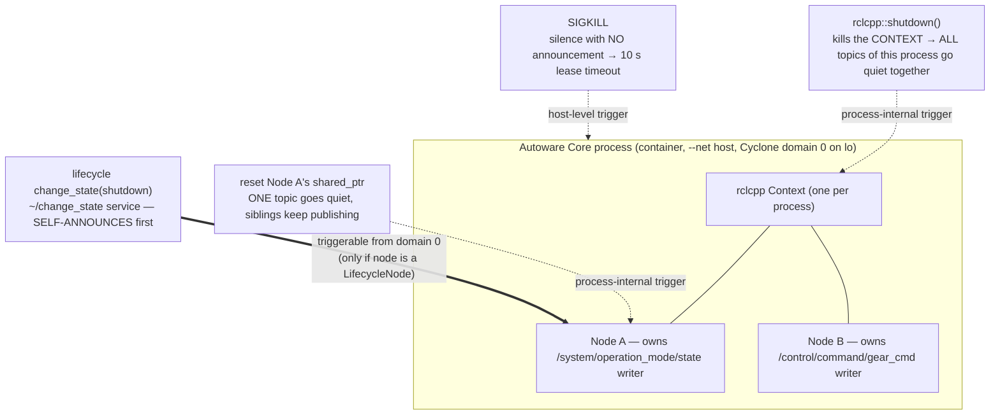

# Task 1 — Liveness & Freshness Loss: Configurable Elements and Element Shutdown

> **Read the [shared foundation](foundation.md) first.** This report reuses the foundation's
> temporal-constraint / STL layer (§0), layer map (§2), publish path (§3), delivery-matching rules
> including the `transient_local` durability gate (§4), and discovery/ports/GUID model (§5) **by
> reference**, and does not re-derive them.
> Source-class tags are the foundation's: `[repo]` = a file in this checkout (cited `path:line`);
> Cyclone DDS core is in-checkout so it is also `[repo]`; `[spec]` = OMG DDS/DDSI-RTPS; `[UNVERIFIED]`
> = would require running the sim or a packet capture; `setup-guide §N` = the authoritative runtime
> record; `[LSEU-abstract]` = a claim, number, or definition taken from the SEU abstract (motivation
> and target behaviour, **not** measured by this static study).

---

## 1. Objective, scope, and exclusions

**Motivation — a silent source is the archetypal critical fault.** Of all the ways a temporal
constraint can be violated, the harshest is the one where the data simply stops: a source that has
gone quiet drives `age(topic)` upward without bound, so *every* freshness property over that topic
fails, and it keeps failing. In the foundation's pipeline (§0) this is the clearest case for a
**preemptive safe-stop**: an actuator holding a gear command whose age exceeds `Δ_fresh` is acting on
data that no longer describes the vehicle `[LSEU-abstract]`. So the first thing the STL monitor has to
get right is *absence*. Absence, however, is the hardest thing to observe — there is no "the
publisher died" message on the wire, only the non-arrival of something, and this report's central
finding is that under the QoS this stack actually configures, **the DDS layer raises no timer-based
alarm for a quiet writer at all**, while `transient_local` latching can make a dead publisher look
alive to a naive freshness check.

**Objective.** Two things. First, enumerate from source the *configurable* elements of this
Autoware-Core / Cyclone-DDS stack — the knobs that change an element's behaviour, lifetime, or
presence, and therefore the knobs that **set or relax the temporal constraints the monitor must
check** — and say for each **where** it is set, **when** (build / launch / runtime), whether it can
change **mid-mission** (i.e. whether a constraint can move under the monitor's feet), and what it
does. Second, document **in depth how one core element goes silent**, keeping four mechanisms that
the names invite conflating strictly distinct — `rclcpp::shutdown()` (whole context), Node
destruction (one node), lifecycle transition (managed nodes), and process signals/kill — because each
leaves a **different freshness-loss signature** with a **different observability latency**. Those two
attributes, not "blast radius," are what decide whether the monitor notices in milliseconds, in ten
seconds, or never.

**Worked target.** Throughout, the "one core element" is the Autoware node that owns the command
topics from the foundation — `/system/operation_mode/state`
(`autoware_adapi_v1_msgs/msg/OperationModeState`) and `/control/command/gear_cmd`
(`autoware_vehicle_msgs/msg/GearCommand`), both published `transient_local` (setup-guide §8;
foundation §4.3). "Shutting this element down" concretely means: making those two topics stop
publishing — i.e. **injecting a total freshness fault on a topic that feeds actuation** — and then
asking what a trace monitor can see, and how fast.

**In scope.** The four application/process-layer paths to silence and, for each, its blast radius,
reversibility, freshness-loss signature, and time-to-observability; how absence manifests (or fails
to) through DDS `DEADLINE`, `LIVELINESS`, and the participant lease; the
`transient_local`-latching masking hazard; and the configurable-element catalogue read as a
constraint-setting surface.

**Excluded (and where it lives instead).** The *protocol-level* removal of an element — forging an
SEDP dispose/unregister so peers believe the endpoint is gone — is named here only as a pointer and
is developed in **Task 4 (silent freshness loss)**, because it is a wire-level fault-injection
mechanism, not a configuration or a clean shutdown path. Likewise the *link-level* kills (`ip link
set lo multicast off`, iptables/tc on the discovery ports) belong to **Task 4 (physical level)**. QoS
as a *latency/jitter* lever is **Task 5**; here QoS appears only as a configurable element and as the
absence-detection machinery of §5. This report does not re-derive the publish path or the
durability-matching rule — see the foundation.

---

## 2. Foundation reuse and new territory

**Reused by reference (not re-derived):**

| From foundation | Used here for |
|---|---|
| §0 data dependency → temporal constraint → STL → trace event → safe-stop | The frame for every closing block here; the `Δ_fresh` / `Δ_deadline` vocabulary and the `/clock` (~90–100 Hz) time base against which age is measured |
| §2 layer map; the `[repo]` locations of the stack | Locating `context.cpp` / `utilities.cpp` / `signal_handler.cpp` at the right layer, and deciding **at which layer** each absence observable is available |
| §3 publish path, esp. step 2 (publish tolerates a shut-down context) | Why a shut-down context produces *silence rather than an error* — the failure mode is invisible at the publishing end |
| §4.1 topic/service name mangling (`rt`/`rq`/`rr` prefixes) | Why the lifecycle and parameter *services* are visible on the wire on domain 0, i.e. why a constraint-changing knob is reachable at runtime |
| §4.3 QoS RxO rule and the rmw QoS mapping | The `transient_local` durability gate that both (a) lets a late-joining monitor receive latched history and (b) creates the masking hazard of §6 |
| §5 discovery, GUIDs, ports, `lo` multicast | The "endpoints disappear from discovery" signature and its latency; the SPDP lease as the last-resort absence timer |

**New territory opened for this task (files first opened here):**
`src/rclcpp/rclcpp/src/rclcpp/utilities.cpp`, `.../context.cpp`, `.../signal_handler.cpp`,
`.../node.cpp`, `.../parameter_service.cpp`, `.../parameter_service_names.hpp`;
`src/rclcpp/rclcpp_lifecycle/src/lifecycle_node_interface_impl.hpp`;
`src/rcl/rcl_lifecycle/src/com_interface.c`, `.../rcl_lifecycle.c`;
`src/rcl/rcl/src/rcl/service.c`; `src/rmw/rmw/include/rmw/qos_profiles.h`.
For the absence-detection and latching mechanism (§5, §6):
`src/cyclonedds/src/core/ddsi/src/ddsi_deadline.c`, `.../q_lease.c`, `.../ddsi_endpoint.c`,
`.../ddsi_entity_match.c`; `src/cyclonedds/src/core/ddsc/src/dds_rhc_default.c`,
`.../dds_reader.c`; `src/cyclonedds/src/CMakeLists.txt`;
`src/rmw_cyclonedds/rmw_cyclonedds_cpp/src/rmw_node.cpp` (the take/sample-info path, not just the
QoS mapping the foundation cites).

---

## 3. Configurable elements (enumeration)

**Orientation.** A ROS 2 element's behaviour is fixed at several distinct moments, and this matters
for the STL monitor because *the moment a knob is set determines whether the constraint it implies is
stable for the whole mission or can move underneath the monitor while the vehicle drives*. A value
baked in at process launch (a `NodeOptions` flag, the domain id, the Cyclone XML) is fixed once and
can be read into the monitor's property set at startup; a value exposed as a **service**
(parameters, lifecycle transitions) can be changed at runtime by anything on domain 0, which means a
derived property can silently stop describing the system it was derived from. A monitor that caches
its bounds and never re-derives them is wrong in exactly the second case. The naive assumption — "it
is all just configuration" — hides this split. The table separates the two.

**Mental model — three configuration surfaces.** (1) *Process-launch configuration*: `InitOptions`,
`NodeOptions`, the domain id, and the whole Cyclone `cyclonedds.xml` — read once at startup, held in
the process, never served on the network. (2) *Endpoint-creation configuration*: the QoS each
publisher/subscriber offers/requests — chosen in code at creation and announced (read-only to peers)
via SEDP. (3) *Runtime-served configuration*: node **parameters** and, if the node is a
**LifecycleNode**, its **managed-transition** interface — both exposed as ROS services and therefore
changeable while the vehicle is running. Only surface (3) can move a derived temporal constraint
mid-mission; surfaces (1) and (2) are inputs to the monitor's property derivation at startup.

| Element | Where configured (cited) | Build / launch / runtime | Can change mid-mission? | Effect — and what it does to a temporal constraint |
|---|---|---|---|---|
| **Node parameters** (`rclcpp::Parameter`) via the parameter **services** | Service endpoints created per node: `set_parameters`, `get_parameters`, `set_parameters_atomically`, `describe_parameters`, `list_parameters`, `get_parameter_types` (`parameter_service.cpp:36-90`; names in `parameter_service_names.hpp:23-28`) `[repo]` | Runtime (values may also be launch-time overrides) | **Yes** — standard services, request/reply endpoints mangled `rq`/`rr` (foundation §4.1), callable by any domain-0 peer | Change a declared parameter → change node behaviour without restart, *if* the node declared it and permits the set. A timer-period or rate parameter **is** the actuation frequency, so setting it moves `f_min`/`f_max` in the rate property — the monitor's bound must be re-derived, not cached `[INFERRED]` |
| **QoS profiles** (per endpoint) | Chosen at publisher/subscriber creation; mapped to Cyclone by `create_readwrite_qos` (foundation §4.3, `rmw_node.cpp:2010-2104`) `[repo]` | Build/launch (in code; some overridable via QoS-override parameters) | **No — announced, not settable.** A peer *reads* the offered/requested QoS from SEDP (foundation §5) but cannot change it | Governs matching and delivery. Read for this task: it is also where the *absence-detection* policies live or fail to (`DEADLINE`, `LIVELINESS`, `LIFESPAN` — next row), and where the `transient_local` request that enables latching (§6) is made |
| **`DEADLINE` / `LIVELINESS` / `LIFESPAN`** (the absence-detection policies) | Mapped only if explicitly set: `dds_qset_lifespan` (`rmw_node.cpp:2077`), `dds_qset_deadline` (`:2080`), liveliness lease defaulting to `DDS_INFINITY` (`:2084`) then `dds_qset_liveliness` (`:2091`) `[repo]`. The ROS 2 default profile leaves all three at `RMW_DURATION_UNSPECIFIED` (`qos_profiles.h:51-62`, `types.h:460-466`, `time.h:56`) `[repo]` | Build/launch (in the publisher/subscriber QoS) | No | **The pivotal row for this task.** Under the default profile no deadline is set and the liveliness lease is infinite, so Cyclone arms *no* per-endpoint absence timer (§5) — the temporal constraint exists in the design but has no enforcement anywhere in the stack |
| **`NodeOptions`** (intra-process comms, parameter overrides, `use_global_arguments`, clock, allocator) | `src/rclcpp/rclcpp/src/rclcpp/node.cpp` construction path; passed to `Node()` (`node.cpp:112-117`) `[repo]` | Build/launch | No | Per-node construction behaviour; the clock choice decides whether the node's stamps follow sim `/clock` or the wall clock — i.e. which time base a freshness property is expressed in (§5.4) |
| **`InitOptions`** incl. `shutdown_on_signal`, `auto_initialize_logging`, domain id | Consumed in `Context::init` (`context.cpp:191-257`); `shutdown_on_signal` read in the signal path (`signal_handler.cpp:262`) `[repo]` | Launch (process init) | No | Whether SIGINT/SIGTERM tears the context down (§4.4) — and therefore whether a terminating process leaves a *clean* withdrawal signature or an abrupt one; logging init |
| **Domain id** | `Context::get_domain_id()` → `rcl_context_get_domain_id` (`context.cpp:282-291`) `[repo]`; effective **0** here (setup-guide §2) | Launch (env `ROS_DOMAIN_ID` / init options) | No (but *defines* the shared namespace the monitor must join to observe anything) | Isolation scope; here everything is domain 0 on `lo`. A monitor on the wrong domain observes perfect silence and cannot distinguish it from a dead system |
| **Lifecycle state** (managed nodes) | `LifecycleNode` change-state machine + services (§4.3 below) `[repo]` | Runtime | **Yes, if the node is a `LifecycleNode`** — see §4.3 | Move a managed node configure↔activate↔deactivate↔shutdown, changing whether it publishes at all — i.e. a *runtime-reachable* way to stop a data flow, which makes it both a freshness-fault injector and a safe-stop actuator candidate (Task 4) |
| **Cyclone config knobs** (`ParticipantIndex=none`, `NetworkInterface name="lo"`, `AllowMulticast=default`, `MaxMessageSize=65500B`, `WhcHigh=500kB`) | `cyclonedds.xml`, loaded via `CYCLONEDDS_URI` (setup-guide §4); ports/participant-index behaviour traced in foundation §5 | Launch (per process, from XML) | No — but changes DDS behaviour for **every element in that process at once** | Interface binding, multicast, max sample size, and WHC back-pressure (Task 3). The XML also owns `Discovery/LeaseDuration`, default **10 s** (`ddsi_cfgelems.h:1960-1965`) `[repo]` — the single timer that bounds how late an unclean death is noticed (§5.3) |

**Gotcha — parameters are only as reachable as the node made them.** A `set_parameters` call
reaches the service, but the node's callback (`parameter_service.cpp:76-90`) `[repo]` delegates to
`node_params->set_parameters_atomically`, which enforces declaration and any registered validation.
An undeclared or read-only parameter is rejected there, not at the DDS layer. So "changeable at
runtime" for parameters means *the service is matchable*, not *any value is settable*.

**Closing block — §3 in monitor terms.**

1. **The property.** Configuration does not itself carry a temporal constraint; it *parameterizes*
   one. The property this section implies is a **stability** property over the constraint set:
   `G( Δ_fresh(t), f_min(t), f_max(t) = Δ_fresh(0), f_min(0), f_max(0) )` — the bounds the monitor
   derived at startup still describe the running system. It is violated by exactly two rows above:
   a **parameter set** that changes a publish rate and a **lifecycle transition** that changes
   whether a node publishes at all `[INFERRED from the two runtime-mutable rows; the rest are
   launch-fixed]`.
2. **The trace event.** For parameters, a request on the `rq`/`rr` endpoints of
   `<node>/set_parameters` (`parameter_service_names.hpp:23-28`) `[repo]`, plus the node's
   `/parameter_events` publisher, created per node in
   `node_parameters.cpp:76` `[repo]` — both visible at the rmw/DDS layer as ordinary samples. For lifecycle, the `TransitionEvent` of §4.3. The launch-fixed rows are
   *not* trace events: they are read once (SEDP-announced QoS, the Cyclone XML) and belong in the
   monitor's property-derivation input, not its runtime trace.
3. **The safe-stop decision.** Not a safe-stop on its own — a configuration change is a
   **re-derivation trigger**. The correct response is to invalidate the affected properties and
   re-derive their bounds; continuing to evaluate a stale bound is how a monitor reports "all clear"
   on a system it no longer models. The one exception is a lifecycle `deactivate`/`shutdown` on a
   node that owns an actuation topic, which is a freshness fault in its own right and is handled
   under §4.3.

---

## 4. Element shutdown — four paths to a silent source (DEEP)

**Orientation.** "Shut it down" is four different operations in this stack, and — the point for the
STL monitor — they produce four *different freshness-loss signatures observable at different
latencies*. The naive reading treats `rclcpp::shutdown()`, deleting a node, a lifecycle `shutdown`
transition, and `kill` as interchangeable "stop the node" verbs. They are not, and the differences
are exactly what a trace monitor keys on: two of them stop *every* topic in the process at once
(a correlated, whole-participant freshness loss), one stops *one* topic while its siblings keep
publishing (a single-topic loss under a still-live participant — the hardest to attribute), one
*announces itself* on the wire before going quiet, and one (SIGKILL) leaves no announcement at all so
that absence is only confirmed by a **10 s** lease timeout (§5.3). This section keeps them distinct
and, for each, states **what it kills**, the **blast radius**, whether it is **clean/reversible**, its
**freshness-loss signature**, and **how fast the monitor can observe it**. Read as fault injection,
these four are also the study's *liveness-fault injectors*: they are how a total freshness fault is
driven into the system so the monitor's safe-stop path can be exercised `[LSEU-abstract]`.

*What to notice:* the distinction that matters to the monitor is not who can pull the trigger but
**what the trace looks like afterwards**. `S1` and `S2` withdraw endpoints via SEDP (prompt, but
differing in *scope*: whole participant vs. one node's endpoints); `S3` emits an application-level
`TransitionEvent` *before* the topic goes quiet, which is the only case where absence is preceded by
a positive signal; `S4` is the worst case — no withdrawal, no event, just non-arrival, resolved only
when the participant lease expires. Only the double arrow (`S3`) is triggerable from domain 0; `S1`
and `S2` are in-process calls and `S4` needs host access, so as *injectors* the first three require
code inside or a matched service client, and SIGKILL requires the host.

### 4.1 `rclcpp::shutdown()` — every topic in the process goes quiet at once

**What it kills.** The entire `Context` — i.e. **every node created on that context in that
process**, not one element. `rclcpp::shutdown(context, reason)` resolves the argument to the global
default context when null, calls `context->shutdown(reason)`, and — if it was the default context —
uninstalls the signal handlers (`utilities.cpp:171-183`) `[repo]`.

**Traced procedure (≥6 steps), what it invalidates.**
1. `rclcpp::shutdown` picks the default context if none was passed and calls
   `context->shutdown(reason)` (`utilities.cpp:174-178`) `[repo]`.
2. `Context::shutdown` takes the recursive `init_mutex_`, and **returns `false` immediately if the
   context is already invalid** (`context.cpp:321-326`) `[repo]` — so a second shutdown is a no-op,
   not an error. It also guards against reentrant calls from a pre-shutdown callback via a
   `thread_local` in-progress set (`context.cpp:328-332`) `[repo]`.
3. It runs every registered **pre-shutdown callback** (`context.cpp:335-340`) `[repo]`.
4. It calls **`rcl_shutdown(rcl_context_)`** (`context.cpp:343`) `[repo]`. This is the point the
   context becomes invalid: `Context::is_valid()` is `rcl_context_is_valid()` on that handle
   (`context.cpp:259-268`) `[repo]`.
5. It records the reason, runs the **on-shutdown callbacks**, then
   **`interrupt_all_sleep_for()`** — which wakes every blocking `sleep_for`, executor, and wait set
   via the interrupt condition variable (`context.cpp:347-358,532-536`) `[repo]`.
6. It removes itself from the global weak-contexts list and, if it owned logging init, finalizes
   logging (`context.cpp:359-376`) `[repo]`.

**The failure mode is silence, not an error — and this is the crux for freshness.** Once the context
is invalid, a `publisher->publish()` on `/control/command/gear_cmd` does not throw: the foundation's
publish path (§3 step 2) shows `do_inter_process_publish` swallows the `RCL_RET_OK`-or-shutdown case
and silently returns (`publisher.hpp:462-465`) `[repo]`. A control loop can therefore keep calling
`publish()` at its nominal rate, believing it is commanding the vehicle, while **nothing reaches the
wire**. There is no error at the producing end and no notification at the consuming end; the only
evidence anywhere in the system is the *absence* of samples. This is precisely the fault class an STL
freshness property exists to catch, and it is why "the publisher didn't complain" is never evidence
of liveness. The rcl context is only *finalized* (`rcl_context_fini`) later, when the `Context` is
destroyed and `clean_up()` resets the handle (`context.cpp:152-167,538-544`; `__delete_context` at
`context.cpp:169-189`) `[repo]` — so between `shutdown()` and destruction the participant may still
be present on the wire while its topics are dead.

**Blast radius.** The whole process's ROS layer: *both* command topics and every other node on that
context go quiet together. For the monitor this is the *easiest* signature to recognise, because
simultaneity across unrelated topics is itself the evidence — many properties fail in the same
trace instant, pointing at the participant rather than at any one data dependency.

**Trigger.** In-process only. `rclcpp::shutdown()` is a C++ call on an in-process object; there is no
DDS endpoint for it, so as a fault injector it must be compiled in (or reached via the signal path of
§4.4). `[INFERRED: no service or topic is created for context shutdown anywhere in
context.cpp/utilities.cpp]`.

**Clean / reversible?** Clean (callbacks run, sleeps interrupted). **Not reversible in place**: once a
context is shut down it cannot be re-`init`'d — `Context::init` throws `ContextAlreadyInitialized` if
valid and otherwise `clean_up()`s first (`context.cpp:197-201`) `[repo]`; recovery means a new
context (in practice, a process restart). So the freshness violation is **permanent** for the life of
that process — there is no self-healing path back, which is what makes it a safe-stop case rather
than a transient degradation.

**Freshness-loss signature and observability latency.** All of that process's endpoints withdraw from
discovery when the nodes are destroyed (SEDP unregistration; foundation §5), and every topic it owned
goes silent simultaneously — a *correlated, whole-participant* freshness loss. Two observables, at
two latencies: (a) **non-arrival**, detectable after one violated inter-arrival bound, i.e. ~one
publish period once the monitor's own `Δ` elapses `[INFERRED]`; (b) **SEDP withdrawal**, prompt but
only at node destruction, and note from the sequencing above that `shutdown()` can precede
destruction — so non-arrival is the *earlier* signal and discovery withdrawal merely confirms it.

### 4.2 Destroying one Node — a single-topic freshness loss under a live participant

**What it kills.** Exactly one node's entities. `Node::~Node()` resets the node's sub-interfaces in a
deliberate order — waitables, time source, parameters, clock, services, topics, timers, logging,
graph (`node.cpp:267-279`) `[repo]`. Resetting `node_topics_` destroys that node's publishers and
subscriptions; when the last `shared_ptr` to the node drops, the underlying rcl node is finalized and
its DDS writers/readers are deleted. So destroying *Node B* removes the `/control/command/gear_cmd`
writer while leaving *Node A*'s `/system/operation_mode/state` writer and the rest of the process
untouched.

**Blast radius.** One node — and therefore **one data dependency**. This is the scalpel
`rclcpp::shutdown()` is not, and for the monitor it is the *hardest* of the four to attribute: the
participant is still alive, still announcing itself, still publishing its other topics at full rate,
so every global health indicator looks nominal while exactly one freshness property fails. A monitor
that watches participants rather than per-topic data dependencies misses this entirely. This is the
case that justifies the abstract's per-dependency derivation of constraints `[LSEU-abstract]`: the
fault is only visible in the property attached to that one topic.

**Trigger.** In-process only. Destroying a node is `reset()` on a `shared_ptr` held *inside the owning
process*; there is no network verb for "delete your node." A domain-0 peer can *observe* the
resulting discovery withdrawal but cannot *cause* it this way; producing the same endpoint
disappearance from outside means forging discovery traffic — the SEDP dispose/unregister path, which
is **Task 4 (protocol level)**, not this mechanism.

**Clean / reversible?** Clean (destructor order lets sub-interfaces consult `node_base` during
teardown, per the comment at `node.cpp:269`) `[repo]`. Reversible only by constructing a new node —
and a re-created node must be re-discovered before its samples flow again, so the freshness gap is
the destruction-to-rediscovery interval, bounded by SEDP/SPDP timing (foundation §5), not by the
node's construction time.

**Freshness-loss signature and observability latency.** A *single* endpoint (or the small set owned by
that one node) withdraws from discovery while the participant and its sibling nodes remain — a
*partial* withdrawal under a still-present participant GUID, unlike §4.1's whole-participant exit.
Two observables again: non-arrival on exactly one topic (~one publish period past `Δ` `[INFERRED]`),
and a drop in the reader's matched-publisher count, which Cyclone maintains as a subscription
status and rmw surfaces via `rmw_subscription_count_matched_publishers` →
`dds_get_subscription_matched_status` (`rmw_node.cpp:2983-2999`) `[repo]`. Note that this is a
**polled query, not an event**: Humble's rmw event enumeration has no
`RMW_EVENT_SUBSCRIPTION_MATCHED` member (`event.h:33-49`) `[repo]`, so "my publisher went away" is
not deliverable as a callback at this layer at all — its latency is set by how often the monitor
asks, not by the wire.

### 4.3 Lifecycle transition — the self-announcing silence, and the safe-stop actuator candidate

**Motivation.** This mechanism matters to the SEU twice over. First, it is the only one of the four
where **the silence announces itself**: the transition publishes a `TransitionEvent` before the
node's publishers go quiet, so the monitor gets a positive event rather than having to infer absence
from non-arrival — a *declared* freshness loss, which a monitor can treat as planned rather than
faulty. Second, and more important for the abstract's pipeline, it is the one clean mechanism
**triggerable from domain 0 without touching the target's code or host** — which makes it the leading
candidate for how a safe-stop *actuates*: if the SEU decides a flow must stop, `deactivate` on a
managed node is the in-band way to stop it `[INFERRED; the actuation design is developed in Task 4]`.
A ROS 2 *managed* (lifecycle) node exposes its state machine as ROS **services**; anything that can
match those services can request a transition, including `deactivate` (stop processing) or `shutdown`
(terminate the managed lifecycle).

**Mechanism — the services exist and are network endpoints.** When a `LifecycleNode` initialises with
the communication interface enabled, it creates five services, among them **`change_state`**, wiring
the service to `on_change_state` and registering it on the node
(`lifecycle_node_interface_impl.hpp:119-134`) `[repo]`. The service **name is `~/change_state`**
(`com_interface.c:41`) `[repo]`, i.e. `<namespace>/<node>/change_state`, created with
`rcl_service_get_default_options()` (`com_interface.c:169-172`) `[repo]`, whose QoS is
`rmw_qos_profile_services_default` = **KEEP_LAST(10), RELIABLE, VOLATILE**
(`service.c:214`; `qos_profiles.h:64-75`) `[repo]`. Being a ROS service, its request/reply endpoints
are mangled with the `rq`/`rr` prefixes (foundation §4.1) and announced via SEDP — so they are
discoverable and matchable by any participant on domain 0.

**Why an out-of-process client matches.** The service reader/writer are **VOLATILE**, not
`transient_local`. By the foundation's RxO rule (§4.3), a client offering the default service QoS
(also RELIABLE + VOLATILE) satisfies `rd.durability(0) > wr.durability(0)` → false → **match**. So
unlike the command *topics* (which demand `transient_local` and trip the durability gate on a naive
writer), the lifecycle *service* has no durability barrier: a plain client matches it. `[INFERRED
from foundation §4.3 applied to the service's default QoS]`. For the SEU this is the encouraging
half of the finding — no QoS gymnastics are needed for the monitor to reach the transition
interface — and for fault injection it means a liveness fault can be induced from a separate process
with a stock service client.

**Traced request path (≥6 steps).**
1. A client sends a `ChangeState` request naming a transition (id or label, e.g. label `shutdown` or
   `deactivate`).
2. `on_change_state` receives it under the state-machine mutex and resolves the transition; **a label
   takes precedence over the id** (because `ros2 service call` defaults integer fields to 0), looked
   up via `rcl_lifecycle_get_transition_by_label` (`lifecycle_node_interface_impl.hpp:226-243`)
   `[repo]`.
3. It calls `change_state(transition_id, cb_return_code)`
   (`lifecycle_node_interface_impl.hpp:247`) `[repo]`.
4. `change_state` verifies the state machine is initialised, records the initial state, and fires the
   transition with `rcl_lifecycle_trigger_transition_by_id(..., publish_update=true)`
   (`lifecycle_node_interface_impl.hpp:406-431`) `[repo]` — `publish_update=true` means the node
   **publishes a `TransitionEvent`**, a visible side effect.
5. It runs the user callback for the target state via `execute_callback`
   (`lifecycle_node_interface_impl.hpp:446,494-516`) `[repo]`; on `deactivate` this calls the managed
   entities' `on_deactivate` (`:586-595`) `[repo]`, which is what actually silences a
   `LifecyclePublisher`.
6. It triggers the terminal transition-label (success/failure/error) and updates the current state
   (`lifecycle_node_interface_impl.hpp:449-463`) `[repo]`; the response's `success` reflects the
   callback return (`:252-253`) `[repo]`.

**Applied to the target.** *If* the node owning `/control/command/gear_cmd` is a `LifecycleNode` with
a `LifecyclePublisher`, a `deactivate` request stops it publishing (the publisher's `on_deactivate`
gate), and `shutdown` terminates its managed lifecycle — both **from a separate process on domain
0**, no forgery required, just a matched service client. Read as a temporal fault: the gear-command
freshness property `G( age(/control/command/gear_cmd) ≤ Δ_fresh )` begins failing one `Δ_fresh` after
the `on_deactivate` returns, with the `TransitionEvent` landing in the trace *before* that — so this
is the one liveness fault whose onset the monitor can timestamp exactly rather than bound.

**The critical open question — does Autoware Core here use lifecycle nodes?** **Cannot be confirmed
from this checkout.** The checkout contains Autoware *message* packages only (`autoware_msgs`,
`autoware_adapi_msgs`); the *node* implementations that publish `/control/command/gear_cmd` and
`/system/operation_mode/state` are **not** present, so whether they derive from
`rclcpp_lifecycle::LifecycleNode` or plain `rclcpp::Node` cannot be read from source here.
`[UNVERIFIED: requires the autoware_core node sources or a live `ros2 lifecycle nodes` / `ros2
service list | grep change_state` against the running container]`. **What is verified** is the
mechanism: the `change_state` service, *where it exists*, is a domain-0-reachable clean stop for a
data flow with no durability barrier, per the citations above. This conditional is the honest
finding, and it cuts at the SEU's design: **if these nodes are not managed, the SEU has no in-band
clean way to stop a flow at all**, and safe-stop actuation must fall back to the protocol- or
link-level mechanisms of Task 4 — a materially worse option, because those stop delivery without
telling the producer it has been stopped.

**Blast radius.** One managed node (and its managed publishers/timers) — like §4.2, a single data
dependency, but announced.

**Trigger.** Domain 0, from a separate process — the only clean path that can — *if* the target is a
LifecycleNode.

**Clean / reversible?** Clean and, for `deactivate`, **reversible** — `activate` brings it back
(the state machine supports the round trip). `shutdown` reaches a terminal state and is not
reversible without re-creating the node. Reversibility is why `deactivate` is the plausible
safe-stop actuator: the flow can be restored without a process restart, and the resulting freshness
gap is bounded by the transition round trip rather than by re-discovery.

**Freshness-loss signature and observability latency.** A published **`TransitionEvent`** (step 4)
and a state change readable via the node's `get_state` service — a *self-announced* transition, plus
the target's publishers going quiet. The `TransitionEvent` arrives as an ordinary sample on an
ordinary topic, so **observability latency is one sample's transit** — far faster than any
absence-based inference, and it is the only one of the four mechanisms where the monitor learns of
the coming silence *before* the first missed deadline. Secondary observable: the requester is a
matched service client carrying a participant GUID (foundation §5), which lets the monitor
distinguish a transition it requested itself from one requested by something else — relevant once
`deactivate` is also the safe-stop actuator, since the monitor must not mistake its own actuation for
a new fault.

### 4.4 Process signals and kill — the unannounced death, and the 10 s worst case

**What it kills.** The whole process. rclcpp installs a SIGINT (and optionally SIGTERM) handler in
`SignalHandler::install`, using `sigaction` where available and spawning a deferred handler thread
(`signal_handler.cpp:119-165`) `[repo]`. On a signal, the deferred handler iterates **every**
context via `rclcpp::get_contexts()` and calls `context->shutdown("signal handler")` for each whose
`shutdown_on_signal` init option is true (`signal_handler.cpp:254-284`, gate at `:261-262`) `[repo]`.
So a delivered SIGINT funnels into the §4.1 whole-context shutdown for every context in the process.
`SIGKILL` skips all of this and terminates the process outright — no callbacks, no clean SEDP
withdrawal.

**Blast radius.** The whole process (all contexts, all nodes) — every temporal constraint whose
producer lived in that process fails at once.

**Trigger.** Host/OS access to the process, not a DDS endpoint. The `--net host` co-location means a
process *with host access* can trivially `kill` the container's PID (setup-guide §0). As an injector
this is the bluntest and most realistic model of a hardware or OS-level element failure — the fault
class the SEU's safe-stop exists for `[LSEU-abstract]` — but note it is a host capability, not
something reachable from the data bus. `[INFERRED from the signal API being an OS mechanism with no
DDS surface; the host-access ease is a loopback co-location artifact per foundation realism caveat]`.

**Clean / reversible?** SIGINT/SIGTERM via the handler → clean per §4.1 (callbacks run). SIGKILL →
**unclean**: the process vanishes without running shutdown callbacks or gracefully unregistering
endpoints. Neither is reversible without a restart.

**Freshness-loss signature and observability latency — the worst case in this report.** The SIGINT
path gives the same correlated whole-participant SEDP withdrawal as §4.1. The **SIGKILL path gives
nothing**: no shutdown callbacks, no SEDP unregistration, no `TransitionEvent` — the participant
simply stops answering. Its liveness is then resolved only by the participant lease, and Cyclone's
default `Discovery/LeaseDuration` is **10 s** (`ddsi_cfgelems.h:1960-1965`) `[repo]`, not overridden
by the deployment XML (setup-guide §4). When the lease expires, `q_lease.c` dispatches on entity
kind: a proxy participant is **deleted** (`ddsi_delete_proxy_participant_by_guid`,
`q_lease.c:290-291`) and a proxy writer is marked not-alive
(`ddsi_proxy_writer_set_notalive`, `q_lease.c:293-294`) `[repo]`. So *discovery-level* confirmation
that the producer is dead can lag the actual death by up to ten seconds — three orders of magnitude
longer than the `/clock`-derived `Δ_fresh` of tens of milliseconds (foundation §0). **The
consequence for the monitor is decisive: a freshness property evaluated on sample arrivals detects
this fault ~10³× faster than any discovery- or lease-based liveness check, so the monitor must key on
data arrival, not on DDS's view of who is alive.** `[INFERRED from the 10 s default against the
~90–100 Hz `/clock` rate, setup-guide §6d]`

### 4.5 Comparison — ranked by how hard the resulting silence is to see

| Mechanism | Kills | Scope of freshness loss | Triggerable from domain 0? | Clean? | Reversible? | Signature and how fast it is observable |
|---|---|---|---|---|---|---|
| Lifecycle `change_state` (§4.3) | one managed node's activity | one data dependency | **Yes**, if LifecycleNode | Yes | `deactivate` yes; `shutdown` no | **Easiest.** `TransitionEvent` sample *before* the silence — one sample's transit; requester GUID also visible |
| `rclcpp::shutdown()` (§4.1) | the context | every topic of the process, simultaneously | No (in-process call) | Yes | No (needs new context) | Correlated multi-topic non-arrival (~one period past `Δ`), then whole-participant SEDP withdrawal at node destruction |
| Node destruction (§4.2) | one node's entities | one data dependency, siblings unaffected | No (in-process `reset`) | Yes | Only by re-creating | Single-topic non-arrival under a still-live, still-publishing participant; matched-count drop is **polled**, not an event |
| SIGKILL (§4.4) | the process | every topic of the process | No as a bus capability; host access only | **No** | No | **Hardest.** No withdrawal, no event; discovery confirms only at the **10 s** lease expiry — so only data-arrival monitoring catches it in time |

*(SIGINT/SIGTERM funnels into the §4.1 row via the handler; SIGKILL is the distinct case.)*

**Closing block — §4 in monitor terms.**

1. **The property.** One liveness property per actuation-feeding topic, plus its rate bound:
   `G( pub(/control/command/gear_cmd) → F_[0,Δ_deadline] pub(/control/command/gear_cmd) )` and
   `G( inter_arrival(/control/command/gear_cmd) ∈ [1/f_max, 1/f_min] )`, with the same pair over
   `/system/operation_mode/state`. All four mechanisms of §4 violate the first; `Δ_deadline` must be
   derived from the topic's nominal publish period against the `/clock` time base, not from any DDS
   setting, because §5 shows the stack configures no deadline at all `[INFERRED]`.
2. **The trace event.** Primarily **sample arrival** — the timestamp of each received sample on the
   topic, from which both age and inter-arrival follow; available at every layer from ddsi upward.
   Secondarily, and only for the cheaper cases: the `TransitionEvent` sample (§4.3), the SEDP
   withdrawal (§4.1/§4.2), the polled matched-publisher count (`rmw_node.cpp:2983-2999`) `[repo]`,
   and — last and slowest — the lease expiry inside ddsi (`q_lease.c:290-294`) `[repo]`. The ordering
   is the finding: the cheap secondary events are either absent (SIGKILL) or late (lease), so arrival
   timestamps carry the property.
3. **The safe-stop decision.** **Safe-stop, for all four.** These topics feed actuation; a command
   whose age exceeds `Δ_fresh` cannot be acted on, and none of the four mechanisms self-heals within
   an actuation period (§4.1 and §4.4 need a process restart, §4.2 needs re-discovery, §4.3's
   `deactivate` needs an external `activate`). The differentiator is not *whether* to safe-stop but
   *how late* the decision arrives: one sample transit for §4.3, roughly one publish period for
   §4.1/§4.2 and for §4.4 *if* the monitor watches arrivals — and up to ten seconds for §4.4 if it
   instead trusts DDS liveness.

---

## 5. How absence manifests at the DDS layer — `DEADLINE`, `LIVELINESS`, and the lease

**Motivation.** §4 established *that* the source goes quiet and *what* each mechanism leaves behind.
The question a monitor designer asks next is the obvious one: DDS has policies named exactly for this
— `DEADLINE` ("I expect a sample every T") and `LIVELINESS` ("tell me if the writer stops asserting
itself") — so why not simply turn them on and let the middleware report absence? This section traces
both through Cyclone and reaches a negative result that shapes the whole SEU design: **the machinery
is fully implemented and compiled in, but this stack's QoS leaves it disarmed**, and the one timer
that *is* armed by default (the participant lease) is ~10 s coarse and only fires when the whole
process dies.

### 5.1 `DEADLINE` — implemented, event-driven, and off

**The mechanism exists and is exactly the shape the SEU wants.** Cyclone keeps a per-reader
*deadline administration*: a list of instances ordered by next deadline, driven by a single scheduled
`xevent` rather than polling. `deadline_init` registers `instance_deadline_missed_cb` on the domain's
event queue with an initial expiry of `DDSRT_MTIME_NEVER`
(`ddsi_deadline.c:50-56`) `[repo]`; each firing pulls every instance whose deadline has passed
(`deadline_next_missed_locked`, `ddsi_deadline.c:30-48`) `[repo]` and reschedules itself for the
earliest remaining one (`ddsi_deadline.c:19-24`) `[repo]`. Sample storage renews or registers the
instance's deadline as data arrives (`dds_rhc_default.c:1489-1502`, using
`ddsrt_time_monotonic()` at `:1501`) `[repo]`. When a deadline is missed, the reader's callback marks
the instance's writer not-live and raises `DDS_REQUESTED_DEADLINE_MISSED_STATUS_ID` through
`dds_reader_status_cb` (`dds_rhc_default.c:530-556`) `[repo]`, which the reader layer accumulates and
dispatches to a listener (`dds_reader.c:414,452-453`) `[repo]`. That is a genuine event-driven
freshness alarm, per instance, with no polling — the same design the SEU adopts `[LSEU-abstract]`.
It is also compiled in: `ENABLE_DEADLINE_MISSED` defaults to `ON`
(`src/cyclonedds/src/CMakeLists.txt:27`) `[repo]`, guarding the `DDS_HAS_DEADLINE_MISSED` block at
`dds_rhc_default.c:530`.

**Why it is nevertheless inert here.** The reader's deadline duration is taken from its QoS and
defaults to infinity: `rhc->deadline.dur = (reader != NULL) ? reader->m_entity.m_qos->deadline.deadline
: DDS_INFINITY` (`dds_rhc_default.c:582-583`) `[repo]`. And the QoS never carries one, because
`create_readwrite_qos` calls `dds_qset_deadline` **only if the profile specifies a deadline**
(`rmw_node.cpp:2079-2080`) `[repo]`, while every stock ROS 2 profile leaves it at
`RMW_QOS_DEADLINE_DEFAULT` = `RMW_DURATION_UNSPECIFIED` = `{0,0}`
(`qos_profiles.h:51-62`; `types.h:460`; `time.h:56`) `[repo]`. Unless an Autoware publisher/subscriber
explicitly sets a deadline in its QoS — which cannot be checked here because the node sources are
absent from the checkout `[UNVERIFIED]` — **no deadline is armed on these topics**, and the
`xevent` sits at `MTIME_NEVER` forever. A further limitation even if it were set: Cyclone does not
support *updating* the deadline duration on an existing reader, as the `FIXME` at
`dds_rhc_default.c:614-615` records `[repo]` — so a monitor cannot retune a deadline in response to a
re-derived constraint (§3's stability property) without recreating the reader.

### 5.2 `LIVELINESS` — collapses onto the participant under the default profile

The same pattern, one layer down. `create_readwrite_qos` computes the lease as
`ldur = DDS_INFINITY` when the profile's `liveliness_lease_duration` is unspecified
(`rmw_node.cpp:2083-2085`) `[repo]` and then sets `DDS_LIVELINESS_AUTOMATIC` with that infinite lease
(`:2088-2091`) `[repo]`; the stock profiles do leave it unspecified
(`qos_profiles.h:51-62`; `types.h:466`) `[repo]`. In Cyclone, an infinite lease means **no writer
lease object is created at all**: `new_writer_guid` allocates `wr->lease_duration` only when
`wr->xqos->liveliness.lease_duration != DDS_INFINITY`, and otherwise sets it to `NULL`
(`ddsi_endpoint.c:910-919`) `[repo]`; the code that would enrol an `AUTOMATIC`-liveliness writer in
the participant's lease-duration heap and trigger participant-message (PMD) renewal is guarded by
`if (wr->lease_duration != NULL)` (`ddsi_endpoint.c:990-1002`) `[repo]`. Consequence: **a writer that
stops writing never loses liveliness**, because nothing is measuring it. Liveliness degenerates to
"is the participant still there," which is the lease of §5.3.

### 5.3 The participant lease — the only default-armed timer, and it is coarse

Cyclone's `Discovery/LeaseDuration` defaults to **10 s** (`ddsi_cfgelems.h:1960-1965`) `[repo]` and
the deployment XML does not override it (setup-guide §4). On expiry, `q_lease.c` deletes the proxy
participant or marks a proxy writer not-alive (`q_lease.c:290-294`) `[repo]`, using wall-clock time
(`ddsrt_time_wallclock()` at `:291`). Two limits make this useless as a freshness signal:

- **It is ~10³× too coarse.** Against a `Δ_fresh` in tens of milliseconds, derived from the
  ~90–100 Hz `/clock` (foundation §0; setup-guide §6d), a ten-second confirmation arrives roughly a
  thousand actuation periods late `[INFERRED]`.
- **It usually never fires.** The lease is renewed by the *participant*, so for §4.2 (node
  destroyed), §4.3 (node deactivated) and the post-`shutdown()`-pre-destruction window of §4.1, the
  process is still alive and renewing — the lease never expires even though the topic is dead. It
  fires only for §4.4's SIGKILL, i.e. exactly the case where nothing faster is available.

### 5.4 The time-base trap — three clocks, and they are not the same clock

A freshness property is an arithmetic statement about *time*, so which clock it is evaluated in is
load-bearing. This stack mixes three:

| Quantity | Clock | Cited |
|---|---|---|
| `SampleInfo.source_timestamp` (what a reader learns about a sample's age) | **Wall clock**, stamped at write: `dds_write` passes `dds_time()` into `dds_write_impl` (`dds_write.c:55`; also `:76` for the CDR path), and `dds_time()` is "nanoseconds since the UNIX Epoch" (`time.h:95-99`) | `[repo]` |
| DDS deadline expiry (§5.1) | **Monotonic**: deadlines are `ddsrt_mtime_t`, registered with `ddsrt_time_monotonic()` (`dds_rhc_default.c:1501`) | `[repo]` |
| Autoware/AWSIM message-header stamps and any `use_sim_time` node's clock | **Sim time**, published on `/clock` at ~90–100 Hz by the bridge | setup-guide §6d |

The monitor's property is naturally written over sim time (that is the time the vehicle's control
loop lives in), but the only per-sample timestamp DDS gives it is wall-clock. The two agree only
while the simulation runs at exactly real time; if sim time is paused, stepped, or scaled, a
wall-clock age computation reports staleness that the control loop does not experience (false
positive) or freshness it does not have (false negative) `[INFERRED from the three clock sources
above; the actual sim-time/wall-time ratio during a run is `[UNVERIFIED]` without running the sim]`.
**Design consequence:** a freshness property over an Autoware topic should be evaluated against the
message's own header stamp (sim time) with `/clock` as the progress reference, and the DDS
`source_timestamp` used only as a transport-layer cross-check — not the other way round.

### 5.5 What the monitor can actually read, and at which layer

The absence observables are not uniformly available up the stack; the rmw boundary drops most of
them. `message_info_from_sample_info` copies `source_timestamp` through
(`rmw_node.cpp:3127`) `[repo]` but **hardcodes `received_timestamp = 0`** with a TODO
(`:3128-3129`) `[repo]` and reports both sequence numbers as
`RMW_MESSAGE_INFO_SEQUENCE_NUMBER_UNSUPPORTED` (`:3130-3131`) `[repo]`. So a monitor implemented as
an ordinary ROS 2 subscriber gets the writer's send time but **neither the arrival time nor the RTPS
sequence number** — it must stamp arrival itself in its own callback (adding its own scheduling
jitter to every age measurement) and cannot see gaps in per-writer sequence at all (which is why
Task 3's over-publication work taps lower). Two further layer facts:

- The freshness computation is already written at this layer, and compiled out:
  `dt = tnow - info.source_timestamp` compared against a threshold, gated on
  `REPORT_LATE_MESSAGES`, which is `#define`d to `0` (`rmw_node.cpp:106`; the block at
  `:3160-3166`) `[repo]`. Evidence that the age arithmetic costs a subtraction at the take path —
  consistent with the SEU's `<2%` CPU target, though that number is the abstract's, not measured
  here `[LSEU-abstract]`.
- There **is** an existing event-driven capture hook: `TRACEPOINT(rmw_take, subscription, message,
  source_timestamp, taken)` fires on every take (`rmw_node.cpp:3172-3177`) `[repo]`, with
  `TRACEPOINT(rmw_publish, ros_message)` on the send side (`:1833`) `[repo]`. A trace monitor keyed on
  these gets exactly the arrival stream it needs without modifying application code — the closest
  thing in this stack to the abstract's event-driven trace capture `[INFERRED]`.
- The rmw event set a subscriber can wait on is `LIVELINESS_CHANGED`,
  `REQUESTED_DEADLINE_MISSED`, `REQUESTED_QOS_INCOMPATIBLE`, `MESSAGE_LOST`
  (`event.h:33-49`) `[repo]` — the first two being precisely the two that §5.1/§5.2 showed are never
  raised under the default QoS.

**Closing block — §5 in monitor terms.**

1. **The property.** The freshness property itself, now with its clock made explicit:
   `G( t_clock − stamp(last_sample(/control/command/gear_cmd)) ≤ Δ_fresh )` evaluated in **sim time**,
   with `Δ_fresh` on the order of tens of milliseconds from the ~90–100 Hz `/clock`
   `[INFERRED; foundation §0]`. The section's negative result is itself a property about the
   platform: `G( ¬ armed(DEADLINE) ∧ ¬ armed(LIVELINESS) )` holds for these endpoints under the stock
   profiles — so the property has no enforcer below the monitor.
2. **The trace event.** Per-sample arrival with `source_timestamp`, via the take path or the
   `rmw_take` tracepoint (`rmw_node.cpp:3172-3177`) `[repo]`; arrival time must be taken by the
   monitor itself because rmw zeroes `received_timestamp` (`:3129`) `[repo]`. `REQUESTED_DEADLINE_MISSED`
   is available in principle (`event.h:37`) `[repo]` but only if a deadline is set on the reader QoS,
   which would require changing the application's QoS — a deployment decision, not a monitor one.
3. **The safe-stop decision.** This section does not add a new violation; it sets the *budget* for
   acting on §4's. Because the middleware raises nothing, the entire time-to-detect is the monitor's
   own: one publish period plus its evaluation latency. That is what makes a lightweight,
   event-driven evaluator a safety requirement rather than an optimisation — a monitor that polls at
   the lease's 10 s granularity would be no better than the DDS behaviour it replaces
   `[LSEU-abstract]`.

---

## 6. The masking hazard — `transient_local` latching makes a dead publisher look alive

**Motivation before mechanism.** Everything above assumes the monitor notices absence because
samples stop arriving. There is one configuration in this stack where that assumption breaks, and
it is the configuration both grounding topics actually use. `/system/operation_mode/state` and
`/control/command/gear_cmd` are published **`transient_local`** (setup-guide §8; foundation §4.3),
which means the writer retains its last sample and **delivers it to readers that match later**. A
monitor (or any consumer) that starts, restarts, or re-matches *after* the publisher has gone quiet
therefore receives a sample — immediately, on a topic whose producer is dead. If it concludes "data
is arriving, the source is live," it has been fooled by a latched sample, and the freshness violation
it exists to catch is precisely the one it reports as healthy. This is the first-class hazard for a
freshness monitor in this stack.

**Worked example.** Node B, owner of `/control/command/gear_cmd`, publishes a gear command at
`t = 100.0` (sim time) and is then deactivated (§4.3) or destroyed (§4.2 — but see the caveat below).
At `t = 115.0` the SEU's own subscriber is (re)started and matches the writer. It receives one
sample, at wall-arrival `t ≈ 115.0`, carrying a payload and a timestamp from `t = 100.0`. A naive
check — "did I receive a sample within `Δ_fresh`?" — passes. The correct check — "is
`t_clock − stamp(sample) ≤ Δ_fresh`?" — fails by fifteen seconds. **The two checks disagree by the
entire duration of the outage**, and only the second is a freshness property.

**Mechanism (traced).**

1. On a writer↔reader match, Cyclone delivers the writer's retained history to the late joiner —
   but only if the reader is better than best-effort *and* better than volatile:
   `if (rd->xqos->reliability.kind > DDS_RELIABILITY_BEST_EFFORT && rd->xqos->durability.kind >
   DDS_DURABILITY_VOLATILE) ddsi_deliver_historical_data (wr, rd);`
   (`ddsi_entity_match.c:798-801`) `[repo]`. A `transient_local` + RELIABLE reader — i.e. what the
   foundation's RxO rule (§4.3) already forces a consumer of these topics to request — satisfies
   both.
2. `ddsi_deliver_historical_data` walks the writer's **WHC** with a sample iterator and, for each
   retained sample, re-types it and calls `ddsi_rhc_store` into the late joiner's reader history
   cache (`ddsi_endpoint.c:339-364`) `[repo]`. The sample enters the reader exactly as a live sample
   would.
3. The retained payload keeps **its original write timestamp** — `serdata->timestamp`, set from
   `dds_time()` at the original `dds_write` (`dds_write.c:55`) `[repo]` — and the RHC surfaces that
   value as the sample's `source_timestamp`: `si->source_timestamp = sample->timestamp.v`
   (`dds_rhc_default.c:943`; also `:1929` and, for the instance view, `:1945`) `[repo]`.
4. rmw copies that through to the application (`rmw_node.cpp:3127`) `[repo]` while leaving
   `received_timestamp` at `0` (`:3129`) `[repo]`.
5. On the writer side, the reader is also enrolled as out-of-sync so that transient-local history is
   delivered in full rather than from the latest sequence number
   (`ddsi_entity_match.c:1010-1036`, the `rd->handle_as_transient_local` branches) `[repo]`; the
   reader-side flag itself is set from the durability kind at reader creation
   (`ddsi_endpoint.c:1445`) `[repo]`, and the writer's own `handle_as_transient_local` at `:821`
   `[repo]`.

**The good news, and the exact boundary of the hazard.** Step 3 is the escape hatch: the middleware
does *not* lie about the sample's age — the original timestamp survives all the way to the
application. So the hazard is entirely in the *monitor's* logic, not in the stack: **any monitor that
derives age from `source_timestamp` rather than from arrival is immune; any monitor that counts
arrivals, or stamps freshness at its own callback, is fooled.** Given §5.5 (rmw zeroes
`received_timestamp`), the naive implementation is also the *easy* one to write, which is what makes
this worth stating as a hazard rather than a curiosity.

**Two scoping caveats, stated honestly.**

- **Latching needs a live writer.** The WHC belongs to the writer entity, so once the writer is
  actually deleted (§4.2's node destruction, §4.1's teardown, §4.4's process death) there is nothing
  left to serve history, and a new reader gets silence. The masking window is therefore the case
  where **the endpoint still exists but has stopped writing** — a deactivated `LifecyclePublisher`
  (§4.3), a node whose timer has died or whose callback has hung, or a context shut down but not yet
  destroyed (§4.1). Those are common failure modes, not exotic ones, and they are the ones with no
  discovery signature at all (§5.3).
- **Already-matched readers are affected differently.** A subscriber that was matched *before* the
  silence does not receive a duplicate; it keeps whatever is in its own history. ROS 2 subscriptions
  take rather than read (`dds_take` at the take path, `rmw_node.cpp:3154`) `[repo]`, so the sample is
  consumed once and the subscriber then sees genuine non-arrival. Note also that Cyclone's rmw
  **disables writer autodispose** (`dds_qset_writer_data_lifecycle(qos, false)`,
  `rmw_node.cpp:2016`) `[repo]`, so a departing writer does not dispose its instances — meaning even
  the instance-state route to "my data's writer is gone" is suppressed in this stack.

**Closing block — §6 in monitor terms.**

1. **The property.** The freshness property must be written over the *sample's own timestamp*, never
   over its arrival: `G( t_clock − stamp(last_sample(/system/operation_mode/state)) ≤ Δ_fresh )`, and
   the same for `/control/command/gear_cmd`, with `Δ_fresh` derived from the topic's nominal rate
   against `/clock` `[INFERRED; foundation §0]`. A monitor startup predicate follows as a corollary:
   the first sample received after (re)matching a `transient_local` topic must be age-checked before
   it is treated as evidence of liveness — `age(first_sample) ≤ Δ_fresh` is not implied by
   `received(first_sample)`.
2. **The trace event.** The sample's `source_timestamp` as delivered by the take path
   (`dds_rhc_default.c:943` → `rmw_node.cpp:3127`) `[repo]`, paired with the monitor's own read of
   sim time from `/clock`. Because `received_timestamp` is zero at this layer (`:3129`) `[repo]`,
   arrival time is *not* an available observable without the monitor timestamping itself — which is
   the very quantity that would have misled it, so its absence is benign here.
3. **The safe-stop decision.** **Safe-stop, and this is the case where the decision is most likely to
   be wrongly skipped.** The underlying fault is a total freshness loss on an actuation topic, so it
   carries §4's verdict unchanged; what §6 adds is that a naive monitor *suppresses* that verdict at
   exactly the moment it matters — on a fresh start or a reconnection into an already-failed system,
   i.e. during recovery, when the vehicle is least able to absorb a missed stop. Age-checking the
   first post-match sample is therefore a safety requirement, not a refinement.

---

## 7. What Task 1 hands the STL monitor

**The question this task answers is: for the archetypal critical fault — a source that stops — what
property states it, what does the monitor observe, and how late is the safe-stop?** The five findings
below are what Task 1 contributes to the SEU design.

- **Liveness must be monitored on data arrival, because nothing else is armed.** §5 is the
  load-bearing negative result: `DEADLINE` is fully implemented and compiled in
  (`ENABLE_DEADLINE_MISSED=ON`, `src/cyclonedds/src/CMakeLists.txt:27`) but left at `DDS_INFINITY`
  because the stock ROS 2 profiles specify none (`dds_rhc_default.c:582-583`;
  `rmw_node.cpp:2079-2080`; `qos_profiles.h:51-62`) `[repo]`; `LIVELINESS` allocates no writer lease
  at all under the default infinite lease (`rmw_node.cpp:2083-2085`; `ddsi_endpoint.c:910-919`)
  `[repo]`. The only default-armed timer is the ~**10 s** participant lease
  (`ddsi_cfgelems.h:1960-1965`; `q_lease.c:290-294`) `[repo]`, which is three orders of magnitude
  coarser than `Δ_fresh` and only fires when the whole process dies. **There is therefore no
  middleware-level freshness enforcement in this stack to build on** — the SEU is not a redundant
  safety net layered over an existing one, it is the only one.
- **The four shutdown paths are four distinct liveness-fault injectors, ranked by detection cost.**
  Lifecycle `deactivate` self-announces (`TransitionEvent`, §4.3) and is the cheapest to detect;
  `rclcpp::shutdown()` and node destruction produce correlated vs. single-topic non-arrival with an
  SEDP withdrawal as confirmation; SIGKILL produces non-arrival and *nothing else* for up to the lease
  duration (§4.4). Used deliberately, this set exercises the monitor's safe-stop path across the full
  range from announced to wholly silent `[LSEU-abstract]`.
- **Silence is the failure mode even at the producer.** A publisher on a shut-down context keeps
  returning success while nothing reaches the wire (`publisher.hpp:462-465`, foundation §3 step 2)
  `[repo]`. No component in the system reports this fault; it exists only as the absence of samples,
  which is precisely why the property must be stated over arrivals rather than over any component's
  self-report.
- **`transient_local` latching can mask a dead publisher (§6), and the naive implementation is the
  fooled one.** History is served from the writer's WHC on match
  (`ddsi_entity_match.c:798-801` → `ddsi_endpoint.c:339-364`) `[repo]` and carries the *original*
  write timestamp through to the application (`dds_rhc_default.c:943` → `rmw_node.cpp:3127`)
  `[repo]`. So an arrival-counting monitor reports health during an outage, while a
  `source_timestamp`-based one does not. Because rmw zeroes `received_timestamp`
  (`rmw_node.cpp:3129`) `[repo]`, the correct quantity is the *only* one the layer offers — the
  hazard is in the monitor's logic, and the fix is to age-check the first post-match sample.
- **Where to tap, and in which clock.** At the rclcpp/rmw layer the monitor gets `source_timestamp`
  but neither arrival time nor RTPS sequence number (`rmw_node.cpp:3127-3131`) `[repo]`; the existing
  `rmw_take` / `rmw_publish` tracepoints (`:3172-3177`, `:1833`) `[repo]` give an event-driven
  arrival stream without touching application code, and anything needing sequence numbers must tap
  ddsi (Task 3). And the age arithmetic must be done in the right clock: `source_timestamp` is
  wall-clock (`dds_write.c:55`; `time.h:95-99`), DDS deadlines are monotonic
  (`dds_rhc_default.c:1501`), and Autoware's freshness semantics are sim time on `/clock`
  (setup-guide §6d) `[repo]` — three clocks, and only the third is the one the property means (§5.4).

**Bottom line.** Task 1's contribution to the STL monitor is one property family and one warning. The
property family: per-topic liveness and freshness over the actuation-feeding topics,
`G( t_clock − stamp(last_sample(topic)) ≤ Δ_fresh )` with the rate bound
`G( inter_arrival(topic) ∈ [1/f_max, 1/f_min] )`, evaluated in sim time on sample-arrival events,
because the middleware arms no timer of its own. The warning: a `transient_local` latched sample is
an arrival without freshness, so the monitor must never treat "a sample came in" as evidence the
source is alive. Violation of these properties on `/control/command/gear_cmd` or
`/system/operation_mode/state` is a **safe-stop**, not a log entry — none of the four mechanisms
self-heals inside an actuation period, and the whole detection budget belongs to the monitor.
Task 4 takes this further into the cases where freshness is lost with *no* application-layer event at
all, and reuses §4.3's `change_state` as a safe-stop actuation candidate.

---

## 8. Appendix — files opened, tags, confidence

**Files opened for this task (all `[repo]`):**
- `src/rclcpp/rclcpp/src/rclcpp/utilities.cpp`
- `src/rclcpp/rclcpp/src/rclcpp/context.cpp`
- `src/rclcpp/rclcpp/src/rclcpp/signal_handler.cpp`
- `src/rclcpp/rclcpp/src/rclcpp/node.cpp`
- `src/rclcpp/rclcpp/src/rclcpp/parameter_service.cpp`
- `src/rclcpp/rclcpp/src/rclcpp/parameter_service_names.hpp`
- `src/rclcpp/rclcpp_lifecycle/src/lifecycle_node_interface_impl.hpp`
- `src/rcl/rcl_lifecycle/src/com_interface.c`
- `src/rcl/rcl_lifecycle/src/rcl_lifecycle.c` (service-name/typesupport context)
- `src/rcl/rcl/src/rcl/service.c`
- `src/rmw/rmw/include/rmw/qos_profiles.h`, `src/rmw/rmw/include/rmw/types.h`,
  `src/rmw/rmw/include/rmw/time.h`, `src/rmw/rmw/include/rmw/event.h`
- `src/rclcpp/rclcpp/src/rclcpp/node_interfaces/node_parameters.cpp`
- `src/rmw_cyclonedds/rmw_cyclonedds_cpp/src/rmw_node.cpp` (QoS mapping, take/sample-info path,
  matched-status query, tracepoints)
- `src/cyclonedds/src/core/ddsi/src/ddsi_deadline.c`, `.../q_lease.c`, `.../ddsi_endpoint.c`,
  `.../ddsi_entity_match.c`
- `src/cyclonedds/src/core/ddsi/include/dds/ddsi/ddsi_cfgelems.h`
- `src/cyclonedds/src/core/ddsc/src/dds_rhc_default.c`, `.../dds_reader.c`, `.../dds_write.c`
- `src/cyclonedds/src/ddsrt/include/dds/ddsrt/time.h`; `src/cyclonedds/src/CMakeLists.txt`
- `src/awsim/cyclonedds_config.xml` (confirming no `LeaseDuration` override)

**`[INFERRED]` / `[UNVERIFIED]` findings and what would settle them:**

| Tag | Claim | What would settle it |
|---|---|---|
| `[UNVERIFIED]` | Whether the Autoware Core nodes owning `/control/command/gear_cmd` and `/system/operation_mode/state` are `LifecycleNode`s (deciding whether §4.3's announced-silence signature and safe-stop actuator apply to them) | The `autoware_core` node sources, or `ros2 lifecycle nodes` / `ros2 service list \| grep change_state` against the running container |
| `[UNVERIFIED]` | Whether those nodes' publishers/subscribers set a non-default `DEADLINE` or `LIVELINESS` in their QoS (which would arm the machinery §5.1/§5.2 found disarmed) | The node sources, or `ros2 topic info -v /control/command/gear_cmd` against the running container |
| `[INFERRED]` | `Δ_fresh` is on the order of tens of milliseconds, derived from the ~90–100 Hz `/clock` rate (setup-guide §6d); the exact bound is a control-layer parameter not fixed in the checkout | The Autoware control configuration, or a measured run |
| `[INFERRED]` | Data-arrival monitoring detects a SIGKILLed producer ~10³× faster than the 10 s participant lease | Arithmetic on the cited 10 s default vs. the `/clock` period; a timed run would confirm |
| `[INFERRED]` | The three clock bases (wall-clock `source_timestamp`, monotonic deadlines, sim-time `/clock`) can disagree, so age must be computed in sim time | Cited per-clock code paths (§5.4); the actual sim-time/wall-time ratio during a run is `[UNVERIFIED]` |
| `[INFERRED]` | The `rmw_take`/`rmw_publish` tracepoints suffice as the SEU's arrival-event source at the rmw layer | An LTTng session against the running container showing the events with usable timestamps |
| `[INFERRED]` | No DDS endpoint exists for `rclcpp::shutdown()` or node destruction, so neither can be triggered from domain 0 | Confirmed by absence of any service/topic creation in `context.cpp`/`utilities.cpp`/`node.cpp`; a wire capture would corroborate |
| `[INFERRED]` | A default-QoS service client from another process matches the `change_state` service (no durability barrier), by applying foundation §4.3 RxO to the service's RELIABLE+VOLATILE QoS | A live `ros2 service call .../change_state` or a capture showing the match |
| `[INFERRED]` | Signal/kill is a host capability, not a domain-0 one; the trivial `kill` here is a co-location artifact | Inherent to the OS signal API (no DDS surface); the realism split is per foundation caveat |
| `[LSEU-abstract]` | The SEU's purpose, its `<2%` CPU / negligible-interference budget, and the fault-injection framing | The abstract only — **not measured by this study**; the sim cannot be run here (setup-guide §0) |

**Per-section confidence:**

| Section | Confidence | Reason |
|---|---|---|
| §3 Configurable elements | HIGH | Every row cited to in-checkout source; the runtime-mutability split follows from foundation §4.1/§5. The constraint-stability reading of it is `[INFERRED]`. |
| §4.1 `rclcpp::shutdown()` | HIGH | Full `shutdown → rcl_shutdown → invalidate → callbacks` chain read in `context.cpp`; the silent-publish property reused from foundation §3. |
| §4.2 Node destruction | HIGH | Destructor order read directly (`node.cpp:267-279`); matched-count observable cited in rmw; wire-level forcing of the same effect deferred to Task 4. |
| §4.3 Lifecycle transition | MEDIUM-HIGH | The service, name, QoS, and transition path are all in-checkout `[repo]`; **MEDIUM only because** whether these specific Autoware nodes are lifecycle nodes is `[UNVERIFIED]` (node sources absent) — which also bounds the safe-stop-actuator claim. |
| §4.4 Signals / kill | HIGH | Handler install and deferred-shutdown path read in `signal_handler.cpp`; the 10 s lease default and its expiry dispatch read in Cyclone; the host-vs-bus distinction tagged `[INFERRED]`. |
| §5 Absence at the DDS layer | HIGH | The disarmed-by-default result is a chain of in-checkout facts (`CMakeLists.txt:27` → `dds_rhc_default.c:582-583` → `rmw_node.cpp:2079-2091` → `qos_profiles.h:51-62`); only the per-topic QoS of the absent Autoware nodes is `[UNVERIFIED]`, and it could only *add* a deadline, not remove this default. |
| §5.4 Time bases | MEDIUM-HIGH | Each of the three clocks is cited in code/config; the *consequence* (false positives/negatives under scaled sim time) is `[INFERRED]` and would need a run to exhibit. |
| §6 `transient_local` masking | HIGH | The full chain is in-checkout: historical delivery on match, WHC iteration into the RHC, original timestamp preserved into `SampleInfo`, and rmw's zeroed `received_timestamp`. The hazard is a property of monitor logic given these facts, stated as such. |
| §7 Monitor implications | MEDIUM | Mechanism is `[repo]`; the STL bounds and the safe-stop verdicts are `[INFERRED]` from mechanism, and the SEU's own performance targets are `[LSEU-abstract]`, never measured here. |

<!-- SAFETY-REVISION-COMPLETE -->
