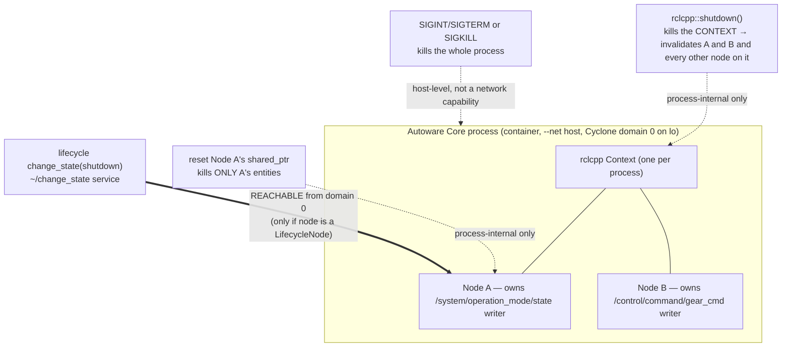

# Task 1 — Configurable Elements and Element Shutdown

> **Read the [shared foundation](foundation.md) first.** This report reuses the foundation's layer
> map (§2), publish path (§3), delivery-matching rules including the `transient_local` durability
> gate (§4), and discovery/ports/GUID model (§5) **by reference**, and does not re-derive them.
> Source-class tags are the foundation's: `[repo]` = a file in this checkout (cited `path:line`);
> Cyclone DDS core is in-checkout so it is also `[repo]`; `[spec]` = OMG DDS/DDSI-RTPS; `[UNVERIFIED]`
> = would require running the sim or a packet capture; `setup-guide §N` = the authoritative runtime
> record.

---

## 1. Objective, scope, and exclusions

**Objective.** Two things. First, enumerate from source the *configurable* elements of this
Autoware-Core / Cyclone-DDS stack — the knobs that change an element's behaviour, lifetime, or
presence — and say for each **where** it is set, **when** (build / launch / runtime), whether it is
**externally reachable** by a process that merely joins Cyclone domain 0 on `lo`, and what it does.
Second, document **in depth how to shut one core element down**, keeping four mechanisms that the
names invite conflating strictly distinct: `rclcpp::shutdown()` (whole context), Node destruction
(one node, process-internal), lifecycle transition (managed nodes, network-reachable), and process
signals/kill.

**Worked target.** Throughout, the "one core element" is the Autoware node that owns the command
topics from the foundation — `/system/operation_mode/state`
(`autoware_adapi_v1_msgs/msg/OperationModeState`) and `/control/command/gear_cmd`
(`autoware_vehicle_msgs/msg/GearCommand`), both published `transient_local` (setup-guide §8;
foundation §4.3). "Shutting this element down" concretely means: making those two topics stop
publishing, and understanding what an external element on domain 0 can and cannot do to cause that.

**In scope.** The application-layer and process-layer shutdown mechanisms and their blast radius,
reversibility, external reachability, and observable signature; the configurable-element catalogue.

**Excluded (and where it lives instead).** The *protocol-level* removal of an element — forging an
SEDP dispose/unregister so peers believe the endpoint is gone — is named here only as a pointer and
is developed in **Task 4 (protocol level)**, because it is a wire-forgery mechanism, not a
configuration or a clean shutdown path. Likewise the *physical/link* kills (`ip link set lo
multicast off`, iptables/tc on the discovery ports) belong to **Task 4 (physical level)**. QoS as a
*prioritization* lever is **Task 5**; here QoS appears only as a configurable element. This report
does not re-derive the publish path or the durability-matching rule — see the foundation.

---

## 2. Foundation reuse and new territory

**Reused by reference (not re-derived):**

| From foundation | Used here for |
|---|---|
| §2 layer map; the `[repo]` locations of the stack | Locating `context.cpp` / `utilities.cpp` / `signal_handler.cpp` at the right layer |
| §3 publish path, esp. step 2 (publish tolerates a shut-down context) | What `rclcpp::shutdown()` invalidates for a live publisher |
| §4.1 topic/service name mangling (`rt`/`rq`/`rr` prefixes) | Why the lifecycle and parameter *services* are visible on the wire on domain 0 |
| §4.3 QoS RxO rule and the rmw QoS mapping | Whether an external client can *match* the lifecycle `change_state` service |
| §5 discovery, GUIDs, ports, `lo` multicast | The "endpoints disappear from discovery" signature; the realism caveat |

**New territory opened for this task (files first opened here):**
`src/rclcpp/rclcpp/src/rclcpp/utilities.cpp`, `.../context.cpp`, `.../signal_handler.cpp`,
`.../node.cpp`, `.../parameter_service.cpp`, `.../parameter_service_names.hpp`;
`src/rclcpp/rclcpp_lifecycle/src/lifecycle_node_interface_impl.hpp`;
`src/rcl/rcl_lifecycle/src/com_interface.c`, `.../rcl_lifecycle.c`;
`src/rcl/rcl/src/rcl/service.c`; `src/rmw/rmw/include/rmw/qos_profiles.h`.

---

## 3. Configurable elements (enumeration)

**Orientation.** A ROS 2 element's behaviour is fixed at several distinct moments, and this matters
for the SEU because *the moment a knob is set determines whether anyone on the network can touch it*.
A value baked in at process launch (a `NodeOptions` flag, the domain id, the Cyclone XML) is
unreachable to a network peer; a value exposed as a **service** (parameters, lifecycle transitions)
is reachable to anyone who can match that service on domain 0. The naive assumption — "it is all just
configuration" — hides this split. The table separates the two.

**Mental model — three configuration surfaces.** (1) *Process-launch configuration*: `InitOptions`,
`NodeOptions`, the domain id, and the whole Cyclone `cyclonedds.xml` — read once at startup, held in
the process, never served on the network. (2) *Endpoint-creation configuration*: the QoS each
publisher/subscriber offers/requests — chosen in code at creation and announced (read-only to peers)
via SEDP. (3) *Runtime-served configuration*: node **parameters** and, if the node is a
**LifecycleNode**, its **managed-transition** interface — both exposed as ROS services and therefore
network-reachable.

| Element | Where configured (cited) | Build / launch / runtime | Externally reachable on domain 0? | Effect |
|---|---|---|---|---|
| **Node parameters** (`rclcpp::Parameter`) via the parameter **services** | Service endpoints created per node: `set_parameters`, `get_parameters`, `set_parameters_atomically`, `describe_parameters`, `list_parameters`, `get_parameter_types` (`parameter_service.cpp:36-90`; names in `parameter_service_names.hpp:23-28`) `[repo]` | Runtime (values may also be launch-time overrides) | **Yes** — standard services, request/reply endpoints mangled `rq`/`rr` (foundation §4.1), matchable by any domain-0 peer | Change a declared parameter → change node behaviour without restart, *if* the node declared it and permits the set |
| **QoS profiles** (per endpoint) | Chosen at publisher/subscriber creation; mapped to Cyclone by `create_readwrite_qos` (foundation §4.3, `rmw_node.cpp:2010-2104`) `[repo]` | Build/launch (in code; some overridable via QoS-override parameters) | **Announced, not settable** — a peer *sees* the offered/requested QoS in SEDP (foundation §5) but cannot change the element's QoS | Governs matching and delivery; e.g. the command readers' `transient_local` request is the gate an injector must satisfy (foundation §4.3) |
| **`NodeOptions`** (intra-process comms, parameter overrides, `use_global_arguments`, clock, allocator) | `src/rclcpp/rclcpp/src/rclcpp/node.cpp` construction path; passed to `Node()` (`node.cpp:112-117`) `[repo]` | Build/launch | No | Per-node construction behaviour |
| **`InitOptions`** incl. `shutdown_on_signal`, `auto_initialize_logging`, domain id | Consumed in `Context::init` (`context.cpp:191-257`); `shutdown_on_signal` read in the signal path (`signal_handler.cpp:262`) `[repo]` | Launch (process init) | No | Whether SIGINT/SIGTERM tears the context down (§4.4); logging init |
| **Domain id** | `Context::get_domain_id()` → `rcl_context_get_domain_id` (`context.cpp:282-291`) `[repo]`; effective **0** here (setup-guide §2) | Launch (env `ROS_DOMAIN_ID` / init options) | No (but *defines* the shared namespace every reachable element lives in) | Isolation scope; here everything is domain 0 on `lo` |
| **Lifecycle state** (managed nodes) | `LifecycleNode` change-state machine + services (§4.3 below) `[repo]` | Runtime | **Yes, if the node is a `LifecycleNode`** — see §4.3 | Move a managed node configure↔activate↔deactivate↔shutdown, changing whether it processes/publishes |
| **Cyclone config knobs** (`ParticipantIndex=none`, `NetworkInterface name="lo"`, `AllowMulticast=default`, `MaxMessageSize=65500B`, `WhcHigh=500kB`) | `cyclonedds.xml`, loaded via `CYCLONEDDS_URI` (setup-guide §4); ports/participant-index behaviour traced in foundation §5 | Launch (per process, from XML) | No — but changes DDS behaviour for **every element in that process at once** | Interface binding, multicast, max sample size, and WHC back-pressure (Task 3) — a global lever, not a per-element one |

**Gotcha — parameters are only as reachable as the node made them.** A `set_parameters` call
reaches the service, but the node's callback (`parameter_service.cpp:76-90`) `[repo]` delegates to
`node_params->set_parameters_atomically`, which enforces declaration and any registered validation.
An undeclared or read-only parameter is rejected there, not at the DDS layer. So "externally
reachable" for parameters means *the service is matchable*, not *any value is settable*.

---

## 4. Element shutdown (DEEP)

**Orientation.** "Shut it down" is four different operations in this stack, with four different blast
radii and — the point for the SEU — two very different answers to "can a network peer do this?" The
naive reading treats `rclcpp::shutdown()`, deleting a node, a lifecycle `shutdown` transition, and
`kill` as interchangeable "stop the node" verbs. They are not: two of them affect the *whole
process*, one affects *one node from inside its own process only*, and only one is *invokable by an
external element on domain 0*. This section keeps them distinct and, for each, states **what it
kills**, the **blast radius**, whether an **external element can invoke it**, whether it is
**clean/reversible**, and its **observable signature**.

*What to notice:* only the double arrow (`S3`, the lifecycle service) crosses the process boundary
from the network. `S1`, `S2` are dotted because they can only be invoked from *inside* the owning
process; `S4` is dotted because it is a host capability, not a domain-0 network capability.

### 4.1 `rclcpp::shutdown()` — kills the whole context, from inside the process

**What it kills.** The entire `Context` — i.e. **every node created on that context in that
process**, not one element. `rclcpp::shutdown(context, reason)` resolves the argument to the global
default context when null, calls `context->shutdown(reason)`, and — if it was the default context —
uninstalls the signal handlers (`utilities.cpp:171-183`) `[repo]`.

**Traced procedure (≥6 steps), what it invalidates.**
1. `rclcpp::shutdown` picks the default context if none was passed and calls
   `context->shutdown(reason)` (`utilities.cpp:174-178`) `[repo]`.
2. `Context::shutdown` takes the recursive `init_mutex_`, and **returns `false` immediately if the
   context is already invalid** (`context.cpp:321-326`) `[repo]` — so a second shutdown is a no-op,
   not an error. It also guards against reentrant calls from a pre-shutdown callback via a
   `thread_local` in-progress set (`context.cpp:328-332`) `[repo]`.
3. It runs every registered **pre-shutdown callback** (`context.cpp:335-340`) `[repo]`.
4. It calls **`rcl_shutdown(rcl_context_)`** (`context.cpp:343`) `[repo]`. This is the point the
   context becomes invalid: `Context::is_valid()` is `rcl_context_is_valid()` on that handle
   (`context.cpp:259-268`) `[repo]`.
5. It records the reason, runs the **on-shutdown callbacks**, then
   **`interrupt_all_sleep_for()`** — which wakes every blocking `sleep_for`, executor, and wait set
   via the interrupt condition variable (`context.cpp:347-358,532-536`) `[repo]`.
6. It removes itself from the global weak-contexts list and, if it owned logging init, finalizes
   logging (`context.cpp:359-376`) `[repo]`.

**The effect on the live command publishers is graceful, not a crash.** Once the context is invalid,
a `publisher->publish()` on `/control/command/gear_cmd` does not throw: the foundation's publish path
(§3 step 2) shows `do_inter_process_publish` swallows the `RCL_RET_OK`-or-shutdown case and silently
returns (`publisher.hpp:462-465`) `[repo]`. So the topics simply stop; the process keeps running
until its nodes are destroyed or the executor returns. The rcl context is only *finalized*
(`rcl_context_fini`) later, when the `Context` is destroyed and `clean_up()` resets the handle
(`context.cpp:152-167,538-544`; `__delete_context` at `context.cpp:169-189`) `[repo]`.

**Blast radius.** The whole process's ROS layer: *both* command topics and every other node on that
context die together. It is not a scalpel.

**External element on domain 0 can invoke it?** **No.** `rclcpp::shutdown()` is a C++ call on an
in-process object; there is no DDS endpoint for it. A network peer cannot call it. `[INFERRED: no
service or topic is created for context shutdown anywhere in context.cpp/utilities.cpp — the only
external trigger is the OS signal path of §4.4]`.

**Clean / reversible?** Clean (callbacks run, sleeps interrupted). **Not reversible in place**: once a
context is shut down it cannot be re-`init`'d — `Context::init` throws `ContextAlreadyInitialized` if
valid and otherwise `clean_up()`s first (`context.cpp:197-201`) `[repo]`; recovery means a new
context (in practice, a process restart).

**Observable signature.** All of that process's endpoints withdraw from discovery at once (SEDP
unregistration; foundation §5), and every topic it owned goes silent simultaneously — a
*correlated, whole-participant* disappearance, distinct from one topic stopping.

### 4.2 Destroying one Node — one element, process-internal only

**What it kills.** Exactly one node's entities. `Node::~Node()` resets the node's sub-interfaces in a
deliberate order — waitables, time source, parameters, clock, services, topics, timers, logging,
graph (`node.cpp:267-279`) `[repo]`. Resetting `node_topics_` destroys that node's publishers and
subscriptions; when the last `shared_ptr` to the node drops, the underlying rcl node is finalized and
its DDS writers/readers are deleted. So destroying *Node B* removes the `/control/command/gear_cmd`
writer while leaving *Node A*'s `/system/operation_mode/state` writer and the rest of the process
untouched.

**Blast radius.** One node. This is the scalpel `rclcpp::shutdown()` is not.

**External element on domain 0 can invoke it?** **No.** Destroying a node is `reset()` on a
`shared_ptr` held *inside the owning process*; there is no network verb for "delete your node." A
peer can *observe* the resulting discovery withdrawal but cannot *cause* it this way. Causing an
endpoint to disappear from *outside* requires forging discovery traffic — the SEDP dispose/unregister
path, which is **Task 4 (protocol level)**, not this mechanism.

**Clean / reversible?** Clean (destructor order lets sub-interfaces consult `node_base` during
teardown, per the comment at `node.cpp:269`) `[repo]`. Reversible only by constructing a new node.

**Observable signature.** A *single* endpoint (or the small set owned by that one node) withdraws
from discovery while the participant and its sibling nodes remain — a *partial* withdrawal under a
still-present participant GUID, unlike §4.1's whole-participant exit.

### 4.3 Lifecycle transition — the one externally-reachable clean shutdown (if managed)

**Motivation.** This is the mechanism the SEU cares about most, because unlike §4.1/§4.2 it is
**invokable over the network on domain 0**. A ROS 2 *managed* (lifecycle) node exposes its state
machine as ROS **services**; anyone who can match those services can request a transition, including
`deactivate` (stop processing) or `shutdown` (terminate the managed lifecycle).

**Mechanism — the services exist and are network endpoints.** When a `LifecycleNode` initialises with
the communication interface enabled, it creates five services, among them **`change_state`**, wiring
the service to `on_change_state` and registering it on the node
(`lifecycle_node_interface_impl.hpp:119-134`) `[repo]`. The service **name is `~/change_state`**
(`com_interface.c:41`) `[repo]`, i.e. `<namespace>/<node>/change_state`, created with
`rcl_service_get_default_options()` (`com_interface.c:169-172`) `[repo]`, whose QoS is
`rmw_qos_profile_services_default` = **KEEP_LAST(10), RELIABLE, VOLATILE**
(`service.c:214`; `qos_profiles.h:64-75`) `[repo]`. Being a ROS service, its request/reply endpoints
are mangled with the `rq`/`rr` prefixes (foundation §4.1) and announced via SEDP — so they are
discoverable and matchable by any participant on domain 0.

**Why an external client matches.** The service reader/writer are **VOLATILE**, not
`transient_local`. By the foundation's RxO rule (§4.3), a client offering the default service QoS
(also RELIABLE + VOLATILE) satisfies `rd.durability(0) > wr.durability(0)` → false → **match**. So
unlike the command *topics* (which demand `transient_local` and trip the durability gate on a naive
writer), the lifecycle *service* has no durability barrier: a plain client matches it. `[INFERRED
from foundation §4.3 applied to the service's default QoS]`.

**Traced request path (≥6 steps).**
1. A client sends a `ChangeState` request naming a transition (id or label, e.g. label `shutdown` or
   `deactivate`).
2. `on_change_state` receives it under the state-machine mutex and resolves the transition; **a label
   takes precedence over the id** (because `ros2 service call` defaults integer fields to 0), looked
   up via `rcl_lifecycle_get_transition_by_label` (`lifecycle_node_interface_impl.hpp:226-243`)
   `[repo]`.
3. It calls `change_state(transition_id, cb_return_code)`
   (`lifecycle_node_interface_impl.hpp:247`) `[repo]`.
4. `change_state` verifies the state machine is initialised, records the initial state, and fires the
   transition with `rcl_lifecycle_trigger_transition_by_id(..., publish_update=true)`
   (`lifecycle_node_interface_impl.hpp:406-431`) `[repo]` — `publish_update=true` means the node
   **publishes a `TransitionEvent`**, a visible side effect.
5. It runs the user callback for the target state via `execute_callback`
   (`lifecycle_node_interface_impl.hpp:446,494-516`) `[repo]`; on `deactivate` this calls the managed
   entities' `on_deactivate` (`:586-595`) `[repo]`, which is what actually silences a
   `LifecyclePublisher`.
6. It triggers the terminal transition-label (success/failure/error) and updates the current state
   (`lifecycle_node_interface_impl.hpp:449-463`) `[repo]`; the response's `success` reflects the
   callback return (`:252-253`) `[repo]`.

**Applied to the target.** *If* the node owning `/control/command/gear_cmd` is a `LifecycleNode` with
a `LifecyclePublisher`, a `deactivate` request stops it publishing (the publisher's `on_deactivate`
gate), and `shutdown` terminates its managed lifecycle — both **from an external process on domain
0**, no forgery required, just a matched service client.

**The critical open question — does Autoware Core here use lifecycle nodes?** **Cannot be confirmed
from this checkout.** The checkout contains Autoware *message* packages only (`autoware_msgs`,
`autoware_adapi_msgs`); the *node* implementations that publish `/control/command/gear_cmd` and
`/system/operation_mode/state` are **not** present, so whether they derive from
`rclcpp_lifecycle::LifecycleNode` or plain `rclcpp::Node` cannot be read from source here.
`[UNVERIFIED: requires the autoware_core node sources or a live `ros2 lifecycle nodes` / `ros2
service list | grep change_state` against the running container]`. **What is verified** is the
mechanism: the `change_state` service, *where it exists*, is a network-reachable clean-shutdown lever
on domain 0 with no durability barrier, per the citations above. This conditional is the honest
finding: the lever is real and reachable; its presence on these specific Autoware nodes is unproven
here.

**Blast radius.** One managed node (and its managed publishers/timers).

**External element can invoke it?** **Yes** (the only clean path that can), *if* the target is a
LifecycleNode.

**Clean / reversible?** Clean and, for `deactivate`, **reversible** — `activate` brings it back
(the state machine supports the round trip). `shutdown` reaches a terminal state and is not
reversible without re-creating the node.

**Observable signature.** A published **`TransitionEvent`** (step 4) and a state change readable via
the node's `get_state` service — a *self-announced* transition, plus the target's publishers going
quiet. Because the transition is requested over a service, the **requester is a matched service
client with a foreign participant GUID** (foundation §5) — directly visible to the SEU.

### 4.4 Process signals and kill — crudest, host-level not network-level

**What it kills.** The whole process. rclcpp installs a SIGINT (and optionally SIGTERM) handler in
`SignalHandler::install`, using `sigaction` where available and spawning a deferred handler thread
(`signal_handler.cpp:119-165`) `[repo]`. On a signal, the deferred handler iterates **every**
context via `rclcpp::get_contexts()` and calls `context->shutdown("signal handler")` for each whose
`shutdown_on_signal` init option is true (`signal_handler.cpp:254-284`, gate at `:261-262`) `[repo]`.
So a delivered SIGINT funnels into the §4.1 whole-context shutdown for every context in the process.
`SIGKILL` skips all of this and terminates the process outright — no callbacks, no clean SEDP
withdrawal.

**Blast radius.** The whole process (all contexts, all nodes).

**External element on domain 0 can invoke it?** **No, not as a network capability.** Sending a signal
requires host/OS access to the process, not a DDS endpoint. The `--net host` co-location means a
process *with host access* can trivially `kill` the container's PID (setup-guide §0), but that is a
**host-level** capability, not something a domain-0 network peer possesses. This distinction matters
for the SEU: the deployment network the sim stands in for does not grant a remote bus attacker
`kill` rights on an ECU's process. `[INFERRED from the signal API being an OS mechanism with no DDS
surface; the host-access ease is a loopback co-location artifact per foundation realism caveat]`.

**Clean / reversible?** SIGINT/SIGTERM via the handler → clean per §4.1 (callbacks run). SIGKILL →
**unclean**: the process vanishes without running shutdown callbacks or gracefully unregistering
endpoints, so peers only learn of the loss via SPDP lease expiry (foundation §5), not a prompt
withdrawal. Neither is reversible without a restart.

**Observable signature.** SIGINT path: same correlated whole-participant SEDP withdrawal as §4.1.
SIGKILL path: **no clean withdrawal** — the participant simply stops answering, and peers time it out
after the SPDP lease, a slower and different signature (abrupt silence + lease timeout vs. explicit
unregistration).

### 4.5 Comparison

| Mechanism | Kills | Blast radius | External (domain-0) can invoke? | Clean? | Reversible? | Signature |
|---|---|---|---|---|---|---|
| `rclcpp::shutdown()` (§4.1) | the context | whole process's ROS layer | **No** (in-process call) | Yes | No (needs new context) | correlated whole-participant SEDP withdrawal |
| Node destruction (§4.2) | one node's entities | one node | **No** (in-process `reset`) | Yes | Only by re-creating | partial withdrawal, participant stays |
| Lifecycle `change_state` (§4.3) | one managed node's activity | one node | **Yes**, if LifecycleNode | Yes | `deactivate` yes; `shutdown` no | `TransitionEvent` + foreign-GUID service client |
| Signal / kill (§4.4) | the process | whole process | **No** as network; host-access only | SIGINT yes / SIGKILL no | No | SIGINT: clean withdrawal; SIGKILL: silence + SPDP lease timeout |

---

## 5. SEU implications

**The enforcement question is "which of these can the SEU use to disable a *compromised* element, and
which can an attacker abuse against a *legitimate* one?" — and the answer splits cleanly by external
reachability.**

- **Only the lifecycle `change_state` service (§4.3) is a network-reachable clean lever**, and it
  cuts both ways. As an **enforcement action**, an authorized SEU could request `deactivate` on a
  compromised managed node to stop it publishing (e.g. silence a node emitting malicious
  `/control/command/gear_cmd`) without killing the whole process — the scalpel §4.1 cannot provide.
  As an **attack**, the same reachability lets an adversary on domain 0 `deactivate`/`shutdown` a
  *legitimate* managed node. The asymmetry the SEU relies on: the transition **self-announces** via a
  `TransitionEvent` (§4.3 step 4) and the requester is a **matched service client carrying a foreign
  participant GUID** not belonging to the two sim participants (foundation §5) — so a `change_state`
  request from an unexpected GUID is a high-fidelity detection signal. **Caveat: this lever exists
  only if the target is a `LifecycleNode`, which is `[UNVERIFIED]` for these Autoware Core nodes
  here** (§4.3). If the command-topic owners are plain `rclcpp::Node`s, there is *no* clean
  network-reachable shutdown at all — which itself is useful for the SEU to know: an attacker then
  cannot cleanly disable them either and must fall back to the forgery/flood paths of Task 4.

- **`rclcpp::shutdown()` and node destruction (§4.1, §4.2) are not attacker levers on the network** —
  they are in-process calls with no DDS endpoint. The SEU should not expect to *detect* them as
  network events; it will only see their *effect* (endpoints withdrawing). Their value is as a
  reference for what a *clean* withdrawal looks like, so the SEU can distinguish it from a forged
  SEDP dispose (Task 4).

- **Signals/kill (§4.4) are host-level, not a domain-0 capability.** On this loopback sim, host
  access makes `kill` trivial (setup-guide §0), but **that ease is a co-location artifact** — the
  deployment vehicular network the SEU defends does not hand a remote bus element `kill` rights on an
  ECU. The SEU should therefore not model process-kill as a *network* threat; the relevant network
  signature it *can* watch for is the **SIGKILL aftermath** — a participant going abruptly silent and
  being reaped only at SPDP lease expiry (§4.4), which looks different from a clean §4.1 withdrawal.

- **Configurable elements (§3) give the SEU a second reachable surface: parameter services.** Like
  lifecycle, `set_parameters` is matchable on domain 0, so a parameter that disables a behaviour is
  an attacker lever *and* a candidate enforcement action — bounded by what the node declared and
  validates (§3 gotcha). The launch-time and Cyclone-XML knobs are *not* network-reachable and so are
  neither attack surface nor enforcement lever at runtime; they matter to the SEU only as the fixed
  parameters (domain 0, `lo`, `WhcHigh`) that frame every other mechanism.

**Bottom line for the SEU:** the detection surface for element shutdown is dominated by (1)
`change_state` requests from foreign GUIDs and their `TransitionEvent` echoes, (2) parameter-service
calls from foreign GUIDs, and (3) the *shape* of endpoint withdrawal — correlated whole-participant
(§4.1/SIGINT), partial (§4.2), self-announced (§4.3), or abrupt-then-lease-timeout (SIGKILL) — which
lets it tell a clean shutdown from the forged protocol-level removal developed in Task 4.

---

## 6. Appendix — files opened, tags, confidence

**Files opened for this task (all `[repo]`):**
- `src/rclcpp/rclcpp/src/rclcpp/utilities.cpp`
- `src/rclcpp/rclcpp/src/rclcpp/context.cpp`
- `src/rclcpp/rclcpp/src/rclcpp/signal_handler.cpp`
- `src/rclcpp/rclcpp/src/rclcpp/node.cpp`
- `src/rclcpp/rclcpp/src/rclcpp/parameter_service.cpp`
- `src/rclcpp/rclcpp/src/rclcpp/parameter_service_names.hpp`
- `src/rclcpp/rclcpp_lifecycle/src/lifecycle_node_interface_impl.hpp`
- `src/rcl/rcl_lifecycle/src/com_interface.c`
- `src/rcl/rcl_lifecycle/src/rcl_lifecycle.c` (service-name/typesupport context)
- `src/rcl/rcl/src/rcl/service.c`
- `src/rmw/rmw/include/rmw/qos_profiles.h`

**`[INFERRED]` / `[UNVERIFIED]` findings and what would settle them:**

| Tag | Claim | What would settle it |
|---|---|---|
| `[UNVERIFIED]` | Whether the Autoware Core nodes owning `/control/command/gear_cmd` and `/system/operation_mode/state` are `LifecycleNode`s (deciding whether §4.3's reachable lever applies to them) | The `autoware_core` node sources, or `ros2 lifecycle nodes` / `ros2 service list \| grep change_state` against the running container |
| `[INFERRED]` | No DDS endpoint exists for `rclcpp::shutdown()` or node destruction, so neither is network-invokable | Confirmed by absence of any service/topic creation in `context.cpp`/`utilities.cpp`/`node.cpp`; a wire capture would corroborate |
| `[INFERRED]` | An external default-QoS service client matches the `change_state` service (no durability barrier), by applying foundation §4.3 RxO to the service's RELIABLE+VOLATILE QoS | A live `ros2 service call .../change_state` or a capture showing the match |
| `[INFERRED]` | Signal/kill is host-level, not a domain-0 network capability; the trivial `kill` here is a co-location artifact | Inherent to the OS signal API (no DDS surface); the realism split is per foundation caveat |

**Per-section confidence:**

| Section | Confidence | Reason |
|---|---|---|
| §3 Configurable elements | HIGH | Every row cited to in-checkout source; the reachability split follows from foundation §4.1/§5. |
| §4.1 `rclcpp::shutdown()` | HIGH | Full `shutdown → rcl_shutdown → invalidate → callbacks` chain read in `context.cpp`; publish-tolerance reused from foundation §3. |
| §4.2 Node destruction | HIGH | Destructor order read directly (`node.cpp:267-279`); wire-level "how a peer would force this" correctly deferred to Task 4. |
| §4.3 Lifecycle transition | MEDIUM-HIGH | The service, name, QoS, and transition path are all in-checkout `[repo]`; **MEDIUM only because** whether these specific Autoware nodes are lifecycle nodes is `[UNVERIFIED]` (node sources absent). |
| §4.4 Signals / kill | HIGH | Handler install and deferred-shutdown path read in `signal_handler.cpp`; the host-vs-network distinction is the realism caveat, tagged `[INFERRED]`. |

<!-- REPORT-COMPLETE -->
