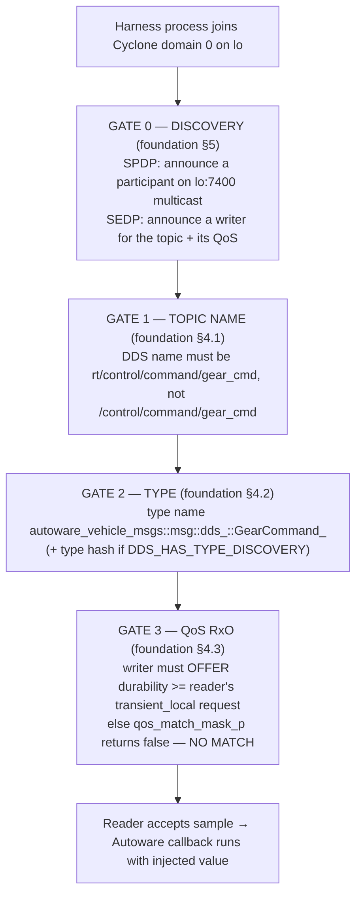

# Task 2 — The Fault-Injection Harness: Feeding Off-Nominal Traces to Exercise the STL Monitor

> **Read the [shared foundation](foundation.md) first.** This report reuses the foundation's layer
> map (§2), publish path to the wire (§3), delivery-matching rules — topic-name mangling (§4.1),
> type matching (§4.2), and the QoS Requested/Offered rule including the `transient_local` durability
> gate (§4.3) — and discovery/ports/GUID model (§5) **by reference**, and does not re-derive them.
> Source-class tags are the foundation's: `[repo]` = a file in this checkout (cited `path:line`);
> Cyclone DDS core is in-checkout, so it too is `[repo]`; `[spec]` = OMG DDS / DDSI-RTPS; `[UNVERIFIED]`
> = would require running the sim or a packet capture; `setup-guide §N` = the authoritative runtime
> record. Terms (rcl, rmw, SEDP, GUID, RxO, CDR, WHC, …) are defined in the foundation glossary (§6).

---

## 1. Objective, scope, and exclusions

**Motivation.** The STL monitor cannot be trusted until it has been *exercised*: fed off-nominal
timing/value traces on real topics and observed to raise the right property violation and reach the
right safe-stop verdict. That requires a **fault-injection harness** — a test instrument that
deliberately places early / late / stale / wrong-value samples onto the running command topics so the
monitor's tap sees an off-nominal trace. This is exactly the abstract's "extreme fault-injection stress
tests" apparatus `[LSEU-abstract]`. This task builds and characterizes that harness from source: it is
the study's instrument, **not an attack the monitor must defend against**.

**Objective.** Determine, from source, **every viable way a process outside the simulation can publish
a sample that a legitimate Autoware Core subscriber's callback actually runs on** — because only a
trace that reaches a real subscriber reaches the monitor's tap point. "Accept" is the load-bearing
word: it is not enough to emit bytes on `lo`; the bytes must survive discovery, topic-name matching,
type matching, and — the gate that silently swallows a naive harness — QoS compatibility. An injected
sample that never couples produces *no* trace to evaluate (and, read as a fault, is itself the
strongest freshness failure — see §4.3).

**Worked target.** Throughout, the injected message is a real actuation-feeding command:
`/system/operation_mode/state` (`autoware_adapi_v1_msgs/msg/OperationModeState`) and
`/control/command/gear_cmd` (`autoware_vehicle_msgs/msg/GearCommand`), both published with
`transient_local` durability (setup-guide §8; foundation §4.3). Injecting well-formed values on these
topics is what produces a *value-domain* off-nominal trace: a delivered `GearCommand{command: 2}`
(DRIVE) or `OperationModeState{mode: 2}` (AUTONOMOUS) is a sample the monitor must timestamp, sequence,
and check against the topic's value/freshness properties (foundation §0 recon confirms the enum
constants `DRIVE = 2` and `AUTONOMOUS = 2` are present in-checkout). Injecting on an arbitrary topic
produces no trace the monitor cares about and is out of scope by the study's framing
(the-new-investigation-layer point 4).

**Two harness realizations, both traced against that target:**
- **PATH A — an external rclcpp node** on the host, Cyclone-configured, publishing on the topic (§4):
  the practical harness, modelling an off-nominal *ROS 2-native* source.
- **PATH B — hand-forged RTPS** DATA submessages on `lo`, with no ROS 2 / rclcpp at all (§5): the
  higher-fidelity harness, modelling an off-nominal source that is **not** a ROS 2 node (a faulty or
  non-ROS ECU on the real bus) and that can set the sample's timestamp and sequence number by hand.

**In scope.** The full acceptance chain each realization must clear down to the wire, a minimal
injector sketch for Path A, the enumeration of what Path B must reproduce, and **at least one trace of
a *dropped* injection** (§4.3) — a volatile-only writer that never matches the `transient_local`
reader, which is both a harness-misconfiguration hazard and, read as a fault, a silent freshness loss.

**Excluded (and where it lives).** *Replay* and *over-publication* (re-sending captured traffic, or
flooding N copies to violate an actuation-frequency constraint) are **Task 3** — the flagship "100x
over-publication" stress case `[LSEU-abstract]` — which reuses this report's injector. *Silencing* a
legitimate writer (forged SEDP dispose, liveliness/deadline expiry, link-layer kill) as a freshness
loss is **Task 4**. *QoS as a timing-determinism / mixed-criticality lever* is **Task 5**. This report
establishes only how the harness gets a *single accepted publish* — one off-nominal sample — onto a
command topic; the other tasks build the timing-fault classes on top of it.

---

## 2. Foundation reuse and new territory

**Reused by reference (not re-derived):**

| From foundation | Used here for |
|---|---|
| §2 layer map; §3 publish path (`publish → rcl_publish → rmw_publish → dds_write → … → nn_xpack_send`) | Path A's descent to the wire; the single point (§3 step 6) where CDR bytes first exist, which Path B must reproduce by hand |
| §4.1 topic-name mangling (`rt` prefix → `rt/control/command/gear_cmd`) | What DDS topic name *both* paths must create to match the Autoware reader |
| §4.2 type matching (DDS type name `autoware_vehicle_msgs::msg::dds_::GearCommand_`; the type-hash `[UNVERIFIED]`) | What type name/id both paths must present |
| **§4.3 QoS RxO rule and the `transient_local` durability gate** | The rule the injector's writer must satisfy; the dropped-injection trace (§4.3 here) |
| §5 discovery (SPDP/SEDP on `lo` multicast, domain 0, ports 7400/7401, builtin entity ids, GUID model) | Why discovery is automatic for Path A; what Path B must forge; the foreign-GUID / late-joiner signatures |

**New territory opened for this task (files first opened here):**
`src/rclcpp/rclcpp/include/rclcpp/qos.hpp` (the rclcpp QoS setters an injector calls, esp.
`transient_local()`); `src/rmw_cyclonedds/rmw_cyclonedds_cpp/src/serdata.cpp` (the CDR
serialization the forged path must reproduce: `sertype_serialize_into`, the XCDR1 representation
flag, the no-keys assumption). The `GearCommand.msg` field layout (`stamp` + `command`) is read to
sketch the CDR body.

---

## 3. Mechanism overview — the acceptance chain both paths must clear

**Orientation.** The naive model of injection is "send a UDP packet to the right port and the
subscriber gets it." That is false here in two independent ways, and both harness realizations must
clear the same four gates before a subscriber's callback ever runs — i.e. before the injected sample
becomes a *trace* the monitor can observe. The gates are the foundation's, assembled here into the
harness's delivery checklist:


*What to notice:* the gates are checked at discovery time, in Cyclone's `qos_match_mask_p`
(`src/cyclonedds/src/core/ddsi/src/q_qosmatch.c:158-267`) `[repo]`, **before any data sample is
delivered** — so a mismatch is a *non-match*, not a late drop (foundation §4.3). Path A gets Gate 0
and most of Gates 1–2 for free from the rclcpp/rmw stack and must only get Gate 3 right; Path B must
construct all four by hand. That difference is the whole **fidelity** comparison: how faithfully each
realization reproduces a real off-nominal source, and how much control it has over the exact bytes,
timestamp, and sequence number of the trace it delivers to the monitor.

---

## 4. PATH A — external rclcpp node (the practical harness) (DEEP)

**Motivation.** The simplest harness is an ordinary ROS 2 Humble C++ program run on the host. Because
the Autoware container is `--net host` and both sides are pinned to Cyclone DDS on domain 0 bound to
`lo` with multicast (setup-guide §0, §4, §6a), a third rclcpp process that sets the *same*
`RMW_IMPLEMENTATION=rmw_cyclonedds_cpp` and `CYCLONEDDS_URI` is, from DDS's point of view, just
another legitimate participant. It is discovered automatically within one SPDP period (foundation §5,
`spdp_interval` default 30 s at `q_ddsi_discovery.c`/`defconfig.c:36`) `[repo]`. **The one thing the
harness must get right for the trace to be delivered at all is the QoS**, and getting it wrong is the
dropped-injection trace of §4.3.

**Mental model.** Path A reuses the *entire* legitimate publish path (foundation §3): the harness's
`publisher->publish(msg)` descends `rclcpp → rcl → rmw → dds_write → write_sample_eot → nn_xpack_send`
exactly as an Autoware node's would, producing a genuine RTPS DATA submessage with correct CDR, a
correct type, the mangled topic name, and a real per-writer sequence number. Nothing is forged; the
injector *is* a real DDS writer. Its only off-nominal quality is that it is not part of the sim and it
delivers a value the monitor's properties are meant to flag — which is precisely what makes it a clean
value-domain fault source: everything about the sample is well-formed *except* the value the operator
chose to inject.

### 4.1 The minimal injector, and the one QoS line that matters

A faithful injector for `/system/operation_mode/state` is about a dozen lines. The trace-delivery
content is entirely in the QoS:

```cpp
// Run with: RMW_IMPLEMENTATION=rmw_cyclonedds_cpp CYCLONEDDS_URI=file://$HOME/cyclonedds.xml
#include "rclcpp/rclcpp.hpp"
#include "autoware_adapi_v1_msgs/msg/operation_mode_state.hpp"

int main(int argc, char ** argv) {
  rclcpp::init(argc, argv);
  auto node = std::make_shared<rclcpp::Node>("not_the_sim");

  // THE load-bearing line: offer transient_local, or the reader never matches (§4.3).
  rclcpp::QoS qos = rclcpp::QoS(rclcpp::KeepLast(1)).reliable().transient_local();

  auto pub = node->create_publisher<autoware_adapi_v1_msgs::msg::OperationModeState>(
      "/system/operation_mode/state", qos);

  autoware_adapi_v1_msgs::msg::OperationModeState m;
  m.mode = 2;  // AUTONOMOUS
  m.is_autoware_control_enabled = true;
  m.is_autonomous_mode_available = true;
  pub->publish(m);          // descends the foundation §3 path to a real RTPS DATA on lo
  rclcpp::spin_some(node);  // let discovery + delivery complete
}
```

**Every dependency, cited.**
1. **`rclcpp::init` / `Node`** join Cyclone domain 0 on `lo` because the process inherits the same
   `CYCLONEDDS_URI` (setup-guide §6a); no code chooses the interface — the Cyclone XML does.
2. **`rclcpp::QoS(...).reliable().transient_local()`** sets the offered durability. `transient_local()`
   sets `DurabilityPolicy::TransientLocal` (`src/rclcpp/rclcpp/include/rclcpp/qos.hpp:198-200`,
   enum at `:50-56`) `[repo]`. **Without this call the QoS defaults to VOLATILE** — the documented
   default profile is Reliable + Volatile (`qos.hpp:115-119`) `[repo]` — which is the dropped case
   (§4.3).
3. **`create_publisher(...)`** maps that QoS through the Cyclone binding's `create_readwrite_qos`,
   which translates `TRANSIENT_LOCAL` to `dds_qset_durability(qos, DDS_DURABILITY_TRANSIENT_LOCAL)`
   and additionally sets the durability-service QoS so the WHC retains history for late joiners
   (foundation §4.3; `src/rmw_cyclonedds/rmw_cyclonedds_cpp/src/rmw_node.cpp:2057-2068`) `[repo]`. It
   also mangles the topic name to `rt/system/operation_mode/state` (foundation §4.1) and builds the
   DDS type name `autoware_adapi_v1_msgs::msg::dds_::OperationModeState_` (foundation §4.2).
4. **`publish(m)`** runs the foundation §3 chain verbatim; the identifier check at
   `rmw_node.cpp:1825-1834` passes because this process really is Cyclone (foundation §3 step 4)
   `[repo]`.

**No forgery anywhere.** The injector's writer GUID is a genuine, locally generated GUID (foundation
§5); its sequence numbers start at 1 and increment (foundation §3 step 7, `++wr->seq`); its CDR is
produced by the same serializer as Autoware's. This is why Path A is a trivially *effective* harness
for value-domain faults — but also why it has *low fidelity for timing faults*: because the timestamp
and sequence number are assigned by the real stack, the harness cannot hand-craft a stale or
out-of-order sample the way Path B can (§5.2). It injects the value; the stack decides the timing.

### 4.2 Why acceptance follows once QoS is right

With durability offered as `transient_local`, the RxO comparison the reader runs (foundation §4.3)
evaluates, for durability, `rd.durability.kind (1) > wr.durability.kind (1)` → **false** → the policy
does not veto the match (`src/cyclonedds/src/core/ddsi/src/q_qosmatch.c:167`) `[repo]`. Reliability
matches (both RELIABLE: `rd(1) > wr(1)` false, `q_qosmatch.c:163`) `[repo]`; the mangled topic name is
byte-equal (`strcmp(...topic_name...) != 0` is false, `q_qosmatch.c:160`) `[repo]`; the type name (or
hash) agrees (§4.2 foundation, `q_qosmatch.c:216-267`) `[repo]`. All gates pass, the endpoints match,
and the injected sample is delivered to the Autoware subscriber's callback. Because the command topics
are `transient_local`, the injector's WHC even resends the value to the reader **if the injector joins
before the reader** — the durability-service QoS wired at `rmw_node.cpp:2057-2068` is what makes a
late-*reader* still receive the outsider's command (foundation §3 gotcha) `[repo]`.

### 4.3 The dropped injection — a volatile writer against a `transient_local` reader (required trace)

This is the trace the study demands, and it has two readings. As a **harness hazard**, it is an
injection that is *emitted* but never *accepted* — the harness reports success while delivering no
trace to the monitor's tap, so a test run that should exercise the monitor silently exercises nothing.
As a **fault in its own right**, a writer that is present but never *couples* to the reader is the
strongest freshness violation there is: the freshness clock never starts, staleness is unbounded, and
(per foundation §4.3) nothing on the sender side signals the failure. Either way it is the default
outcome of the sketch above with the `transient_local()` call removed.

**Setup.** The injector calls `create_publisher("/system/operation_mode/state", rclcpp::QoS(1))` —
depth 1, and the default profile's Reliable + **Volatile** durability (`qos.hpp:115-119`) `[repo]`. It
then calls `publish(m)`.

**Trace (each step cited).**
1. `create_readwrite_qos` still runs, but for VOLATILE it calls `dds_qset_durability(qos,
   DDS_DURABILITY_VOLATILE)` and does **not** attach a durability-service QoS (foundation §4.3; the
   binding always sets *some* durability, so "unset" is impossible — `rmw_node.cpp:2052-2074`)
   `[repo]`. The writer's offered durability kind is therefore `DDS_DURABILITY_VOLATILE == 0`
   (`src/cyclonedds/src/core/ddsc/include/dds/ddsc/dds_public_qosdefs.h:77`) `[repo]`.
2. The writer is created and **announced via SEDP** carrying that VOLATILE durability in its QoS plist
   (foundation §5: SEDP carries exactly the QoS `qos_match_mask_p` later compares). So the wrong
   durability is visible on the wire before any data sample is sent.
3. The Autoware reader requested `transient_local`, i.e. `durability.kind == DDS_DURABILITY_TRANSIENT_
   LOCAL == 1` (`dds_public_qosdefs.h:78`) `[repo]`, proven by the guide's
   `ros2 topic pub ... --qos-durability transient_local` (setup-guide §8).
4. On discovery, Cyclone evaluates `qos_match_mask_p`. Both sides declared durability present, so it is
   compared (`mask &= rd_qos->present & wr_qos->present`, `q_qosmatch.c:158`) `[repo]`. The durability
   test `rd.durability.kind (1) > wr.durability.kind (0)` is **true**, so the function sets `*reason =
   DDS_DURABILITY_QOS_POLICY_ID` and returns **`false`** (`q_qosmatch.c:167-169`) `[repo]`.
5. `false` means the endpoints **never match**. No reader-writer link is formed; the reader's
   `on_data` is never invoked for this writer.
6. Crucially, `publish(m)` on the injector side still **succeeds** — `dds_write` returns `>= 0` and
   `rmw_publish` returns OK (foundation §3 step 4, `rmw_node.cpp:1834`) `[repo]`. The sample is written
   into the injector's own WHC and, with no matched reader, goes nowhere. **The harness reports a
   successful publish while no sample ever reaches the monitor's tap.**

**Why this is the defining subtlety.** The failure is silent on the sender's side and produces *no
delivered-then-rejected sample* — there is nothing for a payload-inspecting monitor to catch, because
the sample never crosses. The only wire evidence is the SEDP announcement of a writer whose durability
does not satisfy the reader (foundation §5). This is the crucial lesson for the monitor's *design*: a
coupling that never forms cannot be caught by looking at delivered content; it can only be caught by a
**freshness/liveness tap** that notices the reader's expected sample never arrives. The dropped
injection is therefore the study's negative control — the case that proves the monitor must watch
*absence*, not just *values*. `[INFERRED: from foundation §4.3 applied to the default-QoS writer; a
live run or capture would confirm the reader never fires — [UNVERIFIED: would require running the
sim].]`

---

## 5. PATH B — direct RTPS on the wire, no rclcpp (the high-fidelity harness) (DEEP)

**Motivation.** Path A models an off-nominal *ROS 2-native* source; Path B models the harder and
more realistic one: an off-nominal source that is **not a ROS 2 node at all**. On the deployment target
— a resource-constrained multicore RISC-V bus running mixed-criticality workloads `[LSEU-abstract]` —
a fault can originate at a non-ROS ECU that simply speaks whatever the bus speaks. The faithful analogue
here is a process that emits **RTPS** (the DDS wire protocol; foundation glossary) directly onto `lo`,
reproducing by hand everything the rclcpp/rmw/Cyclone stack did for Path A. It is worth building because
it is the *only* realization that lets the harness set the sample's **timestamp and sequence number by
hand** (§5.2) — i.e. the only way to synthesize genuine *timing* faults (stale, early, reordered
samples) rather than only value faults. Enumerating *what it must reproduce* is the deliverable; it is
also, precisely, the list of wire observables the monitor taps to timestamp and sequence each sample.

**Mental model.** Cyclone does not accept "a DATA packet." It accepts a DATA submessage **from a writer
GUID it has already discovered and matched** for the reader's topic, type, and QoS. So Path B is really
two constructions: a **discovery construction** (make Cyclone believe a matching writer exists) and a
**data construction** (a well-formed DATA submessage carrying valid CDR under that writer's GUID and a
chosen sequence number). Skip the first and the second is dropped as coming from an unknown writer —
and, again, no trace reaches the monitor.

### 5.1 What Path B must reproduce — the enumeration

| # | Requirement | What it means concretely | Source class |
|---|---|---|---|
| 1 | **Domain 0, `lo`, ports** | Send SPDP/metatraffic to the multicast group on **7400**, user data on **7401**; unicast is ephemeral because `ParticipantIndex=none` (foundation §5, ports from `defconfig.c:37-42` / `ddsi_portmapping.c:29-61`) | `[repo]` (ports) |
| 2 | **SPDP participant announcement** | Emit a participant with a 12-byte GUID prefix + the builtin SPDP writer entity id `0x100c2`, advertising metatraffic/default locators, so peers create a proxy participant (foundation §5, `q_rtps.h:41`) | `[repo]` id / `[spec]` framing |
| 3 | **SEDP endpoint announcement** | Emit a publications-writer record (builtin id `0x3c2`, `SEDP_KIND_WRITER`) declaring: topic name `rt/system/operation_mode/state`, type name `autoware_adapi_v1_msgs::msg::dds_::OperationModeState_`, and a QoS plist that **offers durability `transient_local`** (foundation §4.1, §4.2, §5; `q_ddsi_discovery.c:58-62`) | `[repo]` ids / `[spec]` plist layout |
| 4 | **Type agreement** | Present a type name matching §4.2; **if the container's Cyclone defines `DDS_HAS_TYPE_DISCOVERY`, also a matching type hash / TypeInformation** — otherwise a name `strcmp` suffices (foundation §4.2, `q_qosmatch.c:216-267`) | `[repo]` + `[UNVERIFIED]` build flag |
| 5 | **QoS on the wire** | The SEDP QoS must pass every RxO check of foundation §4.3, durability foremost; a forged VOLATILE offer reproduces the §4.3 dropped case at the protocol level | `[repo]` (rule) |
| 6 | **CDR framing of the payload** | A DATA submessage whose `serializedPayload` is a 4-byte encapsulation header (`CDR_LE`, options `0x0000`) followed by the message body in XCDR1 (§5.2) | `[spec]` header + `[repo]` XCDR1 |
| 7 | **A valid writer GUID + fresh sequence number** | The DATA must cite the *same* writer GUID announced in step 3 and a sequence number the reader has not seen; sequence numbers are per-writer monotonic (foundation §3 step 7) | `[repo]` (seq model) / `[spec]` (DATA header) |

Items 1–3 and 7's GUID are the **discovery construction**; items 4–6 and 7's sequence number are the
**data construction**. Only the port numbers, entity ids, the QoS rule, the XCDR1 flag, and the
sequence-number model are `[repo]` findings; the byte-level layout of SPDP/SEDP plists and the DATA
submessage header is the **RTPS wire contract `[spec]`** — this checkout contains the Cyclone
*behaviour* that consumes those bytes, not a normative statement of their layout. The reason the harness
wants this level of control is item 7: by choosing the sequence number and the CDR `stamp` field
directly, it can present the reader with an out-of-order or back-dated sample — the raw material of a
timing fault — which Path A's honest stack would never produce.

### 5.2 The CDR the harness must produce for `GearCommand`

The one place Path A got serialization for free (foundation §3 step 6, `ddsi_serdata_from_sample`),
Path B must hand-build. Cyclone serializes ROS messages as **XCDR1**: the sertype advertises
`st->allowed_data_representation = DDS_DATA_REPRESENTATION_FLAG_XCDR1`
(`src/rmw_cyclonedds/rmw_cyclonedds_cpp/src/serdata.cpp:703`) `[repo]`, and the body is written by
`sertype_serialize_into` → `cdr_writer->serialize` with **no key handling** ("ROS 2 doesn't support
keys … only data is handled", `serdata.cpp:590,605-628`) `[repo]`. For `GearCommand` — fields
`builtin_interfaces/Time stamp` (int32 `sec`, uint32 `nanosec`) then `uint8 command`
(`autoware_vehicle_msgs/msg/GearCommand.msg`, last two lines) `[repo]` — the serialized payload is:

```
serializedPayload (inside the RTPS DATA submessage):
  +0  00 01        representation_id  = CDR_LE (little-endian plain CDR)   [spec]
  +2  00 00        representation_opts = 0                                 [spec]
  --- CDR body (XCDR1, aligned) ---                                        [repo: XCDR1 flag]
  +4  ss ss ss ss  int32  stamp.sec
  +8  nn nn nn nn  uint32 stamp.nanosec
  +12 02           uint8  command = 2 (DRIVE)                              [repo: DRIVE=2]
```

The 4-byte encapsulation header is the RTPS `[spec]` contract; the field order, types, and alignment
are dictated by the `.msg` and the XCDR1 rule `[repo]`. `OperationModeState` is the same shape with a
different body. Getting one byte of alignment or the endianness flag wrong makes Cyclone misparse the
sample — the reason Path B is *harder*, not merely lower-level, than Path A, and the reason the harness
must reproduce the exact XCDR1 the real stack emits before it can be trusted to deliver a clean,
monitor-visible trace. Note the same `stamp` field the CDR carries (`+4 .. +11`) is the freshness clock
the monitor later reads (foundation §0): the harness's control over those bytes is exactly its control
over the sample's apparent age.

### 5.3 Feasibility verdict

Path B is **feasible in principle but substantially harder to build than Path A**, and the difficulty
is concentrated in the discovery construction (items 1–3), not the data construction. Reproducing a
byte-accurate SPDP/SEDP handshake that Cyclone's discovery accepts — correct builtin entity ids, a
well-formed QoS plist, and (possibly) a matching type hash — is where a hand-rolled harness first
fails. `[UNVERIFIED: whether a hand-built SPDP/SEDP + DATA sequence is accepted by this specific Cyclone
build, and whether a type hash is required, would be settled only by a packet capture against the
running container.]` The value of enumerating it is not that it is easy; it is that **each item is a
wire observable the real stack always produces**, so each is a field the monitor's RTPS-layer tap can
read to reconstruct the timing/value trace it evaluates (§6).

---

## 6. What Task 2 hands the STL monitor

The harness is not itself a property-bearing mechanism — it is the instrument that *produces the traces*
the other tasks' properties are evaluated against. Its closing block therefore reads slightly
differently from a mechanism section: it states which properties this instrument can exercise, what the
monitor observes when it fires, and how a harness run validates the safe-stop path.

1. **The property.** The harness's purpose is to drive each of the monitor's derived properties
   off-nominal on demand — the "extreme fault-injection stress tests" of the abstract `[LSEU-abstract]`.
   Concretely, for the two command topics it can synthesize a violating trace for:
     - a **value-domain** property (Path A or B) — e.g. an out-of-envelope command
       `G( gear_cmd.command ∈ valid_enum ∧ mode_transition_is_legal )` — by simply choosing the injected
       value (§4.1, §5.2);
     - a **freshness** property (Path B, which controls the `stamp` bytes) —
       `G( age(/control/command/gear_cmd) ≤ Δ_fresh )` — by back-dating the sample's source timestamp
       (§5.2), a trace Path A cannot forge because the stack timestamps honestly (§4.1);
     - a **rate / ordering** property (Path B, which controls the sequence number) —
       `G( inter_arrival(topic) ∈ [1/f_max, 1/f_min] )` and monotonic sequence — by emitting early,
       late, or out-of-order DATA (§5.1 item 7);
     - the **coupling / liveness** property as a negative control (§4.3) —
       `G( pub(topic) → F_[0,Δ_deadline] delivered(topic) )` — by the QoS-mismatch case where the sample
       is emitted but never delivered, so the freshness clock never starts.
   All four bounds are `[INFERRED]` from the mechanism and the topics' actuation role; the harness does
   not measure them, it makes them *fail on demand* so the monitor can be checked.

2. **The trace event.** What the monitor observes when the harness fires is one delivered sample at the
   reader tap, carrying its **source timestamp, per-writer sequence number, and CDR value**. Path A
   produces these through the honest stack (foundation §3), so the value is arbitrary but the timestamp
   and sequence number are truthful — good for value faults, useless for timing faults. Path B lets the
   harness set all three by hand at the **RTPS DATA layer** (§5.1–§5.2), so it can present a sample whose
   apparent age or arrival order is off-nominal. The §4.3 dropped case produces **no** trace event at the
   reader tap at all — its only wire evidence is the SEDP announcement — which is exactly why the monitor
   must have a freshness/liveness tap that fires on *expected-but-absent* samples, not only on delivered
   ones.

3. **The safe-stop decision.** The harness never triggers a safe-stop; a harness run is *successful*
   precisely when an injected off-nominal trace drives the monitor to the **correct** verdict. Because
   both target topics feed actuation (`transient_local` command topics; foundation §0), a delivered
   value or freshness violation on `/control/command/gear_cmd` or `/system/operation_mode/state` is a
   **critical** violation whose expected verdict is a preemptive safe-stop — so a passing harness run is
   one where injecting `command: 2` (DRIVE) out of an illegal mode, or a back-dated sample past
   `Δ_fresh`, causes the monitor to safe-stop. The §4.3 dropped injection is the key *negative*
   validation: it must be caught by the freshness/liveness path (unbounded staleness), **not** by content
   inspection — a harness run that injects it and sees the monitor stay silent has found a real gap in
   the monitor, not a limitation of the harness.

**Fidelity, and the co-location caveat.** On this sim *both* realizations are easy to stand up because
the container is `--net host` and everything shares one Cyclone domain on `lo` with multicast — there is
no network boundary to cross (foundation §5 realism caveat; the-new-investigation-layer point 3). That
ease is a **co-location artifact** of the test bench, not a property of the deployment bus. On the target
RISC-V bus a non-ROS fault source must still reach the discovery multicast group and match the
topic/type/QoS for its trace to be delivered — the *mechanics* of both realizations transfer intact
(foundation §4–§5), which is what makes this harness a faithful stand-in for real off-nominal sources.
Path A is the convenient value-fault instrument; Path B is the one that reproduces the timing faults the
monitor most needs to be exercised against.

> **Adversarial footnote (demoted, out of scope).** Each realization here could equally be driven by a
> hostile element rather than a test operator — a rogue rclcpp node (Path A) or a compromised/forging
> ECU (Path B). That security reading is not this study's concern: the SEU is a *safety* monitor for
> off-nominal timing/value traces whatever their origin, and the harness exists to exercise it, not to
> model an attacker.

---

## 7. Appendix — files opened, tags, confidence

**Files opened for this task (all `[repo]`):**
- `src/rclcpp/rclcpp/include/rclcpp/qos.hpp` (QoS setters; `transient_local()`; default profile)
- `src/rmw_cyclonedds/rmw_cyclonedds_cpp/src/serdata.cpp` (XCDR1 flag; `sertype_serialize_into`; no-keys)
- `src/autoware_msgs/autoware_vehicle_msgs/msg/GearCommand.msg` (field layout for the CDR sketch)

Reused by reference (opened in the foundation, not re-opened here): `q_qosmatch.c`,
`rmw_node.cpp`, `dds_public_qosdefs.h`, `q_ddsi_discovery.c`, `q_rtps.h`, `defconfig.c`,
`ddsi_portmapping.c`, `dds_write.c` — all cited via the foundation sections noted inline.

**`[INFERRED]` / `[UNVERIFIED]` findings and what would settle them:**

| Tag | Claim | What would settle it |
|---|---|---|
| `[UNVERIFIED]` | Whether Path B needs a matching **type hash** or only a type name — depends on `DDS_HAS_TYPE_DISCOVERY` in the container's Cyclone build (foundation §4.2, carried forward) | Inspect the built Cyclone library, or a wire capture showing TypeInformation in SEDP |
| `[UNVERIFIED]` | Whether a hand-built SPDP/SEDP + DATA sequence is accepted by this Cyclone build (Path B feasibility, §5.3) | A packet capture / bench against the running container |
| `[UNVERIFIED]` | That the §4.3 dropped writer's `publish()` succeeds locally while the reader never fires | Running the sim with a VOLATILE injector and observing no callback |
| `[INFERRED]` | The default-QoS injector offers VOLATILE (from `qos.hpp:115-119` default profile + `create_readwrite_qos` always setting a durability) | Confirmed by reading both; a capture of the SEDP QoS would corroborate |
| `[INFERRED]` | The STL bounds the harness drives off-nominal (value-domain, `Δ_fresh`, rate/ordering, coupling) and their safe-stop verdicts (§6) | Derived from mechanism + the topics' actuation role; the sim cannot be run to exhibit them |
| `[LSEU-abstract]` | The SEU's purpose, the fault-injection-harness framing, and the "extreme fault-injection stress tests" motivation | The abstract only — **not measured by this study**; the sim cannot be run here (setup-guide §0) |

**Per-section confidence:**

| Section | Confidence | Reason |
|---|---|---|
| §3 Acceptance chain | HIGH | Every gate is a foundation `[repo]` finding assembled, not a new inference. |
| §4 Path A (rclcpp injector) | HIGH | QoS API, the `transient_local()` setter, the default-VOLATILE default, and the RxO consequence are all in-checkout `[repo]`; the publish path is the foundation's HIGH-confidence chain. |
| §4.3 Dropped injection | HIGH | The non-match is read directly from `q_qosmatch.c:167` + the durability enum ordering; only the *observed* "publish succeeds, callback never fires" runtime symptom is `[UNVERIFIED]`. |
| §5 Path B (high-fidelity harness) | MEDIUM | The *requirements* (ports, entity ids, QoS rule, XCDR1 flag, sequence model) are `[repo]`; the *byte layout* of SPDP/SEDP/DATA is `[spec]`, and end-to-end acceptance is `[UNVERIFIED]`. |
| §6 Monitor closing block | MEDIUM | The observables (source timestamp, sequence number, CDR value, the absent-sample case) are `[repo]` mechanism; the STL bounds and safe-stop verdicts they exercise are `[INFERRED]`, and the harness/stress-test purpose is `[LSEU-abstract]`, never measured here. |


<!-- SAFETY-REVISION-COMPLETE -->
