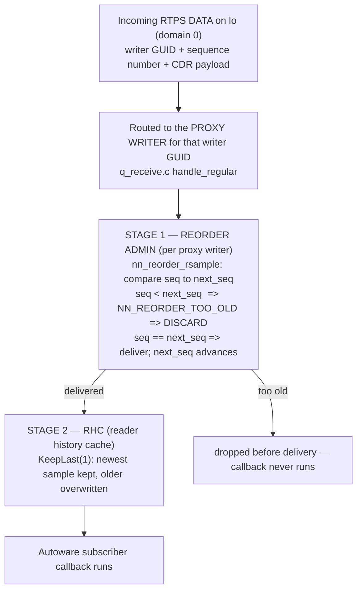

# Task 3 — Replay / Over-Publication via the Injection Module

> **Read the [shared foundation](foundation.md) first, then [Task 2](task-2-report.md).** This report
> reuses the foundation's layer map (§2), publish path to the wire (§3, especially the per-writer
> sequence number `++wr->seq` and the write history cache), the delivery-matching rules (§4), and
> discovery/GUID model (§5) **by reference**, and reuses **Task 2's injector** (its Path A rclcpp node
> and Path B forged-RTPS enumeration) as the tool whose replay capability is under test. It does not
> re-derive any of them. Source-class tags are the foundation's: `[repo]` = a file in this checkout
> (cited `path:line`); the Cyclone DDS core is in-checkout, so it too is `[repo]`; `[spec]` = OMG
> DDS / DDSI-RTPS; `[UNVERIFIED]` = would require running the sim or a packet capture; `setup-guide §N`
> = the authoritative runtime record. Terms defined in the foundation glossary (§6) — rcl, rmw, GUID,
> SEDP, WHC, sequence number, reliability, durability, transient_local, RxO — are used without
> redefinition. New terms this task needs — **proxy writer**, **reorder admin**, **HEARTBEAT /
> ACKNACK / GAP**, **RHC (reader history cache)**, **throttle / back-pressure** — are defined on first
> use.

---

## 1. Objective, scope, and exclusions

**Objective.** Determine, from source, whether the Task 2 injector can **replay** messages — capture
legitimate traffic on a command topic and re-publish it so a real Autoware subscriber accepts it *as
fresh* — and, per the study's conditional, fall back to plain **over-publication** (emitting multiple
messages without capture) only if replay is blocked, stating what forces the pivot. Replay here means
exactly what the prompt defines: **over-publication of previously-seen traffic**.

**Worked target.** The same two vehicle-controlling command topics ground every claim:
`/system/operation_mode/state` (`autoware_adapi_v1_msgs/msg/OperationModeState`) and
`/control/command/gear_cmd` (`autoware_vehicle_msgs/msg/GearCommand`), both **reliable +
`transient_local`** (setup-guide §8; foundation §4.3). A replayed `GearCommand{command: 2}` (DRIVE) or
`OperationModeState{mode: 2}` (AUTONOMOUS) is meaningful precisely because the vehicle obeys it; the
replay question is whether *re-sending* a previously-captured such command lands a second time.

**The finding, stated up front.** Replay splits cleanly by which of Task 2's two paths carries it, and
the split is the whole result:
- **Via the rclcpp injector (Task 2 Path A): replay is achievable** — but only because the injector
  re-emits the *captured payload* under its **own** writer GUID with **fresh** sequence numbers, so to
  the reader it is a brand-new writer's first samples, not a duplicate. It is over-publication of
  captured content, not a faithful replay of the original writer (§4).
- **Via faithful direct-RTPS replay (Task 2 Path B) — original writer GUID, original sequence
  numbers: BLOCKED.** Cyclone tracks, per proxy writer, the next expected sequence number, and
  discards any sample whose sequence number is below it as `NN_REORDER_TOO_OLD` (§5). A verbatim
  capture-and-resend is dropped **before delivery** at the reorder admin. To succeed, the direct-RTPS
  attacker must stop being faithful: forge a fresh writer GUID or advance the sequence numbers — at
  which point the attack *is* over-publication (§6), which is the forced pivot.

**In scope.** The reader-side duplicate/stale filter that decides the verbatim-replay verdict (§5); why
the fresh-GUID rclcpp path evades it (§4); the over-publication mechanism and its interaction with
Cyclone flow control — history depth, the reliable ACKNACK handshake, the `WhcHigh=500kB` write-history
watermark, DEADLINE/LIFESPAN, and executor back-pressure (§6, cross-referencing Task 5); and the SEU
signatures for both replay and over-publication (§7).

**Excluded (and where it lives).** *How the injector gets a single accepted publish at all* — discovery,
topic/type matching, and the mandatory `transient_local` offer — is **Task 2**, reused here wholesale.
*QoS as a prioritization or ownership-dominance lever* is **Task 5**. *Using flooding to silence an
element* (as opposed to injecting content) is **Task 4**, which cites §6 here. Whether the Autoware
subscriber node applies its own *application-level* dedup on these topics is **`[UNVERIFIED]`**: the
subscriber nodes are not in this checkout (only the message packages are — foundation Phase 0), so this
report establishes only that the *DDS layer* imposes no content dedup, and flags the application layer
as unsettled.

---

## 2. Foundation reuse and new territory

**Reused by reference (not re-derived):**

| From foundation / Task 2 | Used here for |
|---|---|
| Foundation §3 step 7: the per-writer sequence number is assigned monotonically as `seq = ++wr->seq` (`q_transmit.c:1286`), and the sample enters the WHC | The fact the whole replay verdict turns on: sequence numbers are per-writer, so a *new* writer restarts them and an *old* writer cannot go backward |
| Foundation §5: a participant/endpoint is identified on the wire by its GUID; a joining process gets a fresh, locally-generated GUID prefix | Why the rclcpp injector's re-publish looks like a new writer (fresh GUID ⇒ fresh sequence space) |
| Foundation §4.3: reliable + `transient_local` matching; the RxO gate | The QoS baseline the flooded/reliable writer operates under; why the reader is RELIABLE (⇒ NORMAL reorder mode, §5) |
| Task 2 Path A injector (the rclcpp node) and Path B enumeration (forged SPDP/SEDP + DATA) | The two carriers whose replay capability this report evaluates |
| Task 5 §6–§7: KeepLast(1) newest-wins RHC, DEADLINE as contract/alarm not scheduler, flooding is flow control not prioritization | The over-publication flow-control analysis (§6) cross-references rather than re-deriving these |

**New territory opened for this task (files first opened here):**
`src/cyclonedds/src/core/ddsi/src/q_radmin.c` (the **reorder admin** — the `(writer, sequence-number)`
dedup that blocks verbatim replay); `src/cyclonedds/src/core/ddsi/include/dds/ddsi/q_radmin.h` (the
reorder result codes and modes); `src/cyclonedds/src/core/ddsi/src/q_receive.c` (the receive path that
routes an incoming DATA to its proxy writer's reorder admin, and the reliable "heartbeat seen" gate);
`src/cyclonedds/src/core/ddsi/src/ddsi_proxy_endpoint.c` (which reorder mode a reliable reader's proxy
writer uses); `src/cyclonedds/src/core/ddsi/src/q_transmit.c` (the WHC-overfull `throttle_writer`
back-pressure); `src/cyclonedds/src/core/ddsc/src/dds_rhc_default.c` (KeepLast history depth and
lifespan expiry in the RHC).

---

## 3. Mechanism overview — what "accept as fresh" requires

**Orientation.** A subscriber's callback runs for an incoming sample only after that sample clears two
independent reader-side stages that Task 2 never had to consider, because Task 2 only sent *one*
sample. Replay sends a *second copy of an already-seen* sample, and the two stages exist precisely to
suppress that.

*What to notice:* the **proxy writer** is Cyclone's local shadow of a remote writer, keyed by that
writer's GUID (foundation §5). Each proxy writer owns one **reorder admin** whose `next_seq` remembers
the next sequence number it expects from *that* writer. Replay's fate is decided at Stage 1 by the
relationship between the replayed sequence number and this per-writer `next_seq` — so **which GUID the
replay carries changes everything**, because the GUID selects which `next_seq` the sample is compared
against. That is the pivot the whole report turns on.

---

## 4. Replay via the rclcpp injector — achievable, because it is a *new* writer (DEEP)

**Motivation.** The obvious replay tool is the Task 2 Path A injector: sniff the value a legitimate
Autoware writer published on `/control/command/gear_cmd`, then call `publish()` with the same field
values. The naive worry is "the subscriber will recognize the duplicate and ignore it." At the DDS
layer it does not — and the reason is mechanical, not a matter of luck.

**Mental model.** When the rclcpp injector re-publishes the captured *content*, it is not re-emitting
the original writer's sample; it is authoring a **new** sample on its **own** DataWriter. That writer
has its own GUID (foundation §5: a joining process generates a fresh GUID prefix) and its own
sequence-number counter starting at 1 (foundation §3 step 7: `seq = ++wr->seq` on the injector's
writer, which began at 0). So the reader sees a *different source* saying the same thing for the first
time — which is exactly what Stage 1 is built to accept.

**The traced path (each step cited; ≥6 steps).**
1. **A fresh proxy writer, fresh `next_seq`.** When the injector's writer is discovered, the Autoware
   reader's side creates a proxy writer for the injector's GUID, and its reorder admin is initialized
   with `r->next_seq = 1` (`src/cyclonedds/src/core/ddsi/src/q_radmin.c:1682`) `[repo]`. This counter
   is *independent* of the legitimate writer's proxy writer — a different GUID means a different proxy
   writer means a different `next_seq`.
2. **Reliable ⇒ NORMAL reorder mode.** The command readers are RELIABLE (foundation §4.3), so the
   injector's proxy writer is created in `NN_REORDER_MODE_NORMAL`:
   `get_proxy_writer_reorder_mode(..., isreliable)` returns `NN_REORDER_MODE_NORMAL` when `isreliable`
   is true (`src/cyclonedds/src/core/ddsi/src/ddsi_proxy_endpoint.c:171-182`), and the admin is built
   with that mode (`ddsi_proxy_endpoint.c:277`) `[repo]`.
3. **The replayed sample carries seq 1.** The injector's `publish(captured_value)` descends the
   foundation §3 path and is stamped `seq = ++wr->seq = 1` on the injector's writer
   (`q_transmit.c:1286`, foundation §3 step 7) `[repo]`. On the wire it is an ordinary DATA submessage
   with the injector's GUID and sequence number 1.
4. **Stage 1 accepts it.** In `handle_regular`, the sample is routed to the injector's proxy writer and
   handed to `nn_reorder_rsample(&sc, pwr->reorder, rsample, &refc_adjust, 0)`
   (`src/cyclonedds/src/core/ddsi/src/q_receive.c:2430`) `[repo]`. Inside, `s->min (1) ==
   reorder->next_seq (1)` is true, so the sample is delivered and `next_seq` advances to `s->maxp1`
   (`q_radmin.c:1938-1966`) `[repo]`. It returns a positive count (samples to deliver), not
   `NN_REORDER_TOO_OLD`.
5. **Stage 2 keeps it.** The delivered sample enters the reader history cache. On `KeepLast(1)` the RHC
   depth is 1 (`rhc->history_depth = (qos->history.kind == DDS_HISTORY_KEEP_LAST) ? depth : ~0u`,
   `src/cyclonedds/src/core/ddsc/src/dds_rhc_default.c:613`) `[repo]`; the replayed sample is simply
   the newest for the instance and is presented to the subscriber. There is **no content comparison**
   anywhere in this path — the RHC keys on instance and sequence, never on payload equality.
6. **Callback fires with the injected value.** Because the sample was delivered and stored, the
   Autoware subscriber's callback runs with `command: 2` (or `mode: 2`) — a second, accepted assertion
   of the command. `[INFERRED: from steps 1–5; the actual callback firing is [UNVERIFIED: would require
   running the sim].]`

**Why this is replay-but-not-faithful.** The captured *content* is delivered again and accepted as
fresh, which satisfies the study's definition (over-publication of previously-seen traffic). But it is
**not** a faithful replay of the *original writer*: the original writer's GUID and sequence numbers are
gone, replaced by the injector's. A monitor that models "who said this" sees a new participant, not the
legitimate one (§7). The rclcpp path cannot produce a faithful replay at all, because rclcpp gives the
attacker no control over the writer GUID or the sequence number — both are assigned by Cyclone from the
injector's own writer state (foundation §3, §5). Faithful replay is only conceivable on the direct-RTPS
path, which §5 shows is where it dies.

---

## 5. Faithful direct-RTPS replay — blocked by the reorder admin (DEEP)

**Motivation.** A deployment-realistic attacker (Task 2 Path B: a compromised bus element forging RTPS,
no rclcpp) is the one who *could* try a faithful replay — capture the legitimate DATA submessages
verbatim, GUID and sequence numbers intact, and re-inject them onto `lo`. This is the classic replay a
naive threat model assumes "just works." Against Cyclone it does not, and the block is a specific,
in-checkout code path — this is the core finding the study warns not to skip.

**Mental model.** Because the forged DATA reuses the *original* writer's GUID, it is routed to the
*original* writer's proxy writer — the very one whose reorder admin has already advanced its `next_seq`
past those sequence numbers while receiving the traffic live. The reorder admin's entire purpose is to
deliver each sequence number once, in order; a sequence number it has already passed is by definition
stale.

**The traced block (each step cited; ≥6 steps).**
1. **Capture is verbatim.** The attacker records legitimate DATA submessages on `lo`: writer GUID `G`,
   sequence numbers `…, n-1, n`, with their CDR payloads. Live delivery has already advanced the
   reader's proxy-writer reorder admin for `G` to `next_seq = n+1` (each accepted sample sets
   `reorder->next_seq = s->maxp1`, `q_radmin.c:1966`) `[repo]`.
2. **Re-injection routes to the same proxy writer.** The forged DATA carries GUID `G`, so
   `handle_regular` routes it to `G`'s existing proxy writer and calls `nn_reorder_rsample(&sc,
   pwr->reorder, rsample, …)` on *that* admin (`q_receive.c:2430`) `[repo]` — not a fresh one.
3. **The stale-sample test.** Inside `nn_reorder_rsample`, the replayed `s->min` (say `n`) is compared
   to `reorder->next_seq` (`n+1`). The branch `else if (s->min < reorder->next_seq)` is taken
   (`q_radmin.c:1979`) `[repo]`.
4. **Discard as too old.** That branch logs "discard: too old", adds the size to `discarded_bytes`, and
   returns `NN_REORDER_TOO_OLD` **without** incrementing the refcount — i.e. the sample is dropped, not
   stored (`q_radmin.c:1979-1985`) `[repo]`. `NN_REORDER_TOO_OLD` is defined as `-1`, "discarded
   because it was too old" (`src/cyclonedds/src/core/ddsi/include/dds/ddsi/q_radmin.h:207`) `[repo]`.
5. **No delivery, no callback.** In `handle_regular`, delivery happens only when the reorder result is
   `> 0` (`if (rres > 0)`, `q_receive.c:2445`) `[repo]`; `NN_REORDER_TOO_OLD` (`-1`) fails that test, so
   the sample is never enqueued to the delivery queue and the subscriber callback never runs. The
   faithful replay is dropped **at Stage 1, before the RHC**.
6. **Even the "jump the sequence number" variant does not deliver immediately.** If the attacker keeps
   GUID `G` but *advances* the sequence number to `n+100` (so `s->min > next_seq`), NORMAL mode does
   **not** deliver it either — it is buffered in the reorder tree pending the missing `n+1 … n+99`
   (the deliver-now branch requires `s->min == next_seq`; the "greater" case falls through to storage,
   `q_radmin.c:1938-1940, 1987+`) `[repo]`. Under reliability the reader will then **NACK** the gap
   (see §6), which the forger cannot satisfy without also forging the intervening samples. So neither
   verbatim nor naively-advanced replay under the real GUID lands cleanly.

**A prerequisite that compounds the difficulty.** Before a reliable reader accepts *any* data from a
proxy writer, Cyclone requires it to have seen a **HEARTBEAT** from that writer (the RTPS control
submessage by which a reliable writer announces its available sequence range): `if
(!pwr->have_seen_heartbeat && pwr->n_reliable_readers > 0 && vendor_is_eclipse(...)) { … return; }`
drops the data otherwise (`q_receive.c:2363-2368`) `[repo]`. A faithful-replay forger must therefore
also reproduce a consistent HEARTBEAT for GUID `G`, whose announced range must line up with the
sequence numbers it replays — another invariant to forge correctly.

**Verdict and the forced pivot.** Faithful direct-RTPS replay is **blocked**: the reorder admin's
`(writer GUID, next_seq)` state discards verbatim resends as `NN_REORDER_TOO_OLD` (`q_radmin.c:1985`)
`[repo]`. To make direct-RTPS replay succeed the attacker must abandon faithfulness in one of exactly
two ways, both of which convert the attack into **over-publication**:
- **Forge a fresh writer GUID** — a new proxy writer, `next_seq = 1`, samples accepted (this is what
  the rclcpp path does for free, §4); or
- **Advance the sequence numbers beyond the reader's window** and supply a matching HEARTBEAT/GAP so
  the reorder admin's `next_seq` moves up to meet them — synthesizing "new" samples rather than
  replaying old ones.

Either way the delivered samples are **new samples carrying old content**, not the original writer's
samples. That is the pivot to §6. `[UNVERIFIED: end-to-end acceptance of a hand-forged fresh-GUID DATA
+ HEARTBEAT by this specific Cyclone build would require a packet capture / bench against the running
container; the drop of a verbatim resend is a [repo] code-path finding.]`

---

## 6. Over-publication — the injector emitting N samples, and Cyclone's flow control (DEEP)

**Motivation.** Over-publication is both the forced pivot from §5 (synthetic "replay" under a fresh
GUID or advanced sequence numbers) and a first-class capability in its own right: the Task 2 injector
looped to `publish()` N times, or N forged DATA submessages with incrementing sequence numbers. Each
sample is accepted by the mechanism of §4 (fresh writer, monotonic sequence numbers from 1). The
interesting question is not *whether* N samples are accepted — they are — but what Cyclone's flow
control does to a *flood*, because that determines both the attack's effect and its signature.

**Mental model.** On a reliable writer, every unacknowledged sample is retained in the **WHC** (write
history cache, foundation glossary) until the reader **ACKNACK**s it (the RTPS submessage by which a
reader acknowledges received sequence numbers and negatively-acknowledges missing ones). If the
attacker publishes faster than the reader ACKs, the WHC fills; Cyclone then applies **back-pressure** —
it blocks the *attacker's own* `publish()` — rather than letting the WHC grow without bound. The flood
throttles itself.

**The flow-control path (each step cited; ≥6 steps).**
1. **Each publish retains a sample in the WHC.** The injector's `write_sample_eot` stamps `seq =
   ++wr->seq` and calls `insert_sample_in_whc(wr, seq, …)` (`q_transmit.c:1286,1299`, foundation §3
   step 7) `[repo]`. Under reliability the sample stays in the WHC until acknowledged.
2. **The high-water check.** Before assigning the next sequence number, `write_sample_eot` reads the
   WHC state and tests `if (whcst.unacked_bytes > wr->whc_high)` (`q_transmit.c:1252`) `[repo]`.
   `wr->whc_high` is the write-history high-water mark — the `WhcHigh=500kB` from the setup-guide XML
   (setup-guide §4).
3. **Back-pressure: block the writer.** When unacked bytes exceed the mark, the path calls
   `throttle_writer(thrst, xp, wr)` (`q_transmit.c:1257,1264`) `[repo]`. `throttle_writer` first forces
   out a HEARTBEAT "requesting an answer" (`writer_hbcontrol_create_heartbeat`, `q_transmit.c:1076-1082`)
   `[repo]` — i.e. it asks the reader to ACKNACK so the WHC can drain — then sleeps on the writer's
   condition variable until `writer_may_continue` (WHC shrank below the low-water mark) or a timeout
   (`q_transmit.c:1087-1105`) `[repo]`.
4. **The timeout is the reliability blocking budget.** The wait is bounded by
   `wr->xqos->reliability.max_blocking_time` (`q_transmit.c:1053`) `[repo]`. If the WHC never drains
   within that budget, `throttle_writer` returns `DDS_RETCODE_TIMEOUT`, and `write_sample_eot` aborts
   the publish (`r = DDS_RETCODE_TIMEOUT; goto drop;`, `q_transmit.c:1266-1271`) `[repo]`. That failure
   propagates up as a failed `dds_write` → `rmw_publish` error → an rclcpp publish exception
   (foundation §3 step 4). **So a reliable flood does not silently succeed N times; past the WHC
   watermark the attacker's own publishes stall and can fail.**
5. **History depth bounds what the subscriber ever sees.** Even for samples that *are* delivered, the
   command readers are `KeepLast(1)` (foundation §4.3; RHC depth 1 at `dds_rhc_default.c:613`) `[repo]`,
   so the RHC keeps only the newest sample per instance; a burst of N identical `GearCommand`s
   collapses to "the latest one" in the reader cache. Over-publication changes the *rate* of callbacks
   (each delivered sample can still trigger a callback as it arrives), but not the retained state — the
   value ends where the last sample left it. Whether the subscriber's rclcpp executor coalesces or
   queues those callbacks is an rclcpp-executor question above Cyclone and is `[UNVERIFIED]` here (the
   Autoware node source is not in the checkout; foundation Phase 0).
6. **LIFESPAN and DEADLINE add time-based limits, but are unarmed by default.** The RHC expires samples
   older than the writer's LIFESPAN via `drop_expired_samples` (`dds_rhc_default.c:467`) `[repo]`; and
   DEADLINE raises a `DEADLINE_MISSED` alarm if inter-sample spacing is violated. Both are reachable
   from rclcpp (Task 5 §7) but the command topics leave them at their defaults (effectively infinite),
   so neither expires a flooded sample nor, conversely, would flooding *cause* a DEADLINE miss — DEADLINE
   fires on *too few* samples, not too many. `[INFERRED: from Task 5 §7 that the command topics carry
   default (unset) deadline/lifespan; a capture of their SEDP QoS would confirm.]`

**Cost and asymmetry (cross-reference Task 5).** The `WhcHigh=500kB` watermark is a *self-limiting*
cost the attacker pays, not a limit on the victim: it throttles the flooding writer, but every sample
that *does* get through is still accepted and delivered (§4). Flooding therefore over-writes the
command value repeatedly at high rate but cannot, by volume alone, make a lower-priority legitimate
writer lose — Cyclone offers no prioritization or ownership arbitration on these SHARED, rclcpp-created
readers (Task 5 §6–§7). Over-publication is a rate/timing attack, not a dominance one.

---

## 7. SEU implications

**Replay and over-publication have distinct, mechanism-derived signatures, and — as in Task 2 — the
loopback co-location makes both trivial here in a way that does not transfer to the deployment bus.**
Each point below is drawn from the mechanism above, not generic security advice.

- **rclcpp-carried replay is content reuse under a *foreign* GUID — a strong identity signal.** Because
  the only way the rclcpp injector's replay is accepted is by re-authoring the content under its own
  writer (§4), the replayed command necessarily arrives with a **writer GUID that is not the legitimate
  command writer's**, and with sequence numbers restarting from 1 (foundation §3, §5). An SEU that
  knows the legitimate command writer's GUID (as Task 2 established it can, on a bounded deployment)
  sees the *same command payload* asserted by a *different, un-allowlisted writer* — the join of "known
  content" and "foreign GUID" is the replay signature. Content-identical payloads recurring under a new
  GUID is the concrete detector.

- **Faithful replay betrays itself as a sequence-number anomaly — if it appears at all.** The verbatim
  direct-RTPS replay the SEU most fears is exactly the one Cyclone already drops as `NN_REORDER_TOO_OLD`
  (§5). So on the wire, a faithful replay shows up as **DATA submessages bearing an already-seen
  (writer GUID, sequence number) pair**, or as a sequence number that jumps forward under a real GUID
  without a consistent HEARTBEAT/GAP history (§5 step 6). Both are positive, content-independent checks
  the SEU can run at the RTPS layer: a legitimate writer never re-emits a retired sequence number, and
  never advertises a sequence range its HEARTBEATs contradict. The SEU gets this detection "for free"
  in the sense that the same anomaly Cyclone drops is the one it should flag.

- **Over-publication is a per-topic *rate* anomaly, bounded by the attacker's own WHC throttle.** A
  flood on `rt/control/command/gear_cmd` or `rt/system/operation_mode/state` shows up as a publish rate
  far above the legitimate command cadence, from a single writer GUID with densely incrementing
  sequence numbers (§6). The SEU's detector is a per-(topic, writer) rate threshold. Two mechanism
  facts sharpen it: the flood is **self-limiting** at the `WhcHigh=500kB` watermark (§6 step 3–4), so
  the attacker cannot sustain unbounded rate on a reliable topic without stalling; and DEADLINE-based
  detection is the *wrong* instrument here — DEADLINE fires on starvation, not excess (§6 step 6), so
  the SEU must not rely on `DEADLINE_MISSED` to catch over-publication. (This corrects the intuitive
  pairing; the rate anomaly, not a deadline alarm, is the signal.)

- **No DDS-layer dedup means detection cannot be delegated downward.** Cyclone accepts every fresh-GUID
  sample and every KeepLast-newest sample without comparing payloads (§4 step 5, §6 step 5); there is
  no middleware content-dedup for the SEU to lean on. Whether the *Autoware application* dedups a
  repeated command is unknown from this checkout (`[UNVERIFIED]`, §1) — the SEU should assume it does
  not and treat repeated accepted commands as effective, i.e. replay/over-publication *do* change
  vehicle behavior unless the application specifically guards against it.

- **Realism caveat (loopback vs. deployment bus).** On this sim, capturing the legitimate traffic and
  re-publishing it is trivial because the injector shares one Cyclone domain on `lo` with the sim and
  discovers the readers automatically (foundation §5 realism caveat; Task 2 §6) — the *capture* step in
  particular is free on loopback. That ease is a **co-location artifact**. On a real automotive
  Ethernet/CAN bus the attacker (a compromised ECU) must still reach the traffic to capture it and the
  discovery group to inject, and — crucially — the **reorder-admin dedup, the fresh-GUID requirement,
  the sequence-number monotonicity, and the WHC self-throttle are Cyclone delivery rules that hold on
  the deployment bus regardless of transport** (§4–§6). So the SEU's portable detection surface is the
  set of *invariants the delivery layer forces on any successful replay/over-publisher*: a foreign or
  restarted GUID carrying known content, an already-seen or inconsistent sequence number, and an
  anomalous per-writer rate. Those transfer intact; the trivial capture-and-inject ease does not.

---

## 8. Appendix — files opened, tags, confidence

**Files opened for this task (all `[repo]`):**
- `src/cyclonedds/src/core/ddsi/src/q_radmin.c` — reorder admin: `nn_reorder_rsample` (`:1901`),
  deliver-when-`==next_seq` (`:1938-1966`), too-old discard → `NN_REORDER_TOO_OLD` (`:1979-1985`),
  `next_seq` init to 1 (`:1682`)
- `src/cyclonedds/src/core/ddsi/include/dds/ddsi/q_radmin.h` — reorder modes (`:191-195`), result codes
  incl. `NN_REORDER_TOO_OLD = -1` (`:206-208`)
- `src/cyclonedds/src/core/ddsi/src/q_receive.c` — `handle_regular` routing to `pwr->reorder`
  (`:2430`), deliver only when `rres > 0` (`:2445`), reliable "heartbeat seen" gate (`:2363-2368`),
  last-seq tracking (`:2380-2384`)
- `src/cyclonedds/src/core/ddsi/src/ddsi_proxy_endpoint.c` — reliable ⇒ `NN_REORDER_MODE_NORMAL`
  (`:171-182`), reorder admin creation (`:277`)
- `src/cyclonedds/src/core/ddsi/src/q_transmit.c` — WHC-overfull check (`:1252`), `throttle_writer`
  (`:1015`, forced heartbeat `:1076-1082`, wait/timeout `:1087-1105`, `max_blocking_time` `:1053`),
  throttle call + timeout→drop (`:1257-1271`)
- `src/cyclonedds/src/core/ddsc/src/dds_rhc_default.c` — KeepLast history depth (`:613`),
  `drop_expired_samples` for LIFESPAN (`:467`)

Reused by reference (opened in the foundation / Task 2, not re-opened): `q_transmit.c:1286,1299`
(sequence number + WHC insert), `q_qosmatch.c` (matching), `rmw_node.cpp` (QoS mapping), `qos.hpp`
(rclcpp QoS) — cited via the foundation and Task 2.

**`[INFERRED]` / `[UNVERIFIED]` findings and what would settle them:**

| Tag | Claim | What would settle it |
|---|---|---|
| `[UNVERIFIED]` | Whether the Autoware subscriber applies *application-level* dedup on the command topics (the DDS layer does not) | Inspecting the subscriber node source (absent from checkout) or observing a live replayed command being obeyed |
| `[UNVERIFIED]` | End-to-end acceptance of a hand-forged fresh-GUID DATA + HEARTBEAT by this Cyclone build (§5 verdict is a code-path finding; the live bench is not) | A packet capture / bench against the running container |
| `[INFERRED]` | The rclcpp replay's callback actually fires with the injected value (steps 1–5 are `[repo]`; the firing is runtime) | Running the sim with a replaying injector and observing the callback |
| `[INFERRED]` | Command topics leave DEADLINE/LIFESPAN at default (unset), so flooding neither expires samples nor trips DEADLINE_MISSED (§6 step 6) | A capture of the command readers' SEDP QoS plist |
| `[UNVERIFIED]` | rclcpp executor coalescing/queuing of callbacks under a flood (above Cyclone) | The Autoware node's executor configuration (source absent) |

**Per-section confidence:**

| Section | Confidence | Reason |
|---|---|---|
| §3 Overview | HIGH | The two-stage reader path (reorder admin → RHC) is assembled from in-checkout `[repo]` findings. |
| §4 rclcpp replay achievable | HIGH | Fresh-GUID `next_seq = 1`, NORMAL mode, deliver-when-`==next_seq`, and no content dedup are all read from Cyclone source in-checkout; only the final callback firing is `[INFERRED]`/`[UNVERIFIED]`. |
| §5 Faithful replay blocked | HIGH | The too-old discard (`NN_REORDER_TOO_OLD`), the routing to the existing proxy writer, and the heartbeat prerequisite are in-checkout `[repo]`; only end-to-end forged-packet acceptance is `[UNVERIFIED]`. |
| §6 Over-publication / flow control | HIGH | The WHC watermark check, `throttle_writer`, the blocking-time timeout, and KeepLast depth are all in-checkout `[repo]`; the executor behavior is `[UNVERIFIED]` and flagged. |
| §7 SEU implications | HIGH | Drawn from the mechanism (foreign/restarted GUID, seq anomaly, rate anomaly, self-throttle, no DDS dedup), not generic commentary; the DEADLINE-is-the-wrong-instrument point is derived from §6. |

<!-- REPORT-COMPLETE -->
