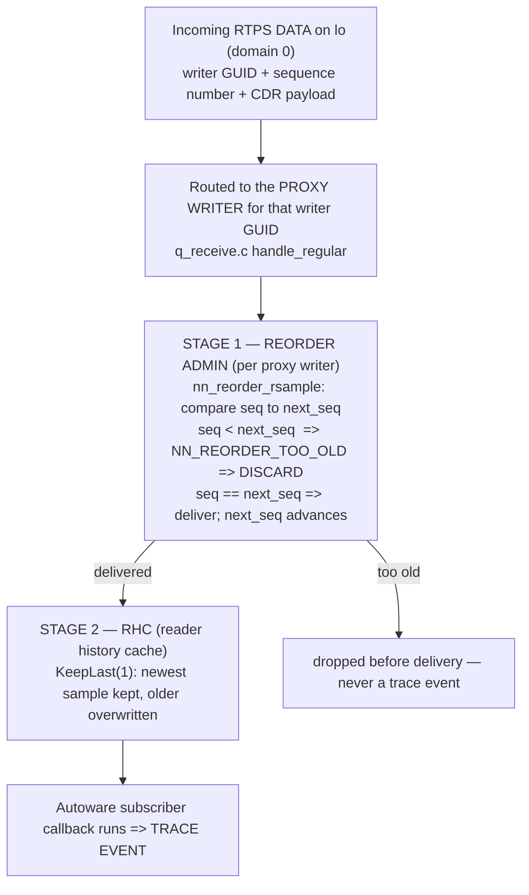

# Task 3 (Flagship) — Over-Publication as an Actuation-Frequency Fault: the 100× Stress Case and Linear-Cost Verification

> **Read the [shared foundation](foundation.md) first, then [Task 2](task-2-report.md).** This report
> reuses the foundation's layer map (§2), publish path to the wire (§3, especially the per-writer
> sequence number `++wr->seq` and the write history cache), the delivery-matching rules (§4), and
> discovery/GUID model (§5) **by reference**, and reuses **Task 2's fault-injection harness** (its Path A
> rclcpp node and Path B forged-RTPS enumeration) as the instrument that drives over-published and
> duplicate-content traces into the system. It does not re-derive any of them. Source-class tags are the
> foundation's: `[repo]` = a file in this checkout (cited `path:line`); the Cyclone DDS core is
> in-checkout, so it too is `[repo]`; `[spec]` = OMG DDS / DDSI-RTPS; `[UNVERIFIED]` = would require
> running the sim or a packet capture; `[INFERRED]` = derived from mechanism, not measured;
> `[LSEU-abstract]` = a claim/number/definition from the (unpublished) SEU abstract, never something this
> static study measured; `setup-guide §N` = the authoritative runtime record. Terms defined in the
> foundation glossary (§6) — rcl, rmw, GUID, SEDP, WHC, sequence number, reliability, durability,
> transient_local, RxO — are used without redefinition. New terms this task needs — **proxy writer**,
> **reorder admin**, **HEARTBEAT / ACKNACK / GAP**, **RHC (reader history cache)**, **throttle /
> back-pressure** — are defined on first use.

---

## 1. Objective, scope, and exclusions

**Motivation — why this is the flagship.** The SEU's central stress test is the abstract's **100×
network over-publication** scenario: a source emits its samples at roughly one hundred times the nominal
cadence, and the runtime verifier must still evaluate the derived STL properties without its cost
exploding — the abstract reports that the verification algorithms stay **linear** even under this load
`[LSEU-abstract]`. Over-publication is precisely an **actuation-frequency / rate constraint violation**:
a command topic whose data dependency fixes an expected inter-arrival window suddenly delivers far too
many samples, far too fast. This report supplies the physical half the abstract assumes: *how* a 100×
over-published trace is produced on the real Cyclone stack, *what the monitor actually observes* when it
happens, and *why* evaluating the rate property against that flood costs only O(1) per sample — the
mechanism behind the abstract's linearity claim.

**Objective.** Determine, from source, (a) how the Task 2 fault-injection harness can drive an
**over-published** trace — many samples per instance, far above the nominal command cadence — into a real
Autoware subscriber so the STL rate/actuation-frequency property is exercised; and (b) what Cyclone does
to a **faithful replay** (re-sending previously-captured samples verbatim), because the delivery layer's
own handling of duplicate and stale sequence numbers decides whether the monitor must catch them or
inherits their suppression for free. Replay here means exactly what the prompt defines:
**over-publication of previously-seen traffic** — a special case of the rate fault whose payload is not
fresh.

**Worked target.** The same two vehicle-controlling command topics ground every claim:
`/system/operation_mode/state` (`autoware_adapi_v1_msgs/msg/OperationModeState`) and
`/control/command/gear_cmd` (`autoware_vehicle_msgs/msg/GearCommand`), both **reliable +
`transient_local`** (setup-guide §8; foundation §4.3). Their nominal cadence is set by the actuation
loop and measured against sim time (`/clock`, ~90–100 Hz, setup-guide §6d). An over-published stream of
`GearCommand{command: 2}` (DRIVE) or `OperationModeState{mode: 2}` (AUTONOMOUS) violates the rate bound
`G( inter_arrival(topic) ∈ [1/f_max, 1/f_min] )` on its lower edge (inter-arrival far below `1/f_max`),
and — if the payload is a stale replayed value — the freshness bound as well.

**The finding, stated up front.** How a duplicate/high-rate trace lands splits cleanly by which of Task
2's two harness paths carries it, and the split is what the monitor's design turns on:
- **Via the rclcpp harness (Task 2 Path A): over-publication is delivered** — because the harness
  re-emits each sample under its **own** writer GUID with **fresh, monotonic** sequence numbers, so to
  the reader every sample is a brand-new writer's next sample, not a duplicate. This is exactly how the
  100× rate fault is injected: N `publish()` calls become N accepted trace events (§4). Faithful replay
  of the *original* writer is not what this path produces; it produces new samples carrying (possibly
  stale) content.
- **Via faithful direct-RTPS replay (Task 2 Path B) — original writer GUID, original sequence numbers:
  suppressed by the delivery layer.** Cyclone tracks, per proxy writer, the next expected sequence
  number, and discards any sample whose sequence number is below it as `NN_REORDER_TOO_OLD` (§5). A
  verbatim capture-and-resend is dropped **before delivery** at the reorder admin — so it never becomes a
  trace event at all. This is a freshness guarantee the monitor **inherits**: a verbatim duplicate cannot
  reach the trace, so any duplicate the monitor *does* see must carry a foreign/restarted GUID or an
  advanced sequence number, which is itself the observable (§5, §7).

**In scope.** The reader-side duplicate/stale filter that suppresses verbatim replay (§5); why the
fresh-GUID rclcpp path delivers over-published samples as fresh trace events (§4); the over-publication
mechanism and its interaction with Cyclone flow control — history depth, the reliable ACKNACK handshake,
the `WhcHigh=500kB` write-history watermark, DEADLINE/LIFESPAN, and executor back-pressure — and how each
bounds *what the monitor sees* under the 100× flood and *why evaluation stays linear* (§6,
cross-referencing Task 5); and the closing STL property / trace-event / safe-stop block for the rate and
freshness constraints (§7).

**Excluded (and where it lives).** *How the harness gets a single accepted publish at all* — discovery,
topic/type matching, and the mandatory `transient_local` offer — is **Task 2**, reused here wholesale.
*QoS as a timing-determinism / mixed-criticality concern* (deadline, latency budget, priority) is **Task
5**. *Using a flood to silence an element* (as opposed to over-publishing content) is **Task 4**, which
cites §6 here. Whether the Autoware subscriber node applies its own *application-level* dedup on these
topics is **`[UNVERIFIED]`**: the subscriber nodes are not in this checkout (only the message packages
are — foundation Phase 0), so this report establishes only that the *DDS layer* imposes no content dedup,
and flags the application layer as unsettled — which matters because it decides whether an over-published
stale value actually changes vehicle behaviour, i.e. whether the freshness violation is real.

---

## 2. Foundation reuse and new territory

**Reused by reference (not re-derived):**

| From foundation / Task 2 | Used here for |
|---|---|
| Foundation §3 step 7: the per-writer sequence number is assigned monotonically as `seq = ++wr->seq` (`q_transmit.c:1286`), and the sample enters the WHC | The fact the whole over-publication/replay analysis turns on: sequence numbers are per-writer, so a *new* writer restarts them and an *old* writer cannot go backward — this is the observable the monitor keys on |
| Foundation §5: a participant/endpoint is identified on the wire by its GUID; a joining process gets a fresh, locally-generated GUID prefix | Why the rclcpp harness's re-publish looks like a new writer (fresh GUID ⇒ fresh sequence space) and every over-published sample is delivered |
| Foundation §4.3: reliable + `transient_local` matching; the RxO gate | The QoS baseline the flooding writer operates under; why the reader is RELIABLE (⇒ NORMAL reorder mode, §5) |
| Task 2 Path A harness (the rclcpp node) and Path B enumeration (forged SPDP/SEDP + DATA) | The two carriers whose over-publication/replay behaviour this report evaluates as trace-injection instruments |
| Task 5 §6–§7: KeepLast(1) newest-wins RHC, DEADLINE as contract/alarm not scheduler, flooding is flow control not prioritization | The over-publication flow-control analysis (§6) cross-references rather than re-deriving these; Task 5 also holds the mixed-criticality/timing-determinism angle |

**New territory opened for this task (files first opened here):**
`src/cyclonedds/src/core/ddsi/src/q_radmin.c` (the **reorder admin** — the `(writer, sequence-number)`
dedup that suppresses verbatim replay); `src/cyclonedds/src/core/ddsi/include/dds/ddsi/q_radmin.h` (the
reorder result codes and modes); `src/cyclonedds/src/core/ddsi/src/q_receive.c` (the receive path that
routes an incoming DATA to its proxy writer's reorder admin, and the reliable "heartbeat seen" gate);
`src/cyclonedds/src/core/ddsi/src/ddsi_proxy_endpoint.c` (which reorder mode a reliable reader's proxy
writer uses); `src/cyclonedds/src/core/ddsi/src/q_transmit.c` (the WHC-overfull `throttle_writer`
back-pressure); `src/cyclonedds/src/core/ddsc/src/dds_rhc_default.c` (KeepLast history depth and
lifespan expiry in the RHC).

---

## 3. Mechanism overview — what becomes a trace event the monitor can see

**Orientation.** The STL monitor evaluates its rate and freshness properties over a **trace**: the
sequence of samples that actually reach the reader, each with an arrival timestamp and a `(writer GUID,
sequence number)` identity. So the first question for any over-published or replayed sample is not "is it
malicious" but "**does it become a trace event at all**." A sample becomes one only after it clears two
independent reader-side stages that Task 2 never had to consider, because Task 2 only sent *one* sample.
Over-publication sends *many*; faithful replay sends a *second copy of an already-seen* sample; and the
two stages are exactly what decide which of those reach the monitor.

*What to notice:* the **proxy writer** is Cyclone's local shadow of a remote writer, keyed by that
writer's GUID (foundation §5). Each proxy writer owns one **reorder admin** whose `next_seq` remembers
the next sequence number it expects from *that* writer. A sample's fate is decided at Stage 1 by the
relationship between its sequence number and this per-writer `next_seq` — so **which GUID the sample
carries changes everything**, because the GUID selects which `next_seq` it is compared against. This is
also the monitor's cheapest possible discriminator: `(GUID, seq)` is a fixed-size key updated in O(1) per
sample, which is the root of why trace evaluation stays linear under a flood (§6, §7).

---

## 4. Over-publication via the rclcpp harness — every sample is a new writer's fresh event (DEEP)

**Motivation.** The direct way to drive a 100× rate fault is the Task 2 Path A harness: loop N times
calling `publish()` with a command value on `/control/command/gear_cmd`. The naive worry is "the
subscriber will recognize the duplicates and ignore all but one, so the monitor never sees the flood." At
the DDS layer it does not deduplicate — and the reason is mechanical, not luck: each of the N samples is
delivered as its own trace event, which is exactly what lets the monitor observe an over-publication.

**Mental model.** When the rclcpp harness publishes the (captured or synthetic) *content* N times, it is
not re-emitting some original writer's sample; it is authoring N **new** samples on its **own**
DataWriter. That writer has its own GUID (foundation §5: a joining process generates a fresh GUID prefix)
and its own sequence-number counter starting at 1 (foundation §3 step 7: `seq = ++wr->seq` on the
harness's writer, which began at 0). So the reader sees a *single source* emitting a dense run of fresh,
in-order samples — 1, 2, 3, … — every one of which Stage 1 is built to accept and deliver. That dense run
*is* the over-published trace.

**The traced path (each step cited; ≥6 steps).**
1. **A fresh proxy writer, fresh `next_seq`.** When the harness's writer is discovered, the Autoware
   reader's side creates a proxy writer for the harness's GUID, and its reorder admin is initialized
   with `r->next_seq = 1` (`src/cyclonedds/src/core/ddsi/src/q_radmin.c:1682`) `[repo]`. This counter
   is *independent* of the legitimate writer's proxy writer — a different GUID means a different proxy
   writer means a different `next_seq`.
2. **Reliable ⇒ NORMAL reorder mode.** The command readers are RELIABLE (foundation §4.3), so the
   harness's proxy writer is created in `NN_REORDER_MODE_NORMAL`:
   `get_proxy_writer_reorder_mode(..., isreliable)` returns `NN_REORDER_MODE_NORMAL` when `isreliable`
   is true (`src/cyclonedds/src/core/ddsi/src/ddsi_proxy_endpoint.c:171-182`), and the admin is built
   with that mode (`ddsi_proxy_endpoint.c:277`) `[repo]`.
3. **Each over-published sample carries the next monotonic seq.** The k-th `publish(value)` descends the
   foundation §3 path and is stamped `seq = ++wr->seq = k` on the harness's writer
   (`q_transmit.c:1286`, foundation §3 step 7) `[repo]`. On the wire each is an ordinary DATA submessage
   with the harness's GUID and a densely incrementing sequence number.
4. **Stage 1 accepts each one.** In `handle_regular`, each sample is routed to the harness's proxy writer
   and handed to `nn_reorder_rsample(&sc, pwr->reorder, rsample, &refc_adjust, 0)`
   (`src/cyclonedds/src/core/ddsi/src/q_receive.c:2430`) `[repo]`. Inside, `s->min (k) ==
   reorder->next_seq (k)` holds for each in-order sample, so it is delivered and `next_seq` advances to
   `s->maxp1` (`q_radmin.c:1938-1966`) `[repo]`. It returns a positive count (samples to deliver), not
   `NN_REORDER_TOO_OLD`.
5. **Stage 2 keeps the newest.** Each delivered sample enters the reader history cache. On `KeepLast(1)`
   the RHC depth is 1 (`rhc->history_depth = (qos->history.kind == DDS_HISTORY_KEEP_LAST) ? depth : ~0u`,
   `src/cyclonedds/src/core/ddsc/src/dds_rhc_default.c:613`) `[repo]`; the newest sample overwrites the
   previous for the instance. There is **no content comparison** anywhere in this path — the RHC keys on
   instance and sequence, never on payload equality, so a repeat of an identical value is not collapsed
   by content, only by KeepLast depth (§6 step 5).
6. **Each delivery is a callback — i.e. a trace event.** Because each sample was delivered and stored,
   the Autoware subscriber's callback runs once per delivered sample, giving the monitor N arrival events
   for the topic in the flood window — the raw material of the rate property. `[INFERRED: from steps 1–5;
   the actual callback firing is [UNVERIFIED: would require running the sim].]`

**Why this delivers over-publication but not faithful replay.** The N samples are delivered and each
becomes a trace event, so the harness realizes the 100× rate fault. But it is **not** a faithful replay
of any *original writer*: the original writer's GUID and sequence numbers are gone, replaced by the
harness's. A monitor that models "who said this" sees a new participant, not the legitimate one (§7). The
rclcpp path cannot produce a faithful replay at all, because rclcpp gives no control over the writer GUID
or the sequence number — both are assigned by Cyclone from the harness's own writer state (foundation §3,
§5). Faithful replay is only conceivable on the direct-RTPS path, which §5 shows is suppressed by the
delivery layer.

---

## 5. Faithful replay — suppressed by the reorder admin (a freshness guarantee the monitor inherits) (DEEP)

**Motivation.** The one instrument that *could* drive a faithful replay — the same original writer's
samples, GUID and sequence numbers intact, re-injected as an off-nominal *stale-value* trace — is the
Task 2 Path B harness (direct RTPS, no rclcpp). If it worked, the monitor would face a subtle case: an
apparently-legitimate sample carrying an out-of-date value. Against Cyclone it does **not** work, and the
suppression is a specific, in-checkout code path. That matters for monitor design in two ways: the
verbatim-stale-value case never reaches the trace (the monitor need not catch it), and the *reason* it is
dropped tells the monitor exactly what a real duplicate must look like to slip through.

**Mental model.** Because the re-injected DATA reuses the *original* writer's GUID, it is routed to the
*original* writer's proxy writer — the very one whose reorder admin has already advanced its `next_seq`
past those sequence numbers while receiving the traffic live. The reorder admin's entire purpose is to
deliver each sequence number once, in order; a sequence number it has already passed is by definition
stale, and is discarded before it can become a trace event.

**The traced suppression (each step cited; ≥6 steps).**
1. **Capture is verbatim.** The harness records legitimate DATA submessages on `lo`: writer GUID `G`,
   sequence numbers `…, n-1, n`, with their CDR payloads. Live delivery has already advanced the
   reader's proxy-writer reorder admin for `G` to `next_seq = n+1` (each accepted sample sets
   `reorder->next_seq = s->maxp1`, `q_radmin.c:1966`) `[repo]`.
2. **Re-injection routes to the same proxy writer.** The forged DATA carries GUID `G`, so
   `handle_regular` routes it to `G`'s existing proxy writer and calls `nn_reorder_rsample(&sc,
   pwr->reorder, rsample, …)` on *that* admin (`q_receive.c:2430`) `[repo]` — not a fresh one.
3. **The stale-sample test.** Inside `nn_reorder_rsample`, the replayed `s->min` (say `n`) is compared
   to `reorder->next_seq` (`n+1`). The branch `else if (s->min < reorder->next_seq)` is taken
   (`q_radmin.c:1979`) `[repo]`.
4. **Discard as too old.** That branch logs "discard: too old", adds the size to `discarded_bytes`, and
   returns `NN_REORDER_TOO_OLD` **without** incrementing the refcount — i.e. the sample is dropped, not
   stored (`q_radmin.c:1979-1985`) `[repo]`. `NN_REORDER_TOO_OLD` is defined as `-1`, "discarded
   because it was too old" (`src/cyclonedds/src/core/ddsi/include/dds/ddsi/q_radmin.h:207`) `[repo]`.
5. **No delivery, no trace event.** In `handle_regular`, delivery happens only when the reorder result is
   `> 0` (`if (rres > 0)`, `q_receive.c:2445`) `[repo]`; `NN_REORDER_TOO_OLD` (`-1`) fails that test, so
   the sample is never enqueued to the delivery queue and the subscriber callback never runs. The
   faithful replay is dropped **at Stage 1, before the RHC** — the monitor never sees it.
6. **Even the "jump the sequence number" variant does not deliver immediately.** If the harness keeps
   GUID `G` but *advances* the sequence number to `n+100` (so `s->min > next_seq`), NORMAL mode does
   **not** deliver it either — it is buffered in the reorder tree pending the missing `n+1 … n+99`
   (the deliver-now branch requires `s->min == next_seq`; the "greater" case falls through to storage,
   `q_radmin.c:1938-1940, 1987+`) `[repo]`. Under reliability the reader will then **NACK** the gap
   (see §6), which the replay instrument cannot satisfy without also synthesizing the intervening
   samples. So neither
   verbatim nor naively-advanced replay under the real GUID becomes a clean trace event.

**A prerequisite that compounds the difficulty.** Before a reliable reader accepts *any* data from a
proxy writer, Cyclone requires it to have seen a **HEARTBEAT** from that writer (the RTPS control
submessage by which a reliable writer announces its available sequence range): `if
(!pwr->have_seen_heartbeat && pwr->n_reliable_readers > 0 && vendor_is_eclipse(...)) { … return; }`
drops the data otherwise (`q_receive.c:2363-2368`) `[repo]`. A faithful-replay instrument must therefore
also reproduce a consistent HEARTBEAT for GUID `G`, whose announced range must line up with the
sequence numbers it replays — another invariant to synthesize correctly.

**Verdict — what the monitor inherits, and what it must still catch.** Faithful direct-RTPS replay is
**suppressed by the delivery layer**: the reorder admin's `(writer GUID, next_seq)` state discards
verbatim resends as `NN_REORDER_TOO_OLD` (`q_radmin.c:1985`) `[repo]`. So the monitor gets a free
guarantee — a verbatim stale-value duplicate never enters the trace. The corollary is the monitor's
detector: for a duplicate/stale value to reach the trace at all, the injecting instrument must abandon
faithfulness in one of exactly two ways, **both observable**:
- **Restart under a fresh writer GUID** — a new proxy writer, `next_seq = 1`, samples accepted (this is
  what the rclcpp path does for free, §4). Observable as *known content asserted by a new/unexpected
  GUID*.
- **Advance the sequence numbers beyond the reader's window** and supply a matching HEARTBEAT/GAP so the
  reorder admin's `next_seq` moves up to meet them — synthesizing "new" samples. Observable as a
  sequence-number jump under a real GUID without a consistent HEARTBEAT/GAP history.

Either way the delivered samples are **new samples carrying old content**, and both signatures are
content-independent facts the monitor can check on the `(GUID, seq)` stream (§7). `[UNVERIFIED:
end-to-end acceptance of a hand-forged fresh-GUID DATA + HEARTBEAT by this specific Cyclone build would
require a packet capture / bench against the running container; the drop of a verbatim resend is a
[repo] code-path finding.]`

---

## 6. The 100× over-publication stress case and Cyclone flow control — why the trace is bounded and evaluation stays linear (DEEP)

**Motivation.** This is the abstract's headline: a **100× network over-publication** stress test, under
which the verifier's cost must stay **linear** `[LSEU-abstract]`. The Task 2 harness realizes the flood
(loop `publish()` N times, §4), and every delivered sample is a trace event. The interesting questions
are not *whether* the flood is delivered — it is — but (a) what Cyclone's flow control does to the *rate*
the monitor actually sees, and (b) why evaluating the rate property against that flood costs only O(1)
per sample, which is the mechanism behind the abstract's linearity claim.

**Mental model.** On a reliable writer, every unacknowledged sample is retained in the **WHC** (write
history cache, foundation glossary) until the reader **ACKNACK**s it (the RTPS submessage by which a
reader acknowledges received sequence numbers and negatively-acknowledges missing ones). If the harness
publishes faster than the reader ACKs, the WHC fills; Cyclone then applies **back-pressure** — it blocks
the *harness's own* `publish()` — rather than letting the WHC grow without bound. The flood throttles
itself, which in turn bounds the sustained event rate the monitor must handle.

**The flow-control path (each step cited; ≥6 steps).**
1. **Each publish retains a sample in the WHC.** The harness's `write_sample_eot` stamps `seq =
   ++wr->seq` and calls `insert_sample_in_whc(wr, seq, …)` (`q_transmit.c:1286,1299`, foundation §3
   step 7) `[repo]`. Under reliability the sample stays in the WHC until acknowledged.
2. **The high-water check.** Before assigning the next sequence number, `write_sample_eot` reads the
   WHC state and tests `if (whcst.unacked_bytes > wr->whc_high)` (`q_transmit.c:1252`) `[repo]`.
   `wr->whc_high` is the write-history high-water mark — the `WhcHigh=500kB` from the setup-guide XML
   (setup-guide §4).
3. **Back-pressure: block the writer.** When unacked bytes exceed the mark, the path calls
   `throttle_writer(thrst, xp, wr)` (`q_transmit.c:1257,1264`) `[repo]`. `throttle_writer` first forces
   out a HEARTBEAT "requesting an answer" (`writer_hbcontrol_create_heartbeat`, `q_transmit.c:1076-1082`)
   `[repo]` — i.e. it asks the reader to ACKNACK so the WHC can drain — then sleeps on the writer's
   condition variable until `writer_may_continue` (WHC shrank below the low-water mark) or a timeout
   (`q_transmit.c:1087-1105`) `[repo]`.
4. **The timeout is the reliability blocking budget.** The wait is bounded by
   `wr->xqos->reliability.max_blocking_time` (`q_transmit.c:1053`) `[repo]`. If the WHC never drains
   within that budget, `throttle_writer` returns `DDS_RETCODE_TIMEOUT`, and `write_sample_eot` aborts
   the publish (`r = DDS_RETCODE_TIMEOUT; goto drop;`, `q_transmit.c:1266-1271`) `[repo]`. That failure
   propagates up as a failed `dds_write` → `rmw_publish` error → an rclcpp publish exception
   (foundation §3 step 4). **So a reliable 100× flood does not stream N samples through unimpeded: past
   the WHC watermark the source's own publishes stall, which caps the sustained arrival rate the monitor
   observes at the drain rate of the ACKNACK loop.**
5. **History depth bounds retained *state*, not the *event count*.** Even for samples that *are*
   delivered, the command readers are `KeepLast(1)` (foundation §4.3; RHC depth 1 at
   `dds_rhc_default.c:613`) `[repo]`, so the RHC keeps only the newest sample per instance; a burst of N
   identical `GearCommand`s collapses to "the latest one" in the reader cache. Over-publication changes
   the *rate* of callbacks (each delivered sample can still fire a callback as it arrives) but not the
   retained value — which is why the monitor must evaluate the rate property on the **arrival event
   stream**, not on the cache contents. Whether the subscriber's rclcpp executor coalesces or queues
   those callbacks is an rclcpp-executor question above Cyclone and is `[UNVERIFIED]` here (the Autoware
   node source is not in the checkout; foundation Phase 0).
6. **LIFESPAN and DEADLINE add time-based limits, but are unarmed by default.** The RHC expires samples
   older than the writer's LIFESPAN via `drop_expired_samples` (`dds_rhc_default.c:467`) `[repo]`; and
   DEADLINE raises a `DEADLINE_MISSED` alarm if inter-sample spacing is violated. Both are reachable
   from rclcpp (Task 5 §7) but the command topics leave them at their defaults (effectively infinite),
   so neither expires a flooded sample nor, conversely, would flooding *cause* a DEADLINE miss — DEADLINE
   fires on *too few* samples, not too many (§7). `[INFERRED: from Task 5 §7 that the command topics
   carry default (unset) deadline/lifespan; a capture of their SEDP QoS would confirm.]`

**Why evaluation stays linear under 100× (the mechanism behind the abstract's claim).** Each of the
three observables the monitor needs — a sample's **arrival timestamp**, its **writer GUID**, and its
**sequence number** — is delivered *per sample* and is fixed-size. Updating a per-`(topic, writer)`
inter-arrival estimate and comparing it to the rate bound is **O(1) work per trace event** (last
timestamp, running count, current `next_seq`); no step rescans history. So a 100× flood is 100× as many
O(1) updates — the verifier's cost grows **linearly** in the number of delivered samples, never
super-linearly, which is exactly the abstract's linear-complexity result under the 100× over-publication
stress test `[LSEU-abstract]`. Two mechanism facts reinforce this: KeepLast(1) means the monitor never
has to hold an unbounded RHC (§6 step 5), and the WHC self-throttle caps the sustained rate (§6 steps
3–4), so the worst-case event rate the monitor must service is itself bounded by the delivery layer, not
by the harness's loop count. `[INFERRED: the O(1)-per-event cost is read from the observables' fixed
size and the KeepLast/WHC bounds; the abstract supplies the linearity target, and the sim is not run to
measure it.]`

**Cost and asymmetry (cross-reference Task 5).** The `WhcHigh=500kB` watermark is a *self-limiting* cost
the flooding source pays, not a limit on the victim: it throttles the flooding writer, but every sample
that *does* get through is still delivered as a trace event (§4). Flooding therefore over-writes the
command value repeatedly at high rate but cannot, by volume alone, make a lower-priority legitimate
writer lose — Cyclone offers no prioritization or ownership arbitration on these SHARED, rclcpp-created
readers (Task 5 §6–§7). Over-publication is a rate/timing fault, not a dominance one — which is precisely
why it maps onto the actuation-frequency STL property and not onto an ownership model.

---

## 7. What Task 3 hands the STL monitor

**This report supplies the flagship rate/actuation-frequency property and its freshness corollary.** As
in Task 2, the co-located loopback bench makes injecting an over-published trace trivial in a way that
does not transfer to the deployment bus; what *does* transfer is the set of delivery-layer invariants the
monitor keys on. The closing block below is the standard three parts — the property, the trace event, and
the safe-stop decision — each drawn from the mechanism above, not from generic advice.

**1. THE PROPERTY.** Over-publication violates an **actuation-frequency / rate** bound; faithful replay
would violate a **freshness** bound (but is suppressed by §5). Written STL-shaped over the two command
topics:

- Rate / actuation-frequency (the flagship, §4, §6):
  `G( inter_arrival(rt/control/command/gear_cmd) ∈ [1/f_max, 1/f_min] )` — over-publication drives
  `inter_arrival` below `1/f_max`; the same holds for `rt/system/operation_mode/state`.
- Freshness (the replay corollary, §5): `G( age(topic) ≤ Δ_fresh )`, age measured against sim time
  (`/clock`, foundation §0). A verbatim stale resend cannot violate this (dropped as
  `NN_REORDER_TOO_OLD`); only a fresh-GUID or advanced-seq resend carrying old content can, and that
  carries an identity/ordering anomaly the monitor can see.

`f_max`, `f_min`, and `Δ_fresh` are control-layer parameters bounded by the ~90–100 Hz `/clock` cadence
(setup-guide §6d) and are `[INFERRED]`; the code fixes the *mechanism*, not the exact bound.

**2. THE TRACE EVENT.** The event-driven monitor observes, **per delivered sample at the rmw/ddsi
layer**, three fixed-size fields: the **arrival timestamp**, the **writer GUID**, and the **sequence
number** (§3, foundation §3 step 7). From these:
- *Over-publication* is a per-`(topic, writer)` **inter-arrival below `1/f_max`** — a dense run of
  monotonically-incrementing sequence numbers from a single GUID arriving far faster than the nominal
  cadence (§4, §6). Each observation is an O(1) update, which is why the evaluation stays linear under
  100× (§6) `[LSEU-abstract]`.
- *Fresh-GUID replay* is **known content asserted under a new/unexpected writer GUID with seq restarting
  at 1** (§4, §5); *advanced-seq replay* is a **sequence-number jump under a real GUID without a
  consistent HEARTBEAT/GAP history** (§5). Both are content-independent checks on the `(GUID, seq)`
  stream — and the verbatim case the monitor need not check at all, because Cyclone already drops it
  (§5).
- A **WHC stall** (the source's `publish()` blocking/timing out past `WhcHigh`, §6 steps 3–4) is a
  secondary observable that a sustained flood is under way and self-throttling.

**3. THE SAFE-STOP DECISION.** A sustained rate violation on `/control/command/gear_cmd` or
`/system/operation_mode/state` is a **critical** violation: these topics drive actuation, and commands
arriving ~100× above cadence indicate a runaway or duplicated source whose retained value cannot be
trusted to reflect the true intended command (KeepLast(1) leaves whatever the last flooded sample was,
§6 step 5). Its expected verdict is a **preemptive safe-stop** — a passing flagship-stress run is one
where the monitor, fed the 100× over-published trace, evaluates the rate property in linear time and
triggers the safe-stop. Two mechanism facts sharpen the decision: DEADLINE is the **wrong instrument**
(it fires on starvation, not excess — §6 step 6), so the safe-stop must be driven by the monitor's own
inter-arrival check, not by `DEADLINE_MISSED`; and because there is **no DDS-layer content dedup** (§4
step 5, §6 step 5), the monitor cannot delegate detection downward — a repeated accepted command *does*
change vehicle behaviour unless the (unverified, §1) application layer guards against it, so the monitor
must treat the rate/freshness violation itself as the trigger. A freshness violation from a fresh-GUID
replay of a *stale* value is likewise critical; a fresh-GUID replay of a *still-current* value is at most
a degradation to log (the identity is anomalous but the actuation state is unchanged).

> **Adversarial footnote (demoted, out of scope).** Over-publication and replay could equally be driven
> by a hostile element — a rogue rclcpp node (§4) or a compromised/forging ECU (§5) — rather than by a
> test operator. That security reading is not this study's concern: the SEU is a *safety* monitor for
> off-nominal rate/freshness traces whatever their origin, and this report exists to establish what such
> a trace looks like at the delivery layer and how the monitor evaluates it in linear time, not to model
> an attacker.

**Portable vs. co-location.** On this sim, capturing and re-publishing traffic is trivial because the
harness shares one Cyclone domain on `lo` with the sim and discovers the readers automatically
(foundation §5 realism caveat; Task 2 §6). That ease is a **co-location artifact**. On a real automotive
Ethernet/CAN bus, the **reorder-admin suppression of verbatim replay, the fresh-GUID/advanced-seq
requirement for any duplicate to land, the sequence-number monotonicity, and the WHC self-throttle are
Cyclone delivery rules that hold regardless of transport** (§4–§6). So the monitor's portable observable
surface is exactly the `(GUID, seq, arrival-time)` stream and the invariants the delivery layer forces on
any over-publisher; the trivial capture-and-inject ease does not transfer, but the properties and their
trace events do.

---

## 8. Appendix — files opened, tags, confidence

**Files opened for this task (all `[repo]`):**
- `src/cyclonedds/src/core/ddsi/src/q_radmin.c` — reorder admin: `nn_reorder_rsample` (`:1901`),
  deliver-when-`==next_seq` (`:1938-1966`), too-old discard → `NN_REORDER_TOO_OLD` (`:1979-1985`),
  `next_seq` init to 1 (`:1682`)
- `src/cyclonedds/src/core/ddsi/include/dds/ddsi/q_radmin.h` — reorder modes (`:191-195`), result codes
  incl. `NN_REORDER_TOO_OLD = -1` (`:206-208`)
- `src/cyclonedds/src/core/ddsi/src/q_receive.c` — `handle_regular` routing to `pwr->reorder`
  (`:2430`), deliver only when `rres > 0` (`:2445`), reliable "heartbeat seen" gate (`:2363-2368`),
  last-seq tracking (`:2380-2384`)
- `src/cyclonedds/src/core/ddsi/src/ddsi_proxy_endpoint.c` — reliable ⇒ `NN_REORDER_MODE_NORMAL`
  (`:171-182`), reorder admin creation (`:277`)
- `src/cyclonedds/src/core/ddsi/src/q_transmit.c` — WHC-overfull check (`:1252`), `throttle_writer`
  (`:1015`, forced heartbeat `:1076-1082`, wait/timeout `:1087-1105`, `max_blocking_time` `:1053`),
  throttle call + timeout→drop (`:1257-1271`)
- `src/cyclonedds/src/core/ddsc/src/dds_rhc_default.c` — KeepLast history depth (`:613`),
  `drop_expired_samples` for LIFESPAN (`:467`)

Reused by reference (opened in the foundation / Task 2, not re-opened): `q_transmit.c:1286,1299`
(sequence number + WHC insert), `q_qosmatch.c` (matching), `rmw_node.cpp` (QoS mapping), `qos.hpp`
(rclcpp QoS) — cited via the foundation and Task 2.

**`[INFERRED]` / `[UNVERIFIED]` / `[LSEU-abstract]` findings and what would settle them:**

| Tag | Claim | What would settle it |
|---|---|---|
| `[UNVERIFIED]` | Whether the Autoware subscriber applies *application-level* dedup on the command topics (the DDS layer does not) — decides whether an over-published/stale value actually changes vehicle behaviour | Inspecting the subscriber node source (absent from checkout) or observing a live over-published command being obeyed |
| `[UNVERIFIED]` | End-to-end acceptance of a hand-forged fresh-GUID DATA + HEARTBEAT by this Cyclone build (§5 verdict is a code-path finding; the live bench is not) | A packet capture / bench against the running container |
| `[INFERRED]` | The over-published stream actually fires N subscriber callbacks (i.e. N trace events; steps 1–5 are `[repo]`, the firing is runtime) | Running the sim with an over-publishing harness and counting callbacks |
| `[INFERRED]` | Command topics leave DEADLINE/LIFESPAN at default (unset), so flooding neither expires samples nor trips DEADLINE_MISSED (§6 step 6) | A capture of the command readers' SEDP QoS plist |
| `[INFERRED]` | The rate/actuation-frequency and freshness STL bounds (`f_max`, `f_min`, `Δ_fresh`) and their safe-stop verdicts (§7) | Derived from mechanism + the topics' actuation role and the ~90–100 Hz `/clock`; the sim cannot be run to exhibit them |
| `[INFERRED]` | Trace evaluation is O(1) per sample ⇒ linear under a 100× flood (from fixed-size `(GUID, seq, timestamp)` observables + KeepLast/WHC bounds) | The abstract states the linearity target; a run/benchmark on the RISC-V target would measure it |
| `[UNVERIFIED]` | rclcpp executor coalescing/queuing of callbacks under a flood (above Cyclone) | The Autoware node's executor configuration (source absent) |
| `[LSEU-abstract]` | The 100× over-publication stress case, the linear-complexity target, and the SEU's safe-stop purpose | The abstract only — **not measured by this study**; the sim cannot be run here (setup-guide §0) |

**Per-section confidence:**

| Section | Confidence | Reason |
|---|---|---|
| §3 Overview | HIGH | The two-stage reader path (reorder admin → RHC) that decides what becomes a trace event is assembled from in-checkout `[repo]` findings. |
| §4 Over-publication delivered | HIGH | Fresh-GUID `next_seq = 1`, NORMAL mode, deliver-when-`==next_seq`, and no content dedup are all read from Cyclone source in-checkout; only the final callback firing (the trace event) is `[INFERRED]`/`[UNVERIFIED]`. |
| §5 Faithful replay suppressed | HIGH | The too-old discard (`NN_REORDER_TOO_OLD`), the routing to the existing proxy writer, and the heartbeat prerequisite are in-checkout `[repo]`; only end-to-end forged-packet acceptance is `[UNVERIFIED]`. |
| §6 100× flood / flow control | HIGH | The WHC watermark check, `throttle_writer`, the blocking-time timeout, and KeepLast depth are all in-checkout `[repo]`; the O(1)-per-event/linearity reading is `[INFERRED]` from those plus `[LSEU-abstract]`; the executor behavior is `[UNVERIFIED]` and flagged. |
| §7 Monitor closing block | MEDIUM | The observables (`GUID`, `seq`, arrival timestamp, WHC stall) are `[repo]` mechanism; the STL bounds and safe-stop verdicts are `[INFERRED]` from mechanism and actuation role, and the 100×/linear-complexity target is `[LSEU-abstract]`, never measured here. |

<!-- SAFETY-REVISION-COMPLETE -->
