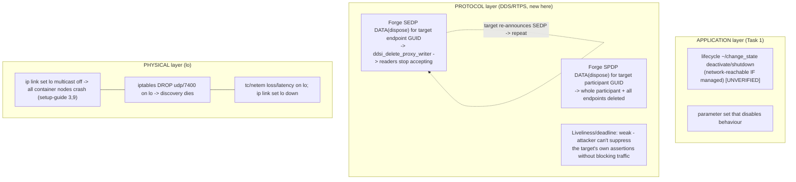

# Task 4 — Alternatives to Shutdown: Disabling an Element at Three Layers

> **Source classes** (as in every report): `[repo]` = a file in this checkout under `src/`,
> cited `path:line`. Cyclone DDS core is in the checkout at `src/cyclonedds/`, so its findings are
> `[repo]`, not vendor guesses. `[spec]` = the OMG DDS / DDSI-RTPS specification (external claim).
> `[UNVERIFIED]` = would need the running sim or a packet capture. `setup-guide §N` = the
> authoritative runtime-configuration record.
>
> This is a **synthesis** report. It draws its application layer from **Task 1**, its discovery and
> forging mechanics from **Task 2** and the **Foundation**, and its QoS reasoning from **Task 5**. It
> re-derives none of them; it cites them and adds one genuinely new trace — the forged endpoint
> withdrawal (SEDP/SPDP dispose) — plus the loopback link-layer kills mapped to a deployment bus.

---

## 1. Objective, scope, and exclusions

**Objective.** Catalogue the ways to disable or silence one core element **other than the clean
shutdown of Task 1**, organised across three explicitly named layers — **protocol** (DDS/RTPS),
**"physical"** (the simulated link, loopback `lo`), and **application** (the clean levers, cross-ref
Task 1). For each method: what it disrupts, whether an external element on domain 0 can perform it,
whether it is reversible, and its observable signature.

**Worked targets.** The two command topics from the Foundation are the concrete victims throughout:
`/system/operation_mode/state` (`autoware_adapi_v1_msgs/msg/OperationModeState`) and
`/control/command/gear_cmd` (`autoware_vehicle_msgs/msg/GearCommand`), both published
`transient_local` (setup-guide §8; Foundation §4.3). "Disabling the element" here means silencing the
node that publishes one of these, or the node that consumes it, so the vehicle stops receiving the
Drive/autonomous command it needs.

**In scope.** Endpoint- and participant-withdrawal forging over SEDP/SPDP; liveliness/deadline as
disable levers; discovery-multicast flooding; link-layer kills on `lo` (`multicast off`, iptables,
tc/netem, link down); the application-layer levers by reference to Task 1.

**Excluded.** The clean shutdown mechanisms themselves (Task 1 owns them; §5.3 here only cross-refs).
Injection of a *valid command* to countermand a node (that is Task 2's attack, not "disabling the
element"). Malformed-RTPS stack-crash exploits are treated at MENTION level only (§4.4), because they
rest on fuzzing the built library, not on a traceable code path in the checkout.

---

## 2. Foundation reuse and new territory

**Reused by reference (not re-derived):**

| Reused | From | Used here for |
|---|---|---|
| Discovery: SPDP/SEDP builtin writer ids, domain-0 ports, `lo` multicast being load-bearing | Foundation §5 | The layer at which withdrawal and link kills act |
| The QoS RxO table (liveliness, deadline rows) | Foundation §4.3 | Why liveliness/deadline are weak external levers |
| Foreign-participant-GUID and late-joiner signatures; forged-RTPS prerequisites | Task 2 §5, §6 | What a protocol-layer forger must first reproduce |
| Reader reorder/HEARTBEAT gating a fresh proxy writer must clear | Task 3 (reorder path) | Why a forged dispose is trivially deliverable |
| Prioritization/ownership unreachable via rclcpp | Task 5 §5, §6 | Why QoS is not a usable disable lever here |
| The four clean shutdown mechanisms and their reachability | Task 1 §4 | The application layer (§5.3) |

**New territory this report opens (traced from source here):**
- `sedp_dispose_unregister_writer` / `_reader` and how a dispose is framed and, on receipt, deletes a
  proxy endpoint **keyed purely on the payload GUID** (`q_ddsi_discovery.c`, `ddsi_proxy_endpoint.c`).
- The SPDP-dead path and its guard `is_proxy_participant_deletion_allowed`, whose behaviour on a
  non-secure build is the crux of whether a forged participant-kill is accepted
  (`ddsi_security_omg.c`, `ddsi_security_omg.h`).
- The link-layer kills on `lo` and their mapping to a deployment automotive bus.

---

## 3. Mechanism overview — three layers, three different forgery costs

**Orientation.** There is a spectrum from "make the middleware believe the element left" (protocol) to
"cut the wire under everyone" (physical) to "ask the element nicely to stop" (application). They differ
in *what an external attacker must forge* and in *who is authorised to act*. The Foundation's
matching gates (topic/type/QoS, §4) decide who *hears* a writer; this report is about the opposite —
making a writer or reader stop being heard at all.


*What to notice:* the protocol layer needs the attacker to forge a small keyed DATA sample but no
control of the link; the physical layer needs control of `lo` (host access) but forges nothing; the
application layer needs a legitimate-looking request the node obeys. Cost and authority rise left to
right in different currencies.

---

## 4. PROTOCOL LEVEL — making the middleware believe the element is gone (DEEP)

### 4.1 The lever: an endpoint withdrawal is an ordinary keyed DATA with a status flag

**Motivation.** The naive expectation is that only a node can retract its own endpoints, or that DDS
authenticates a withdrawal. In plain (non-secure) Cyclone neither holds. An endpoint's "I am gone"
announcement is a normal RTPS DATA submessage on the SEDP builtin writer, distinguished only by a
**status-info** flag, and the receiver acts on the **GUID inside the payload** — not on who sent it.

When a Cyclone node deletes one of its own writers, it calls `sedp_dispose_unregister_writer`, which
routes to `sedp_write_endpoint_impl(sedp_wr, 0 /*alive*/, &wr->e.guid, NULL, NULL, NULL, NULL)`
(`src/cyclonedds/src/core/ddsi/src/q_ddsi_discovery.c:1358-1367`) `[repo]`. The `alive = 0` argument
carries a plist containing only `PP_ENDPOINT_GUID` — the 16-byte GUID of the endpoint being withdrawn
(`q_ddsi_discovery.c:1113-1133`) `[repo]`. That plist is written by `write_and_fini_plist`, which is
the single place the withdrawal becomes distinguishable on the wire:

```c
serdata = ddsi_serdata_from_sample(wr->type, alive ? SDK_DATA : SDK_KEY, ps);
serdata->statusinfo = alive ? 0 : (NN_STATUSINFO_DISPOSE | NN_STATUSINFO_UNREGISTER);
```
(`q_ddsi_discovery.c:520-522`) `[repo]`. So a withdrawal is a `SDK_KEY` sample on the SEDP
publications writer (`NN_ENTITYID_SEDP_BUILTIN_PUBLICATIONS_WRITER = 0x3c2`, Foundation §5) whose
status-info bits are DISPOSE|UNREGISTER and whose key is the target endpoint GUID. The RTPS byte
encoding of the status-info parameter is `[spec]`; that Cyclone *sets* those bits for a withdrawal is
`[repo]` above.

### 4.2 On receipt, deletion is keyed on the payload GUID, with no ownership check

**The trace (≥6 cited steps), following a forged DISPOSE for the `gear_cmd` writer GUID:**

1. **Dispatch by status-info.** The builtin reader hands the sample to `handle_sedp`, which switches on
   `serdata->statusinfo & (NN_STATUSINFO_DISPOSE | NN_STATUSINFO_UNREGISTER)`; a non-zero result for a
   writer routes to `handle_sedp_dead_endpoint(rst, &decoded_data, SEDP_KIND_WRITER, timestamp)`
   (`q_ddsi_discovery.c:1851,1867-1880`) `[repo]`.
2. **Kind sanity only.** `handle_sedp_dead_endpoint` calls `check_sedp_kind_and_guid`, which merely
   confirms the entity id is a *writer* entity id (`ddsi_is_writer_entityid`) — a structural check on
   the GUID's low 4 bytes, **not** an authorisation check (`q_ddsi_discovery.c:1745`;
   `check_sedp_kind_and_guid` at `1480-1493`) `[repo]`.
3. **Delete by payload GUID.** It then calls `ddsi_delete_proxy_writer(gv, &datap->endpoint_guid,
   timestamp, 0)` — the GUID is taken **from the decoded payload**, i.e. from whatever the attacker put
   in the plist (`q_ddsi_discovery.c:1747-1748`) `[repo]`.
4. **Lookup and removal.** `ddsi_delete_proxy_writer` looks the writer up purely by GUID
   (`entidx_lookup_proxy_writer_guid(gv->entity_index, guid)`) and, if found, invalidates the reader
   array and removes it from the entity index
   (`src/cyclonedds/src/core/ddsi/src/ddsi_proxy_endpoint.c:419,430,444`) `[repo]`.
5. **Readers stop accepting.** `local_reader_ary_setinvalid(&pwr->rdary)` (line 430) tells the receive
   path it can no longer trust the cached reader array for that proxy writer; the comment states this
   is precisely so readers stop being fed from it (`ddsi_proxy_endpoint.c:426-430`) `[repo]`.
6. **No source-vs-target check anywhere on this path.** Unlike the *alive* path — where
   `handle_sedp_checks` derives the owning participant from the endpoint GUID prefix and rejects a
   mismatched `PP_PARTICIPANT_GUID` (`q_ddsi_discovery.c:1502-1506`) `[repo]` — the *dead* path performs
   no such derivation and no check that the disposing SEDP writer belongs to the same participant as the
   endpoint being deleted.

**Net effect on the worked target.** If the attacker forges a DISPOSE carrying the GUID of the Autoware
DataWriter for `rt/control/command/gear_cmd` (the mangled name, Foundation §4.1), every peer that had a
proxy writer for it — the AWSIM vehicle-interface reader — deletes that proxy and stops delivering its
samples. The publishing node is untouched and still calls `publish()` successfully (exactly the
"attacker sees success, consumer sees nothing" asymmetry Task 2 §4.3 found for a QoS non-match), but its
`gear_cmd` no longer reaches the vehicle. The element has been silenced without being shut down.

### 4.3 The participant-level kill, and the guard that does not guard here

A cruder protocol kill withdraws the whole *participant*. `spdp_dispose_unregister` writes a
DISPOSE|UNREGISTER on the SPDP builtin writer (`q_ddsi_discovery.c:569-576`) `[repo]`; on receipt,
`handle_spdp_dead` deletes the proxy participant **and all its endpoints** via
`ddsi_delete_proxy_participant_by_guid` — but only after a guard:

```c
if (is_proxy_participant_deletion_allowed(gv, &guid, pwr_entityid))
    ddsi_delete_proxy_participant_by_guid(gv, &guid, timestamp, 0);
```
(`q_ddsi_discovery.c:645-660`) `[repo]`. The guard is where the SPDP path differs from the unguarded
SEDP path — and in this deployment it does not stop the attack:

- **If Cyclone is built without DDS Security** (no `DDS_HAS_SECURITY`), the guard is a stub that
  **unconditionally returns `true`** (`src/cyclonedds/src/core/ddsi/include/dds/ddsi/ddsi_security_omg.h:1183-1186`)
  `[repo]`. A forged SPDP dispose for any participant GUID is accepted.
- **If Cyclone is built with security but the participant is unauthenticated** — which is this stack,
  since the setup-guide `cyclonedds.xml` configures no `Security` element (setup-guide §4) — the full
  implementation returns `!proxypp_is_authenticated(proxypp)`, i.e. **still allows the deletion**, and
  its own comment flags the missing check: *"TODO: Check if the proxy writer guid prefix matches that of
  the proxy participant. Deletion is not allowed when they're not equal."*
  (`src/cyclonedds/src/core/ddsi/src/ddsi_security_omg.c:2052-2068`) `[repo]`.

Either way, the sim's participants (AWSIM and the Autoware container), being unauthenticated, can be
deleted by a forged SPDP dispose. Whether the container's build defines `DDS_HAS_SECURITY` is
`[UNVERIFIED: settled by inspecting the built library]`, but the outcome is the same for an
unauthenticated participant. This is a strictly larger blast radius than the SEDP endpoint dispose: it
removes every writer and reader the target hosts at once.

**What the forger must first reproduce (reused, not re-derived).** A dispose is only *deliverable* if
the attacker's SEDP/SPDP builtin writer is itself an established, in-order reliable source. That means
the attacker must first be discovered as a participant (SPDP, Task 2 §5) and satisfy the reader-side
reorder/HEARTBEAT gating for its builtin writer — which, per Task 3, is trivial for a *fresh* writer
because its sequence numbers start at 1 and its own HEARTBEAT vouches for them. The attacker must also
**know the target's exact endpoint or participant GUID**; it learns this passively from the target's
own SEDP/SPDP announcements (Foundation §5 notes the QoS and GUID are on the wire before any data
sample). So the capability chain is: sniff discovery → learn GUID → emit one keyed DISPOSE.

### 4.4 Liveliness, deadline, and discovery flooding — weaker or vendor-dependent

**Liveliness and deadline are poor external levers here, and it is worth saying why.** The RxO table
(Foundation §4.3) shows liveliness and deadline are *matching* policies; they are not switches an
outsider can flip. Liveliness declares a writer not-alive when *the writer* stops asserting it — an
attacker cannot suppress another node's assertions at the protocol layer without blocking its traffic
(which is the physical layer, §5). Likewise DEADLINE_MISSED fires on the reader when samples *fail to
arrive* on time; an attacker forces it only by blocking the writer, not by sending anything. And the
command writers use the default liveliness (AUTOMATIC, asserted by participant SPDP presence), so there
is no per-writer manual lease to starve. The one indirect path is participant-lease expiry: the default
`lease_duration` is 10 s (`src/cyclonedds/src/core/ddsi/defconfig.c:45`) `[repo]`, maintained by
periodic SPDP; blocking the target's SPDP keepalives (again, a physical-layer act) lets the lease expire
and Cyclone deletes the proxy participant just as a forged SPDP dispose would `[INFERRED: from the lease
default and SPDP keepalive model; exact effective lease and renewal cadence would be confirmed by a
capture]`. **Conclusion: at the protocol layer the real external lever is the forged dispose, not
liveliness/deadline.**

**Discovery-multicast flooding / malformed RTPS (MENTION).** Flooding SPDP on `lo`'s multicast group
(port 7400, Foundation §5) to drown legitimate discovery, or sending malformed RTPS to destabilise the
receive path, is plausible but not a clean traceable path in this checkout; the effect depends on
Cyclone's parser robustness and on OS socket buffering (`SocketReceiveBufferSize min=10MB`,
setup-guide §4). The relevant hard limit is `MaxMessageSize=65500B` plus the IP-fragmentation sysctls
(setup-guide §4) that bound a single datagram. Tag `[UNVERIFIED: would require fuzzing the built
library / a packet capture]`.

---

## 5. "PHYSICAL" LEVEL — cutting the simulated link (`lo`)

**Orientation.** Beneath every DDS gate is one interface: loopback `lo` (setup-guide §0). Anyone with
host access can disable communication under the whole application, forging nothing. This is a
simulation artifact — on the deployment bus the equivalent act requires physical/link control — but on
the sim it is the most reliable kill of all.

### 5.1 The one-command kill the setup guide already documents

`ip link set lo multicast off` removes multicast from `lo`. The setup guide records that this **alone**
crashes every container node with *"selected interface 'lo' is not multicast-capable: disabling
multicast / Failed to find a free participant index for domain 0"* (setup-guide §3, §9). The Foundation
traced why: the SPDP-multicast path is gated on `gv->config.allowMulticast & DDSI_AMC_SPDP`
(`q_ddsi_discovery.c:314`, Foundation §5) `[repo]`, so without multicast on `lo`, participant discovery
never completes and the stack aborts at startup. This is a link-layer kill of the entire container-side
element set with a single command — cited from the guide as observed behaviour, not re-derived here.

### 5.2 Finer-grained link kills

| Method | What it disrupts | External on domain 0? | Reversible? |
|---|---|---|---|
| `ip link set lo multicast off` | All container DDS discovery → every node crashes (setup-guide §3,§9) | No — needs host/link control, not a domain-0 endpoint | Yes: re-enable + relaunch |
| `iptables -A INPUT -i lo -p udp --dport 7400 -j DROP` | Kills SPDP/metatraffic discovery (port 7400, domain 0, Foundation §5); data mcast is 7401 | No — host control | Yes: delete rule |
| `tc qdisc add dev lo ... netem loss/delay` | Degrades *all* `lo` traffic; cannot target one topic | No — host control | Yes: remove qdisc |
| `ip link set lo down` | Kills all loopback traffic, host and container | No — host control | Yes: bring up |

The ports come from the Foundation (§5): domain-0 SPDP/metatraffic multicast is **7400**, user-data
multicast **7401**, unicast **ephemeral** because `ParticipantIndex=none` (setup-guide §2, §4). Because
the unicast ports are ephemeral, a precise port-DROP targets the fixed **7400** discovery rendezvous;
dropping it starves discovery even though established unicast flows might briefly survive `[INFERRED:
from the port model — established endpoints already exchanged unicast locators, but lose liveliness/
retransmission once discovery is cut]`. `tc/netem` and `lo down` are indiscriminate; none of these can
silence *one* element selectively — that selectivity is exactly what the protocol-layer dispose (§4)
buys.

### 5.3 Mapping to the deployment link (important caveat)

On the sim, `lo` is one host interface, so a link kill needs only host access — trivial, and a
**simulation artifact** (the-new-investigation-layer point 3). On the real vehicular network the sim
stands in for, the equivalent is cutting or degrading a segment of automotive Ethernet or a CAN bus.
That requires physical or switch-level control, which the SEU's threat model gives to the *defender* far
more readily than to a compromised ECU: an ECU can flood its own segment but cannot generally drop
another node's link-layer frames without controlling the switch. So the "one-command kill" ease does
**not** transfer to the attacker on the deployment bus, even though the discovery mechanics do.

---

## 6. APPLICATION LEVEL — the clean levers (cross-ref Task 1, new points only)

The application-layer ways to stop an element are the clean paths Task 1 traced in full; this report
does not re-derive them. In brief, and only what is new for the "disable" framing:

- **Lifecycle deactivate/shutdown over the network.** If Autoware Core nodes are `LifecycleNode`s, the
  `~/change_state` service is reachable from any domain-0 client and its default service QoS (RELIABLE +
  VOLATILE) imposes no durability barrier on an external client (Task 1 §4.3). This is the *only*
  network-reachable **clean** disable, and it is authoritative — the node transitions itself to
  inactive and stops publishing. Whether the core actually uses lifecycle nodes is `[UNVERIFIED]` (node
  sources absent from the checkout), carried from Task 1.
- **Parameter change.** A parameter that gates a behaviour can be set via the node's parameter services
  (Task 1 §3), disabling the behaviour without stopping the node. New point for Task 4: unlike the
  protocol dispose, this leaves the endpoint present in discovery, so it is invisible to a
  discovery-watching detector — it only shows as a parameter-event on `/parameter_events`.
- **A command the node obeys.** For the two worked topics, publishing a countermanding
  `OperationModeState{mode: 1 /*stop*/}` or `GearCommand{command: 1 /*neutral/park-ish*/}` makes the
  vehicle stop — but that is Task 2's *injection* attack (it requires the `transient_local` offer and a
  matched writer), not a disabling of the element, so it belongs to Task 2, noted here only to keep the
  boundary clear.

---

## 7. SEU implications

Every method below is dual-use: an **enforcement action** the SEU can take against a compromised
element, and an **attack** against a legitimate one. The asymmetry the SEU exploits is that **it is
authorised and can act at a trusted layer, whereas the attacker must forge at an untrusted one.**

**Protocol layer (forged dispose) — the sharpest attacker tool, and the SEU's clearest signature.** The
finding that `ddsi_delete_proxy_writer` acts on the payload GUID with no ownership check
(`ddsi_proxy_endpoint.c:419-444`) `[repo]`, and that the participant-deletion guard degenerates to
`true`/`!authenticated` on this non-secure stack
(`ddsi_security_omg.h:1183-1186`; `ddsi_security_omg.c:2052-2068`) `[repo]`, means an unauthenticated
attacker on the bus can silence any element it can name. **Signatures the SEU can watch:** (1) a
SEDP/SPDP DATA with status-info DISPOSE|UNREGISTER whose *source* participant GUID prefix differs from
the *endpoint/participant GUID prefix being disposed* — the exact mismatch the code's own TODO says it
fails to check, so the SEU can enforce the check the middleware omits; (2) a dispose for an endpoint that
promptly reappears (the target re-announces), i.e. dispose/re-announce flapping; (3) any dispose whose
source is the foreign participant GUID already flagged by Task 2. The defensive lever is symmetric: the
SEU, if it holds a trusted participant, could itself emit a dispose to evict a *compromised* element —
and unlike the attacker it can do so from an authenticated participant where the guard is meant to pass.
**The decisive mitigation is DDS Security** (authentication), which flips
`is_proxy_participant_deletion_allowed` to reject unauthenticated disposes — the SEU's strongest
recommendation for the deployment build.

**Physical layer — reliable but coarse, and the SEU's home turf.** On the sim, the link kills (§5) are a
host-access artifact. On the deployment bus, the *defender* is best positioned here: an inline SEU on
automotive Ethernet can drop or rate-limit a compromised ECU's frames at the switch — a clean,
authoritative, per-source enforcement the attacker cannot match without switch control. The attacker's
physical options are largely limited to flooding its own segment (a rate anomaly the SEU already
detects, Task 3). So the SEU's best-positioned enforcement layer on the real network is the link, and
its best *detection* layer is the protocol dispose signature above.

**Application layer — clean but conditional.** The lifecycle/parameter levers are the *authorised*
disables, but they are only network-reachable if the core exposes them (lifecycle services
`[UNVERIFIED]`) and they carry their own signatures (a `ChangeState` request or a `/parameter_events`
entry from a foreign GUID). The SEU should treat an unexpected `~/change_state deactivate` or parameter
write from a non-sim participant as hostile for the same reason a dispose is: legitimate transitions
originate from the trusted orchestration, not from a late-joining domain-0 stranger.

**Realism caveat (study-wide).** The loopback co-location makes all three layers trivially reachable in
the sim. On the deployment network the ordering inverts by actor: the *attacker's* easiest layer is the
protocol dispose (forgeable from any bus foothold), while the *SEU's* strongest layer is the physical
link (authoritative, inline, per-source). The protocol dispose is therefore the method the SEU must
detect, and the link is the method it should enforce with.

---

## 8. Appendix — files opened, tags, confidence

**Files opened for this report (new territory; all `[repo]`):**
- `src/cyclonedds/src/core/ddsi/src/q_ddsi_discovery.c` (dispose write + receive/dead paths,
  `write_and_fini_plist`, `handle_sedp`, `handle_sedp_dead_endpoint`, `handle_spdp_dead`,
  `check_sedp_kind_and_guid`, `handle_sedp_checks`)
- `src/cyclonedds/src/core/ddsi/src/ddsi_proxy_endpoint.c` (`ddsi_delete_proxy_writer`)
- `src/cyclonedds/src/core/ddsi/src/ddsi_proxy_participant.c` (delete-by-guid entry points)
- `src/cyclonedds/src/core/ddsi/src/ddsi_security_omg.c` (`is_proxy_participant_deletion_allowed` impl)
- `src/cyclonedds/src/core/ddsi/include/dds/ddsi/ddsi_security_omg.h` (non-secure stub)
- `src/cyclonedds/src/core/ddsi/defconfig.c` (default `lease_duration`)

**Reused by reference (not re-opened):** Foundation §4.3, §5; Task 1 §3, §4; Task 2 §5, §6; Task 3
(reorder/HEARTBEAT gating); Task 5 §5, §6; setup-guide §0, §2, §3, §4, §8, §9.

**`[INFERRED]` / `[UNVERIFIED]` items and what would settle them:**
- `[UNVERIFIED]` Whether the container's Cyclone defines `DDS_HAS_SECURITY` — decides which branch of
  the deletion guard runs, though both allow deleting an unauthenticated participant (§4.3). Settled by
  inspecting the built library.
- `[UNVERIFIED]` Reversibility timing: whether/when a disposed target re-announces SEDP and re-creates
  the proxy endpoint, so silence must be repeated. Settled by a capture; the attacker can repeat the
  dispose regardless.
- `[INFERRED]` Participant-lease expiry (10 s default) as an indirect kill when SPDP keepalives are
  blocked (§4.4); exact effective lease and renewal cadence need a capture.
- `[INFERRED]` A port-7400 DROP starves discovery while established unicast flows briefly survive (§5.2).
- `[UNVERIFIED]` Discovery-flood / malformed-RTPS destabilisation (§4.4) — needs fuzzing the built
  library.
- `[spec]` The RTPS byte layout of the status-info parameter that carries DISPOSE|UNREGISTER; Cyclone
  *setting* those bits is `[repo]` (§4.1).

**Per-section confidence:**

| Section | Confidence | Reason |
|---|---|---|
| §4.1–4.2 SEDP endpoint dispose | HIGH | Write path, status-info flag, receive dispatch, and GUID-keyed deletion all read from in-checkout Cyclone source; the missing ownership check is confirmed by absence on the dead path vs. presence on the alive path. |
| §4.3 SPDP participant dispose + guard | HIGH | Guard stub and security-build impl both read directly; the TODO comment is quoted from source. Which build compiles is `[UNVERIFIED]` but does not change the unauthenticated outcome. |
| §4.4 Liveliness/deadline/flood | MEDIUM | The negative finding (weak external levers) is reasoned from the RxO model and lease default; the flood/malformed sub-point is irreducibly `[UNVERIFIED]`. |
| §5 Physical layer | HIGH (sim) / MEDIUM (deployment) | The `lo` multicast-off kill is documented in the guide and grounded in the SPDP-multicast gate; ports from Foundation §5. Deployment mapping is reasoned, not measured. |
| §6 Application layer | MEDIUM | Cross-referenced from Task 1; the lifecycle reachability it rests on is `[UNVERIFIED]`. |

<!-- REPORT-COMPLETE -->
