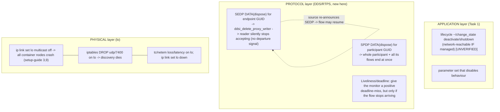

# Task 4 — Silent Freshness Loss and Safe-Stop Actuation: Halting a Data Flow at Three Layers

> **Read the [shared foundation](foundation.md) first.** Source classes are the foundation's: `[repo]` =
> a file in this checkout under `src/`, cited `path:line`. Cyclone DDS core is in the checkout at
> `src/cyclonedds/`, so its findings are `[repo]`, not vendor guesses. `[spec]` = the OMG DDS / DDSI-RTPS
> specification (external claim). `[UNVERIFIED]` = would need the running sim or a packet capture.
> `[INFERRED]` = derived from mechanism, not measured. `[LSEU-abstract]` = a claim/number/definition from
> the (unpublished) SEU abstract, never something this static study measured. `setup-guide §N` = the
> authoritative runtime-configuration record.
>
> **What this report is for.** The SEU is a *safety* monitor: it derives temporal/freshness constraints
> from data dependencies, formalizes them as STL properties, evaluates system traces, and executes a
> **preemptive safe-stop** when a critical property is violated (foundation §0; `[LSEU-abstract]`). This
> report serves that purpose from two sides. **(a) Silent freshness loss — the hardest case for the
> monitor.** Each of the three layers below is a way a data flow can *stop being fresh with no clean
> shutdown signal*: the publisher never announces it left, so the reader is not told the samples are gone
> — the monitor has to infer staleness from the absence of arrivals, not from any positive event. **(b)
> Safe-stop actuation — how the SEU could halt a flow.** The very same mechanisms are candidate
> *actuators*: once the monitor decides to safe-stop, it must actually stop a runaway or unsafe data flow,
> and these three layers are where that halt can be applied.
>
> This is a **synthesis** report. It draws its application layer from **Task 1**, its discovery and
> injection mechanics from **Task 2** and the **Foundation**, and its QoS reasoning from **Task 5**. It
> re-derives none of them; it cites them and adds one genuinely new trace — the endpoint/participant
> withdrawal (SEDP/SPDP dispose) — plus the loopback link-layer halts mapped to a deployment bus.

---

## 1. Objective, scope, and exclusions

**Objective.** Catalogue the ways a data flow can be halted or made to go silent **other than the clean
shutdown of Task 1**, organised across three explicitly named layers — **protocol** (DDS/RTPS),
**"physical"** (the simulated link, loopback `lo`), and **application** (the clean levers, cross-ref
Task 1). For each method: what freshness it destroys, whether it happens *without a clean shutdown
signal* (so a reader is never told the flow is gone), whether an actor at that layer could deliberately
apply it as a safe-stop, whether it is reversible, and what a trace monitor can observe. This is the
Task-4 fault class: **freshness lost silently** — the case where a source stops reaching a consumer but
nothing on the wire announces the departure, which is the hardest condition for a freshness monitor to
distinguish from a merely quiet-but-healthy link.

**Worked targets.** The two command topics from the Foundation are the concrete flows throughout:
`/system/operation_mode/state` (`autoware_adapi_v1_msgs/msg/OperationModeState`) and
`/control/command/gear_cmd` (`autoware_vehicle_msgs/msg/GearCommand`), both published
`transient_local` (setup-guide §8; Foundation §4.3). "Halting the flow" here means the node that
publishes one of these, or the node that consumes it, stops exchanging fresh samples — so the vehicle
stops receiving the up-to-date Drive/autonomous command it depends on for actuation.

**In scope.** Endpoint- and participant-withdrawal via SEDP/SPDP dispose; liveliness/deadline as halt
mechanisms; discovery-multicast flooding; link-layer halts on `lo` (`multicast off`, iptables,
tc/netem, link down); the application-layer clean stops by reference to Task 1.

**Excluded.** The clean shutdown mechanisms themselves (Task 1 owns them; §5.3 here only cross-refs) —
and note that a *clean* shutdown is explicitly **not** the Task-4 case, because it emits a withdrawal
signal the monitor can key on. Injection of a *valid* countermanding command is Task 2's fault-injection
harness, not a halt of the flow. Malformed-RTPS stack-crash behaviour is treated at MENTION level only
(§4.4), because it rests on fuzzing the built library, not on a traceable code path in the checkout.

---

## 2. Foundation reuse and new territory

**Reused by reference (not re-derived):**

| Reused | From | Used here for |
|---|---|---|
| Discovery: SPDP/SEDP builtin writer ids, domain-0 ports, `lo` multicast being load-bearing | Foundation §5 | The layer at which withdrawal and link halts act |
| The QoS RxO table (liveliness, deadline rows) | Foundation §4.3 | Why liveliness/deadline give the monitor no positive departure signal |
| Foreign-participant-GUID and late-joiner signatures; injection prerequisites | Task 2 §5, §6 | What a protocol-layer dispose must first establish to be deliverable |
| Reader reorder/HEARTBEAT gating a fresh proxy writer must clear | Task 3 (reorder path) | Why a dispose is trivially deliverable |
| Prioritization/ownership unreachable via rclcpp | Task 5 §5, §6 | Why QoS is not a usable halt mechanism here |
| The four clean shutdown mechanisms and their reachability | Task 1 §4 | The application layer (§5.3) — the one path that *does* signal departure |

**New territory this report opens (traced from source here):**
- `sedp_dispose_unregister_writer` / `_reader` and how a dispose is framed and, on receipt, deletes a
  proxy endpoint **keyed purely on the payload GUID** (`q_ddsi_discovery.c`, `ddsi_proxy_endpoint.c`) —
  the mechanism that, from the reader's side, silently ends a flow.
- The SPDP-dead path and its guard `is_proxy_participant_deletion_allowed`, whose behaviour on a
  non-secure build determines whether a whole participant's flows can be halted at once
  (`ddsi_security_omg.c`, `ddsi_security_omg.h`).
- The link-layer halts on `lo` and their mapping to a deployment automotive bus.

---

## 3. Mechanism overview — three layers, three ways freshness ends

**Orientation.** There is a spectrum from "make the middleware believe the element left" (protocol) to
"cut the wire under everyone" (physical) to "ask the element to stop cleanly" (application). For a
freshness monitor the salient difference is **how much departure signal each one leaves**. The
application path (Task 1) is the *easy* case: it emits a clean withdrawal the monitor can key on. The
other two are the Task-4 hard case: a proxy endpoint is deleted or a link goes dark, and the consuming
reader simply stops receiving fresh samples with nothing on the wire announcing why. The Foundation's
matching gates (topic/type/QoS, §4) decide who *hears* a writer; this report is about the opposite —
a flow that *was* being heard going silent, and whether the monitor can tell.


*What to notice, for the monitor:* the protocol dispose ends the flow at the reader with **no positive
departure event** (the reader's cached proxy is invalidated silently — §4.2); the physical halts stop
arrivals wholesale with no signal either; only liveliness/deadline (§4.4) and the application clean stop
(§6) produce a positive event the monitor could observe directly. That is exactly why the protocol and
physical layers are the hard freshness case — the monitor is left inferring staleness from *silence*.
Read the other way, the same three layers are the candidate **actuators** for a safe-stop: a trusted
participant could emit a dispose (protocol), an inline SEU could gate the link (physical), or an
orchestrator could command a clean stop (application).

---

## 4. PROTOCOL LEVEL — a flow ended at the reader with no departure signal (DEEP)

### 4.1 The mechanism: an endpoint withdrawal is an ordinary keyed DATA with a status flag

**Motivation (freshness angle).** For a freshness monitor, the worst case is a flow that stops being
fresh *without any observable event marking the stop* — the monitor cannot distinguish "the source is
gone" from "the source is momentarily quiet but healthy" except by watching the clock run out. The SEDP
dispose is the canonical producer of that case: it deletes the reader's proxy for a writer, so the reader
silently stops accepting that writer's samples, yet the disposing message is *not* seen by the
application at all — it is consumed inside discovery. A second reason it matters: DDS does not
authenticate a withdrawal, and the receiver acts on the **GUID inside the payload**, not on who sent it —
so on a non-secure build the departure can be triggered by any participant, which is why the same
mechanism doubles as a candidate safe-stop actuator (§7) and, demoted, as an adversarial hazard. An
endpoint's "I am gone" announcement is a normal RTPS DATA submessage on the SEDP builtin writer,
distinguished only by a **status-info** flag.

When a Cyclone node deletes one of its own writers, it calls `sedp_dispose_unregister_writer`, which
routes to `sedp_write_endpoint_impl(sedp_wr, 0 /*alive*/, &wr->e.guid, NULL, NULL, NULL, NULL)`
(`src/cyclonedds/src/core/ddsi/src/q_ddsi_discovery.c:1358-1367`) `[repo]`. The `alive = 0` argument
carries a plist containing only `PP_ENDPOINT_GUID` — the 16-byte GUID of the endpoint being withdrawn
(`q_ddsi_discovery.c:1113-1133`) `[repo]`. That plist is written by `write_and_fini_plist`, which is
the single place the withdrawal becomes distinguishable on the wire:

```c
serdata = ddsi_serdata_from_sample(wr->type, alive ? SDK_DATA : SDK_KEY, ps);
serdata->statusinfo = alive ? 0 : (NN_STATUSINFO_DISPOSE | NN_STATUSINFO_UNREGISTER);
```
(`q_ddsi_discovery.c:520-522`) `[repo]`. So a withdrawal is a `SDK_KEY` sample on the SEDP
publications writer (`NN_ENTITYID_SEDP_BUILTIN_PUBLICATIONS_WRITER = 0x3c2`, Foundation §5) whose
status-info bits are DISPOSE|UNREGISTER and whose key is the target endpoint GUID. The RTPS byte
encoding of the status-info parameter is `[spec]`; that Cyclone *sets* those bits for a withdrawal is
`[repo]` above.

### 4.2 On receipt, deletion is keyed on the payload GUID, with no ownership check

**The trace (≥6 cited steps), following a DISPOSE carrying the `gear_cmd` writer GUID:**

1. **Dispatch by status-info.** The builtin reader hands the sample to `handle_sedp`, which switches on
   `serdata->statusinfo & (NN_STATUSINFO_DISPOSE | NN_STATUSINFO_UNREGISTER)`; a non-zero result for a
   writer routes to `handle_sedp_dead_endpoint(rst, &decoded_data, SEDP_KIND_WRITER, timestamp)`
   (`q_ddsi_discovery.c:1851,1867-1880`) `[repo]`.
2. **Kind sanity only.** `handle_sedp_dead_endpoint` calls `check_sedp_kind_and_guid`, which merely
   confirms the entity id is a *writer* entity id (`ddsi_is_writer_entityid`) — a structural check on
   the GUID's low 4 bytes, **not** an authorisation check (`q_ddsi_discovery.c:1745`;
   `check_sedp_kind_and_guid` at `1480-1493`) `[repo]`.
3. **Delete by payload GUID.** It then calls `ddsi_delete_proxy_writer(gv, &datap->endpoint_guid,
   timestamp, 0)` — the GUID is taken **from the decoded payload**, i.e. from whatever GUID the disposing
   sample carried in the plist (`q_ddsi_discovery.c:1747-1748`) `[repo]`.
4. **Lookup and removal.** `ddsi_delete_proxy_writer` looks the writer up purely by GUID
   (`entidx_lookup_proxy_writer_guid(gv->entity_index, guid)`) and, if found, invalidates the reader
   array and removes it from the entity index
   (`src/cyclonedds/src/core/ddsi/src/ddsi_proxy_endpoint.c:419,430,444`) `[repo]`.
5. **Readers stop accepting.** `local_reader_ary_setinvalid(&pwr->rdary)` (line 430) tells the receive
   path it can no longer trust the cached reader array for that proxy writer; the comment states this
   is precisely so readers stop being fed from it (`ddsi_proxy_endpoint.c:426-430`) `[repo]`.
6. **No source-vs-target check anywhere on this path.** Unlike the *alive* path — where
   `handle_sedp_checks` derives the owning participant from the endpoint GUID prefix and rejects a
   mismatched `PP_PARTICIPANT_GUID` (`q_ddsi_discovery.c:1502-1506`) `[repo]` — the *dead* path performs
   no such derivation and no check that the disposing SEDP writer belongs to the same participant as the
   endpoint being deleted.

**Net effect on the worked flow — freshness ends invisibly.** A DISPOSE carrying the GUID of the
Autoware DataWriter for `rt/control/command/gear_cmd` (the mangled name, Foundation §4.1) makes every
peer that had a proxy writer for it — the AWSIM vehicle-interface reader — delete that proxy and stop
delivering its samples. Two facts make this the hard freshness case. First, the publishing node is
untouched and still calls `publish()` successfully (the same "publisher sees success, consumer sees
nothing" asymmetry Task 2 §4.3 found for a QoS non-match), so `gear_cmd` simply stops reaching the
vehicle with no error surfaced anywhere. Second, the *reader* is given **no departure event the
application layer can see** — the proxy is invalidated inside discovery (step 5), not delivered as a
sample — so from the monitor's vantage the flow just goes quiet. The freshness of `gear_cmd` decays past
its bound while every layer above ddsi believes the link is merely idle.

### 4.3 The participant-level halt, and the guard that does not guard here

A coarser protocol halt withdraws the whole *participant*, ending **all** of its flows at once — the
largest silent-freshness blast radius. `spdp_dispose_unregister` writes a DISPOSE|UNREGISTER on the SPDP
builtin writer (`q_ddsi_discovery.c:569-576`) `[repo]`; on receipt, `handle_spdp_dead` deletes the proxy
participant **and all its endpoints** via `ddsi_delete_proxy_participant_by_guid` — but only after a
guard:

```c
if (is_proxy_participant_deletion_allowed(gv, &guid, pwr_entityid))
    ddsi_delete_proxy_participant_by_guid(gv, &guid, timestamp, 0);
```
(`q_ddsi_discovery.c:645-660`) `[repo]`. The guard is where the SPDP path differs from the unguarded
SEDP path — and in this deployment it does not gate the deletion at all:

- **If Cyclone is built without DDS Security** (no `DDS_HAS_SECURITY`), the guard is a stub that
  **unconditionally returns `true`** (`src/cyclonedds/src/core/ddsi/include/dds/ddsi/ddsi_security_omg.h:1183-1186`)
  `[repo]`. An SPDP dispose for any participant GUID is accepted, whatever its source.
- **If Cyclone is built with security but the participant is unauthenticated** — which is this stack,
  since the setup-guide `cyclonedds.xml` configures no `Security` element (setup-guide §4) — the full
  implementation returns `!proxypp_is_authenticated(proxypp)`, i.e. **still allows the deletion**, and
  its own comment flags the missing check: *"TODO: Check if the proxy writer guid prefix matches that of
  the proxy participant. Deletion is not allowed when they're not equal."*
  (`src/cyclonedds/src/core/ddsi/src/ddsi_security_omg.c:2052-2068`) `[repo]`.

Either way, the sim's participants (AWSIM and the Autoware container), being unauthenticated, can be
deleted by an SPDP dispose regardless of its origin. Whether the container's build defines
`DDS_HAS_SECURITY` is `[UNVERIFIED: settled by inspecting the built library]`, but the outcome is the
same for an unauthenticated participant. This is a strictly larger blast radius than the SEDP endpoint
dispose: it removes every writer and reader the target hosts at once — every flow the monitor was
tracking for that participant goes silent simultaneously, again with no per-flow departure event.

**What a dispose must first establish to be deliverable (reused, not re-derived).** A dispose is only
*deliverable* if the disposing SEDP/SPDP builtin writer is itself an established, in-order reliable
source. That means the emitter must first be discovered as a participant (SPDP, Task 2 §5) and satisfy
the reader-side reorder/HEARTBEAT gating for its builtin writer — which, per Task 3, is trivial for a
*fresh* writer because its sequence numbers start at 1 and its own HEARTBEAT vouches for them. The
emitter must also **know the target's exact endpoint or participant GUID**; that GUID is on the wire in
the target's own SEDP/SPDP announcements (Foundation §5 notes the QoS and GUID precede any data sample).
This is the capability chain a safe-stop actuator would follow deliberately — and, demoted to a footnote
(§7), the same chain an adversarial element could follow: observe discovery → learn GUID → emit one keyed
DISPOSE.

### 4.4 Liveliness, deadline, and discovery flooding — the layer's *positive* freshness signals

**Liveliness and deadline are not halt mechanisms — they are the monitor's built-in freshness
detectors, and that is exactly why they matter here.** The RxO table (Foundation §4.3) shows liveliness
and deadline are *matching* policies, not switches anyone flips to stop a flow. But the Task-4 question
is not only "how does a flow stop" — it is "what does the monitor get to observe when it does." These two
policies are the one place the protocol layer hands the reader a **positive event** on freshness loss:
- **DEADLINE_MISSED** fires *on the reader* when samples fail to arrive within the deadline period —
  i.e. it converts silent staleness into an observable callback. This is precisely the signal a freshness
  property wants, *if* a finite deadline is configured; with the default (infinite) deadline the reader
  gets nothing and staleness stays silent (Foundation §4.3).
- **Liveliness** declares a writer not-alive when *the writer* stops asserting it. The command writers
  use the default liveliness (AUTOMATIC, asserted by participant SPDP presence), so there is no
  per-writer manual lease; liveliness loss tracks participant presence, not per-flow freshness.
The one indirect halt-and-signal path is participant-lease expiry: the default `lease_duration` is 10 s
(`src/cyclonedds/src/core/ddsi/defconfig.c:45`) `[repo]`, maintained by periodic SPDP; if the target's
SPDP keepalives stop (e.g. because a physical-layer halt, §5, cut them), the lease expires and Cyclone
deletes the proxy participant just as an SPDP dispose would, but *with* a ~10 s-bounded detection latency
the monitor can rely on `[INFERRED: from the lease default and SPDP keepalive model; exact effective
lease and renewal cadence would be confirmed by a capture]`. **Conclusion for the monitor: a dispose (§4.1–4.3)
ends a flow with no signal; liveliness/deadline are the fallback that turn *some* silent losses back into
observable events — so whether a finite DEADLINE is configured on the command readers is a first-order
question for the freshness monitor (§7).**

**Discovery-multicast flooding / malformed RTPS (MENTION).** Flooding SPDP on `lo`'s multicast group
(port 7400, Foundation §5) to drown legitimate discovery, or sending malformed RTPS to destabilise the
receive path, would also silence flows, but it is not a clean traceable path in this checkout; the effect
depends on Cyclone's parser robustness and on OS socket buffering (`SocketReceiveBufferSize min=10MB`,
setup-guide §4). The relevant hard limit is `MaxMessageSize=65500B` plus the IP-fragmentation sysctls
(setup-guide §4) that bound a single datagram. Tag `[UNVERIFIED: would require fuzzing the built
library / a packet capture]`.

---

## 5. "PHYSICAL" LEVEL — cutting the simulated link (`lo`)

**Orientation.** Beneath every DDS gate is one interface: loopback `lo` (setup-guide §0). Halting it
ends every flow under the whole application at once, with **no departure signal whatsoever** — the
coarsest silent-freshness case there is. Read as an actuator, it is also the most *reliable* halt: an
inline SEU that controls the link can guarantee a flow stops, which is why the physical layer is the
natural home for enforced safe-stop on the deployment bus (§5.3). This is partly a simulation artifact —
on the sim `lo` is one host interface, whereas on the deployment bus the equivalent requires
physical/link control — but the mechanics carry over.

### 5.1 The one-command halt the setup guide already documents

`ip link set lo multicast off` removes multicast from `lo`. The setup guide records that this **alone**
crashes every container node with *"selected interface 'lo' is not multicast-capable: disabling
multicast / Failed to find a free participant index for domain 0"* (setup-guide §3, §9). The Foundation
traced why: the SPDP-multicast path is gated on `gv->config.allowMulticast & DDSI_AMC_SPDP`
(`q_ddsi_discovery.c:314`, Foundation §5) `[repo]`, so without multicast on `lo`, participant discovery
never completes and the stack aborts at startup. This is a link-layer halt of the entire container-side
flow set with a single command — cited from the guide as observed behaviour, not re-derived here. As a
safe-stop actuator it is decisive but wholly indiscriminate: it stops *every* flow, not the one the
monitor flagged.

### 5.2 Finer-grained link halts

| Method | What it disrupts | Signals departure to a reader? | Selective? | Reversible? |
|---|---|---|---|---|
| `ip link set lo multicast off` | All container DDS discovery → every node crashes (setup-guide §3,§9) | No — nodes crash, no per-flow event | No | Yes: re-enable + relaunch |
| `iptables -A INPUT -i lo -p udp --dport 7400 -j DROP` | Kills SPDP/metatraffic discovery (port 7400, domain 0, Foundation §5); data mcast is 7401 | Only via lease/liveliness timeout (§4.4) | No | Yes: delete rule |
| `tc qdisc add dev lo ... netem loss/delay` | Degrades *all* `lo` traffic; cannot target one topic | No — silent latency/loss | No | Yes: remove qdisc |
| `ip link set lo down` | Kills all loopback traffic, host and container | No — silent | No | Yes: bring up |

The ports come from the Foundation (§5): domain-0 SPDP/metatraffic multicast is **7400**, user-data
multicast **7401**, unicast **ephemeral** because `ParticipantIndex=none` (setup-guide §2, §4). Because
the unicast ports are ephemeral, a precise port-DROP targets the fixed **7400** discovery rendezvous;
dropping it starves discovery even though established unicast flows might briefly survive `[INFERRED:
from the port model — established endpoints already exchanged unicast locators, but lose liveliness/
retransmission once discovery is cut]`. **For the monitor, the key column is the middle one:** every
physical halt is *silent* except where it eventually trips the lease/liveliness timeout (§4.4) — so the
monitor cannot rely on a positive event and must fall back on its own freshness clock. **For a safe-stop
actuator, the key column is selectivity:** none of these can stop *one* flow — that per-flow selectivity
is exactly what the protocol-layer dispose (§4) buys, and why the two layers are complementary actuators.

### 5.3 Mapping to the deployment link — where enforced safe-stop lives

On the sim, `lo` is one host interface, so a link halt needs only host access — trivial, and a
**simulation artifact**. On the real vehicular network the sim stands in for, the equivalent is cutting
or degrading a segment of automotive Ethernet or a CAN bus, which requires physical or switch-level
control. This is precisely why the physical layer is the SEU's natural **safe-stop actuation** point:
an inline SEU sitting on the automotive-Ethernet segment holds link-level control that an ordinary ECU
does not, so it can authoritatively halt (or rate-limit) a flow it has judged unsafe — a clean,
per-source actuation the STL monitor can invoke once a critical property is violated. An ordinary node,
by contrast, can flood its own segment but cannot generally drop another node's frames without the
switch. So the "one-command halt" ease transfers to the *inline SEU* on the deployment bus, not to an
arbitrary participant — the discovery mechanics carry over, the physical authority does not.

---

## 6. APPLICATION LEVEL — the clean stops that *do* signal departure (cross-ref Task 1)

The application-layer ways to stop a flow are the clean paths Task 1 traced in full; this report does
not re-derive them. Their significance for Task 4 is the mirror image of §4–§5: **these are the halts
that leave a positive event**, so they are the *easy* case for the monitor and the *cleanest* safe-stop
actuator. In brief, and only what is new for the freshness/actuation framing:

- **Lifecycle deactivate/shutdown over the network.** If Autoware Core nodes are `LifecycleNode`s, the
  `~/change_state` service is reachable from any domain-0 client and its default service QoS (RELIABLE +
  VOLATILE) imposes no durability barrier on a client (Task 1 §4.3). This is the *only* network-reachable
  **clean** stop, and it is authoritative — the node transitions itself to inactive and, crucially, its
  endpoints are withdrawn via the *normal* SEDP path with the owning participant intact, so a reader sees
  an orderly departure rather than the silent proxy-invalidation of §4.2. That makes it the ideal
  safe-stop actuator *when it exists*. Whether the core actually uses lifecycle nodes is `[UNVERIFIED]`
  (node sources absent from the checkout), carried from Task 1.
- **Parameter change.** A parameter that gates a behaviour can be set via the node's parameter services
  (Task 1 §3), stopping the behaviour without stopping the node. New point for Task 4: unlike a dispose,
  this leaves the endpoint present in discovery, so the flow can go silent while the endpoint still looks
  alive — a *second* silent-freshness case at the application layer, observable only as a parameter-event
  on `/parameter_events`, not as any change the freshness monitor sees on the data topic itself.
- **A countermanding command.** For the two worked topics, publishing
  `OperationModeState{mode: 1 /*stop*/}` or `GearCommand{command: 1 /*neutral/park-ish*/}` makes the
  vehicle stop — but that is Task 2's *fault-injection* path (it requires the `transient_local` offer and
  a matched writer) and it does not halt the *flow* (fresh samples still arrive), so it belongs to Task 2,
  noted here only to keep the boundary clear.

---

## 7. What Task 4 hands the STL monitor

**This report supplies the silent-freshness-loss property and the safe-stop *actuation* map.** Its
two contributions to the monitor are: (a) the recognition that the protocol dispose (§4) and the physical
halt (§5) end a flow with **no positive departure event**, so the freshness property must be evaluated
against the monitor's own clock rather than any DDS-delivered signal; and (b) the mapping of the three
layers to concrete actuators the SEU can use once it decides to safe-stop. The closing block below is the
standard three parts — the property, the trace event, and the safe-stop decision — each drawn from the
mechanism above.

**1. THE PROPERTY.** Silent departure violates a **freshness** bound, and its detection latency is set by
whatever positive signal (if any) the layer provides. Written STL-shaped over the two command topics
(age measured against sim time, `/clock`, foundation §0):

- Freshness (the core Task-4 property): `G( age(rt/control/command/gear_cmd) ≤ Δ_fresh )` — a dispose
  (§4.2), a participant kill (§4.3), or a link halt (§5) drives `age` past `Δ_fresh` with no event
  marking the moment; the same holds for `rt/system/operation_mode/state`.
- Liveness with a bounded detector (§4.4): where a finite DEADLINE is configured,
  `G( miss_deadline(topic) → F_[0,Δ_detect] safe_stop )`, with `Δ_detect` the deadline period; where the
  only backstop is participant-lease expiry, `Δ_detect ≈ lease_duration = 10 s`
  (`defconfig.c:45`) `[repo]`.

`Δ_fresh` is a control-layer bound tied to the ~90–100 Hz `/clock` and actuation cadence (setup-guide
§6d) and is `[INFERRED]`; the code fixes the *mechanism* and the 10 s lease default, not the exact
freshness bound.

**2. THE TRACE EVENT.** The event-driven monitor cannot rely on a departure sample, because §4.2 showed
the reader is given none — so the observable is the **absence** of the next expected sample. Concretely,
**per (topic, writer) the monitor tracks the arrival timestamp of the last delivered sample** (the same
`(GUID, seq, arrival-timestamp)` triple Task 3 §7 keys on) and fires when `now − last_arrival` exceeds
the freshness/deadline bound. Two positive events, where available, shorten detection: a
**DEADLINE_MISSED** callback at the rmw/reader layer (§4.4) if a finite deadline is set, and a
**liveliness/participant-lease-expiry** event (~10 s, §4.4) that fires when SPDP keepalives stop. A
dispose itself is *not* observable above ddsi (§4.2); a monitor that wanted to see it would have to tap
the SEDP/SPDP builtin-reader stream directly and watch for a status-info DISPOSE|UNREGISTER — an option,
but one that only helps for the protocol-layer case, not the physical one.

**3. THE SAFE-STOP DECISION.** A freshness violation on `/control/command/gear_cmd` or
`/system/operation_mode/state` is **critical** and its expected verdict is a **preemptive safe-stop**:
these topics drive actuation, and a vehicle acting on a command whose age has passed `Δ_fresh` — with the
`transient_local` last-sample still latched as if current (foundation §0; the latched sample makes a dead
publisher look alive, Task 1) — is the exact hazard the SEU exists to prevent. The mechanism sharpens the
decision in two ways. First, **the monitor must not wait for a DDS signal that never comes**: because the
dispose and the link halt are silent (§4.2, §5.2), the safe-stop must be driven by the monitor's own
`age > Δ_fresh` clock, with DEADLINE_MISSED/lease-expiry treated only as *early* corroboration, not as a
prerequisite. Second, **Task 4 is also where the safe-stop is actuated**: once the monitor decides to
halt an unsafe flow, the same three layers are its instruments — a clean lifecycle `~/change_state`
(§6, the orderly path, when lifecycle nodes exist), a per-flow SEDP dispose from a trusted participant
(§4, selective but silent to other readers), or an inline link-level gate (§5.3, authoritative and
coarse). The layer chosen trades selectivity (protocol) against authority (physical) against cleanliness
(application).

> **Adversarial footnote (demoted, out of scope).** Each mechanism here can also be triggered
> maliciously rather than for test or safe-stop: on this non-secure stack `ddsi_delete_proxy_writer`
> acts on the payload GUID with no ownership check (`ddsi_proxy_endpoint.c:419-444`) `[repo]` and the
> participant-deletion guard degenerates to `true`/`!authenticated`
> (`ddsi_security_omg.h:1183-1186`; `ddsi_security_omg.c:2052-2068`) `[repo]`, so an unauthenticated
> element could silence any flow it can name; DDS Security (authentication) would flip that guard to
> reject the dispose. That security reading is not this study's concern — the SEU is a *safety* monitor
> for off-nominal freshness traces whatever their origin, and Task 4 exists to establish how such a
> silent loss manifests at each layer and how the monitor detects and safe-stops it.

---

## 8. Appendix — files opened, tags, confidence

**Files opened for this report (new territory; all `[repo]`):**
- `src/cyclonedds/src/core/ddsi/src/q_ddsi_discovery.c` (dispose write + receive/dead paths,
  `write_and_fini_plist`, `handle_sedp`, `handle_sedp_dead_endpoint`, `handle_spdp_dead`,
  `check_sedp_kind_and_guid`, `handle_sedp_checks`)
- `src/cyclonedds/src/core/ddsi/src/ddsi_proxy_endpoint.c` (`ddsi_delete_proxy_writer`)
- `src/cyclonedds/src/core/ddsi/src/ddsi_proxy_participant.c` (delete-by-guid entry points)
- `src/cyclonedds/src/core/ddsi/src/ddsi_security_omg.c` (`is_proxy_participant_deletion_allowed` impl)
- `src/cyclonedds/src/core/ddsi/include/dds/ddsi/ddsi_security_omg.h` (non-secure stub)
- `src/cyclonedds/src/core/ddsi/defconfig.c` (default `lease_duration`)

**Reused by reference (not re-opened):** Foundation §4.3, §5; Task 1 §3, §4; Task 2 §5, §6; Task 3
(reorder/HEARTBEAT gating); Task 5 §5, §6; setup-guide §0, §2, §3, §4, §8, §9.

**`[INFERRED]` / `[UNVERIFIED]` items and what would settle them:**
- `[UNVERIFIED]` Whether the container's Cyclone defines `DDS_HAS_SECURITY` — decides which branch of
  the deletion guard runs, though both allow deleting an unauthenticated participant (§4.3). Settled by
  inspecting the built library.
- `[UNVERIFIED]` Whether a finite DEADLINE is configured on the command readers — decides whether the
  monitor gets a positive DEADLINE_MISSED signal or must rely wholly on its own freshness clock (§4.4,
  §7). Settled by inspecting the readers' QoS or a capture.
- `[UNVERIFIED]` Recovery timing: whether/when a disposed source re-announces SEDP and re-creates the
  proxy endpoint, so the flow resumes (§4.2). Settled by a capture.
- `[INFERRED]` Participant-lease expiry (10 s default) as a bounded freshness-loss detector when SPDP
  keepalives stop (§4.4, §7); exact effective lease and renewal cadence need a capture.
- `[INFERRED]` A port-7400 DROP starves discovery while established unicast flows briefly survive (§5.2).
- `[INFERRED]` `Δ_fresh` freshness bounds derived from actuation cadence / `/clock` (§7) — from
  mechanism, not measured.
- `[UNVERIFIED]` Discovery-flood / malformed-RTPS destabilisation (§4.4) — needs fuzzing the built
  library.
- `[spec]` The RTPS byte layout of the status-info parameter that carries DISPOSE|UNREGISTER; Cyclone
  *setting* those bits is `[repo]` (§4.1).
- `[LSEU-abstract]` The SEU's purpose (event-driven trace capture, preemptive safe-stop) and its
  resource/latency targets — context for this report's monitor framing, never measured here.

**Per-section confidence:**

| Section | Confidence | Reason |
|---|---|---|
| §4.1–4.2 SEDP endpoint dispose (silent flow-end) | HIGH | Write path, status-info flag, receive dispatch, and GUID-keyed deletion all read from in-checkout Cyclone source; that the reader gets no departure event is confirmed by the proxy-invalidation happening inside discovery, not as a delivered sample. |
| §4.3 SPDP participant dispose + guard | HIGH | Guard stub and security-build impl both read directly; the TODO comment is quoted from source. Which build compiles is `[UNVERIFIED]` but does not change the unauthenticated outcome. |
| §4.4 Liveliness/deadline as positive signals | MEDIUM | The finding (deadline/lease turn *some* silent losses into observable events) is reasoned from the RxO model and lease default; the flood/malformed sub-point is irreducibly `[UNVERIFIED]`. |
| §5 Physical layer | HIGH (sim) / MEDIUM (deployment) | The `lo` multicast-off halt is documented in the guide and grounded in the SPDP-multicast gate; ports from Foundation §5. Deployment mapping (inline-SEU actuation) is reasoned, not measured. |
| §6 Application layer | MEDIUM | Cross-referenced from Task 1; the lifecycle reachability it rests on is `[UNVERIFIED]`. |
| §7 Monitor closing block | MEDIUM | The observables (last-arrival timestamp, DEADLINE_MISSED, lease expiry) and the 10 s lease default are `[repo]` mechanism; the `Δ_fresh` bounds and safe-stop verdicts are `[INFERRED]`, and the SEU's purpose/targets are `[LSEU-abstract]`, never measured here. |


<!-- SAFETY-REVISION-COMPLETE -->
