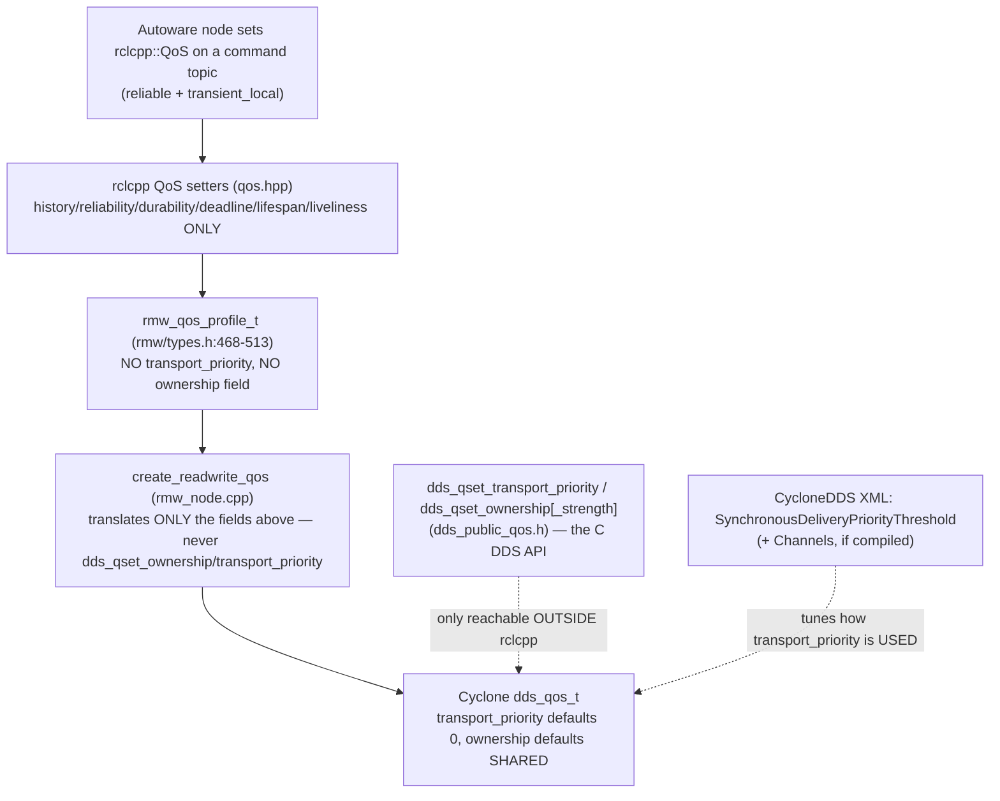

# Task 5 — QoS Configuration in Cyclone DDS for Message Prioritization

> **Read the [shared foundation](foundation.md) first.** This report reuses the foundation's layer
> map (§2), the delivery-matching rules — especially the QoS Requested/Offered (RxO) rule and the rmw
> QoS mapping (§4.3) — and discovery/SEDP (§5) **by reference**, and does not re-derive them.
> Source-class tags are the foundation's: `[repo]` = a file in this checkout (cited `path:line`);
> the Cyclone DDS core is in-checkout, so it too is `[repo]`; `[spec]` = OMG DDS / DDSI-RTPS;
> `[UNVERIFIED]` = would require running the sim or a packet capture; `setup-guide §N` = the
> authoritative runtime record. Terms (rcl, rmw, SEDP, GUID, RxO, WHC, QoS, DataWriter/Reader, …)
> are defined in the foundation glossary (§6). New terms this task needs — **transport priority**,
> **ownership / ownership strength**, **network channels**, **synchronous delivery**, **DSCP** — are
> defined on first use below.

---

## 1. Objective, scope, and exclusions

**Objective.** Determine, from source, **how Cyclone DDS QoS can be configured to prioritize
messages**, and — the layer-crossing that is the whole point of the task — **how much of that is
reachable through the rclcpp/rmw QoS API versus only through Cyclone's own configuration or its C
DDS API**. "Prioritize" is used precisely: it means causing one writer's samples to be delivered
sooner, or to win over another writer's samples for the same instance, rather than merely being
sent reliably.

**Worked target.** The two real command topics ground every claim: `/system/operation_mode/state`
(`autoware_adapi_v1_msgs/msg/OperationModeState`) and `/control/command/gear_cmd`
(`autoware_vehicle_msgs/msg/GearCommand`), both published **reliable + `transient_local`**
(setup-guide §8; foundation §4.3). The question this report answers concretely is: *could an operator
(or the SEU) make enforcement traffic on these topics take priority over an injector's traffic, and
could an injector conversely set a priority or ownership strength to dominate the topic?* The answer
turns on which QoS knobs actually exist in this stack and which layer they live at.

**The central finding, stated up front.** Neither **TRANSPORT_PRIORITY** nor **OWNERSHIP** is present
in the rmw QoS profile or set anywhere in the Cyclone rmw binding, so **prioritization is not
reachable through the rclcpp QoS API at all** (§4). Cyclone itself *does* implement both policies
in-checkout (§5, §6) — including working **exclusive-ownership strength arbitration**, contrary to the
historical expectation that Cyclone lacks it — but they are reachable only through the Cyclone C DDS
API (`dds_qset_*`) or, for transport priority, partly through CycloneDDS XML. Furthermore the one
XML-configurable transport-priority mechanism that would shape the wire, **network channels**, is
**compiled out of standard builds** (§5.3), leaving a single live in-tree lever: **synchronous
delivery gated on transport priority** (§5.2), which still needs the C API to set the priority.

**In scope.** The exact rmw/rclcpp QoS surface (§4); where transport priority does and does not take
effect in Cyclone (§5); Cyclone's exclusive-ownership arbitration and why ROS readers never trigger it
(§6); the distinction between true prioritization and latency shaping via deadline/latency-budget/
reliability (§7); and the SEU implications for privileging enforcement traffic and detecting a
priority/ownership attacker (§8).

**Excluded (and where it lives).** *How an outsider gets a single accepted publish onto a command
topic* is **Task 2** (the injector this report assumes). *Replay / over-publication and flow control
under flooding* — WHC watermark, ACKNACK, executor back-pressure — are **Task 3**; this report
cross-references but does not re-derive them. *Using QoS/liveliness to silence an element* is **Task
4**, which cites §5–§6 here. Message *content* semantics (what `mode: 2` does) are Task 2's.

---

## 2. Foundation reuse and new territory

**Reused by reference (not re-derived):**

| From foundation | Used here for |
|---|---|
| §4.3 the rmw QoS mapping: `create_readwrite_qos` translates only reliability, durability(+service), history/depth, lifespan, deadline, liveliness | The starting point that **no `transport_priority` or `ownership` setter exists** in the binding (§4) |
| §4.3 the RxO comparison table, incl. the ownership row `rd.ownership.kind != wr.ownership.kind` (`q_qosmatch.c:191`) | Why an EXCLUSIVE writer fails to match a SHARED reader (§6) |
| §4.3 the durability enum ordering and the `transient_local` gate | The command topics' offered/requested QoS baseline the priority discussion sits on |
| §5 SEDP carries each endpoint's full QoS plist on the wire before data flows | Why transport priority / ownership strength are **observable** to the SEU (§8) |
| §3 the publish path (`dds_write` → WHC → `nn_xpack_send`) | Where synchronous vs. asynchronous *delivery* diverges on the receive side (§5.2) |

**New territory opened for this task (files first opened here):**
`src/rmw/rmw/include/rmw/types.h` (the full `rmw_qos_profile_t` struct — foundation quoted the field
list; here it is read as the *complete* surface); `src/rclcpp/rclcpp/include/rclcpp/qos.hpp` (the
rclcpp `QoS` setter surface); `src/cyclonedds/.../dds_public_qos.h` (the Cyclone C-API setters
`dds_qset_transport_priority` / `dds_qset_ownership[_strength]`); `dds_public_qosdefs.h` (the
`dds_ownership_kind` enum); `ddsi_proxy_endpoint.c` and `defconfig.c` / `ddsi_cfgelems.h`
(synchronous-delivery gating and its defaults); `ddsi_endpoint.c`, `q_misc.c`, `ddsi_udp.c` and
`src/CMakeLists.txt` (the network-channels path and its build gating); `dds_rhc_default.c` (the
exclusive-ownership arbitration in the reader history cache); `ddsi_plist.c` (wire serialization of
these policies).

---

## 3. Mechanism overview — three questions, one picture

**Orientation.** "Prioritize messages" collapses three different DDS ideas that this report keeps
apart, because they live at different layers and only one of them is even nominally about priority:

1. **Transport priority** (`TRANSPORT_PRIORITY`) — a per-writer integer whose *intended* meaning is
   "send my samples on a higher-priority transport path." In Cyclone this maps onto **network
   channels** (dedicated threads + DSCP marking) and onto **synchronous delivery** on the receive
   side. It is the policy most directly *named* for prioritization.
2. **Ownership** (`OWNERSHIP` + `OWNERSHIP_STRENGTH`) — not latency but **arbitration**: under
   EXCLUSIVE ownership the highest-strength writer *owns* an instance and lower-strength writers are
   ignored. This is the policy that decides *whose* command wins, which is exactly the injection-
   dominance question.
3. **Latency shaping** (`DEADLINE`, `LATENCY_BUDGET`, and the reliability/history interaction) —
   policies that influence *when* and *whether* a sample is delivered, but are not priority between
   competing writers (§7).


*What to notice:* the solid path is everything a ROS 2 node can reach; it never touches priority or
ownership. The dotted paths — the C API and the XML — are the *only* ways priority/ownership enter
this stack, and they sit **beside** rclcpp, not under it. That gap is the entire finding.

---

## 4. What rclcpp and rmw expose — the exact surface (DEEP)

**Motivation.** The naive assumption is "DDS has a transport-priority QoS, ROS 2 rides on DDS,
therefore I can set message priority from rclcpp." That is false in this stack at the very first
layer, and the proof is a complete enumeration of the rmw profile and the rclcpp setters — because a
policy that is not a *field* cannot be set, mapped, or announced.

**The rmw QoS profile is a closed struct.** `rmw_qos_profile_t` contains exactly nine members:
`history`, `depth`, `reliability`, `durability`, `deadline`, `lifespan`, `liveliness`,
`liveliness_lease_duration`, and `avoid_ros_namespace_conventions`
(`src/rmw/rmw/include/rmw/types.h:471-513`) `[repo]`. There is **no `transport_priority` member and no
`ownership` / `ownership_strength` member** anywhere in the struct (`rmw/types.h:468-513`) `[repo]`.
Because rmw is the vendor-neutral contract every binding implements, a policy absent here is
invisible to *every* ROS 2 middleware, Cyclone included — the ceiling is set at rmw, not at the
vendor.

**The rclcpp `QoS` class exposes setters for exactly those fields and no others.** Reading the public
setter surface: `history`/`keep_last`/`keep_all` (`qos.hpp:151-165`), `reliability`/`reliable`/
`best_effort` (`qos.hpp:167-181`), `durability`/`durability_volatile`/`transient_local`
(`qos.hpp:183-200`), `deadline` (`qos.hpp:202-208`), `lifespan` (`qos.hpp:210-216`), `liveliness`
and `liveliness_lease_duration` (`qos.hpp:218-232`), and `avoid_ros_namespace_conventions`
(`qos.hpp:234-236`) `[repo]`. **There is no `transport_priority(...)` setter and no `ownership(...)`
or `ownership_strength(...)` setter** — the class simply has no method that would reach those policies
(`qos.hpp:151-236`) `[repo]`, and it could not, since its only backing store is the
`rmw_qos_profile_t` it returns from `get_rmw_qos_profile()` (`qos.hpp:143-149`) `[repo]`, which lacks
the fields.

**The Cyclone binding confirms it end-to-end.** The foundation established that
`create_readwrite_qos` maps reliability, durability (plus a durability-service QoS for
`transient_local`), history/depth, lifespan, deadline, and liveliness (foundation §4.3;
`rmw_node.cpp:2010-2104`) `[repo]`. A search of the entire Cyclone binding for the priority/ownership
setters finds **no call to `dds_qset_ownership`, `dds_qset_ownership_strength`, or
`dds_qset_transport_priority`** anywhere — the only occurrences of the word "ownership" in
`rmw_node.cpp` refer to C++ *memory* ownership of message buffers, not the QoS policy `[repo]`. So
even though these setters exist one layer down (§5), the binding never invokes them: a writer created
through rclcpp leaves transport priority at its default 0 and ownership at its default SHARED.

**Consequence.** For the command topics `/system/operation_mode/state` and `/control/command/gear_cmd`,
**every** legitimate Autoware writer and reader, and any rclcpp-based injector or enforcement node,
carries `transport_priority = 0` and `ownership = SHARED` — because none of the three layers above
Cyclone can set otherwise. Prioritization by transport priority or ownership is therefore a
**non-feature of the ROS 2 API here**; to use it at all one must drop to Cyclone's C API or its XML.
This is the "where would it live" answer the task asks for, and §5–§6 show what happens if you do
reach down there.

---

## 5. Transport priority in Cyclone — where it lives, and where it is dead (DEEP)

**Motivation.** Having shown transport priority is unreachable from rclcpp, the honest next question
is: if one *did* set it via Cyclone's C API (`dds_qset_transport_priority(qos, value)`,
`src/cyclonedds/.../dds_public_qos.h:365`) `[repo]`, what would it actually do on this loopback,
domain-0, `lo`-bound deployment? The answer is "less than the name promises," and the reasons are
specific to how this Cyclone build is compiled.

Cyclone gives the value a home: `transport_priority` is a field of the internal extended-QoS struct
(`dds_transport_priority_qospolicy_t transport_priority;`,
`src/cyclonedds/.../ddsi_xqos.h:329`, type at `:169-171`) `[repo]`, it defaults to `0`
(`ddsi_plist.c:3459`) `[repo]`, and — importantly for the SEU — it is **serialized into the QoS
parameter list on the wire** via the `QP(TRANSPORT_PRIORITY, transport_priority, Xi)` table entry
(`ddsi_plist.c:1907`), which is in the main plist table and not behind any feature `#ifdef` `[repo]`.
So an endpoint's transport priority is announced in its SEDP record (foundation §5) before any data
flows. There are exactly two places the value is *consumed*.

### 5.1 Path 1 — network channels (the DSCP / dedicated-thread path) is compiled out

Cyclone's **network channels** feature lets an administrator define multiple outbound channels in
XML, each with a priority threshold and optionally a DiffServ code point, and routes each writer to a
channel by its transport priority. The selection is `find_channel(cfg, wr->xqos->transport_priority)`,
"the channel with the lowest priority not less than transport_priority, or else the one with the
highest priority" (`src/cyclonedds/.../q_misc.c:146-161`) `[repo]`, invoked when a writer is created
to pick its event queue/thread: `wr->evq = channel->evq ? channel->evq : wr->e.gv->xevents`
(`src/cyclonedds/.../ddsi_endpoint.c:887-894`) `[repo]`. The **DSCP** marking — writing the channel's
DiffServ value into the IP header via `setsockopt(sock, IPPROTO_IP, IP_TOS, &qos->m_diffserv, …)` — is
the one place transport priority would touch the wire (`src/cyclonedds/.../ddsi_udp.c:553-561`)
`[repo]`. (**DSCP** = Differentiated Services Code Point, the 6-bit IP-header field routers use to
prioritize packets; **DiffServ** is the QoS architecture that uses it.)

**But every one of these code paths is guarded by `#ifdef DDS_HAS_NETWORK_CHANNELS`** — the
channel-selection block (`ddsi_endpoint.c:887`), `find_channel` itself (`q_misc.c:145-162`), and the
`IP_TOS` call (`ddsi_udp.c:553`) all sit inside that macro `[repo]`. And that macro is **not a
supported build option in this checkout**: the CMake option list defines `ENABLE_SECURITY`,
`ENABLE_LIFESPAN`, `ENABLE_DEADLINE_MISSED`, `ENABLE_NETWORK_PARTITIONS`, `ENABLE_TYPE_DISCOVERY`,
etc., but **no `ENABLE_NETWORK_CHANNELS`** (`src/cyclonedds/src/CMakeLists.txt:25-32`) `[repo]`;
instead a comment lists `DDS_HAS_NETWORK_CHANNELS` among the flags that merely "linger in the sources"
(`src/CMakeLists.txt:66-68`) `[repo]`. So in any standard build — including the container's
`ghcr.io/autowarefoundation/autoware:core-humble` image `[INFERRED: it is a stock Cyclone build; a
non-default channels build would be highly unusual and is not indicated by the setup guide]` — **the
channels path is not compiled**, and note also that the XML in setup-guide §4 defines no `<Channels>`
element. **Result: transport priority produces no dedicated thread and no DSCP marking here.** The
`NetworkInterface priority="default"` attribute in the setup-guide XML is unrelated — that is
*interface* selection priority, not the DataWriter transport-priority QoS.

### 5.2 Path 2 — synchronous delivery gated on transport priority is the only live lever

The second consumer is *not* behind the channels macro and therefore **is** active in this build. On
the receive side, when a proxy writer is matched, Cyclone decides whether to deliver its samples
synchronously on the receive thread (lower latency) or hand them to asynchronous delivery queues:

```
} else if (pwr->c.xqos->latency_budget.duration <= gv->config.synchronous_delivery_latency_bound &&
           pwr->c.xqos->transport_priority.value >= gv->config.synchronous_delivery_priority_threshold) {
    pwr->deliver_synchronously = 1;
```
(`src/cyclonedds/.../ddsi_proxy_endpoint.c:222-231`) `[repo]`. This is the genuine, in-tree
transport-priority mechanism: a writer whose transport priority meets or exceeds the configured
`SynchronousDeliveryPriorityThreshold` (and whose latency budget is within the bound) is delivered
straight off the recv thread, "at the expense of aggregate bandwidth" as the config doc puts it
(`src/cyclonedds/.../ddsi_cfgelems.h:1252-1272`) `[repo]`.

**Two defaults make this inert until deliberately configured.** The threshold defaults to `0`
(`ddsi_cfgelems.h:1252`) and the latency bound defaults to infinity
(`synchronous_delivery_latency_bound = INT64_MAX`, `src/cyclonedds/.../defconfig.c:55`; XML default
`"inf"`, `ddsi_cfgelems.h:1262`) `[repo]`. With the setup-guide XML setting neither element
(setup-guide §4), every regular writer satisfies `transport_priority(0) >= threshold(0)` and
`latency_budget(0) <= inf`, so the *threshold does not discriminate* — it is on for everyone, which is
the same as off as a prioritization lever. To use it for prioritization one must **(a)** raise
`SynchronousDeliveryPriorityThreshold` above 0 in the CycloneDDS XML on the relevant side, and **(b)**
give the privileged writer a `transport_priority` at or above that value — which, per §4, is
reachable **only** through the Cyclone C API, never through rclcpp. So even the one working lever is a
two-part, out-of-band configuration that no ROS 2 node in this deployment performs.

**Cost and scope.** Even fully configured, this shapes *latency* (which thread delivers), not
*arbitration*: it does not make a high-priority writer's `GearCommand` override a low-priority one's;
both are still delivered and the reader's history cache keeps the latest (§6). And it lives on the
**receive** side keyed on the *remote* writer's advertised transport priority, so an attacker who sets
a high transport priority does not gain delivery precedence *over* other writers — he only changes how
*his own* samples are scheduled into the reader. This is why §7 separates latency shaping from true
prioritization.

---

## 6. Ownership — Cyclone implements exclusive-ownership arbitration, but ROS readers never arm it (DEEP)

**Motivation.** Ownership is the policy that actually answers "whose command wins." Under
`EXCLUSIVE` ownership, DDS designates, per instance, the live writer with the highest
`OWNERSHIP_STRENGTH` as the owner; samples from any lower-strength writer are dropped by the reader
until the owner goes away. If that worked for ROS readers, an injector could seize a command topic by
declaring a huge strength, or the SEU could privilege enforcement traffic the same way. The task
flagged this as historically unsupported in Cyclone — **but this checkout implements it**, so the
finding is more interesting than "unavailable."

**Cyclone implements exclusive ownership in the default reader history cache (RHC).** The RHC records
whether the reader requested exclusive ownership — `rhc->exclusive_ownership = (qos->ownership.kind ==
DDS_OWNERSHIP_EXCLUSIVE)` (`src/cyclonedds/.../dds_rhc_default.c:610`) `[repo]` — and enforces
strength arbitration when accepting a sample for an instance already owned by a different live writer:

```
if (rhc->exclusive_ownership && inst->wr_iid_islive && inst->wr_iid != wrinfo->iid) {
  int32_t strength = wrinfo->ownership_strength;
  if (strength > inst->strength) { /* ok */ }
  else if (strength < inst->strength) { return 0; }      /* drop the weaker writer */
  else if (inst_accepts_sample_by_writer_guid(...)) { /* tie-break by GUID */ }
  else { return 0; }
}
```
(`dds_rhc_default.c:1041-1053`) `[repo]`. The owning writer's strength is tracked on the instance
(`inst->strength = wrinfo->ownership_strength`, `dds_rhc_default.c:1064`) `[repo]`, and the value rides
the wire via `QP(OWNERSHIP_STRENGTH, ownership_strength, Xi)` and `QP(OWNERSHIP, ownership, XE1)`
(`ddsi_plist.c:1902-1903`) `[repo]`. The C-API setters exist too: `dds_qset_ownership(qos, kind)` and
`dds_qset_ownership_strength(qos, value)` (`dds_public_qos.h:276-288`) `[repo]`, with kinds
`DDS_OWNERSHIP_SHARED` (0) and `DDS_OWNERSHIP_EXCLUSIVE` (1) (`dds_public_qosdefs.h:99-104`) `[repo]`.
**So the historical "Cyclone lacks exclusive ownership" caveat does not hold for this stack** — the
mechanism is present and functional at the Cyclone layer.

**Why it nonetheless does nothing on the command topics.** The arbitration is gated on
`rhc->exclusive_ownership`, which is true only if **the reader** requested `EXCLUSIVE`. But §4 proved
no rclcpp/rmw path sets ownership: the Autoware command *readers* are created through the binding,
which never calls `dds_qset_ownership`, so they keep the DDS default `SHARED`
(`dds_public_qosdefs.h:99-104`) `[repo]`, and `rhc->exclusive_ownership` is `false`. With SHARED
ownership the arbitration block is skipped entirely and **every matched writer's samples are accepted,
newest-write-wins** — there is no owner and no strength comparison. An injector that reached down to
the C API and set `EXCLUSIVE` + a large strength would gain nothing, and worse would *lose*: the RxO
ownership check requires kinds to be equal (`rd.ownership.kind != wr.ownership.kind` fails the match,
foundation §4.3, `q_qosmatch.c:191`) `[repo]`, so an EXCLUSIVE writer would **fail to match** the
SHARED Autoware reader and deliver nothing — a variant of the foundation's dropped-injection trace,
this time on ownership kind rather than durability.

**Net.** Exclusive-ownership dominance is unavailable *as a lever* on these topics not because Cyclone
can't do it, but because arming it requires the *reader* to opt in, and no ROS 2 reader in this
deployment does. Making it usable would require changing the Autoware subscriber's QoS (source or a
patched binding) to request EXCLUSIVE and giving the enforcement writer the higher strength via the C
API — a coordinated, out-of-band change on both endpoints, not something either an attacker or the SEU
can impose one-sidedly from the network.

---

## 7. True prioritization vs. latency shaping — deadline, latency budget, reliability

**Orientation.** The policies rclcpp *does* expose can influence timing, and it is tempting to call
that "prioritization." It is not, and the distinction matters for both the operator and the SEU.

- **DEADLINE** (reachable via rclcpp, `qos.hpp:202-208`) is a *contract and alarm*, not a scheduler:
  it declares the maximum expected inter-sample period and raises `DEADLINE_MISSED` if violated. It
  does not reorder or prioritize samples between writers; Task 4 uses its *violation* as a silencing
  signal, not as a priority lever.
- **LATENCY_BUDGET** (reachable via rclcpp, `qos.hpp` deadline/lifespan family; on the wire at
  `ddsi_plist.c:1888`) is a *hint* about acceptable delay. In this Cyclone build its only teeth are
  the synchronous-delivery gate of §5.2 — and even there it is ANDed with transport priority, which
  rclcpp cannot set, so a ROS 2 node setting only a tight latency budget still gets the default
  behavior unless the threshold and priority are configured out-of-band. `[INFERRED: from §5.2 — with
  threshold 0 and priority 0 the budget term never becomes discriminating on its own.]`
- **RELIABILITY + HISTORY/DEPTH** (reachable via rclcpp) govern *whether and how many* samples
  survive, not *who wins*. On the `reliable + transient_local + KeepLast(1)` command topics, a slow or
  flooding writer interacts with the WHC watermark and the reliable ACKNACK handshake — but that is
  **flow control**, analyzed in Task 3, not prioritization. Reliability can *raise* effective latency
  (retransmission) rather than lower it.

**Conclusion.** None of the rclcpp-reachable policies provides prioritization *between competing
writers*. They shape delivery of a single stream. True inter-writer prioritization in DDS is
transport priority (latency precedence) and ownership strength (arbitration precedence) — and both, in
this stack, are unreachable from rclcpp (§4) and largely inert or unarmed even from Cyclone config
(§5.1, §6).

## 7.1 Summary table

| QoS policy | What it controls | Reachable via rclcpp? | Reachable via Cyclone config / C API? | Relevance to prioritization | Relevance to injection / SEU |
|---|---|---|---|---|---|
| **TRANSPORT_PRIORITY** | Intended transport precedence | **No** — absent from `rmw_qos_profile_t` and rclcpp `QoS` (§4) | C API `dds_qset_transport_priority` `[repo]`; XML only via Channels (compiled out) | Direct in name; in practice only the sync-delivery gate (§5.2) works here | Attacker can't set it via ROS; if set via C API it's visible in SEDP (§8) |
| **OWNERSHIP / STRENGTH** | Which writer owns an instance | **No** — no field, no setter (§4) | C API `dds_qset_ownership[_strength]`; RHC implements EXCLUSIVE (§6) | The real "whose command wins" lever — but reader must request EXCLUSIVE | Dominance impossible on SHARED ROS readers; EXCLUSIVE writer would fail to match |
| **DEADLINE** | Max inter-sample period + alarm | Yes (`qos.hpp:202-208`) | Yes | None (contract, not scheduler) | Task 4 silencing signal (DEADLINE_MISSED) |
| **LATENCY_BUDGET** | Acceptable delay hint | Yes | Yes; teeth only via §5.2 sync gate | Latency shaping, not priority | Inert without transport-priority config |
| **RELIABILITY / HISTORY / DEPTH** | Delivery guarantee & queue | Yes | Yes | Flow control, not priority (Task 3) | Flooding/back-pressure surface (Task 3) |
| **DURABILITY (transient_local)** | History for late joiners | Yes (foundation §4.3) | Yes | The match gate, not priority | The injector's mandatory offer (Task 2) |

---

## 8. SEU implications

**Prioritization is not a lever the SEU can pull through ROS 2, and not one an attacker can pull
either — which is itself the finding.** Each implication below is drawn from the mechanism above, not
from generic security advice.

- **The SEU cannot privilege enforcement traffic by QoS through rclcpp.** Because neither transport
  priority nor ownership is reachable from the rmw/rclcpp API (§4), an SEU enforcement node written as
  an ordinary ROS 2 node has *no* QoS knob to make its `OperationModeState`/`GearCommand` win over an
  injector's. On the SHARED command readers, the injector's and the enforcer's samples are treated
  identically — last write into the reader's `KeepLast(1)` cache wins (§6). So an SEU that tries to
  "out-prioritize" an injector on the same topic is racing it, not overriding it. To actually
  privilege enforcement traffic by DDS ownership, the SEU would need the *Autoware readers* to request
  `EXCLUSIVE` and the enforcer to hold the higher strength (§6) — a coordinated change to both
  endpoints via the C API or a patched binding, i.e. a build-time deployment decision, not a runtime
  network action. That is a concrete recommendation the SEU design can act on, and a real limitation
  it must not assume around.

- **A priority/ownership attacker is loud, because the values ride SEDP.** Both `TRANSPORT_PRIORITY`
  and `OWNERSHIP`/`OWNERSHIP_STRENGTH` are serialized into the endpoint's QoS plist and announced in
  SEDP before any data flows (`ddsi_plist.c:1902-1907`; foundation §5) `[repo]`. Every legitimate
  writer in this deployment carries `transport_priority = 0` and `ownership = SHARED` (§4), so **any
  endpoint advertising a non-zero transport priority or EXCLUSIVE ownership on a command topic is, by
  construction, not a stock rclcpp node** — it had to reach the Cyclone C API to set those, which no
  Autoware node does. That is a crisp, positive SEU signature: a SEDP publication record on
  `rt/control/command/gear_cmd` or `rt/system/operation_mode/state` whose transport priority ≠ 0 or
  whose ownership ≠ SHARED is anomalous on its face, detectable at discovery time without inspecting a
  single data sample.

- **The dominance attack mostly defeats itself here.** An attacker who sets `EXCLUSIVE` + high strength
  hoping to seize the topic instead **fails to match** the SHARED Autoware reader (RxO ownership-kind
  mismatch, §6) and delivers nothing — the same silent non-match as the durability trap (Task 2). The
  SEU should recognize this as a *failed* dominance attempt visible only in SEDP (a foreign EXCLUSIVE
  writer that never delivers), analogous to Task 2's reconnaissance-injection signature.

- **Realism caveat (loopback vs. deployment bus).** The mechanics above are Cyclone's and transfer to
  the deployment network: on a real automotive Ethernet bus, the SEDP-visible QoS anomaly and the
  ownership-kind matching rule hold regardless of transport. What does *not* transfer is any assumption
  that DSCP/transport-priority marking is in play — it is compiled out here (§5.1), and whether a
  production vehicle build enables network channels or DSCP is a separate question the SEU should not
  presume `[UNVERIFIED: would require the production Cyclone build flags and XML]`. The portable SEU
  takeaway is the **identity-and-QoS-invariant** one: legitimate command endpoints have a fixed,
  knowable QoS fingerprint (reliable, `transient_local`, `transport_priority = 0`, `ownership =
  SHARED`), and priority/ownership prioritization is simply not part of how this system delivers
  commands — so any deviation is signal, not noise.

---

## 9. Appendix — files opened, tags, confidence

**Files opened for this task (all `[repo]`):**
- `src/rmw/rmw/include/rmw/types.h` — full `rmw_qos_profile_t` struct (`:468-513`)
- `src/rclcpp/rclcpp/include/rclcpp/qos.hpp` — the rclcpp `QoS` setter surface (`:143-236`)
- `src/rmw_cyclonedds/rmw_cyclonedds_cpp/src/rmw_node.cpp` — searched for ownership/transport_priority setters (none; only memory-ownership references)
- `src/cyclonedds/src/core/ddsc/include/dds/ddsc/dds_public_qos.h` — C-API setters (`:276,288,365`)
- `src/cyclonedds/src/core/ddsc/include/dds/ddsc/dds_public_qosdefs.h` — `dds_ownership_kind` enum (`:99-104`)
- `src/cyclonedds/src/core/ddsc/src/dds_rhc_default.c` — exclusive-ownership arbitration (`:610,1041-1064`)
- `src/cyclonedds/src/core/ddsi/src/ddsi_proxy_endpoint.c` — synchronous-delivery gate (`:222-231`)
- `src/cyclonedds/src/core/ddsi/src/ddsi_endpoint.c` — channel selection (`:887-894`, behind `DDS_HAS_NETWORK_CHANNELS`)
- `src/cyclonedds/src/core/ddsi/src/q_misc.c` — `find_channel` (`:145-162`, behind the macro)
- `src/cyclonedds/src/core/ddsi/src/ddsi_udp.c` — `IP_TOS`/DSCP (`:553-561`, behind the macro)
- `src/cyclonedds/src/core/ddsi/defconfig.c` — sync-delivery defaults (`:55`)
- `src/cyclonedds/src/core/ddsi/include/dds/ddsi/ddsi_cfgelems.h` — threshold/latency-bound config docs & defaults (`:792-802,1252-1272`)
- `src/cyclonedds/src/core/ddsi/include/dds/ddsi/ddsi_xqos.h` — `transport_priority` xqos field (`:169-171,329`)
- `src/cyclonedds/src/core/ddsi/src/ddsi_plist.c` — wire serialization of OWNERSHIP/STRENGTH/TRANSPORT_PRIORITY (`:1902-1907`), defaults (`:3459`)
- `src/cyclonedds/src/CMakeLists.txt` — build options; absence of `ENABLE_NETWORK_CHANNELS` (`:25-32,66-68`)

Reused by reference (opened in the foundation): `q_qosmatch.c` (ownership/RxO), `rmw_node.cpp`
`create_readwrite_qos` mapping, `dds_public_qosdefs.h` durability ordering — cited via the foundation.

**`[INFERRED]` / `[UNVERIFIED]` findings and what would settle them:**

| Tag | Claim | What would settle it |
|---|---|---|
| `[INFERRED]` | The container's Cyclone is a stock build with `DDS_HAS_NETWORK_CHANNELS` undefined, so the channels/DSCP path is absent (§5.1) | Inspecting the built library's compile flags, or a wire capture showing no DSCP marking on `lo` |
| `[UNVERIFIED]` | A production vehicle build's transport-priority/DSCP behavior — the deployment the SEU defends may differ (§8 caveat) | The production Cyclone build flags and CycloneDDS XML |
| `[INFERRED]` | With threshold 0 / latency-bound inf and all writers at priority 0, the sync-delivery gate does not discriminate (§5.2) | Reading the defaults (done) plus a run confirming uniform delivery scheduling |
| `[INFERRED]` | ROS command readers keep the DDS default `SHARED` ownership because the binding never calls `dds_qset_ownership` (§6) | A capture of the reader's SEDP QoS plist showing OWNERSHIP=SHARED |

**Per-section confidence:**

| Section | Confidence | Reason |
|---|---|---|
| §4 rclcpp/rmw surface | HIGH | The struct and setter surface are read in full in-checkout; absence is verified by enumeration and a binding-wide search. |
| §5.1 Channels compiled out | HIGH | The `#ifdef` guards and the absence of `ENABLE_NETWORK_CHANNELS` (with the "linger in the sources" comment) are all in-checkout; only the specific container binary is `[INFERRED]`. |
| §5.2 Synchronous delivery | HIGH | The gate, its config elements, and their defaults are all in-checkout; the "inert by default" conclusion follows from the cited defaults. |
| §6 Ownership arbitration | HIGH | The RHC arbitration, the setters, the enum, and the RxO match rule are in-checkout Cyclone source; the "readers stay SHARED" step is `[INFERRED]` from the binding not setting it. |
| §7 Latency vs. priority | MEDIUM-HIGH | Policy reachability is HIGH (in-checkout); the "latency-budget teeth only via §5.2" claim is `[INFERRED]`. |
| §8 SEU implications | HIGH | Drawn from the mechanism (unreachability, SEDP visibility, SHARED non-arbitration, ownership-kind non-match), not generic commentary. |

<!-- REPORT-COMPLETE -->
