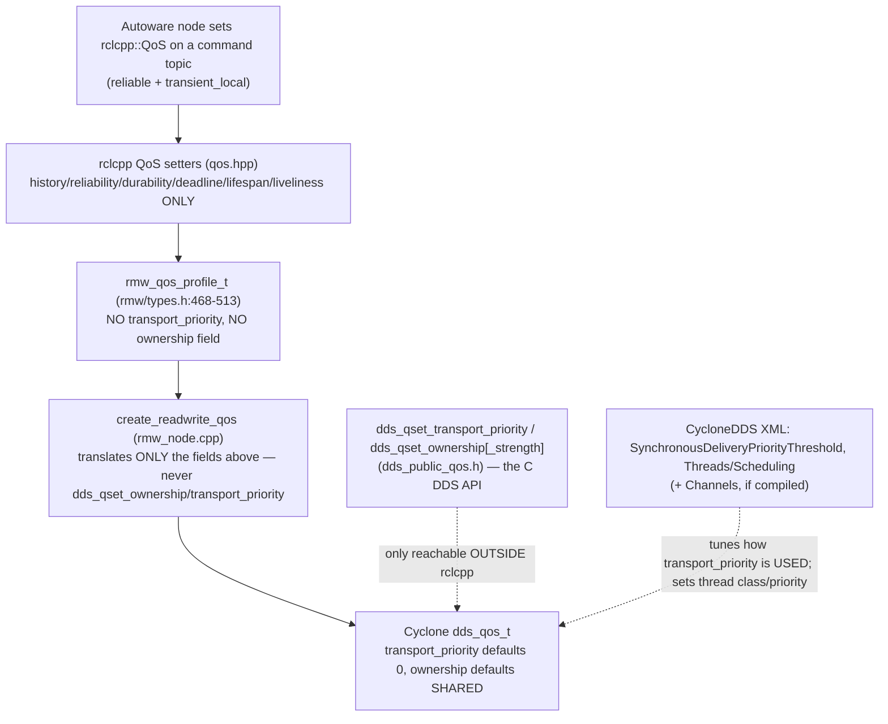

# Task 5 — Timing Determinism & Mixed-Criticality: What Cyclone QoS Can and Cannot Promise the STL Monitor

> **Read the [shared foundation](foundation.md) first.** This report reuses the foundation's layer
> map (§2), the delivery-matching rules — especially the QoS Requested/Offered (RxO) rule and the rmw
> QoS mapping (§4.3) — and discovery/SEDP (§5) **by reference**, and does not re-derive them. It also
> assumes the foundation's §0 pipeline (data dependency → temporal constraint → STL property → trace
> event → safe-stop) as its purpose.
> Source-class tags are the foundation's: `[repo]` = a file in this checkout (cited `path:line`);
> the Cyclone DDS core is in-checkout, so it too is `[repo]`; `[spec]` = OMG DDS / DDSI-RTPS;
> `[UNVERIFIED]` = would require running the sim or a packet capture; `setup-guide §N` = the
> authoritative runtime record; `[LSEU-abstract]` = a claim, target number, or definition taken from
> the SEU abstract rather than from the source tree. Terms (rcl, rmw, SEDP, GUID, RxO, WHC, QoS,
> DataWriter/Reader, …) are defined in the foundation glossary (§6). New terms this task needs —
> **transport priority**, **ownership / ownership strength**, **network channels**, **synchronous
> delivery**, **DSCP**, **deadline administration**, **thread scheduling class** — are defined on
> first use below.

---

## 1. Objective, scope, and exclusions

**Motivation.** Every property the SEU evaluates is a *timing* statement over a real topic:
`G( age(/control/command/gear_cmd) ≤ Δ_fresh )`, `G( inter_arrival(topic) ∈ [1/f_max, 1/f_min] )`,
`G( pub(topic) → F_[0,Δ_deadline] pub(topic) )` (foundation §0). Such a property is only worth
deriving if two things hold in the real stack. First, the transport must be *able* to meet the bound —
a command whose delivery latency is hostage to a burst of point-cloud traffic will violate
`Δ_fresh` for reasons no monitor can fix, only report. Second, the violation must be *observable*
somewhere, either because the middleware itself declares the contract and raises an alarm, or because
the monitor taps the arrival trace itself. Task 5 is where those two questions are answered from
source, plus the deployment question behind them: can the monitor run alongside the stack on a
resource-constrained multicore RISC-V executing mixed-criticality workloads *without disturbing the
real-time tasks* `[LSEU-abstract]`.

**Objective.** Determine, from source, **which Cyclone DDS QoS and configuration knobs actually shape
latency, jitter, and delivery scheduling**, and — the layer-crossing that is the whole point of the
task — **how much of that is reachable through the rclcpp/rmw QoS API versus only through Cyclone's
own XML configuration or its C DDS API**. "Shape" is used precisely: it means causing one writer's
samples to be delivered sooner or more predictably, or to win over another writer's samples for the
same instance, rather than merely being sent reliably.

**Worked target.** The two real command topics ground every claim: `/system/operation_mode/state`
(`autoware_adapi_v1_msgs/msg/OperationModeState`) and `/control/command/gear_cmd`
(`autoware_vehicle_msgs/msg/GearCommand`), both published **reliable + `transient_local`**
(setup-guide §8; foundation §4.3). Both feed actuation, so both carry the study's tightest freshness
properties. The concrete question this report answers is: *can the deployment give these command
topics any timing precedence over the rest of the traffic, can it declare their timing bound to the
middleware so the middleware raises the alarm, and what jitter does the delivery path leave behind for
the monitor to absorb?*

**The central finding, in three parts, stated up front.**

1. **There is no message-level timing precedence in this stack.** Neither **TRANSPORT_PRIORITY** nor
   **OWNERSHIP** is present in the rmw QoS profile or set anywhere in the Cyclone rmw binding, so
   latency shaping between writers **is not reachable through the rclcpp QoS API at all** (§4). Cyclone
   itself *does* implement both policies in-checkout (§5, §6) — including working **exclusive-ownership
   strength arbitration**, contrary to the historical expectation that Cyclone lacks it — but they are
   reachable only through the Cyclone C DDS API (`dds_qset_*`) or, for transport priority, partly
   through CycloneDDS XML. The one XML-configurable mechanism that would actually shape the wire,
   **network channels** (dedicated threads + DSCP marking), is **compiled out of standard builds**
   (§5.1), leaving a single live in-tree lever: **synchronous delivery gated on transport priority**
   (§5.2), inert at its defaults. A `GearCommand` therefore shares one transmit path and one delivery
   path with every bulk topic in the system.
2. **The one timing contract the middleware could enforce for you — DEADLINE — is compiled in and
   reachable from rclcpp, but is not armed by default.** `ENABLE_DEADLINE_MISSED` is ON in this
   checkout (`src/CMakeLists.txt:27`), Cyclone maintains a real per-instance deadline administration in
   the reader history cache, and the missed-deadline status propagates all the way up to an rclcpp
   subscription callback (§7.1). But the ROS 2 default QoS leaves `deadline` **unspecified**
   (`rmw/types.h:460`; `qos_profiles.h:51-62`) and the Cyclone binding only calls `dds_qset_deadline`
   when it is specified (`rmw_node.cpp:2079-2080`) `[repo]` — so on a stock Autoware topic no deadline
   is set, no deadline timer is armed, and **the middleware raises no timing alarm whatsoever**. The
   rate/freshness property must therefore be derived and evaluated by the SEU itself; DDS DEADLINE is
   at best a coarse in-band corroborator that a deployment must deliberately turn on.
3. **Mixed-criticality isolation exists here at the thread level, not the message level.** Cyclone's
   XML can put each of its internal threads (`recv`, `dq.builtins`, `tev`, `lease`, `gc`) into a
   scheduling class and priority (`ddsi_cfgelems.h:815-836,869-885,2131-2136`) `[repo]`; the setup-guide
   XML sets none of them (setup-guide §4), so every Cyclone thread runs at the OS default. That knob —
   not QoS — is the one that decides whether DDS delivery work, and a monitor tapping it, interferes
   with real-time tasks on the target `[LSEU-abstract]`.

**In scope.** The exact rmw/rclcpp QoS surface and what it means for a derivable timing contract (§4);
where transport priority does and does not take effect in Cyclone (§5.1–§5.2); Cyclone's thread
scheduling configuration as the real mixed-criticality lever (§5.3); Cyclone's exclusive-ownership
arbitration and why ROS readers never trigger it, i.e. how the monitor must disambiguate redundant
sources itself (§6); the timing policies that *are* reachable — deadline, latency budget, reliability
and history/WHC — and the deadline administration that implements them (§7); and what all of it hands
the STL monitor (§8).

**Excluded (and where it lives).** *How off-nominal samples are driven onto a command topic in the
first place* is **Task 2**, the fault-injection harness this report assumes. *Over-publication and flow
control under flood* — WHC watermark, ACKNACK, executor back-pressure, and the 100× stress case — are
**Task 3**; this report cross-references but does not re-derive them. *Silent freshness loss and
safe-stop actuation* is **Task 4**, which cites §5–§7 here. Message *content* semantics (what `mode: 2`
means) are Task 2's.

---

## 2. Foundation reuse and new territory

**Reused by reference (not re-derived):**

| From foundation | Used here for |
|---|---|
| §0 the pipeline data dependency → temporal constraint → STL property → trace event → safe-stop | The purpose every section below closes on |
| §4.3 the rmw QoS mapping: `create_readwrite_qos` translates only reliability, durability(+service), history/depth, lifespan, deadline, liveliness | The starting point that **no `transport_priority` or `ownership` setter exists** in the binding (§4) |
| §4.3 the RxO comparison table, incl. the ownership row `rd.ownership.kind != wr.ownership.kind` (`q_qosmatch.c:191`) | Why an EXCLUSIVE writer fails to match a SHARED reader, i.e. a silent coupling loss (§6) |
| §4.3 the durability enum ordering and the `transient_local` gate | The command topics' offered/requested QoS baseline the timing discussion sits on |
| §5 SEDP carries each endpoint's full QoS plist on the wire before data flows | Why a topic's declared timing contract is knowable to the monitor at discovery time (§8) |
| §3 the publish path (`dds_write` → WHC → `nn_xpack_send`) | Where a sample gets its timestamp and sequence number, and where synchronous vs. asynchronous *delivery* diverges on the receive side (§5.2) |

**New territory opened for this task (files first opened here):**
`src/rmw/rmw/include/rmw/types.h` (the full `rmw_qos_profile_t` struct and the `RMW_QOS_*_DEFAULT`
macros); `src/rmw/rmw/include/rmw/qos_profiles.h` (the default profile's unspecified deadline);
`src/rmw/rmw/include/rmw/event.h` and `rmw/events_statuses/*` (the deadline-missed event surface);
`src/rclcpp/rclcpp/include/rclcpp/qos.hpp` and `qos_event.hpp` (the rclcpp `QoS` setter surface and the
subscription event callbacks); `src/cyclonedds/.../dds_public_qos.h` (the Cyclone C-API setters
`dds_qset_transport_priority` / `dds_qset_ownership[_strength]`); `dds_public_qosdefs.h` (the
`dds_ownership_kind` enum); `ddsi_proxy_endpoint.c` and `defconfig.c` / `ddsi_cfgelems.h`
(synchronous-delivery gating, thread-scheduling elements, and their defaults); `ddsi_endpoint.c`,
`q_misc.c`, `ddsi_udp.c` and `src/CMakeLists.txt` (the network-channels path and its build gating, plus
the `ENABLE_DEADLINE_MISSED` option); `dds_rhc_default.c` (the exclusive-ownership arbitration and the
per-instance deadline administration in the reader history cache); `ddsi_deadline.c` /
`ddsi_deadline.h` (how a missed deadline is actually timed); `dds_reader.c` (deadline QoS validation);
`ddsi_plist.c` (wire serialization of these policies).

---

## 3. Mechanism overview — three places timing is decided, one picture

**Orientation.** "QoS prioritization" collapses three different DDS ideas that this report keeps
apart, because they live at different layers and each answers a different question the monitor cares
about:

1. **Transport priority** (`TRANSPORT_PRIORITY`) — a per-writer integer whose *intended* meaning is
   "send my samples on a higher-priority transport path." It answers *can a critical command jump the
   queue ahead of bulk traffic?* In Cyclone it maps onto **network channels** (dedicated threads +
   DSCP marking) and onto **synchronous delivery** on the receive side.
2. **Ownership** (`OWNERSHIP` + `OWNERSHIP_STRENGTH`) — not latency but **arbitration**: under
   EXCLUSIVE ownership the highest-strength writer *owns* an instance and lower-strength writers are
   ignored. It answers *whose sample defines this instance's current value and therefore its
   freshness?* — the question that decides whether the monitor can trust one trace per topic or must
   disambiguate several sources itself.
3. **Declared timing contracts and queueing** (`DEADLINE`, `LATENCY_BUDGET`, and the
   reliability/history/WHC interaction) — policies that state or influence *when* and *whether* a
   sample is delivered. This is the group that overlaps the monitor's own job: DEADLINE is, in effect,
   a fragment of the STL rate property expressed in QoS (§7).


*What to notice:* the solid path is everything a ROS 2 node can reach, and it never touches precedence
or arbitration — so **every** endpoint in this deployment is timing-equal on the wire. The dotted
paths — the C API and the XML — are the only ways precedence or thread-level isolation enter this
stack, and they sit **beside** rclcpp, not under it. For the monitor that gap is the finding: timing
determinism here is not something the application layer negotiates per message; it is a property of the
whole node's configuration, which is why the monitor has to *measure* what it cannot *request*.

---

## 4. What rclcpp and rmw expose — the exact surface, and the contract it cannot declare (DEEP)

**Motivation.** The naive assumption is "DDS has a transport-priority QoS, ROS 2 rides on DDS,
therefore I can give my safety-critical command topic priority — and DDS has a DEADLINE QoS, therefore
the middleware is already checking my timing constraint for me." Both halves are false in this stack,
and the proof is a complete enumeration of the rmw profile, the rclcpp setters, and the defaults they
carry — because a policy that is not a *field* cannot be set, mapped, or announced, and a field left at
its default announces nothing.

**The rmw QoS profile is a closed struct.** `rmw_qos_profile_t` contains exactly nine members:
`history`, `depth`, `reliability`, `durability`, `deadline`, `lifespan`, `liveliness`,
`liveliness_lease_duration`, and `avoid_ros_namespace_conventions`
(`src/rmw/rmw/include/rmw/types.h:471-513`) `[repo]`. There is **no `transport_priority` member and no
`ownership` / `ownership_strength` member** anywhere in the struct (`rmw/types.h:468-513`) `[repo]`.
Because rmw is the vendor-neutral contract every binding implements, a policy absent here is
invisible to *every* ROS 2 middleware, Cyclone included — the ceiling is set at rmw, not at the
vendor.

**The rclcpp `QoS` class exposes setters for exactly those fields and no others.** Reading the public
setter surface: `history`/`keep_last`/`keep_all` (`qos.hpp:151-165`), `reliability`/`reliable`/
`best_effort` (`qos.hpp:167-181`), `durability`/`durability_volatile`/`transient_local`
(`qos.hpp:183-200`), `deadline` (`qos.hpp:202-208`), `lifespan` (`qos.hpp:210-216`), `liveliness`
and `liveliness_lease_duration` (`qos.hpp:218-232`), and `avoid_ros_namespace_conventions`
(`qos.hpp:234-236`) `[repo]`. **There is no `transport_priority(...)` setter and no `ownership(...)`
or `ownership_strength(...)` setter** — the class simply has no method that would reach those policies
(`qos.hpp:151-236`) `[repo]`, and it could not, since its only backing store is the
`rmw_qos_profile_t` it returns from `get_rmw_qos_profile()` (`qos.hpp:143-149`) `[repo]`, which lacks
the fields.

**The Cyclone binding confirms it end-to-end.** The foundation established that
`create_readwrite_qos` maps reliability, durability (plus a durability-service QoS for
`transient_local`), history/depth, lifespan, deadline, and liveliness (foundation §4.3;
`rmw_node.cpp:2010-2104`) `[repo]`. A search of the entire Cyclone binding for the priority/ownership
setters finds **no call to `dds_qset_ownership`, `dds_qset_ownership_strength`, or
`dds_qset_transport_priority`** anywhere — the only occurrences of the word "ownership" in
`rmw_node.cpp` refer to C++ *memory* ownership of message buffers, not the QoS policy `[repo]`. So
even though these setters exist one layer down (§5), the binding never invokes them: a writer created
through rclcpp leaves transport priority at its default 0 and ownership at its default SHARED.

**The timing fields that *are* mapped are conditional on being specified — and by default they are
not.** The three temporal policies rmw does carry (`deadline`, `lifespan`,
`liveliness_lease_duration`) are all translated only when the caller set them:
`if (!is_rmw_duration_unspecified(qos_policies->deadline)) dds_qset_deadline(...)`
(`rmw_node.cpp:2079-2080`; the same guard on lifespan at `:2076-2078`; liveliness falls back to
`ldur = DDS_INFINITY` at `:2084-2088`) `[repo]`, where "unspecified" means literally `{0, 0}`
(`rmw_node.cpp:1987-1989`; `rmw/time.h:56`) `[repo]`. And the stock profile leaves them exactly there:
`rmw_qos_profile_default` is `{KEEP_LAST, 10, RELIABLE, VOLATILE, RMW_QOS_DEADLINE_DEFAULT,
RMW_QOS_LIFESPAN_DEFAULT, LIVELINESS_SYSTEM_DEFAULT, RMW_QOS_LIVELINESS_LEASE_DURATION_DEFAULT, false}`
(`src/rmw/rmw/include/rmw/qos_profiles.h:51-62`) `[repo]`, and each of those `*_DEFAULT` macros is
defined as `RMW_DURATION_UNSPECIFIED` (`rmw/types.h:460-466`) `[repo]`. **Consequence: unless an
Autoware node explicitly calls `qos.deadline(...)`, its topics carry no deadline at all**, and §7.1's
deadline machinery is never armed for them. `[INFERRED: that the Autoware command publishers use the
default (or a SensorData/reliable+transient_local) profile without an explicit deadline — the node
sources are not in this checkout; setup-guide §8 records only reliability and durability for these
topics.]`

**Consequence.** For the command topics `/system/operation_mode/state` and `/control/command/gear_cmd`,
**every** legitimate Autoware writer and reader, and any rclcpp-based harness or monitor node, carries
`transport_priority = 0`, `ownership = SHARED`, and — absent an explicit call — no deadline, no
lifespan, and an infinite liveliness lease, because none of the three layers above Cyclone sets
otherwise. Message-level timing precedence is a **non-feature of the ROS 2 API here**, and the
middleware is not silently checking a timing contract on the SEU's behalf.

**Monitor closing — §4.**
1. **The property.** What §4 fixes is not a bound but the *provenance* of every bound: since the stack
   declares none, each property the SEU evaluates over these topics —
   `G( age(/control/command/gear_cmd) ≤ Δ_fresh )` and
   `G( inter_arrival(/system/operation_mode/state) ∈ [1/f_max, 1/f_min] )` — is **derived from the data
   dependency, not read from QoS** `[LSEU-abstract]`, and its bound is `[INFERRED]`. This is precisely
   the abstract's case for automatic derivation: there is no hand-authored contract in the system to
   read `[LSEU-abstract]`.
2. **The trace event.** At discovery time the monitor can still read each endpoint's *declared* QoS
   from its SEDP plist (foundation §5): reliability, durability, and whichever of
   deadline/lifespan/liveliness were specified. On this deployment that record is expected to show
   `transport_priority = 0`, `ownership = SHARED`, and deadline absent — a **timing-contract-free
   endpoint**, which tells the monitor up front that nothing below it will alarm on time.
3. **The safe-stop decision.** Nothing in §4 is itself a violation, so nothing here triggers a
   safe-stop. It sets a *design constraint*: because no in-band alarm exists by default, a monitor that
   relies on `DEADLINE_MISSED` events alone would be **silent through every freshness fault in this
   study**. Deriving and evaluating the property in the SEU is not an optimization here; it is the only
   path.

---

## 5. Transport priority and thread scheduling — where latency shaping lives, and where it is dead (DEEP)

**Motivation.** Having shown message-level precedence is unreachable from rclcpp, the honest next
question is: if a deployment *did* reach down to Cyclone's C API (`dds_qset_transport_priority(qos,
value)`, `src/cyclonedds/.../dds_public_qos.h:365`) `[repo]` or its XML, what would actually change for
the latency and jitter of a `GearCommand` on this loopback, domain-0, `lo`-bound deployment? The answer
is "less than the name promises, and not at the layer you expect," and the reasons are specific to how
this Cyclone build is compiled.

Cyclone gives the value a home: `transport_priority` is a field of the internal extended-QoS struct
(`dds_transport_priority_qospolicy_t transport_priority;`,
`src/cyclonedds/.../ddsi_xqos.h:329`, type at `:169-171`) `[repo]`, it defaults to `0`
(`ddsi_plist.c:3459`) `[repo]`, and — usefully for a monitor that reads discovery traffic — it is
**serialized into the QoS parameter list on the wire** via the `QP(TRANSPORT_PRIORITY,
transport_priority, Xi)` table entry (`ddsi_plist.c:1907`), which is in the main plist table and not
behind any feature `#ifdef` `[repo]`. So an endpoint's transport priority is announced in its SEDP
record (foundation §5) before any data flows. There are exactly two places the value is *consumed*.

### 5.1 Path 1 — network channels (the DSCP / dedicated-thread path) is compiled out

Cyclone's **network channels** feature lets an administrator define multiple outbound channels in
XML, each with a priority threshold and optionally a DiffServ code point, and routes each writer to a
channel by its transport priority. The selection is `find_channel(cfg, wr->xqos->transport_priority)`,
"the channel with the lowest priority not less than transport_priority, or else the one with the
highest priority" (`src/cyclonedds/.../q_misc.c:146-161`) `[repo]`, invoked when a writer is created
to pick its event queue/thread: `wr->evq = channel->evq ? channel->evq : wr->e.gv->xevents`
(`src/cyclonedds/.../ddsi_endpoint.c:887-894`) `[repo]`. The **DSCP** marking — writing the channel's
DiffServ value into the IP header via `setsockopt(sock, IPPROTO_IP, IP_TOS, &qos->m_diffserv, …)` — is
the one place transport priority would touch the wire (`src/cyclonedds/.../ddsi_udp.c:553-561`)
`[repo]`. (**DSCP** = Differentiated Services Code Point, the 6-bit IP-header field routers use to
prioritize packets; **DiffServ** is the QoS architecture that uses it.) The feature's own
documentation states the intent exactly: to "map transport priorities to operating system scheduler
priorities, ensuring system-wide end-to-end priority preservation"
(`ddsi_cfgelems.h:2125-2126`) `[repo]` — i.e. this, and only this, is Cyclone's built-in
mixed-criticality story for *message* traffic.

**But every one of these code paths is guarded by `#ifdef DDS_HAS_NETWORK_CHANNELS`** — the
channel-selection block (`ddsi_endpoint.c:887`), `find_channel` itself (`q_misc.c:145-162`), the
`IP_TOS` call (`ddsi_udp.c:553`), and the config elements themselves (`ddsi_cfgelems.h:806-813,2128`)
all sit inside that macro `[repo]`. And that macro is **not a supported build option in this
checkout**: the CMake option list defines `ENABLE_SECURITY`, `ENABLE_LIFESPAN`,
`ENABLE_DEADLINE_MISSED`, `ENABLE_NETWORK_PARTITIONS`, `ENABLE_TYPE_DISCOVERY`, etc., but **no
`ENABLE_NETWORK_CHANNELS`** (`src/cyclonedds/src/CMakeLists.txt:25-32`) `[repo]`; instead a comment
lists `DDS_HAS_NETWORK_CHANNELS` among the flags that merely "linger in the sources"
(`src/CMakeLists.txt:66-68`) `[repo]`. So in any standard build — including the container's
`ghcr.io/autowarefoundation/autoware:core-humble` image `[INFERRED: it is a stock Cyclone build; a
non-default channels build would be highly unusual and is not indicated by the setup guide]` — **the
channels path is not compiled**, and note also that the XML in setup-guide §4 defines no `<Channels>`
element. **Result: transport priority produces no dedicated thread and no DSCP marking here.** The
`NetworkInterface priority="default"` attribute in the setup-guide XML is unrelated — that is
*interface* selection priority, not the DataWriter transport-priority QoS.

**What that costs the timing model.** With no channels, **all writers share one transmit path and one
event queue**, so a `GearCommand` is serialized behind whatever bulk traffic (point clouds, images —
the traffic the setup guide tunes `net.core.rmem_max` and `MaxMessageSize=65500B` for, setup-guide §4)
happens to be in flight. The latency of a command sample is therefore **load-coupled**, and its jitter
is bounded by the transmit of the largest concurrent message, not by anything the command topic itself
declares. `[INFERRED: from the absence of per-channel queues — the magnitude of the coupling would need
a run or a capture to quantify, which this study cannot do.]`

**Monitor closing — §5.1.**
1. **The property.** The freshness bound on a command topic must be set with *bulk-traffic coupling
   included*: `G( age(/control/command/gear_cmd) ≤ Δ_fresh )` where `Δ_fresh` has to absorb the
   worst-case serialization behind a large concurrent message, because no traffic class separates them
   `[INFERRED]`. A bound derived from an idle-bus measurement will produce false violations under load.
2. **The trace event.** Nothing fires here — the absence of channels is a *configuration* observable,
   not a runtime one. It is visible to the monitor only statically (build flags, XML), and its runtime
   shadow is the *distribution* of inter-arrival times the monitor already records: load-coupled
   latency shows up as jitter in the arrival trace, not as any distinct event.
3. **The safe-stop decision.** Not a safe-stop condition. It is a calibration input: it argues for
   deriving `Δ_fresh` with margin, and for treating a single late sample under load as a
   **degradation to log** while a *run* of late samples — sustained loss of the freshness property —
   remains the critical, safe-stop-worthy case, since the topic feeds actuation.

### 5.2 Path 2 — synchronous delivery gated on transport priority is the only live message-level lever

The second consumer is *not* behind the channels macro and therefore **is** active in this build. On
the receive side, when a proxy writer is matched, Cyclone decides whether to deliver its samples
synchronously on the receive thread (lower latency) or hand them to asynchronous delivery queues:

```
} else if (pwr->c.xqos->latency_budget.duration <= gv->config.synchronous_delivery_latency_bound &&
           pwr->c.xqos->transport_priority.value >= gv->config.synchronous_delivery_priority_threshold) {
    pwr->deliver_synchronously = 1;
```
(`src/cyclonedds/.../ddsi_proxy_endpoint.c:222-231`) `[repo]`. This is the genuine, in-tree
transport-priority mechanism: a writer whose transport priority meets or exceeds the configured
`SynchronousDeliveryPriorityThreshold` (and whose latency budget is within the bound) is delivered
straight off the recv thread, "at the expense of aggregate bandwidth" as the config doc puts it
(`src/cyclonedds/.../ddsi_cfgelems.h:1252-1272`) `[repo]`.

**Two defaults make this inert until deliberately configured.** The threshold defaults to `0`
(`ddsi_cfgelems.h:1252`) and the latency bound defaults to infinity
(`synchronous_delivery_latency_bound = INT64_MAX`, `src/cyclonedds/.../defconfig.c:55`; XML default
`"inf"`, `ddsi_cfgelems.h:1262`) `[repo]`. With the setup-guide XML setting neither element
(setup-guide §4), every regular writer satisfies `transport_priority(0) >= threshold(0)` and
`latency_budget(0) <= inf`, so the *threshold does not discriminate* — it is on for everyone, which is
the same as off as a shaping lever. To use it for prioritization one must **(a)** raise
`SynchronousDeliveryPriorityThreshold` above 0 in the CycloneDDS XML on the relevant side, and **(b)**
give the privileged writer a `transport_priority` at or above that value — which, per §4, is
reachable **only** through the Cyclone C API, never through rclcpp. So even the one working lever is a
two-part, out-of-band configuration that no ROS 2 node in this deployment performs.

**What it shapes, and the interference it trades for latency.** Even fully configured, this shapes
*latency and jitter* (which thread delivers), not *arbitration*: it does not make a high-priority
writer's `GearCommand` override a low-priority one's; both are still delivered and the reader's
history cache keeps the latest (§6). And because the flag is per *proxy writer* on the **receive**
side, keyed on the *remote* writer's advertised transport priority, a node that sets a high transport
priority does not gain precedence *over* other writers — it only changes how *its own* samples are
scheduled into the reader. The trade is explicit and matters on a constrained target: synchronous
delivery runs user-visible delivery work **on the recv thread**, i.e. inside the protocol state machine
(`ddsi_cfgelems.h:848-850` describes `recv` as "taking data from the network and running the protocol
state machine") `[repo]`, which lowers per-sample latency but couples delivery cost to protocol
handling; asynchronous delivery moves it to the `dq` threads, which decouples the two at the cost of a
queue hop. On a resource-constrained multicore RISC-V running mixed-criticality workloads, *that* is
the choice with real interference consequences `[LSEU-abstract]`.

**Monitor closing — §5.2.**
1. **The property.** This is the only knob in the stack that directly moves the left-hand side of
   `G( age(topic) ≤ Δ_fresh )` for a chosen topic. Expressed as a design statement: the achievable
   `Δ_fresh` on a synchronously-delivered topic is strictly lower (and less jittery) than on an
   asynchronously-delivered one, but on *this* deployment **all topics are in the same regime**, so one
   `Δ_fresh` calibration applies uniformly `[INFERRED from the cited defaults]`.
2. **The trace event.** The regime is visible to the monitor two ways: statically, from the XML
   threshold plus the writer's SEDP-advertised `transport_priority` and `latency_budget`
   (`ddsi_plist.c:1888,1907`) `[repo]` — the monitor can compute `deliver_synchronously` for any proxy
   writer without touching the data path; and dynamically, as a shift in the arrival-timestamp
   distribution if a deployment changes it.
3. **The safe-stop decision.** No violation, no safe-stop. Its significance is that **a deployment can
   buy freshness margin here, but only by paying interference on the recv thread** — which on the SEU's
   target is exactly the budget the abstract constrains (`<2%` of core capacity, negligible RT
   interference, `[LSEU-abstract]`). A monitor tapping the recv path inherits that same trade-off, and
   should prefer the async (`dq`) side if it must not perturb protocol handling.

### 5.3 The real mixed-criticality lever in this build — Cyclone thread scheduling

**Motivation.** If message-level precedence is dead (§5.1) and the one live message-level lever is
inert (§5.2), then the question "can the timing constraints be met on a resource-constrained multicore
RISC-V without disturbing real-time tasks" `[LSEU-abstract]` has to be answered one layer down: at the
**OS scheduling of Cyclone's own threads**. That layer is fully present and configurable in this build.

Cyclone exposes each internal thread by name and lets the XML set its scheduling class and priority.
The named threads are `gc` (garbage collection of entities), `recv` (network receive + protocol state
machine), `dq.builtins` (delivery of discovery data), `lease` (DDSI liveliness monitoring), `tev`
(general timed-event handling, retransmits and discovery), `fsm` (security handshake), and — only with
channels compiled in — `xmit.CHAN` / `dq.CHAN` / `tev.CHAN` (`ddsi_cfgelems.h:838-867`) `[repo]`. For
each, `<Threads><Thread name="..."><Scheduling>` accepts a **`Class`** of `realtime`, `timeshare`, or
`default` and a **`Priority`** (decimal integer or `default`), both noting that "the user may need
special privileges from the underlying operating system" (`ddsi_cfgelems.h:815-836`) `[repo]`, plus a
`StackSize` (`:876-883`) `[repo]`; the `Threads` group sits directly under `Domain`
(`ddsi_cfgelems.h:2131-2136`) `[repo]`.

**None of it is configured here.** The setup-guide XML contains `Discovery`, `General` (interfaces,
`AllowMulticast`, `MaxMessageSize=65500B`) and `Internal` (`SocketReceiveBufferSize min=10MB`,
`Watermarks/WhcHigh=500kB`) and **no `<Threads>` element at all** (setup-guide §4). So on this bench
every Cyclone thread — including `recv`, the one that would deliver a command sample synchronously
(§5.2), and `tev`, the one that fires missed-deadline callbacks (§7.1) — runs in the OS default
scheduling class at default priority, competing with every other process on the host. That is
acceptable on a desktop bench and is precisely what must be replaced on the vehicle target.

**Monitor closing — §5.3.**
1. **The property.** The bound `Δ_fresh` is only as tight as the *scheduling* of the thread that
   delivers the sample; with all threads at OS default, the enforceable statement is the weaker
   `G( age(topic) ≤ Δ_fresh )` with `Δ_fresh` inflated by scheduler jitter `[INFERRED]`. Pinning `recv`
   and `tev` to a real-time class is the mechanism by which a deployment converts that into a bound
   that can actually be argued for.
2. **The trace event.** Again static rather than per-sample: the effective class/priority of `recv`,
   `dq.*`, `lease` and `tev`. Its runtime shadow is the tail of the inter-arrival distribution the
   monitor already collects — scheduler-induced jitter is indistinguishable, in the trace, from network
   jitter, which is why the monitor needs the static configuration as context to interpret its own
   measurements.
3. **The safe-stop decision.** Not a safe-stop condition; it is the **deployment prerequisite** for the
   SEU's interference budget. The abstract's target — `<2%` of core capacity and negligible
   interference on real-time tasks on a multicore RISC-V `[LSEU-abstract]` — is only meaningful once
   the DDS threads the monitor shares a core with have declared scheduling classes. This static study
   does not and cannot measure that budget; it identifies the knob that governs it.

---

## 6. Ownership — Cyclone implements exclusive-ownership arbitration, but ROS readers never arm it (DEEP)

**Motivation.** Ownership is the policy that answers "whose sample is the instance's current value."
That is a freshness question before it is anything else: if two sources publish `/control/command/gear_cmd`
— a primary and a redundant path, or the real publisher plus the fault-injection harness of Task 2 —
the monitor must know whether the reader is presenting it *one* authoritative trace or an *interleaving*
of several, because `age(topic)` and `inter_arrival(topic)` mean different things in the two cases.
Under `EXCLUSIVE` ownership, DDS designates, per instance, the live writer with the highest
`OWNERSHIP_STRENGTH` as the owner, and samples from any lower-strength writer are dropped by the reader
until the owner goes away — a clean, single-source trace. The task flagged exclusive ownership as
historically unsupported in Cyclone — **but this checkout implements it**, so the finding is more
interesting than "unavailable."

**Cyclone implements exclusive ownership in the default reader history cache (RHC).** The RHC records
whether the reader requested exclusive ownership — `rhc->exclusive_ownership = (qos->ownership.kind ==
DDS_OWNERSHIP_EXCLUSIVE)` (`src/cyclonedds/.../dds_rhc_default.c:610`) `[repo]` — and enforces
strength arbitration when accepting a sample for an instance already owned by a different live writer:

```
if (rhc->exclusive_ownership && inst->wr_iid_islive && inst->wr_iid != wrinfo->iid) {
  int32_t strength = wrinfo->ownership_strength;
  if (strength > inst->strength) { /* ok */ }
  else if (strength < inst->strength) { return 0; }      /* drop the weaker writer */
  else if (inst_accepts_sample_by_writer_guid(...)) { /* tie-break by GUID */ }
  else { return 0; }
}
```
(`dds_rhc_default.c:1041-1053`) `[repo]`. The owning writer's strength is tracked on the instance
(`inst->strength = wrinfo->ownership_strength`, `dds_rhc_default.c:1064`) `[repo]`, and the value rides
the wire via `QP(OWNERSHIP_STRENGTH, ownership_strength, Xi)` and `QP(OWNERSHIP, ownership, XE1)`
(`ddsi_plist.c:1902-1903`) `[repo]`. The C-API setters exist too: `dds_qset_ownership(qos, kind)` and
`dds_qset_ownership_strength(qos, value)` (`dds_public_qos.h:276-288`) `[repo]`, with kinds
`DDS_OWNERSHIP_SHARED` (0) and `DDS_OWNERSHIP_EXCLUSIVE` (1) (`dds_public_qosdefs.h:99-104`) `[repo]`.
**So the historical "Cyclone lacks exclusive ownership" caveat does not hold for this stack** — the
mechanism is present and functional at the Cyclone layer.

**Why it nonetheless does nothing on the command topics.** The arbitration is gated on
`rhc->exclusive_ownership`, which is true only if **the reader** requested `EXCLUSIVE`. But §4 proved
no rclcpp/rmw path sets ownership: the Autoware command *readers* are created through the binding,
which never calls `dds_qset_ownership`, so they keep the DDS default `SHARED`
(`dds_public_qosdefs.h:99-104`) `[repo]`, and `rhc->exclusive_ownership` is `false`. With SHARED
ownership the arbitration block is skipped entirely and **every matched writer's samples are accepted,
newest-write-wins** — there is no owner and no strength comparison. A node that reached down to
the C API and set `EXCLUSIVE` + a large strength would gain nothing, and worse would *lose*: the RxO
ownership check requires kinds to be equal (`rd.ownership.kind != wr.ownership.kind` fails the match,
foundation §4.3, `q_qosmatch.c:191`) `[repo]`, so an EXCLUSIVE writer would **fail to match** the
SHARED Autoware reader and deliver nothing — a variant of the foundation's dropped-delivery trace, this
time on ownership kind rather than durability, and therefore a **silent, total freshness loss** for any
consumer that depended on it (the hazard Task 4 develops).

**Net, for the monitor.** Source arbitration is not available *as a lever* on these topics — not
because Cyclone can't do it, but because arming it requires the *reader* to opt in, and no ROS 2 reader
in this deployment does. Two consequences follow. First, **the reader's trace on a command topic is an
interleaving of all matched writers, with no middleware-level notion of an authoritative source**; the
monitor must separate sources itself, which it can do because every sample's provenance is the writer
GUID that the RTPS layer already carries (foundation §5) and that the RHC itself uses as its
tie-breaker (`dds_rhc_default.c:1041-1053`) `[repo]`. Second, making DDS do the arbitration would
require changing the Autoware subscriber's QoS (source or a patched binding) to request EXCLUSIVE and
giving the privileged writer the higher strength via the C API — a coordinated, build-time change on
*both* endpoints, not something a monitor can impose one-sidedly from the network. *(A one-line aside:
the same asymmetry means a rogue high-strength writer cannot seize a topic here either — it would
simply fail to match. That is a security-flavoured corollary, not this study's subject.)*

**Monitor closing — §6.**
1. **The property.** Freshness and rate properties on a multi-writer topic must be written
   **per source**, not per topic:
   `G( ∀w ∈ writers(topic) : age_w(/control/command/gear_cmd) ≤ Δ_fresh )` and the corresponding
   per-writer `inter_arrival`. The topic-level aggregate can look healthy while the *authoritative*
   source has gone stale, because SHARED ownership lets any other writer keep the aggregate alive
   `[INFERRED from the SHARED newest-write-wins path]`.
2. **The trace event.** The **writer GUID** accompanying each delivered sample, alongside its source
   timestamp and per-writer sequence number (foundation §3, §5). This is the observable that makes the
   per-source property evaluable at all, and it is available at the RTPS/RHC layer without any QoS
   change. The *absence* case — an EXCLUSIVE writer that never matches — produces no sample event at
   all and is visible only in SEDP.
3. **The safe-stop decision.** A per-source freshness violation on `/control/command/gear_cmd` or
   `/system/operation_mode/state` is **critical** — these topics feed actuation, and a stale authoritative
   source masked by a second writer is exactly the case where acting on the aggregate is unsafe — so it
   warrants a preemptive safe-stop. A merely *unexpected extra source* on the topic, with all per-source
   properties still satisfied, is a **degradation to log**: it changes the trace's structure without
   yet violating a temporal constraint.

---

## 7. The timing policies that *are* reachable — deadline, latency budget, reliability

**Orientation.** The policies rclcpp does expose can state or influence timing, and one of them —
DEADLINE — is close enough to the monitor's own job that its exact mechanism and its exact default
matter. This section separates what the middleware can *enforce*, what it merely *hints*, and what only
shapes the queue.

### 7.1 DEADLINE — a real, compiled-in, per-instance timer that nothing in this deployment arms

**Motivation.** DEADLINE is, in QoS form, a fragment of the STL rate property:
`G( inter_arrival(topic) ≤ Δ_deadline )` per instance. If it were armed, the middleware would be
producing a genuine violation event for free, and the SEU could corroborate its own evaluation against
it. So it is worth knowing precisely what it does here.

**It is compiled in.** `ENABLE_DEADLINE_MISSED` is an option defaulting to **ON**
(`src/cyclonedds/src/CMakeLists.txt:27`) `[repo]` — unlike network channels (§5.1), which has no option
at all. When it is *not* compiled in, Cyclone actively refuses a finite deadline on a reader:
`if (rqos->present & QP_DEADLINE && rqos->deadline.deadline != DDS_INFINITY) return
DDS_RETCODE_BAD_PARAMETER` (`src/cyclonedds/.../dds_reader.c:121-129`) `[repo]` — so the feature's
presence is directly testable at runtime.

**The mechanism is a per-instance deadline administration in the RHC.** The reader history cache holds
a `struct deadline_adm deadline` (`dds_rhc_default.c:334`) `[repo]` whose duration is taken straight
from the reader's QoS at construction — `rhc->deadline.dur = (reader != NULL) ?
reader->m_entity.m_qos->deadline.deadline : DDS_INFINITY`, followed by `deadline_init(...,
dds_rhc_default_deadline_missed_cb)` (`dds_rhc_default.c:582-583`) `[repo]`. Each instance carries a
`struct deadline_elem deadline` (`:279`) and a `deadline_reg` bit (`:271`) `[repo]`; on every accepted
sample the instance's timer is renewed or registered (`deadline_renew_instance_locked` /
`deadline_register_instance_locked`, `dds_rhc_default.c:1497-1502`) and unregistered when the instance
is disposed or dropped (`:1489-1492`, `:719-720`) `[repo]`. When a deadline expires,
`dds_rhc_default_deadline_missed_cb` walks the missed instances via `deadline_next_missed_locked` and
re-registers each (`dds_rhc_default.c:532-541`) `[repo]`.

**What it costs — and why that is the interesting part for a constrained target.** The administration
is *one* timed event per RHC, not one per instance: `deadline_adm` holds a circular list of instances
plus a single `struct xevent *evt` (`ddsi_deadline.h:26-33`, the per-instance element at `:35-38`) `[repo]`, created as
`qxev_callback (gv->xevents, DDSRT_MTIME_NEVER, instance_deadline_missed_cb, deadline_adm)`
(`ddsi_deadline.c:50-53`) `[repo]` — i.e. it runs on the general timed-event thread `tev`
(`ddsi_cfgelems.h:855-856`) `[repo]` — and each registration or expiry merely calls
`resched_xevent_if_earlier` on that single event (`ddsi_deadline.c:83`, `:19-23`) `[repo]`. So the
per-sample cost is an O(1) list renewal and at most one timer reschedule, with the expiry path walking
only the instances that actually missed. **This is an in-stack precedent for exactly the cost profile
the SEU targets** — event-driven, no polling, cost linear in the number of actual violations rather
than in traffic volume `[LSEU-abstract]` — though Cyclone's implementation is evidence about Cyclone,
not a measurement of the SEU.

**The status reaches all the way up to the application.** Cyclone's
`DDS_REQUESTED_DEADLINE_MISSED_STATUS` is bound to an rmw event by the Cyclone binding
(`MAKE_DDS_EVENT_CALLBACK_FN(requested_deadline_missed, REQUESTED_DEADLINE_MISSED)`,
`rmw_node.cpp:511`; listener installation at `:661-666`; the event/status map at `:3583-3586`; the take
path at `:3669`) `[repo]`; rmw declares `RMW_EVENT_REQUESTED_DEADLINE_MISSED` and
`RMW_EVENT_OFFERED_DEADLINE_MISSED` (`src/rmw/rmw/include/rmw/event.h:37,43`) with a status struct
carrying `total_count` / `total_count_change` and the instance handle
(`rmw/events_statuses/requested_deadline_missed.h:28-39`) `[repo]`; and rclcpp surfaces it as
`SubscriptionEventCallbacks::deadline_callback` (`qos_event.hpp:66-72`; the publisher-side
`PublisherEventCallbacks::deadline_callback` at `:58-63`) `[repo]`. The writer side exists too
(`q_transmit.c:961,981` under `DDS_HAS_DEADLINE_MISSED`) `[repo]`. **A complete, ready-made
missed-deadline pipeline therefore exists from the RHC timer to a ROS 2 callback.**

**And nothing in this deployment uses it.** Per §4, the deadline is mapped only if specified
(`rmw_node.cpp:2079-2080`) and the ROS default leaves it `RMW_DURATION_UNSPECIFIED`
(`rmw/types.h:460`; `qos_profiles.h:51-62`) `[repo]`, so `rhc->deadline.dur` stays `DDS_INFINITY`
(`dds_rhc_default.c:582`) and the timer is never armed. Note also the FIXME at
`dds_rhc_default.c:614-615` — updating the deadline duration on a QoS change is *not yet supported*
`[repo]` — so the deadline must be right at reader creation; it cannot be tightened later at runtime.

**Monitor closing — §7.1.**
1. **The property.** `G( inter_arrival_w(/control/command/gear_cmd) ≤ Δ_deadline )`, per instance and
   per writer — the rate half of the foundation's §0 pair. DDS DEADLINE expresses exactly the upper
   bound of this property (never the lower bound, so it cannot catch *over*-publication — that is Task
   3's case). `Δ_deadline` is `[INFERRED]` from the topic's actuation frequency; the checkout fixes no
   value because no value is set.
2. **The trace event.** Two mutually exclusive taps. *If a deployment arms the deadline*, the monitor
   gets a first-class event for free: `RMW_EVENT_REQUESTED_DEADLINE_MISSED` with
   `total_count_change` and the offending instance handle, delivered through the existing rmw/rclcpp
   event path — cheap, event-driven, and already wired. *If it does not* — the situation as configured
   — the monitor must synthesize the same signal from sample arrival timestamps at its own tap, which
   is the general case it must implement anyway (§4 closing).
3. **The safe-stop decision.** A sustained missed deadline on a command topic is the **critical** case:
   it is the archetypal freshness/liveness failure of Task 1, on a topic that feeds actuation, and its
   expected verdict is a preemptive safe-stop. A single missed deadline under transient load is a
   **degradation to log**, for the §5.1 reason that latency here is load-coupled and margin was built
   into the bound. The concrete recommendation this section yields for the deployment: **set an explicit
   `deadline` on the command subscriptions** — it costs one QoS call, arms a mechanism that is already
   compiled in and nearly free, and gives the SEU an independent in-band corroborator of its own
   verdict.

### 7.2 LATENCY_BUDGET and RELIABILITY / HISTORY — hint and queue, not contract

- **LATENCY_BUDGET** (reachable via rclcpp's QoS family; on the wire at `ddsi_plist.c:1888`) `[repo]`
  is a *hint* about acceptable delay. In this Cyclone build its only teeth are the synchronous-delivery
  gate of §5.2 — and even there it is ANDed with transport priority, which rclcpp cannot set, so a ROS 2
  node setting only a tight latency budget still gets the default behavior unless the threshold and
  priority are configured out-of-band. `[INFERRED: from §5.2 — with threshold 0 and priority 0 the
  budget term never becomes discriminating on its own.]` For the monitor it is **declarative only**: a
  value worth reading from SEDP as a statement of *intent*, never as a guarantee.
- **RELIABILITY + HISTORY/DEPTH** (reachable via rclcpp) govern *whether and how many* samples
  survive, not *when* they arrive. On the `reliable + transient_local + KeepLast(1)` command topics, a
  slow or flooding writer interacts with the WHC watermark (`WhcHigh` 500 kB, set explicitly in
  setup-guide §4 and matching Cyclone's own default, `ddsi_cfgelems.h:977-978`) `[repo]` and the
  reliable ACKNACK handshake — analyzed as flow control in **Task 3**. The timing consequence worth
  carrying here is the direction of the effect: **reliability *raises* worst-case latency** (a lost
  sample costs a retransmit round trip) while *lowering* loss, so a reliable topic trades a tighter
  `Δ_fresh` for a stronger delivery guarantee. `KeepLast(1)` additionally means the reader presents only
  the newest sample, so a monitor tapping at the application layer can **miss intermediate samples
  entirely** and under-count `inter_arrival` — an argument for tapping below the RHC.

**Conclusion.** None of the rclcpp-reachable policies provides timing precedence *between competing
writers*; they shape or describe the delivery of a single stream. True inter-writer precedence in DDS
is transport priority (latency) and ownership strength (arbitration) — and both, in this stack, are
unreachable from rclcpp (§4) and inert or unarmed even from Cyclone config (§5.1, §6). What *is*
reachable and genuinely useful is DEADLINE (§7.1), which nothing here turns on, and thread scheduling
(§5.3), which nothing here configures.

## 7.3 Summary table

| QoS policy | What it controls | Reachable via rclcpp? | Reachable via Cyclone config / C API? | Effect on latency/jitter | What it gives the STL monitor |
|---|---|---|---|---|---|
| **TRANSPORT_PRIORITY** | Intended transport precedence | **No** — absent from `rmw_qos_profile_t` and rclcpp `QoS` (§4) | C API `dds_qset_transport_priority` `[repo]`; XML only via Channels (compiled out) | None here except the sync-delivery gate (§5.2); no DSCP, no dedicated thread (§5.1) | A static SEDP-readable field; its uniform `0` means one latency regime for all topics |
| **OWNERSHIP / STRENGTH** | Which writer owns an instance | **No** — no field, no setter (§4) | C API `dds_qset_ownership[_strength]`; RHC implements EXCLUSIVE (§6) | None (arbitration, not timing) | Forces **per-source** freshness properties keyed on writer GUID (§6) |
| **DEADLINE** | Max inter-sample period + event | Yes (`qos.hpp:202-208`) | Yes; compiled in (`CMakeLists.txt:27`), per-instance timer on `tev` (§7.1) | None (it observes, does not shape) | The one in-band violation event — **if armed**; unset by default (`types.h:460`) |
| **LATENCY_BUDGET** | Acceptable delay hint | Yes | Yes; teeth only via §5.2 sync gate | Only through the §5.2 gate | Declared intent readable from SEDP; never a guarantee |
| **RELIABILITY / HISTORY / DEPTH** | Delivery guarantee & queue | Yes | Yes | Reliability *raises* worst-case latency (retransmit); `KeepLast(1)` hides intermediate samples | Argues for tapping below the RHC; flood behaviour is Task 3 |
| **DURABILITY (transient_local)** | History for late joiners | Yes (foundation §4.3) | Yes | Late-joiner burst at match time | A latched last sample can **mask staleness** (Task 1's hazard) |
| **Thread `Class` / `Priority`** (not QoS) | OS scheduling of `recv`/`dq`/`tev`/`lease` | **No** — not a QoS at all | XML `Threads/Thread/Scheduling` (`ddsi_cfgelems.h:815-836`) | The dominant jitter term once the wire is uncontended | The actual mixed-criticality lever on the RISC-V target (§5.3) `[LSEU-abstract]` |

---

## 8. What Task 5 hands the STL monitor

Task 5's subject is not a fault but a *capability envelope*: it establishes which temporal constraints
this stack can meet, which it can declare, and which the SEU must own end to end. Its closing block
therefore states the envelope in the standard three parts.

1. **The property.** The properties themselves are unchanged from the foundation — for each command
   topic and each source, `G( age_w(topic) ≤ Δ_fresh )` and
   `G( inter_arrival_w(topic) ∈ [1/f_max, 1/f_min] )` — but Task 5 fixes **where their bounds come from
   and how tight they may honestly be**:
   - `Δ_fresh` must absorb bulk-traffic serialization, because no traffic class separates command
     from point-cloud traffic (§5.1, channels compiled out) `[INFERRED]`;
   - it must also absorb OS scheduler jitter on Cyclone's `recv`/`dq`/`tev` threads, because the
     deployment declares no scheduling class (§5.3) `[INFERRED]`;
   - it may be tightened, per topic, only by the synchronous-delivery gate, and only via out-of-band
     XML + C-API configuration (§5.2);
   - the upper `inter_arrival` bound `Δ_deadline` is expressible as DDS DEADLINE and would then be
     enforced by a compiled-in per-instance timer (§7.1) — but no topic in this deployment sets one,
     so it remains the SEU's to evaluate;
   - and every property must be written **per writer GUID**, because SHARED ownership means the
     topic-level trace is an interleaving with no authoritative source (§6).
   All bounds remain `[INFERRED]` from mechanism; nothing here is measured.

2. **The trace event.** Task 5's contribution to the tap design is mostly about *which layer to tap*
   and *what static context the monitor needs*:
   - **Per-sample observables** (unchanged, foundation §3/§5): source timestamp, per-writer sequence
     number, writer GUID. §6 promotes the GUID from an implementation detail to a required field, and
     §7.2 argues the tap belongs **below the RHC**, since `KeepLast(1)` can hide intermediate samples
     from an application-layer tap and corrupt `inter_arrival`.
   - **An optional in-band event**: `RMW_EVENT_REQUESTED_DEADLINE_MISSED` via the existing
     rmw/rclcpp event path (`rmw/event.h:37`; `rmw_node.cpp:511,661-666,3583-3586`;
     `qos_event.hpp:66-72`) `[repo]` — free, event-driven, and already wired, but only if a deployment
     arms the deadline.
   - **Static configuration the monitor must read once to interpret its measurements**: the SEDP QoS
     plist per endpoint (reliability, durability, deadline, latency budget, transport priority,
     ownership — `ddsi_plist.c:1888,1902-1907`) `[repo]`, plus the build flags and XML that decide the
     delivery regime and thread scheduling. Without that context, scheduler jitter and network jitter
     are indistinguishable in the arrival trace.

3. **The safe-stop decision.** Nothing in Task 5 is itself a violation, so Task 5 triggers no
   safe-stop. What it determines is **whether a safe-stop decision can be trusted**:
   - A freshness or rate violation on `/control/command/gear_cmd` or `/system/operation_mode/state`
     remains **critical** (both feed actuation) and safe-stop-worthy — but only if the bound was
     calibrated with §5.1/§5.3 margin, or the monitor will safe-stop the vehicle on ordinary load
     jitter. A false safe-stop is a safety event of its own.
   - The **deployment recommendations** that follow are concrete and actionable: set an explicit
     `deadline` on the command subscriptions (§7.1); declare scheduling classes for Cyclone's `recv`,
     `dq.*` and `tev` threads (§5.3); and decide the synchronous-delivery regime deliberately rather
     than inheriting the inert default (§5.2). Each is a build/config-time decision, which is the right
     altitude — none of them can be imposed at runtime from the network.
   - For the SEU's own footprint, §5.2 and §7.1 identify where it competes: a tap on the recv path buys
     latency at the cost of interference with the protocol state machine, and Cyclone's own
     event-driven deadline administration (one rescheduled `tev` timer, O(1) per sample) is the in-stack
     shape to imitate for a `<2%`-of-core, negligible-interference budget `[LSEU-abstract]` — a target
     from the abstract, **not** something this static study measured.

**Realism caveat (loopback vs. deployment bus).** The mechanisms above are Cyclone's and transfer to
the deployment network: the QoS reachability ceiling at rmw, the ownership matching rule, the deadline
administration, and the thread-scheduling elements hold regardless of transport. What does *not*
transfer is any assumption about the *magnitude* of the timing effects — `lo` on a desktop host is not
an automotive Ethernet bus sharing cores with real-time tasks — nor any assumption that DSCP/
transport-priority marking is in play, since it is compiled out here (§5.1) and whether a production
vehicle build enables network channels is a separate question `[UNVERIFIED: would require the
production Cyclone build flags and XML]`. The portable takeaway is structural: **this stack offers no
message-level timing precedence and, by default, declares no timing contract at all**, so the temporal
constraints the SEU verifies must be derived from the data dependencies and evaluated by the SEU itself
`[LSEU-abstract]` — which is precisely the premise the abstract argues for.

---

## 9. Appendix — files opened, tags, confidence

**Files opened for this task (all `[repo]`):**
- `src/rmw/rmw/include/rmw/types.h` — full `rmw_qos_profile_t` struct (`:468-513`); `RMW_QOS_*_DEFAULT` macros (`:460-466`)
- `src/rmw/rmw/include/rmw/qos_profiles.h` — `rmw_qos_profile_default`, deadline unspecified (`:51-62`)
- `src/rmw/rmw/include/rmw/time.h` — `RMW_DURATION_UNSPECIFIED` (`:56`)
- `src/rmw/rmw/include/rmw/event.h` — deadline-missed event enums (`:37,43`)
- `src/rmw/rmw/include/rmw/events_statuses/requested_deadline_missed.h` — status struct (`:28-39`)
- `src/rclcpp/rclcpp/include/rclcpp/qos.hpp` — the rclcpp `QoS` setter surface (`:143-236`)
- `src/rclcpp/rclcpp/include/rclcpp/qos_event.hpp` — publisher/subscription deadline callbacks (`:58-63,66-72`)
- `src/rmw_cyclonedds/rmw_cyclonedds_cpp/src/rmw_node.cpp` — `is_rmw_duration_unspecified` (`:1987-1989`), the conditional deadline/lifespan/liveliness mapping (`:2076-2095`), deadline event plumbing (`:511,661-666,3583-3586,3669`); searched for ownership/transport_priority setters (none; only memory-ownership references)
- `src/cyclonedds/src/core/ddsc/include/dds/ddsc/dds_public_qos.h` — C-API setters (`:276,288,365`)
- `src/cyclonedds/src/core/ddsc/include/dds/ddsc/dds_public_qosdefs.h` — `dds_ownership_kind` enum (`:99-104`)
- `src/cyclonedds/src/core/ddsc/src/dds_rhc_default.c` — exclusive-ownership arbitration (`:610,1041-1064`); deadline administration (`:271,279,334,532-541,582-583,614-615,719-720,1489-1502`)
- `src/cyclonedds/src/core/ddsc/src/dds_reader.c` — deadline QoS validation when the feature is absent (`:121-129`)
- `src/cyclonedds/src/core/ddsi/src/ddsi_deadline.c` — the single rescheduled xevent behind deadline detection (`:19-23,50-53,83`)
- `src/cyclonedds/src/core/ddsi/include/dds/ddsi/ddsi_deadline.h` — `deadline_adm` / `deadline_elem` (`:27-38`)
- `src/cyclonedds/src/core/ddsi/src/ddsi_proxy_endpoint.c` — synchronous-delivery gate (`:222-231`)
- `src/cyclonedds/src/core/ddsi/src/ddsi_endpoint.c` — channel selection (`:887-894`, behind `DDS_HAS_NETWORK_CHANNELS`)
- `src/cyclonedds/src/core/ddsi/src/q_misc.c` — `find_channel` (`:145-162`, behind the macro)
- `src/cyclonedds/src/core/ddsi/src/ddsi_udp.c` — `IP_TOS`/DSCP (`:553-561`, behind the macro)
- `src/cyclonedds/src/core/ddsi/src/q_transmit.c` — writer-side (offered) deadline (`:961,981`)
- `src/cyclonedds/src/core/ddsi/defconfig.c` — sync-delivery defaults (`:55`)
- `src/cyclonedds/src/core/ddsi/include/dds/ddsi/ddsi_cfgelems.h` — thread scheduling `Class`/`Priority` (`:815-836`), thread-name list (`:838-867`), `Scheduling`/`StackSize` group (`:869-885`), channel threshold (`:792-802`), `WhcHigh` default (`:977-978`), sync-delivery threshold/latency bound (`:1252-1272`), channels intent + `BEHIND_FLAG` (`:2125-2129`), `Threads` group (`:2131-2136`)
- `src/cyclonedds/src/core/ddsi/include/dds/ddsi/ddsi_xqos.h` — `transport_priority` xqos field (`:169-171,329`)
- `src/cyclonedds/src/core/ddsi/src/ddsi_plist.c` — wire serialization of LATENCY_BUDGET (`:1888`) and OWNERSHIP/STRENGTH/TRANSPORT_PRIORITY (`:1902-1907`), defaults (`:3459`)
- `src/cyclonedds/src/CMakeLists.txt` — build options incl. `ENABLE_DEADLINE_MISSED` ON (`:27`); absence of `ENABLE_NETWORK_CHANNELS` (`:25-32,66-68`)

Reused by reference (opened in the foundation): `q_qosmatch.c` (ownership/RxO), `rmw_node.cpp`
`create_readwrite_qos` mapping, `dds_public_qosdefs.h` durability ordering — cited via the foundation.

**`[INFERRED]` / `[UNVERIFIED]` / `[LSEU-abstract]` findings and what would settle them:**

| Tag | Claim | What would settle it |
|---|---|---|
| `[INFERRED]` | The container's Cyclone is a stock build with `DDS_HAS_NETWORK_CHANNELS` undefined, so the channels/DSCP path is absent and command traffic shares one transmit path with bulk traffic (§5.1) | Inspecting the built library's compile flags, or a wire capture showing no DSCP marking on `lo` |
| `[INFERRED]` | With threshold 0 / latency-bound inf and all writers at priority 0, the sync-delivery gate does not discriminate — one delivery regime for all topics (§5.2) | Reading the defaults (done) plus a run confirming uniform delivery scheduling |
| `[INFERRED]` | The Autoware command publishers set no explicit `deadline`, so no deadline timer is armed and no `DEADLINE_MISSED` event can fire (§4, §7.1) | The Autoware node sources (absent from this checkout), or a capture of the SEDP QoS plist showing no DEADLINE parameter |
| `[INFERRED]` | ROS command readers keep the DDS default `SHARED` ownership because the binding never calls `dds_qset_ownership`, so the topic trace interleaves sources (§6) | A capture of the reader's SEDP QoS plist showing OWNERSHIP=SHARED |
| `[INFERRED]` | `Δ_fresh` must absorb bulk-traffic serialization and OS scheduler jitter; the magnitude of both is unquantified here (§5.1, §5.3, §8) | A run with a latency histogram under representative load — the sim cannot be run in this environment |
| `[UNVERIFIED]` | A production vehicle build's transport-priority/DSCP and thread-scheduling configuration, which is what actually determines timing determinism on the target (§8 caveat) | The production Cyclone build flags and CycloneDDS XML |
| `[LSEU-abstract]` | The SEU's `<2%` core budget, negligible RT interference, and linear verification complexity on a multicore RISC-V under mixed-criticality workloads (§5.2, §5.3, §7.1, §8) | These are the abstract's targets and motivation; this static study neither reproduces nor measures them |

**Per-section confidence:**

| Section | Confidence | Reason |
|---|---|---|
| §4 rclcpp/rmw surface and defaults | HIGH | The struct, the setter surface, the conditional mapping, and the default-profile macros are all read in full in-checkout; absence is verified by enumeration and a binding-wide search. The one `[INFERRED]` step is that Autoware's own nodes do not override the deadline. |
| §5.1 Channels compiled out | HIGH | The `#ifdef` guards and the absence of `ENABLE_NETWORK_CHANNELS` (with the "linger in the sources" comment) are all in-checkout; only the specific container binary is `[INFERRED]`. The load-coupling consequence is `[INFERRED]` in magnitude, not in kind. |
| §5.2 Synchronous delivery | HIGH | The gate, its config elements, and their defaults are all in-checkout; the "inert by default" conclusion follows from the cited defaults. The recv-thread interference trade-off is read off Cyclone's own thread description. |
| §5.3 Thread scheduling | HIGH | The config elements, the thread-name list and the defaults are in-checkout; that the deployment sets none of them is read directly from setup-guide §4. What the knob would *buy* on the RISC-V target is `[LSEU-abstract]`/`[UNVERIFIED]`, not claimed here. |
| §6 Ownership and per-source traces | HIGH | The RHC arbitration, the setters, the enum, and the RxO match rule are in-checkout Cyclone source; the "readers stay SHARED" step is `[INFERRED]` from the binding not setting it, and the per-source-property consequence follows from it. |
| §7.1 Deadline | HIGH | The feature flag, the RHC administration, the xevent plumbing, the whole rmw/rclcpp event path, and the unset default are each cited in-checkout. `Δ_deadline` itself is `[INFERRED]` because no value exists in the checkout. |
| §7.2 Latency budget / reliability | MEDIUM-HIGH | Policy reachability is HIGH (in-checkout); the "latency-budget teeth only via §5.2" claim is `[INFERRED]`, and the flow-control detail is deferred to Task 3. |
| §8 Monitor closing | MEDIUM | The observables and configuration inputs are `[repo]` mechanism; the STL bounds and the calibration margins are `[INFERRED]`, and the SEU's cost/interference targets are `[LSEU-abstract]` — never measured here. |

<!-- SAFETY-REVISION-COMPLETE -->
